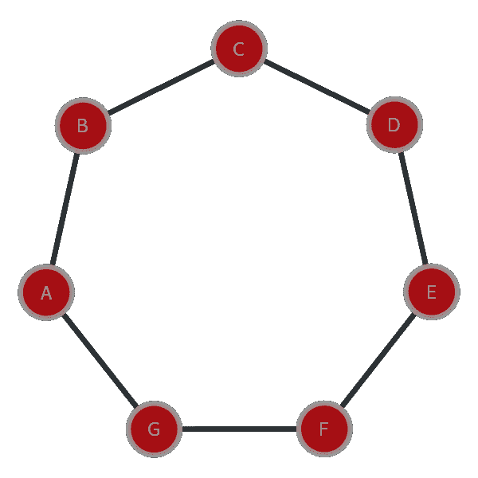
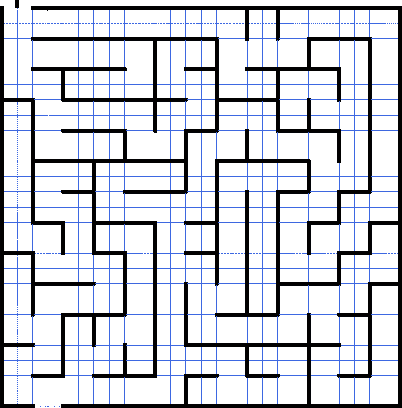
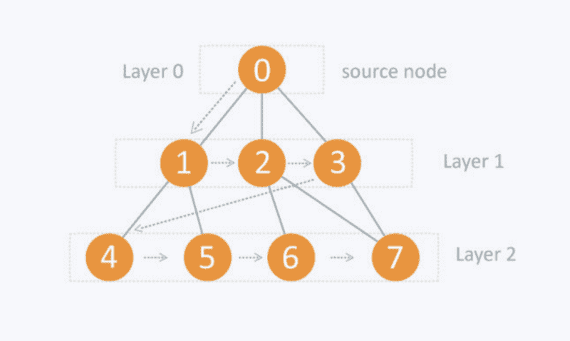
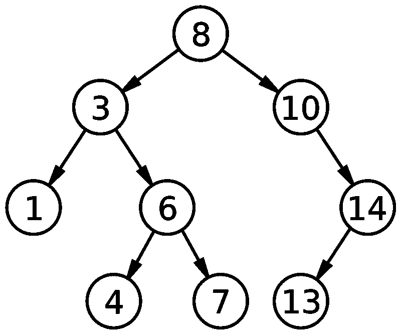
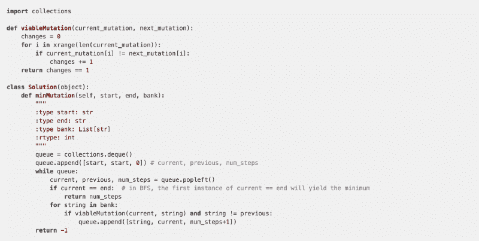

# 深入研究图遍历

> 原文：<https://www.freecodecamp.org/news/deep-dive-into-graph-traversals-227a90c6a261/>

作者:Sachin Malhotra

# 深入研究图遍历


截至 2017 年第三季度，全球每月活跃的脸书用户超过 20.7 亿。脸书网络最重要的方面是用户之间的社交。用户拥有的朋友越多，通过帖子评论、消息传递等方式进行的对话就越有吸引力。如果你经常使用脸书，你一定知道好友推荐功能。

脸书推荐了一些我们可以添加为好友的人。大多数时候，这些人是我们从未听说过的。但是，脸书仍然认为我们应该把它们加进去。问题是:**脸书如何为一个特定的人提出一套建议**？

一种方法是基于共同的朋友。如果用户 A 和 C 彼此不认识，但是他们有共同的朋友 B，那么 A 和 C 也应该是朋友。如果 A 和 C 有 2 个共同好友，A 和 D 有 3 个共同好友呢？如何对建议进行排序？

在这种情况下，向 A 推荐 D 而不是 C 似乎是很明显的，因为他们有更多共同的朋友，更有可能建立联系。

然而，两个人可能不总是有共同的朋友，但他们可能有共同的二级或三级关系。

### n 度连接

*   a 和 B 是朋友。 **(0 度)**
*   a 和 B 是**一级**朋友意味着他们有一个共同的朋友。
*   a 和 B 是**二级**朋友，如果他们有一个朋友，这个朋友和另一个人是一级朋友。例如:- A — C — D — B，那么 A 和 B 是二级朋友。
*   类似地，如果 A 和 B 之间有 N 个联系，那么它们就是第 N 级朋友。例如:-A-X1-X2-X3…..— XN — B

考虑这种推荐方法，我们需要能够找到两个给定用户在脸书上共享的友谊程度。

### 输入图形遍历

现在我们知道了如何推荐朋友，让我们重申一下这个问题，这样我们就可以从算法的角度来看这个问题。

让我们想象一个无向图，上面有脸书 ***、*、**的所有用户，其中顶点 **V** 代表用户，边 **E** 代表友谊。换句话说:如果用户 A 和 B 是脸书上的朋友，那么顶点 A 和 B 之间有一条边。挑战是找出任意两个用户之间的连接程度。

更正式地说，我们需要看到一个无向、无权重的图中两个节点之间的最短距离。



考虑无向图 A 和 C 中的两个顶点。有两条不同的路径可以到达 C:

1.A → B → C 和
2。A → G →F → E →D →C

显然，我们在试图查看社交网络上两个人之间的联系程度时，希望采取最小的路径。

到目前为止一切顺利。

在继续之前，让我们看看这个问题的复杂性。如前所述，截至 2017 年第三季度，脸书拥有约 20.7 亿用户。这意味着我们的图将有大约 20.7 亿个节点和至少(20.7 亿— 1)条边(如果每个人至少有一个朋友)。

这是一个巨大的规模来解决这个问题。此外，我们还看到在图中从给定的源顶点到目的顶点可能有多条路径，我们希望用最短的一条来解决我们的问题。

我们将研究两种经典的图遍历算法来解决我们的问题:

1.深度优先搜索和
2。广度优先搜索。

### 深度优先搜索

想象一下你被困在这样的迷宫里。



你必须想办法出去。从你的起点到出口可能有多条路线。走出迷宫的自然方法是尝试所有的路径。

假设你现在有两个选择。很明显，你不知道哪一条是走出迷宫的。所以你决定做出第一个选择，在迷宫中继续前进。

你继续前进，你继续前进，你走进了死胡同。现在，理想情况下，你会想要尝试不同的路径，所以你 ***回溯*** 到你做出其中一个选择的前一个检查点，然后你尝试新的路径，即这次是不同的路径。

你一直这样做，直到找到出口。

递归尝试特定路径和回溯是构成**深度优先搜索算法** (DFS)的两个组成部分。

如果我们将迷宫问题建模为一个图，顶点将代表个体在迷宫中的位置，两个节点之间的有向边将代表从一个位置到另一个位置的单次移动。使用 DFS，个人将尝试所有可能的路线，直到找到出口。

下面是相同的示例伪代码。

```
1  procedure DFS(G,v):2      label v as discovered3      for all edges from v to w in G.adjacentEdges(v) do4          if vertex w is not labeled as discovered then5              recursively call DFS(G,w)
```

要更深入地了解这个算法，请查看:-

[**深潜图:DFS 遍历**](https://medium.com/basecs/deep-dive-through-a-graph-dfs-traversal-8177df5d0f13)
[*无论好坏，做一件事总有不止一种方法。幸运的是，在软件和……*medium.com](https://medium.com/basecs/deep-dive-through-a-graph-dfs-traversal-8177df5d0f13)的世界里

时间复杂度:O(V + E)

### 横向优先搜索

想象一种传染病在一个地区逐渐传播。每天，患病的人都会感染与他们有身体接触的新的人。通过这种方式，这种疾病正在人群中进行一种广度优先搜索(BFS)。“队列”就是刚刚被感染的那一组人。该图是该区域的物理接触网络。

想象一下你需要通过这个网络来模拟疾病的传播。搜索的根节点是零号病人，第一个已知的该病患者。你开始时只和患病的人在一起，没有其他人。

现在你迭代他们接触的人。有些人会染上这种疾病。现在对它们进行迭代。也给与疾病接触的人，除非他们已经感染了。继续下去，直到你感染了所有人，或者你感染了你的目标。那你就完了。这就是广度优先搜索的工作原理。



BFS 搜索算法从第一个顶点开始一层一层地搜索顶点，只有当前层上的所有顶点都被处理后才会移动到下一层。

这里有一个 BFS 的示例伪代码。

```
1   procedure BFS(G, v):2       q = Queue()3       q.enqueue(v)4       while q is not empty:5            v = q.dequeue()6            if v is not visited:7               mark v as visited (// Process the node)8               for all edges from v to w in G.adjacentEdges(v) do9                    q.enqueue(w)
```

为了更深入地了解 BFS，请看这篇文章。

时间复杂度:O(V + E)

### 最短路径

让我们向前看，解决我们最初的问题:在无向图中寻找两个给定顶点之间的最短路径。

从两种算法的时间复杂度来看，对于这个问题，我们真的搞不清两者的区别。这两种算法都将找到一条从给定源到我们目的地的路径(或者说是最短路径)。

让我们看看下面的例子。



**假设我们想找出从节点 8 到 10** 的最短路径。让我们看看 DFS 和 BFS 在到达目的地之前探索的节点。

#### 深度优先搜索

*   **流程** 8 → **流程** 3 → **流程** 1。
*   回溯到 3。
*   **流程** 6 → **流程** 4。
*   回溯到 6。
*   **流程** 7。
*   回溯到 6 →回溯到 3 →回溯到 8。
*   **流程 10** 。

在到达目的地之前，这里总共处理 7 个节点。现在让我们看看 BFS 是如何做事的。

#### BFS

*   **进程** 8 →入队 3，10
*   **进程** 3 →入队 1，6
*   **流程** 10。

哇，真快！只需处理 3 个节点，我们就到达了目的地。

我们可以在 BFS 看到这种加速，而在 DFS 中看不到，这是因为 DFS 采用了一种特定的路径，并一直走到最后，也就是说，直到它遇到一个死胡同，然后返回。

这是 DFS 算法的主要缺点。在到达包含我们的目的地的路径之前，它可能必须扩展 1000 个级别(在像脸书这样的巨大网络中，只是因为它从一开始就选择了一个糟糕的路径来处理)。BFS 不面临这个问题，因此对我们的问题来说要快得多。

此外，即使 DFS 找到了目的地，我们也不能确定 DFS 采用的路径是最短的。也可能有其他途径。

这意味着，在任何情况下，对于最短路径问题，DFS 必须跨越整个图来获得最短路径。

然而，在 BFS 的情况下，第一个出现的目的节点确保它是距离源最短的节点。

### 结论

到目前为止，我们讨论了脸书的朋友推荐问题，我们将其归结为在网络图中寻找两个用户之间的连接度的问题。

然后我们讨论了两个非常常用的有趣的图遍历算法。最后，我们看看哪种算法能最好地解决我们的问题。

如果您必须在一个无方向、无权重的图中找到两个节点之间的最短距离，广度优先搜索是您想要使用的算法。

让我们看一下[这个有趣的问题](https://leetcode.com/problems/minimum-genetic-mutation/description/)来刻画两种算法的区别。

假设您已经仔细阅读了问题陈述，让我们首先尝试将它建模为一个图问题。

让所有可能的字符串成为图中的节点，如果两个顶点之间有一个突变，则我们在这两个顶点之间有一条边。

很简单，对吧？

给我们一个起始字符串(读取源顶点)，例如:- "AACCGGTT "，我们必须以最小数量的突变(读取最小数量的步骤)到达目的字符串(读取目的顶点)" AACCGGTA "，使得所有中间字符串(节点)都属于给定的单词库。

在查看下面的解决方案之前，尝试自己解决这个问题。



如果您尝试使用 DFS 来解决它，您肯定会提出一个解决方案，但是有一个测试用例将超过 LeetCode 平台上分配的时间限制。这是因为之前描述的问题，即为什么 DFS 需要很长时间(处理 7 个节点，而不是 BFS 的 3 个节点)才能到达目的顶点。

希望您已经理解了两个主要图遍历背后的主要思想，以及当应用程序是无向无权重图中的最短路径时它们之间的区别。

如果你认为这篇文章对某人有用，请推荐(❤)这篇文章！