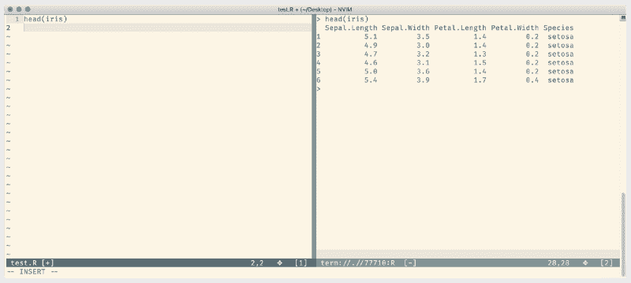
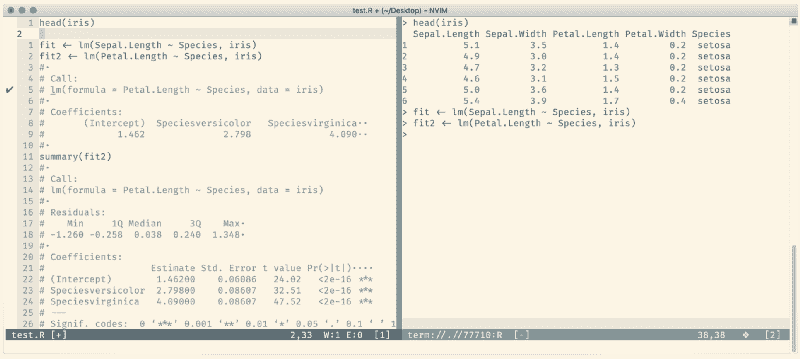
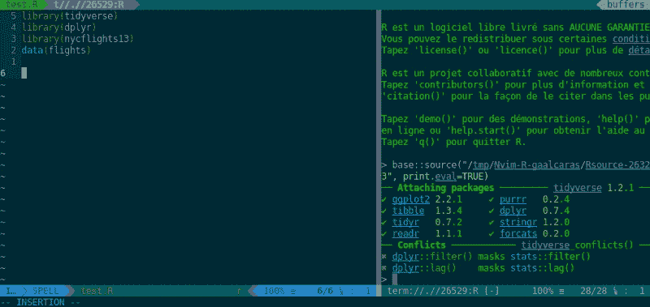

# 将 Vim 转变为一条道路

> 原文：<https://www.freecodecamp.org/news/turning-vim-into-an-r-ide-cd9602e8c217/>

作者:卡德·基拉里


# 如何将 Vim 变成 R 的 IDE

*警告* : **否**，如果你是初学者，这不是可以使用的 R 设置。T4 r studio IDE 非常棒，应该永远是你的默认工具。然而，如果你碰巧属于 [Vim](http://www.vim.org/) / [Emacs](https://www.gnu.org/software/emacs/) land 的被驱逐者，那么这篇文章可能适合你。此外，我将在整篇文章中提到 Vim 和 Neovim，在这一点上，它们基本上是相同的。所以，如果你被绑在一个或另一个不应该有关系。

### 为什么不用 RStudio 呢？


的确是一个伟大的问题。对我来说，主要原因是速度和熟悉度。是的，我知道 RStudio 有 Vim 键绑定，但它不是真正的*T3。在这一点上，我被 Vim 毁了。一个孤独的疯子在微软 Word 中用力敲击`<e` sc > `; and` < C-f >，结果却大失所望。*

> 然而，并没有失去一切。

### Vim 中的 r

起初，在 Vim 中对 R 的追求似乎是一种野蛮主义的练习。你的选择很少，支持似乎很少。

你最好的选择是利用一个单独的`:terminal`缓冲器。基本工作流程如下:

*   在`myFile.R`中编写代码
*   直观选择代码
*   将代码粘贴到`:terminal`缓冲区
*   执行代码
*   冲洗并重复

这可能看起来不太糟糕，但是很快就会变得乏味。此外，这种方法还有很多不足之处。主要是查看定义了什么，细读数据，和一些基本的完成+林挺。

### Nvim-R 前来救援

Nvim-R 是我最喜欢的 vim 插件之一。它把一把旧水枪改造成一把功能齐全的机枪。它储存了许多宝石，会让你后悔没有一直使用它。所以，别再诗意地打蜡了。让我们赶快把 Vim 变成我们的新家吧。

R 启蒙的第一步是……你猜对了，安装 [Nvim-R](https://github.com/jalvesaq/Nvim-R) 。我使用 [Vim-Plug](https://github.com/junegunn/vim-plug) ，所以这就是我下面展示的。然而，你可以使用你选择的插件管理器轻松安装它。

```
Plug 'jalvesaq/Nvim-R'
```

现在，如果你打开一个 R 文件并点击`\rf`，你会看到一个终端缓冲区出现，一个 R 控制台绑定到你当前的会话。要结束它，点击`\rq`。



R file + R console

需要注意的重要一点是，控制台不仅仅依赖于当前缓冲区。这意味着您可以将多个缓冲区全部输入同一个控制台。这可能是好的/坏的，取决于你的个人喜好。我喜欢它，但如果你不小心的话，它肯定会让你大吃一惊。要深入了解 R 和 Vim 如何在 Nvim-R 中通信，你可以点击[这里](https://github.com/jalvesaq/Nvim-R)。

### 秘密武器

现在，您已经有了基本的设置和运行，我们可以深入了解 Nvim-R 提供的所有功能。有大量的内置快捷方式，完整的列表你可以在这里阅读文档。我将简要介绍一些有用的命令，它们将在日常生活中为您提供很好的服务。

#### 发送行

最迫切的需求是能够发送代码行。在 Nvim-R 中有多种方法可以做到这一点:

*   发送::整个文件`\aa`
*   发送::整个块`\bb`
*   发送::整个功能`\ff`
*   发送::整个选择`\ss`
*   发送::整行`\l`

正如您开始看到的，正斜杠`\`是许多操作的前导符。然而，这些中的大部分，以及它们之间的细微差别，都是多余的。重新映射其中几个可能会更好。

```
" in your .vimrc /init.vim
```

```
“ remapping the basic :: send linenmap , <Plug>RDSendLine
```

```
“ remapping selection :: send multiple linesvmap , <Plug>RDSendSelection
```

```
“ remapping selection :: send multiple lines + echo linesvmap ,e <Plug>RESendSelection
```

我选择将基本的发送行+多行重新映射到我的逗号键。这大大减少了我必须使用的键的数量。此外，`,e`映射允许我检查我发送的行是否计算正确。在很大程度上，这三个映射将允许您做您需要做的一切。还有几个值得一提，如果重新映射，可能会给你的工作流程增加一些东西。

#### 对象浏览器

首先，对象浏览器。通过键入`\ro`请求的这个特性将允许您查看在您当前的环境中哪些变量和库是活动的。


也可以通过键入`\rl`来查看对象，这将在您当前的控制台中运行`ls()`功能。

#### 证明文件

为了更好地理解你的代码，你有几个选择。在 Nvim-R 中，有两个特别值得注意的`\rh` —帮助和`\re` —示例。每一个都将在一个带有相关信息的分割缓冲区中打开。


另一个值得选择的是 [Dash 插件](https://github.com/rizzatti/dash.vim)。最简单的使用方法如下:

```
“ install plugin :: using vim-plugPlug ‘rizzatti/dash.vim’
```

```
“ remap search keynmap <silent> <leader>d <Plug>DashSearch<CR>
```

现在，当你在寻找一段 R 代码或任何其他语言的更多信息时，你所要做的就是将你的键放在单词上，然后点击`<leade` r > d，Dash 应用程序就会弹出相关信息。你也可以搜索谷歌和堆栈溢出。这是一个很好的工具，尤其是对于那些将 Vim 用于多种语言的 Vim mer 来说。

#### 查看数据

接下来是快速查看您的数据。RStudio 带有一个漂亮的内置数据查看器，可以方便地了解数据。在 Vim 中，难度稍大，但并非不可能。

Nvim-R 允许您使用`\rv`命令查看数据帧。如果你安装了 Vim 的 [CSV 插件](https://github.com/chrisbra/csv.vim),这将显示 Mac 上使用 X Quartz 的数据框。

CSV 插件附带了大量用于操作数据的附加特性，但这超出了本文的范围。总的来说，我的建议是使用 Excel。虽然被许多人过度喜爱，但它确实是一个很好的数据查看器。

### 其他提示和技巧

不管你怎么想，还有更多，甚至更多，我不会涵盖。但是，接下来的几个技巧绝对值得记住。

#### 内联代码输出

如果您有一行代码并点击`\o`，您将看到输出在当前文件中呈现为注释。



#### 功能

Nvim-R 允许简化流程，而不是进行`str()` + `plot()`等基本流程。

*   summary() :: `\rs`
*   plot() :: `\rg`
*   args() :: `\ra`
*   setwd() :: `\rd`
*   print() :: `\rp`
*   姓名()::`\rn`

#### 箭头

键入箭头可能会很痛苦。幸运的是，Nvim-R 通过将`_`映射到`&l` t 使这变得更容易；-.这可能会，也可能不会，完全迷惑你。如果你喜欢蛇的大小写，那么你必须敲两次下划线才能得到真正的下划线，而不是箭头。但是，您可以覆盖此设置。我发现它很有用，并且已经适应了，但是当然也能理解其他人的苦恼。

### 完成

我经常看到缺乏代码补全是人们跳过 Vim 的主要原因。然而这种观点是不正确的。代码完成是 Vim 的一部分。对于我们的特定目的，即 R 的完成，还有几个选项。

#### Nvim-R 完成

Nvim-R 支持开箱即用的代码完成。您必须使用`<C-X>`手动接合它；< C-O >为一个对象`ct name, o`r<C-X>C-A>为一个函数自变量。对于一些人来说，这种工作流是理想的，但是在当前 VS Code 的智能感知和其他类似选项的时代，这感觉很笨拙。

#### Ncm-R

Ncm-R 是你的最佳选择。这是一个相当新的包，但非常受欢迎。它与 Nvim-R 集成，通过 [nvim 完成管理器](https://github.com/roxma/nvim-completion-manager)为 R 提供异步完成。



Ncm-R 为以下所有内容提供了丰富的完井:

*   来自全局 R 环境的对象
*   所有已加载包中的函数
*   `library()`和`require()`内的包
*   `data()`内的数据集
*   函数内部的参数
*   管道内的变量`%&g`t；%和 ggplo `t` s +

对于基本设置，请将下面的代码添加到您的 Vim 配置文件中。

```
Plug ‘roxma/nvim-completion-manager’Plug ‘gaalcaras/ncm-R’
```

```
“ Optional: for snippet supportPlug ‘sirver/UltiSnips’
```

#### r 语言服务器

如果你不熟悉什么是语言服务器，请点击这里。如果你熟悉的话，那么[这个项目](https://github.com/REditorSupport/languageserver)可能会感兴趣。它仍处于早期，很大程度上是试验性的，但确实有效，目前支持代码完成和林挺。

### 林挺

最后但同样重要的是，林挺。质量林挺的设置相当简单。你会想要使用异步 Lint 引擎 ALE 作为你的驱动。您可以在您的。vimrc 如下:

```
Plug ‘w0rp/ale’
```

现在你需要做的就是安装 [lintr](https://github.com/jimhester/lintr) 。这可以通过使用`install.packages(‘lintr’)`来完成。

下次你打开一个。你应该可以走了。

### 结论

此时，您已经在 Vim 中为 R 设置了一个杀手。如果你好奇的话，当然还有更多的事情要做。需要进一步探索的领域包括浏览我在本文中链接的插件的所有文档。你会在那里找到许多有用的提示和技巧，以及有用的设置。我希望这有助于您在 Vim 中使用 R！

[***欲了解更多关于 Vim 的头像请到我的博客！***](https://kadekillary.work/)

### 奖金部分

我知道我说过你应该自己探索。提供一些额外的设置会让你的生活更轻松，这并没有什么坏处。

```
“ settings :: Nvim-R plugin
```

```
“ R output is highlighted with current colorschemelet g:rout_follow_colorscheme = 1
```

```
“ R commands in R output are highlightedlet g:Rout_more_colors = 1
```