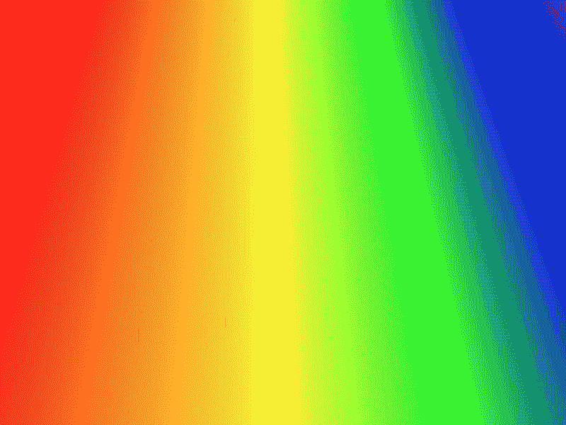
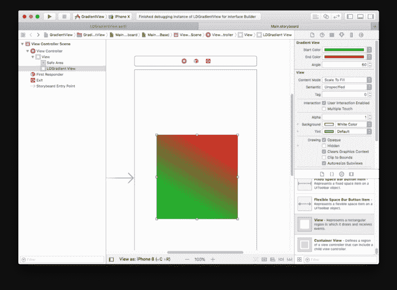
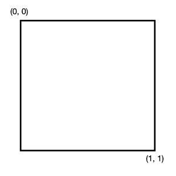
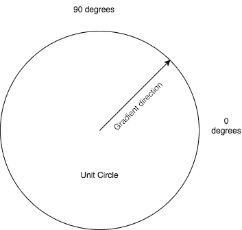

# 如何使用 IBDesignable 在 Swift 中创建一个漂亮的、可重复使用的渐变视图

> 原文：<https://www.freecodecamp.org/news/how-to-create-a-beautiful-reusable-gradient-view-in-swift-with-ibdesignable-981aebb43d30/>

作者:李·道斯韦特

# 如何使用 IBDesignable 在 Swift 中创建一个漂亮的、可重复使用的渐变视图



本教程将演示如何在 Swift 4 中创建一个通用的`@IBDesignable`渐变视图类。您可以将 CAGradientView 放到故事板中，并在设计时进行预览。或者以编程方式添加。您可以设置两个渐变停止点(开始和结束)和渐变方向(以度为单位)的颜色。这些属性完全可以从 IB 检查器中控制。

### 你为什么需要这个

设计师就是喜欢渐变。诚然，就像模糊的背景和阴影一样，它们随着风的变化而时好时坏。如今，它们确实变得更加微妙，所以它们需要相当多的摆弄才能恰到好处。

创建一个梯度涉及到合理的工作量。调整它直到你的设计师满意是一个耗时的过程。本教程向您展示了如何构建一个渐变视图组件，您可以将它放入故事板中，并直接从界面构建器中预览。

你的设计师会因此而喜欢你，你会节省很多时间。

### 你将建造什么

说你要建立一个渐变视图很容易，但是确切的要求是什么呢？让我们来定义它们:

*   它必须是`UIView`子类
*   它必须是`@IBDesignable`，这样才能在 Xcode/Interface Builder 中预览
*   它必须在代码或界面构建器中完全可配置

### 获取示例项目

为了正确地完成本教程，您需要一个示例项目，您可以从 GitHub 中获取该项目。

当您将项目载入 Xcode 并在故事板中打开示例 ViewController 场景时，您将能够选择渐变视图并在“属性”检查器中编辑它，如下图所示。



### 关于渐变图层

**注意:**这不是对`CAGradientLayer`的介绍。如果你需要更基本的介绍，请阅读我的[在 Swift](https://appcodelabs.com/creating-an-ibdesignable-gradient-view-in-swift-2) 掌握 CAGradientLayer 教程，它解释了你需要的所有背景。

有几种方法可以在 iOS 中实现渐变效果，但在本教程中，我们将使用`CAGradientLayer`。这是`CALayer`的一个子类，它是一个核心动画对象，是视图层层次的一部分。在 iOS 中，`UIView`被描述为**层背景视图**，因为它们的外观由它们的`layer`属性控制。每个视图都有一个层，就像每个`UIView`可以有多个子视图一样，每个层可以有多个子层。

这实际上意味着每个视图可以有任意复杂的层树来增加视图的视觉复杂性。当大量使用核心动画时，在某些时候，开发人员必须区分在`CALayer`级别增加复杂性和简单地添加新的`UIView`来实现相同的效果。通常，视图和层之间的界限非常明显。通常是因为应用程序的功能需要视图的某些属性(例如，需要一个`UILabel`或`UIButton`)。

当我们创建包含大量微妙图形的丰富 ui 时，增加层层次的复杂性变得太容易了。通常，您应该避免这种情况，因为层只能在代码中管理，而不能在故事板中管理。管理层次结构的逻辑可能会变得非常笨拙。

出于本教程的目的，您将添加一个`CAGradientLayer`作为视图的`layer`属性的子层。这提供了视图和层之间的一对一映射。它很好地将每个渐变层封装在一个 UIView 中，因此它可以在一个故事板中进行布局。

### 定义视图子类

本教程的核心是一个叫做`LDGradientView`的渐变视图。它是`UIView`的子类，定义如下:

```
@IBDesignable class LDGradientView: UIView {   // ... }
```

该类被标记为`@IBDesignable`，这意味着它可以在界面构建器(Xcode 的故事板编辑器)中预览。

渐变本身被定义为类的私有属性:

```
// the gradient layer private var gradient: CAGradientLayer?
```

该属性由下面的函数创建。它将渐变的`frame`属性设置为视图的边界，从而占据整个视图。这符合视图和层之间的一对一映射。

```
// create gradient layer private func createGradient() -> CAGradientLayer {   let gradient = CAGradientLayer()   gradient.frame = self.bounds  return gradient }
```

然后，它被添加为视图层的子视图，如下所示:

```
// Create a gradient and install it on the layer private func installGradient() {   // if there's already a gradient installed on the layer, remove it  if let gradient = self.gradient {    gradient.removeFromSuperlayer()  }   let gradient = createGradient()  self.layer.addSublayer(gradient)  self.gradient = gradient}
```

这两个都是私有函数，因为视图的层层次应该是它自己的事。

如果在复杂的层次结构中安装渐变视图，或者安装任何使用约束的超级视图，那么每次设置框架时，视图都必须更新自身。您可以通过添加这些方法来实现:

```
override var frame: CGRect {  didSet {    updateGradient()  }}
```

```
override func layoutSubviews() {  super.layoutSubviews()  // this is crucial when constraints are used in superviews  updateGradient()}
```

```
// Update an existing gradient    private func updateGradient() {        if let gradient = self.gradient {            let startColor = self.startColor ?? UIColor.clear            let endColor = self.endColor ?? UIColor.clear            gradient.colors = [startColor.cgColor, endColor.cgColor]            let (start, end) = gradientPointsForAngle(self.angle)            gradient.startPoint = start            gradient.endPoint = end            gradient.frame = self.bounds        }    }
```

最后，我们还需要一些实例化视图和调用`installGradient`函数的方法。我们从两个初始化器中的一个来做这个，第一个从接口构建器初始化，第二个用于编程实例化:

```
// initializers required init?(coder aDecoder: NSCoder) {  super.init(coder: aDecoder)  installGradient() } 
```

```
override init(frame: CGRect) {  super.init(frame: frame)  installGradient() }
```

### 定义渐变

现在你有了一个可以安装一个`CAGradientLayer`的`UIView`子类，但是它并没有实现全部功能。让我们让渐变视图为我们工作…

您的定制视图将操作`CAGradientLayer`的两个主要属性。这些是:

*   渐变的颜色
*   渐变的方向

### 定义颜色

颜色被定义为`CAGradientLayer`上的一个属性:

```
// An array of CGColorRef objects defining the color of each gradient stop. Animatable.var colors: [Any]?
```

### 关于梯度停止的一个注记

渐变中颜色变化的点称为*渐变停止点*。渐变确实支持相当复杂的行为，并且可以有无限的停靠点。对这种行为进行编程很简单。然而，为它创建一个`@IBInspectable`界面更具挑战性。

再增加一两个梯度光阑相对来说是微不足道的。解决任意次数停车的一般问题更加困难。这种解决方案可能不如直接用代码做同样的工作有用。

出于这个原因，这个项目只处理“简单”的梯度。在视图的一边以一种颜色开始，在相反的一边渐变到另一种颜色。

如果您需要添加另一个站点，您应该能够很容易地修改代码，但是这会使教程过于复杂。

因此，我们对颜色停止的实现很简单:

```
// the gradient start colour @IBInspectable var startColor: UIColor? 
```

```
// the gradient end colour @IBInspectable var endColor: UIColor?
```

这些在界面构建器中作为漂亮的颜色控件出现。

### 定义方向

渐变的方向由`CAGradientLayer`上的两个属性定义:

```
// The end point of the gradient when drawn in the layer’s coordinate space. Animatable.var endPoint: CGPoint
```

```
// The start point of the gradient when drawn in the layer’s coordinate space. Animatable.var startPoint: CGPoint
```

渐变的起点和终点是在**单位渐变空间**中定义的，这仅仅意味着无论给定`CAGradientLayer`的维度如何，在单位渐变空间中，我们认为左上角是位置(0，0)，右下角是位置(1，1)，如下图所示:



这是`CAGradientLayer`坐标系。

方向是制作渐变`@IBDesignable`最具挑战性的部分。因为需要一个起点和终点，事实上`@IBInspectable`属性不支持`CGPoint`数据类型，更不用说 UI 中完全缺乏数据验证，我们的选择有点有限。

当试图找出定义常见梯度方向的最简单方法时，字符串似乎是一种潜在有用的数据类型，或许指南针点，例如“N”、“S”、“E”、“W”可能有用。但是对于中间方向应该支持“NW”吗？那“NNW”或者“WNW”呢？除此之外呢？这将立即变得令人困惑。这种思维方式显然是一条漫长的道路，直到意识到描述罗盘上任何角度的最佳方式是使用度数！

用户可以忘记单位梯度空间。所有的复杂性都简化为向界面构建器公开的单个属性:

```
// the gradient angle, in degrees anticlockwise from 0 (east/right)@IBInspectable var angle: CGFloat = 270
```

它的默认值(270 度)指向南方，只是为了匹配`CAGradientLayer`默认方向。对于水平渐变，将其设置为 0 或 180。

### 将角度转换到渐变空间

这是最难的部分。我包括代码和它如何工作的描述。如果您只是对使用该类感兴趣，可以跳过这一步。

将角度转换为起点和终点渐变空间的顶级函数如下所示:

```
// create vector pointing in direction of angle private func gradientPointsForAngle(_ angle: CGFloat) -> (CGPoint, CGPoint) {  // get vector start and end points  let end = pointForAngle(angle)  let start = oppositePoint(end)  // convert to gradient space  let p0 = transformToGradientSpace(start)  let p1 = transformToGradientSpace(end)  return (p0, p1) }
```

这将获取用户指定的角度，并使用它来创建一个指向该方向的向量，如下所示。角度指定向量从 0 度开始的旋转。按照惯例，在核心动画中指向东方，并逆时针增加(逆时针)。



通过调用`pointForAngle()`找到终点，定义如下:

```
private func pointForAngle(_ angle: CGFloat) -> CGPoint {  // convert degrees to radians  let radians = angle * .pi / 180.0  var x = cos(radians)  var y = sin(radians)  // (x,y) is in terms unit circle. Extrapolate to unit square to get full vector length  if (fabs(x) > fabs(y)) {    // extrapolate x to unit length    x = x > 0 ? 1 : -1 y = x * tan(radians)  } else {    // extrapolate y to unit length    y = y > 0 ? 1 : -1    x = y / tan(radians)  }   return CGPoint(x: x, y: y) }
```

这个函数看起来比实际更复杂。在它的核心，它只是简单地采取角度的正弦和余弦来确定单位圆上的终点。因为 Swift 的三角函数(与大多数其他语言一样)要求用弧度而不是度数来指定角度，所以我们必须首先进行转换。然后由`x = cos(radians)`计算 x 值，由`y = sin(radians)`计算 y 值。

函数的其余部分涉及到这样一个事实，即产生的点在单位圆上。然而，我们需要的点在一个单位正方形内。沿着罗盘点的角度(即 0 度、90 度、180 度和 270 度)将在正方形的边缘产生正确的结果。对于中间角度，该点将从正方形的边缘插入。向量必须外推至正方形的边缘，以给出正确的视觉外观。如下图所示。


现在我们有了带符号的单位正方形中的**终点**，向量的**起点**通过下面的简单函数找到。因为该点在有符号的单位空间中，所以通过简单地反转终点的分量的符号来找到起点是微不足道的。

```
private func oppositePoint(_ point: CGPoint) -> CGPoint {  return CGPoint(x: -point.x, y: -point.y) }
```

注意，实现这个的另一种方法是将原始角度增加 180 度，并再次调用`pointForAngle()`。但是符号反转法是如此简单，以至于用这种方法会稍微更有效率。

现在我们有了有符号单位空间中的起点和终点，剩下的就是将它们转换到无符号梯度空间。单位空间有一个向北增加的 y 轴。而在核心动画空间 y 向南增加。因此，作为平移的一部分，y 分量必须翻转。我们的有符号单位空间中的位置(0，0)在梯度空间中变成(0.5，0.5)。该功能非常简单:

```
private func transformToGradientSpace(_ point: CGPoint) -> CGPoint {  // input point is in signed unit space: (-1,-1) to (1,1)  // convert to gradient space: (0,0) to (1,1), with flipped Y axis   return CGPoint(x: (point.x + 1) * 0.5, y: 1.0 - (point.y + 1) * 0.5) }
```

### 恭喜你！

这就是所做的全部艰苦工作——唷！祝贺你走到这一步——去喝杯咖啡庆祝一下吧…

### 界面构建器支持

渐变视图类剩下的就是`prepareForInterfaceBuilder()`函数。此函数仅在需要渲染视图时使用界面构建器运行。一个设计合理的`@IBDesignable`视图实际上没有它也能很好地工作。有时候——例如，当向故事板添加一个新视图时——在这个功能出现之前，它不会正确地呈现。您可以通过选择故事板中的视图并从菜单中选择**编辑器|调试所选视图**来强制运行它。

我们的函数实现只是确保梯度被安装和更新。

```
override func prepareForInterfaceBuilder() {   super.prepareForInterfaceBuilder()  installGradient()  updateGradient() }
```

### 感谢阅读！

这个项目的代码可以在 GitHub 上免费获得[。](https://github.com/leedowthwaite/LDGradientView)

Lee Dowthwaite 是一名经验丰富的 iOS 开发人员,自 2010 年以来，他为许多顶级客户开发了备受瞩目的应用程序。

*最初发布于[appcodelabs.com](https://appcodelabs.com/create-ibdesignable-gradient-view-swift)2017 年 12 月 10 日。*