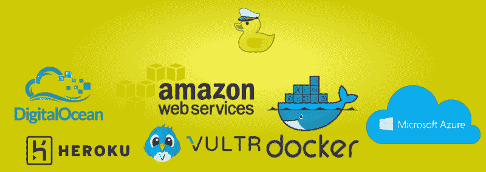
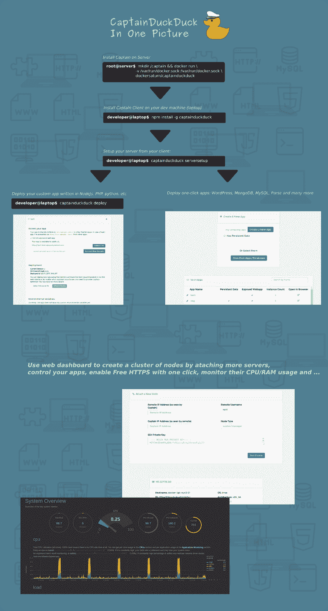
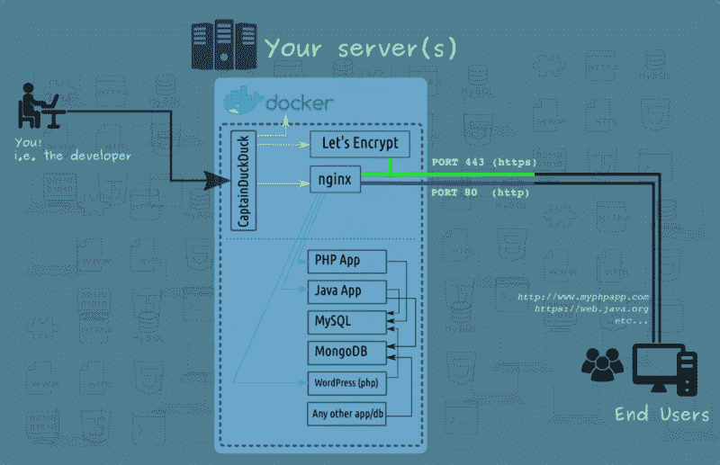

# 我如何构建 Heroku 的替代产品并将平台成本降低了 4 倍

> 原文：<https://www.freecodecamp.org/news/how-i-cut-my-heroku-cost-by-400-5b9d0220ce13/>

作者:Kasra Bigdeli

# 我如何构建 Heroku 的替代产品并将平台成本降低了 4 倍

如果你想直接进入正题，你可以跳到**部分。**

****2019 更新** : *CaptainDuckDuck 现更名为 CapRover 发行。参见 https://github.com/caprover/caprover*T4**

### **下雨了**

**几年前，我开始使用服务器端语言——主要是 Node JS。经过几天的努力，我终于能够在我的`localhost`上部署一个 Hello World 应用程序了。这很有趣，直到我决定采取下一步，将我的一个项目部署到互联网上，这样人们就可以从像`http://www.some-awesome-web-app.com`这样的公共 URL 访问它。**

**那时，我意识到我必须学习一整套新技术来部署我的 web 应用程序。我需要知道如何构建工具和部署管道，nginx 路由和 SSL 是如何工作的，以及许多其他的事情…**

****

**不用说，部署是一次痛苦的经历。我意识到，我不得不花费几乎与我编码相同的时间来将代码部署到服务器上，构建、安装依赖项，以及维护服务器。简直蠢到家了！我不得不花时间一遍又一遍地做同样的事情。**

**我宁愿把时间花在为用户编写产品/服务代码上，而不是花在如何建立 HTTPS 上。毕竟，我的 HTTPS 和互联网上其他成千上万的 HTTPS 网站没什么不同。一定有更简单的方法。**

### **临时救世主**

**当我遇到 Heroku，一个现成的部署应用程序的平台时，这种痛苦的经历就结束了。我告诉自己“太好了！这才是一个部署平台需要的！”我喜欢他们如何抽象出简单界面背后的所有复杂性。你只需要简单的点击和推送就可以创建一个应用程序。它立即通过一个公共 URL 变得可用。不活动 30 分钟后，花很少的睡眠费用就可以免费获得。事情再好不过了！**

**一切都很好。直到我参与了一些需要连续 24 小时执行的项目(一个阅读器机器人)。我不得不升级到付费服务。还不算太糟，每月只有 7 美元。但在我开始部署越来越多的应用程序后，事情开始变得疯狂。有些是个人项目，有些是与业务相关的项目，需要高于 512MB(自由限制)的 ram 或 24 小时连续可用性。**

**没过多久，我就意识到我给了 Heroku 100+美元。这简直说不通。我的一些需要 24 小时可用性的阅读器机器人只消耗 128MB 的内存。然而，我还必须为未使用的内存付费。我无法跨应用程序共享内存/CPU。对于高 RAM 使用率的应用程序，情况会变得更糟。如果我有一个需要 1GB 内存的应用程序，我每月至少要支付 50 美元。**

****

**为了找到更好的交易，我开始寻找 AWS、Digital Ocean、Vultr 和其他服务器提供商。我看到的价格简直让我震惊。例如，在 Digital Ocean 上，我可以以每月 20 美元的价格获得一台 2GB 内存的服务器。我可以花 20 美元而不是 100 美元在那台机器上安装 2 个 1GB 的内存。我可以将成本降低 4 倍！**

**这个较低的价格有一个陷阱。如果你不知道那是什么，你就没有读过第一段，*痛苦*。使用这些准系统服务器提供商(与 Heroku 等服务相对)的问题是，我必须做 Heroku 为我做的所有工作。**

### **寻找永恒的救世主**

**我知道我想要什么:我需要一个可以把一个准系统服务器(比如 AWS 或者 Digital Ocean)变成一个类似 Heroku 的平台的东西。随着我获得更多的经验，我知道 Github 上一定有某种类似 Heroku 的开源软件。果然，我是对的。不止一个，而是一大堆。**

**然而，在对每一个都花了一两个小时之后，我意识到没有一个是我正在寻找的真正 Heroku-easy 的解决方案。有些是超级基本的，只有一个很薄的界面层，几乎没有文档。有些非常先进，有大量的功能没有使用。拥有这些功能意味着复杂的设置过程和维护。我一直在寻找一个简单而高效的解决方案。**

### **建造永恒的救世主**

**由于我没有运气找到一个好的替代 Heroku，我决定建立一个。幸运的是，我需要的所有工具都是免费的——从路由请求的 HTTP 服务器 nginx，到容器化应用程序的 Docker 等等。**

**经过几个月的计划、设计、构建、删除和从头开始，这个项目已经准备好了。**

**我在 2017 年 10 月发布了 CaptainDuckDuck 的初始版本。仅仅过了两个月，已经有了很多积极的反馈。在主要用于部署 web 应用程序的第一个版本发布后，社区要求更多。他们主要希望能够部署数据库和一键式应用程序。就在本周，我发布了 0.2.1 版本，包含了所有这些要求的特性:)**

### **它是做什么的**

**我的目标是让一个典型的 web 应用程序开发人员在不到 10 分钟的时间内创建一个类似 Heroku 的服务器实例。我很高兴地说，我做到了！**

**你只需在你的服务器上复制并粘贴一行，你就有了自己的 Heroku。**

*   **您可以使用简单的 CLI deploy 命令部署 web 应用程序(nodejs、php 等)。**
*   **你可以通过点击“启用 HTTPS”按钮来启用 HTTPS。**
*   **你可以从 WordPress、MongoDB、MySQL、Parse 等一键式应用/数据库中进行选择。**
*   **只需在 web UI 中输入服务器的 IP 地址和凭据，就可以连接多台服务器来创建服务器集群。**

**CaptainDuckDuck 是用 NodeJS 写的。但是最终用户处理的不是节点。船长在引擎盖下使用的主要发动机是 nginx 和 docker。两者都是最值得信赖的生产就绪工具。CaptainDuckDuck 的 NodeJS 部分仅在将应用程序部署到服务器时使用。理论上，您可以在部署后终止服务器中的 CaptainDuckDuck 进程，用户不会注意到任何变化。**

### **辅导的**

**如果你想要一份完整的指南，我推荐你看一下[视频教程](https://www.youtube.com/watch?v=576RsaocNUE)，阅读 G [ithub 页面](https://github.com/githubsaturn/captainduckduck)。该视频是第一次发布，所以它没有数据库和一键应用程序。但这是一个很好的起点。**

********