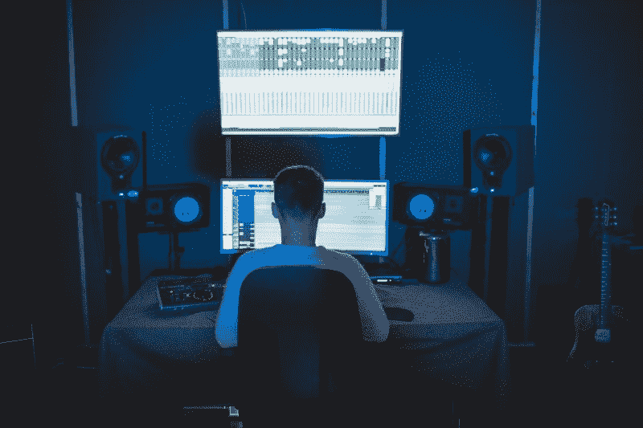
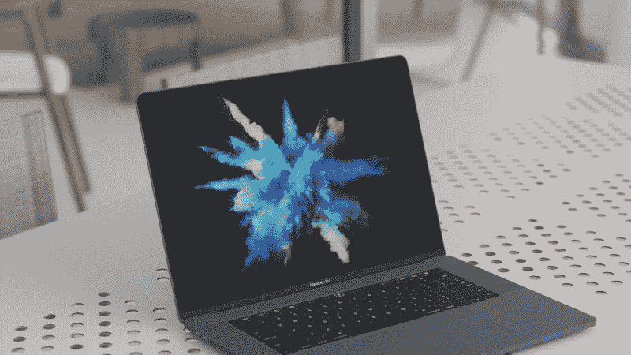
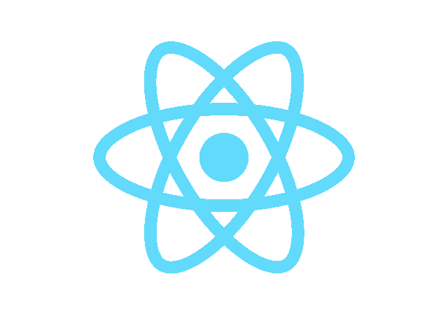
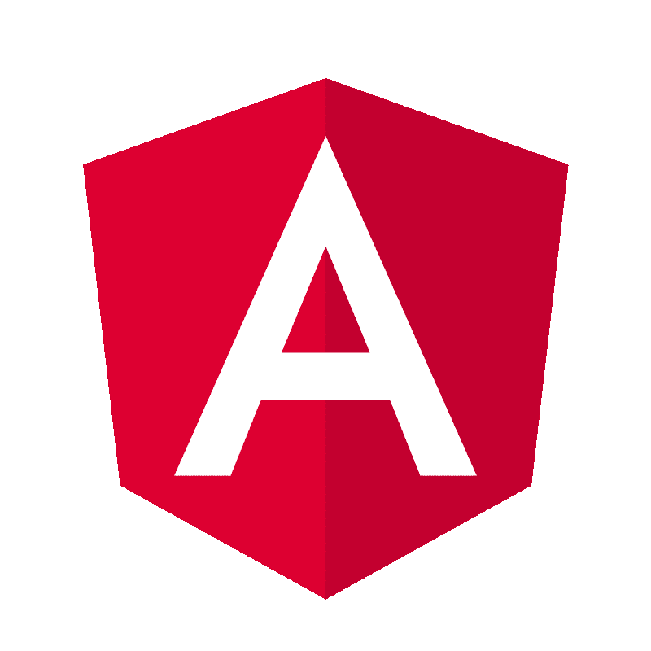
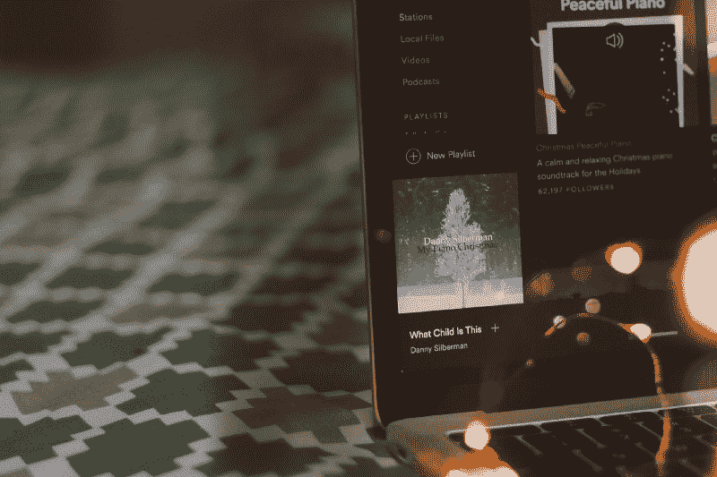
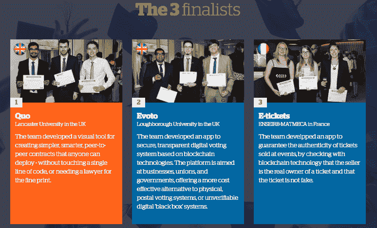
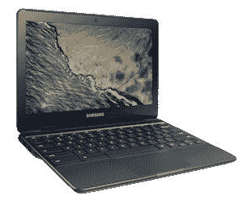

# 2018 年你可以参加的鲜为人知的开发者竞赛

> 原文：<https://www.freecodecamp.org/news/lesser-known-developer-contests-you-can-join-in-2018-bf70f175106a/>

作者:迈克·塞齐勒夫斯基

# 2018 年你可以参加的鲜为人知的开发者竞赛

Daniel Borowski 发布了一个很棒的[列表](https://medium.freecodecamp.org/the-10-most-popular-coding-challenge-websites-of-2016-fb8a5672d22f)，你可以为了乐趣和/或测试你的编程技能而加入其中。像 TopCoder 或 Google Code Jam 这样的竞赛设计得很好，并且提供很高的奖励。竞争通常也很激烈。在这篇文章中，我想列出 2018 年你可以参加的鲜为人知的在线竞赛。(注意:绝大多数都不是基于算法问题)。

### js13k 游戏

**链接:**【http://js13kgames.com】T2

**挑战:**

是 HTML5 游戏开发者的 JavaScript 编码比赛。游戏资产应小于或等于 13 千字节。它必须能在至少两种浏览器上运行:Firefox 和 Chrome。规则还定义了主题，强烈建议在你的游戏中遵循它(2017 主题-“迷失”)。

**奖品:**

赞助商的包装，例如:

*   Steam 上有三份由 [Agar3s](https://twitter.com/agar3s) 制作的[邪恶故障](http://store.steampowered.com/app/619890/Evil_Glitch/)游戏。
*   来自[的](https://twitter.com/boniatillo_com)[相位器编辑](http://phasereditor.boniatillo.com/)的三个终身和十年许可证。
*   三十个付费的 GitHub 计划——十二个月内拥有无限私人储存库的个人账户。
*   10 个 6 个月的 PlayCanvas 个人账户提供了一个云托管的协作平台来构建游戏。
*   由 [Scirra](https://www.scirra.com/) 创建的三个游戏引擎[各一年的两个个人许可证。](https://www.construct.net/make-games/buy-construct-3)
*   来自 [Kenney.nl](http://kenney.nl/) 的两份[资产伪造豪华](http://assetforge.io/)工具。

**往届获奖者:**

*   Ryan 'Rybar' Malm —你是一个卑微的太空采矿机器人，遭遇了一场可怕的事故，与你的船员失散了。找到足够的燃料和身体组件来修复自己和探索。
*   Maxime Euziere——一款大型益智游戏和寻找走失儿童的漫长旅程。
*   Rémi Vansteelandt —通过夺取信标并防御敌人单位来夺回对这些区域的控制权。

### Yelp 数据集挑战

**链接:**【https://www.yelp.com/dataset/challenge】T2

**挑战:**

该挑战要求学生以创新的方式使用 Yelp 数据集。这是一个对 Yelp 数据进行研究或分析并分享你的发现的机会。例如，2017 年的数据集包括来自 4 个国家 12 个大都市地区的当地企业信息。

**奖品:**

*   10 个 5000 美元的奖励

**往届获奖者:**

*   语义扫描:检测文本流中细微的、空间定位的事件。Abhinav Maurya、Kenton Murray、刘延东、、William W. Cohen 和 Daniel B. Neill。
*   “基于评论的评级预测的主题正则化矩阵分解”。卡耐基梅隆大学计算机科学学院语言技术研究所的李、、孙翔宇、廉和。
*   [“利用深度特征从群体到个体标签”。](http://mdenil.com/media/papers/2015-deep-multi-instance-learning.pdf) Dimitrios Kotzias(加州大学欧文分校)、Misha Denil(英国牛津大学)、Nando De Freitas(英国牛津大学、加拿大高等研究院)、Padhraic Smyth(加州大学欧文分校)。

### XD HAX 开发者挑战

**链接:**[https://xdhax . devpost . com/](https://xdhax.devpost.com/)

**挑战:**

开发者被要求利用云技术构建创新应用。这类应用将惠及全球的小型企业。竞赛分为几类:

*   最佳新应用集成(与 Xero API)
*   现有应用集成的最佳增强
*   Xero API 的最具创新性的应用
*   使用 Xero 的 API 的最佳新开源项目

**奖品:**

5000 美元的亚马逊网络服务信用点，2500 美元现金，外加 Xero 的特色资源。此外，在最佳集成类别中，获胜者有机会在您选择的 Xerocon 的 Startup Alley 展出。这大约值 5000 美元。

**往届获奖者:**

*   [革命性的新卡](https://devpost.com/software/curve-jzte6x)让商业支出变得像 Xero 做会计一样美好。
*   [账户管理仪表盘](https://devpost.com/software/enhancements-to-the-exsalerate-xero-integration) (AMD)。
*   [税](https://devpost.com/software/tax-optimiser-d3fb8x)帮助创业公司处理税务。

### 开放 OIT 挑战赛 4.0

**链接:**【https://iot.eclipse.org/open-iot-challenge/】T2

**挑战:**

您需要创建一个基于开放标准和开源技术的解决方案。根据以下标准判断解决方案:

*   解决方案对特定行业的适用性，如智能城市、工业 4.0 和远程医疗。
*   解决方案的完整性。
*   使用开放标准和开源技术。
*   参与者构建解决方案时的社区讨论量。

**奖品:**

**一等奖:**

*   价值 3000 美元的礼品卡，可在网上商店购买电子用品和开放式硬件。
*   1000 美元奖学金参加 2017 年的未来日食活动。
*   1 个活性砌块专业许可证(4800 欧元)。

**二等奖:**

*   价值 1000 美元的礼品卡，可在网上商店购买电子用品和开放式硬件。
*   1 个活性砌块专业许可证(4800 欧元)。

**三等奖:**

*   价值 500 美元的礼品卡，可在网上商店购买电子用品和开放式硬件。
*   1 个活性砌块专业许可证(4800 欧元)。

**往届获奖者:**

*   Sebastien Lambour &团队——《生命的方式:情绪障碍的睡眠分析》。
*   Siva Prasad Katru &团队 —帮助农民以更智能、更高效的方式执行农业操作的解决方案。
*   汤姆·莫罗茨&团队——RHDS，该团队每分钟执行一次近乎实时的家庭能源审计。

Photo by [James Owen](https://unsplash.com/photos/MuIvHRJbjA8?utm_source=unsplash&utm_medium=referral&utm_content=creditCopyText) on [Unsplash](https://unsplash.com/?utm_source=unsplash&utm_medium=referral&utm_content=creditCopyText)

### 太空应用挑战

**链接:**【https://2017.spaceappschallenge.org/】T2

**开始日期:【2018 年 4 月**

**挑战:**

太空应用挑战赛是美国宇航局的国际黑客马拉松，在世界各地的城市举行，时间超过 48 小时。它是关于构建在许多不同类别中被评判的应用程序:

*   构思和创造！这一类别的挑战将要求你创造性地解读美国宇航局的地球科学数据。你将被要求设计新的方式来体验美国宇航局的地球科学数据和技术。
*   我们的生态社区。该类别的挑战将要求你使用 NASA 地球科学数据来研究生态系统。你也将产生解决方案来更好地理解地球上的生命。
*   **警告！前方危险。**这个类别会要求你分析 NASA 的数据。你将协助监测自然灾害和与健康风险相关的现象。您还将被要求评估它们对生命和财产的影响。
*   **行星蓝调**。在这个类别中，将要求您分析和可视化 NASA 关于水圈和冰冻圈的数据。
*   **地球和我们**。这个类别会要求你将 NASA 地球科学数据与社会学和经济学信息结合起来。其结果将产生关于人类与环境相互作用的新的理解和观点。

Photo by [Team UI8](https://unsplash.com/photos/z8lfwpQVXJo?utm_source=unsplash&utm_medium=referral&utm_content=creditCopyText) on [Unsplash](https://unsplash.com/?utm_source=unsplash&utm_medium=referral&utm_content=creditCopyText)

**奖品:**

*   2015 年，Global 有机会参加了天鹅座 CRS OA-4 发射的观看机会。天鹅座 CRS OA-4 将货物和实验带到了 T2 国际空间站 T3。
*   2016 年，全球获奖者可以参加 [OSIRIS-Rex](https://en.wikipedia.org/wiki/OSIRIS-REx) 的发射，参观小行星[贝努鸟](https://en.wikipedia.org/wiki/Bennu_%28asteroid%29)。

**往届获奖者:**

*   数据的最佳利用:闪烁减轻了恶劣空气质量对全球社会的影响。这是通过使空气质量数据收集民主化来实现的。
*   [最佳硬件使用](https://2016.spaceappschallenge.org/challenges/space-station/rock-it-space-fashion-and-design/projects/canaria) : [二氧化碳监测贴片和耳机的加那利系统](http://canaria.co.uk/)对佩戴者来说就像是一条生命线。它同时监测心率、血氧和大气二氧化碳水平。
*   [银河撞击](https://2016.spaceappschallenge.org/challenges/earth/earth-live/projects/l.i.v.e.-glacier-project-ice-cream-team):这是一个网络工具，提供冰川表面速度场的近实时可视化。它是通过我们自己的算法处理免费的 SENTINEL-1 合成孔径雷达图像得到的。随着美国宇航局 GIBS 号环境变量的加入，这一点得到了加强。
*   最佳任务概念:解决方案是宇航员戴上数据手套，作为宇航服的一部分。数据手套是一个无线设备网络，可在各种环境中提供通信。这些包括地下环境，如月球、火星和小行星上的洞穴、岩洞和熔岩管道。
*   [人民的选择](https://2016.spaceappschallenge.org/challenges/tech/jet-set-mars/projects/mars-hopper) : MarsHopper 是一架用于火星极点及其周围环境调查的飞机。它使用二氧化碳，以固体形式覆盖表面来产生喷射推力。
*   [最励志:](https://2016.spaceappschallenge.org/challenges/solar-system/book-it-to-the-moon/projects/kid-on-the-moon)月亮上的孩子是一款互动 app。它培养好奇心，激励下一代太空探险者。

### 泰德哈克

**链接:**【https://tadhack.com/2017/】T2

**挑战:**

TEDHack 是全球最大的电信黑客马拉松。比赛分为以下几个类别:

*   哈克森。这个类别是一个想法或对赞助商的挑战的回答。你可以在活动开始前构思，或者在活动期间利用所有绝佳的社交机会创造创意。
*   展示。此类别适用于已经上市的产品。它还可以包括已经有重大发展的产品。

**奖品:**

1000 美元——200 美元现金(取决于类别)，外加赞助商的礼包。

**往届获奖者:**

*   Hack: snappy kamailio。丹尼尔·康斯坦丁·米尔拉。
*   [Hack:局外人。作者埃尔米尔·苏尔达什](https://youtu.be/p8INY-zlEaY)。
*   [黑:复仇者联盟。由 Mchotsa Banda，Daryl Lukas，Chobela Kakumbi，Itati Dzekedzeke，Joshua chi pile&Sibusiso Ngoma](https://youtu.be/c11Sa9G_OXQ)。

([更多类别和获奖者](http://blog.tadhack.com/2016/10/16/tadhack-2016-winners/))。)

### 反抗暴乱

**链接:**【https://www.reactriot.com/】T2

**挑战:**

48h 使用 React JS 搭建 app。没有具体的话题或主题。参赛作品在 3 个维度上以 1-5 分制进行评判:

*   创新——创意和执行有多新颖？
*   设计——使用起来感觉有多好？
*   实用性/趣味性——网站是否提供了我会反复使用的服务？

**奖品:**

赞助商提供奖品，没有现金奖励。估计值示例:

*   [Algolia](http://www.algolia.com/)——您选择的价值 500 美元的礼品卡
*   [Sencha](http://pages.sencha.com/extreact-trial-react-riot-2017) —每个团队成员每年可获得额外的高级许可(价值 4780 美元)
*   [Algolia](https://algolia.com/) —每个团队成员 2 年的启动计划(价值 4704 美元)
*   [前端大师](https://frontendmasters.com/) —每个团队成员 6 个月的前端大师会员资格(价值 936 美元)
*   [ag-Grid](https://www.ag-grid.com/?utm_source=reactriot&utm_medium=link&utm_campaign=sponsorship) — 1 个开发者许可证(价值 495 美元)
*   [Github](http://www.github.com/) —每个团队成员一年的开发者计划(价值 336 美元)
*   [AgileBits](https://agilebits.com/) —每个团队成员 1 个密码许可证(价值 144 美元)

**往届获奖者:**

*   确定的结局故事——继续思考如何进入奶奶的房子。在城镇中导航，并与市民交谈以拾取物品。
*   [Composer](https://www.reactriot.com/entries/331-teamninja) —让您选择和弦和乐器类型来创作自己的音乐作品，并与朋友分享。
*   好吧，好吧！ —一个使用人工智能分析和可视化语气的聊天室
*   你正在帮助一个有着奇怪爱好的黑法师。他在奇怪的地方收集硬币，并使用黑魔法控制环境，例如，提起或拉下某物。
*   PewPew 是一款实时多人游戏，玩家可以用他们的声音互相战斗。
*   [给我加油](https://www.reactriot.com/entries/140-cf-ui-ux) — FillMeUp 解决了尼泊尔的一大难题——给车辆加油。这是一个供应商通过提供有价值的汽油泵统计数据和信息来接触更多消费者的平台。

### 恒星构建挑战

**链接:**【https://www.stellar.org/lumens/build/】T2

**挑战:**

参赛者需要构建符合以下要求的应用程序:

*   继续可用性的改进和完善。
*   以新颖有趣的方式使用多重签名的应用程序。
*   开放联合服务或其他利用联合的应用程序。
*   发送流明到任何地址。

您还可以构建符合以下维度的钱包解决方案:

*   继续可用性改进，完善现有内容。
*   有多个账户。
*   展示优秀的设计。
*   [向任意电子邮件地址](https://galactictalk.org/d/37-project-idea-sending-lumens-to-any-address)发送流明。
*   具有其他功能，允许轻松加入并增加病毒传播。

其他类别包括代币、发行 ICO、交易工具或汇款 app。

**奖品:**

2000000–350000 流明(流明是恒星网络的*固有资产*)

**往届获奖者:**

*   [Popcoin](https://popcoin.ws/) —针对忙碌开发者的计量计费。
*   [托奈拉](http://tonaira.com/)—[允许你以低至 1%](https://www.youtube.com/watch?v=7KDnV5imQm4) 的价格给家人和朋友寄钱。
*   [BlackWallet](https://blackwallet.co/) —它支持流明、资产和代币，让你轻松收发。
*   [eSACCO](http://www.esacco.co.ug/) —相似的金融需求和不同的金融旅程意味着我们每个人都需要个性化的解决方案。这正是 eSSACO 所提供的。
*   [Stellar term](https://stellarterm.com/)—Stellar network 的一个[开源](https://github.com/irisli/stellarterm)客户端。借助 StellarTerm，在 Stellar 网络上轻松发送、接收和交易资产。

### 角度攻击

**链接**:https://www.angularattack.com/

**挑战:**

所有参赛作品必须是用 Angular 创建的应用程序。你有 48 小时来建立你的解决方案，并通过它(参赛作品应该是网络应用)。应用将在 3 个维度上以 1-5 分制进行评判:

*   创新——创意和执行有多新颖？
*   设计——使用起来感觉有多好？
*   实用性/趣味性——网站是否提供了我会反复使用的服务？

**奖品:**

赞助商的包裹，例如:

*   [剑道界面](http://www.telerik.com/kendo-angular-ui/?utm_medium=website&utm_campaign=kendo-ui-angular-attack&utm_source=angular-attack)——您选择的 500 美元礼品卡
*   [native script](https://www.nativescript.org/?utm_medium=website&utm_campaign=kendo-ui-angular-attack&utm_source=angular-attack)——您选择的 500 美元礼品卡
*   [剑道界面](http://www.telerik.com/kendo-angular-ui/?utm_medium=website&utm_campaign=kendo-ui-angular-attack&utm_source=angular-attack) —如果您使用剑道界面，您可以选择一张价值 2000 美元的礼品卡
*   [NativeScript](https://www.nativescript.org/?utm_medium=website&utm_campaign=kendo-ui-angular-attack&utm_source=angular-attack) —如果您使用 NativeScript，您可以选择价值 2000 美元的礼品卡
*   [前端大师](https://frontendmasters.com/) —每个团队成员 6 个月的前端大师会员资格(价值 936 美元)
*   [Scotch](https://scotch.io/) —每个团队成员一年的苏格兰学校会员资格(价值 480 美元)
*   [SitePoint](https://sitepoint.com/) —每个团队成员 1 年高级会员资格(价值 396 美元)
*   [Github](http://www.github.com/) —每个团队成员一年的开发者计划(价值 336 美元)
*   [滚动条](http://www.rollbar.com/) — 6 个月的引导计划(价值 300 美元)
*   [AgileBits](https://agilebits.com/) —每个团队成员 1 个密码许可证(144 美元)

**往届获奖者:**

*   团队赢家— [游戏](https://www.angularattack.com/entries/335-izolenta)提供一块 6x6 的板子，上面有物品和一组线索。
*   Solo 赢家— [一台架子鼓](https://www.angularattack.com/entries/281-far)和聊天应用。这个应用程序可以让你和你的同伴一起实时创作和聆听节拍。不管你的同行作曲家住在哪里，这都可以实现。
*   创新赢家— [一款有趣的沉浸式增强现实游戏。](https://www.angularattack.com/entries/514-daydreamer)在这个游戏中，初学走路的孩子必须使用设备摄像头来识别字母。
*   设计赢家— [一款回合制多人游戏](https://www.angularattack.com/entries/206-eresoft)，玩家需要用投石器向对手投掷石块。
*   实用/有趣的赢家——是[一个单页网络应用程序](https://www.angularattack.com/entries/50-h4cker)提供了视频的下载链接。
*   大众最爱— [创造自己故事的最棒的](https://www.angularattack.com/entries/94-eliftech)工具之一。

### 节点剔除

**链接**:https://www.nodeknockout.com/

**挑战:**

Node Knockout 是一个在线黑客马拉松。团队使用 Node.js 在 48 小时的时间内竞争，尽可能打造最佳应用。提交应用后，将由一名专家评委进行评分:

*   创新——创意和执行有多新颖？
*   设计——使用起来感觉有多好？
*   实用性/趣味性——网站是否提供了我会反复使用的服务？

**奖品:**

发起人创办，无现金奖励。例如，“评委最爱”收到:

*   Heroku —您选择的 500 美元礼品卡
*   前端大师—每个团队成员 1 年订阅(最高价值 1，872 美元)
*   blit line——每个团队成员 100 美元积分(最高价值 400 美元)
*   Github —每个团队成员 1 年的订阅(最高价值 336 美元)
*   AgileBits 1Password —每个团队成员 1 年订阅(最高价值 144 美元)
*   Papertrail — 1 年订阅(价值高达 84 美元)
*   组件 IO — 6 个月标准计划(价值 60 美元)
*   滚动条— 1 个月的引导计划(价值 49 美元)

**往届获奖者:**

*   评委评出的最佳总分被授予 [the？Store，](http://100.2017.nodeknockout.com)这是一个神奇的地方，在这里你可以设计并订购定制的表情帽、t 恤和马克杯，一两周之后就能收到邮件。
*   参与者的最佳总分被授予 [DuckNockout。DuckNockout](http://ducknockout.2017.nodeknockout.com) 是一款科技射击游戏，带来了对 80 年代猎鸭的怀旧之情。
*   最高创新分数— [使用 git 命令的科技拼词游戏](http://nullpointer.2017.nodeknockout.com)。
*   最高设计分数——一款类似 8 位风格的有趣小游戏。你已经找到了完美的波浪，剩下要做的就是驾驭它而不坠落。
*   最高的效用/乐趣分数——这是一个使用麦克风作为输入的[游戏](http://jumpingjack.2017.nodeknockout.com)。如果你足够大声，角色会向右移动。如果你很安静，角色会向左移动。瞄准树枝。如果你触底，你就输了。
*   票数最多— [多人游戏](http://trendswar.2017.nodeknockout.com)包括知识、速度、预测。

### 24 个拉取请求

**链接:**【https://24pullrequests.com/about】T2

**开始日期:**12 月 1 日至 24 日

**挑战:**

您需要在 12 月 1 日到 12 月 24 日之间发送 24 个拉取请求。这个想法基本上是鼓励开发者在整个 12 月用代码的小礼物回馈开源。

**奖品:**

成为真正的操作系统开发人员

Photo by [Mariah Ashby](https://unsplash.com/photos/4p0C_OiXNiM?utm_source=unsplash&utm_medium=referral&utm_content=creditCopyText) on [Unsplash](https://unsplash.com/?utm_source=unsplash&utm_medium=referral&utm_content=creditCopyText)

### ATOS 信息技术挑战

**链接:**【https://www.atositchallenge.net/】T2

**挑战:**

为基于聊天机器人和人工智能的应用程序提出一个创新的概念。2018 年 Atos IT 挑战赛的主题如下:

> “设计一个创新的用例，并构建一个利用人工智能和对话界面的原型。展示这如何为人们带来好处和/或改变业务，以及您如何进一步开发您的解决方案并将其推向市场。”

你可以使用类似亚马逊 Echo Dot 或谷歌 AIY 项目的设备和 Raspberry Pi 来提供一个界面、一个 web 服务或 API，如 API.ai 或 wit.ai

**奖品:**

*   一等奖:10000 欧元。
*   两名决赛选手(二等奖和三等奖)分别获得 5000 欧元和 3000 欧元。

**往届获奖者:**

*   Quo(英国兰卡斯特大学)
*   英国拉夫堡大学
*   电子票(法国的 ensrb-matmeca)

[The 3 finalists of 2017 ATOS IT challenge](https://www.atositchallenge.net/edition-2017/)

### 梅赛德斯·奔驰数字挑战赛

**链接:**【http://www.mercedes-benz-challenge.com/】T2

**挑战:**

使用梅赛德斯汽车模拟器、模拟 API 和 SDK 开发新的和创新的用例(应用程序或其他想法)。在数字挑战赛中，您可以访问 80 多个模拟 API、移动 SDK(iOS 和 Android)和一个汽车仿真器。

> API 涉及汽车底盘、数字钥匙、兴趣点、停车等等。如果与外部 API 结合，唯一的限制应该是参赛者的创造力。

**奖品**:

*   **第一名**:除了 15K 欧元，获胜团队还将获得两张 2017 里斯本网络峰会门票。在那里，他们将与梅赛德斯-奔驰一起展示他们的解决方案。
*   **第二名**:亚军将获得 6000 欧元，并有机会继续与梅赛德斯-奔驰团队讨论。亚军将有可能继续超越数字挑战的发展。
*   **第三名**:第二名将获得 3K 和继续与梅赛德斯-奔驰团队讨论的机会。第二名将有可能在数字挑战之外继续发展。

**往届获奖者:**

1.  一等奖[安全驾驶。](https://community.mercedes-benz-challenge.com/#/projects/59a1ee8e0946a80004a4ceab) Safe_drive 是一款监控驾驶资质的 app。它还可以恢复司机的注意力，测试司机的回答能力，采取安全措施，并向紧急服务机构报警。
2.  二等奖 [KarMa](https://community.mercedes-benz-challenge.com/#/projects/5975c3965750e20004918dc4) KarMa 是一款使用奔驰 API 设计的 Android 应用。它提供了一个集中的平台，用户可以依靠它来满足他们所有的汽车需求。
3.  三等奖 [Virtuo](https://community.mercedes-benz-challenge.com/#/projects/597b2227a1363c00042f84d6) — Virtuo 是汽车租赁行业的游戏改变者。

### 10 万美元的小型企业应用摊牌 2018

**链接:**【https://intuit.promo.eprizes.com/showdown2018/】T2

**挑战:**

挑战在于在 Apps.com 上发布一款小型商业应用。要获得资格，应用程序必须在 2017 年 8 月 16 日至 2018 年 8 月 15 日期间发布在 Apps.com 的 QuickBooks 应用程序商店上。

**奖品:**

**十名决赛选手每人获得**:

*   QuickBooks Connect 展厅决赛入围者画廊的特色空间，
*   QuickBooks 连接通行证，
*   有机会向评委展示和推介一款应用，并争夺 10 万美元大奖，
*   为商业伙伴提供一个附加的 QuickBooks Connect 通行证，
*   以及赞助商自行决定的三晚酒店住宿。

一个大奖是一张 10 万美元的支票。

**往届获奖者:**

[ShopVOX](https://www.shopvox.com/) 。ShopVOX 是一个全面的基于网络、易于使用的定制制造商企业解决方案。它使这些企业能够管理他们商店中的一切。这包括销售线索、报价、库存和工作流程。它还可以包括生产、发票、员工、客户、供应商等等。

### 编码竞赛

**链接:**【https://www.codingcontest.org/en/contest/ccc/】T2

**开始日期:【2018 年 4 月 27 日**

**挑战:**

在许多地点的国际比赛期间要解决的程序测试和难题。这些也将在网上提供(所有这些同时开始)。

**奖品:**

*   在线获胜者的奖品是 50 欧元亚马逊代金券。
*   特定赞助商将为各地的获奖者提供奖品——“在有抽奖活动的地方，您有机会赢得各种奖品。你在比赛中得分越多，你获得的抽奖机会就越多。在颁奖仪式上，我们抽签，幸运的获奖者可以在剩余的奖品中挑选一个。”

**往届获奖者:**

[获胜者根据他们的位置和挑战类别进行分组。](https://www.codingcontest.org/en/hall-of-fame/)

### 2018 年社区 Kickstarter 大赛

**链接:**[https://www . milestone sys . com/nl/campaigns/milestone-community-kickstarter-contest-2018/](https://www.milestonesys.com/nl/campaigns/milestone-community-kickstarter-contest-2018/)

**挑战:**

> “邀请编码人员和开发人员提出集成想法的竞赛，推动视频管理的发展。”

开发人员必须在 Milestone 的视频管理软件基础上创造创意。他们还必须利用里程碑集成平台和软件开发工具包(MIP SDK)。获胜的解决方案将是一个概念、平台的新功能、一个小部件或代码。获胜的解决方案必须在商业上可行，在技术上可行。此外，鉴于 Milestone 平台的当前功能，它必须正常工作。

**奖品:**

*   10，000 美元现金奖励
*   20，000 美元的开发和认证资源
*   35，000 美元的营销和活动费用
*   5 项荣誉奖

**往届获奖者:**

[Parking Spotter](https://www.milestonesys.com/newsletters/2017/Developer-Community-Update/Milestone-Community-Kickstarter-Contest/) —一款帮助最终用户找到最近可用停车位的应用程序。

### aero lab 2017 年编码挑战

**链接:**【https://aerolab.co/coding-challenge?medium】T2

**挑战:**

您需要为奖励计划构建一个产品网格:

*   Aerolab 为您提供了基本的 UI 和 API，如果您认为有必要，欢迎您直接使用它或对其进行改进。最终的产品应该是有效的，但视觉上有吸引力。
*   你的想法的主要目标应该是帮助用户通过基于积分的系统兑换物品。
*   你可以使用任何你想要的技术。决赛选手将根据一系列标准进行排名，创新、效率和视觉效果将获得额外加分。

**奖品:**

*   三等奖是一张[书库](https://www.bookdepository.com/)的礼品卡
*   二等奖是一副 JBL 耳机
*   一等奖是一个树莓派 3，以及一年的 Zeit.co 高级订阅

如果你喜欢这些比赛，你可能也会对 [**奖励开发者挑战赛**](https://www.voucherify.io/blog/voucherify-developer-challenge) 感兴趣。学习各种 API，赢取[可破解](https://blog.lessonslearned.org/building-a-more-secure-development-chromebook/) Chromebook！

