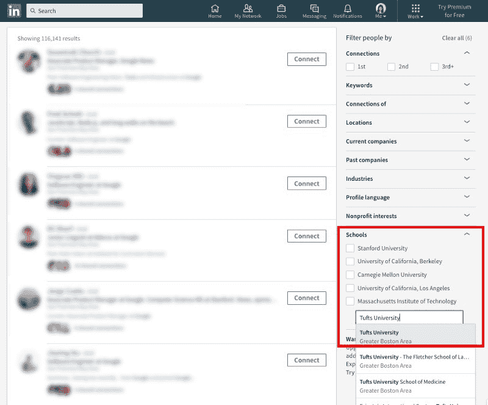
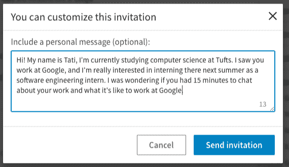

# 想找一份软件工程实习工作吗？这里有一些想法可以帮助你

> 原文：<https://www.freecodecamp.org/news/landing-a-software-engineering-internship-66e0d541539a/>

作者:塔蒂亚娜·道尔

# 想找一份软件工程实习工作吗？这里有一些想法可以帮助你。

注意:这篇文章只是为了分享我希望得到的建议。

如果你是一名正在寻找暑期软件工程实习机会的大学生，或者只是想知道找一份实习机会是什么感觉，那么这篇文章就是为你准备的！

在我大学二年级的时候，我非常确定我想成为一名软件工程师。我在大学里上过两门入门课，我很喜欢它们，并且在一个我喜欢的更高水平的班级里。因此，我希望在今年夏天获得一份软件工程实习，这将使我获得行业经验并提高我的技能。

由于不知道如何解决这个问题，我直到春天才开始寻找。从一月份开始，我在网上申请了 60 多家公司，收到了至少 20 份自动拒绝。我参加了两次技术面试(两次都以失败告终),最后找了一份与软件工程无关的工作。

我的错误是:

1.  直到春天才开始
2.  没有利用我的网络或试图扩大它
3.  没有为技术面试做准备
4.  不做任何副业

大三的时候，我下定决心要做得更好。我尽可能多地建立关系网，投入时间练习技术和行为面试，并参加我能得到的每一次面试。我觉得我最大的问题是如何迈出第一步。我的简历在网上成千上万的求职者中消失了。没有人有任何理由再看我的申请。

去年失败后，我花了很多时间研究获得软件工程师实习机会的策略。我从自己的错误中学到了四点:

1.  开始**早**
2.  人脉是你最重要的工具
3.  你必须**为**准备技术面试
4.  辅助项目让你的简历从优秀变得优秀

我要做的第一件事是挑选我想瞄准的公司。我首先列出所有我使用和喜欢其产品的公司，然后[在 Glassdoor 工作搜索上搜索“软件工程实习生”](https://www.glassdoor.com/Job/jobs.htm?suggestCount=0&suggestChosen=false&clickSource=searchBtn&typedKeyword=software+engineer+intern&sc.keyword=software+engineer+intern&locT=&locId=&jobType=)并筛选那些我喜欢其产品、听过其好评或其招聘信息听起来有趣的公司。

### 早点开始

招聘季节于八月/九月开始。我建议从八月/九月初开始，或者最迟十月。

许多大公司(如果这是你想要的)会在 11 月/12 月完成招聘。如果你想和朋友联系，尽早开始是很好的，例如，九月前。如果你正在春天阅读这篇文章，*还不算太晚*！你仍然可以应用下面的所有策略，并有很大的机会获得实习机会。

### 使用连接

可以这么说，这里总结了一些你可以向其伸出援手的人。

1.  在你想去的公司工作的校友
2.  在那家公司实习的朋友/同学
3.  教授
4.  在那家公司工作的朋友的朋友

#### *最初伸出手*

作为一名大学生，我觉得自己好像没有任何关系。联系似乎是真正的成年人所拥有的，而不是我。但这被证明是完全错误的。

首先，我认识一些校友，他们现在在我想去的公司工作。第二，我发现了 LinkedIn 作为最大限度利用我的社交网络的工具的力量。

我利用人脉的第一步是联系我已经认识的人*他们在我感兴趣的公司担任软件工程师。对我来说，向我已经认识的人要时间更容易。*

如果你的任何同学/朋友在这些公司实习，试着联系他们。他们通常会让你去找那家公司的招聘人员。接触这些公司的全职员工也很有价值。

我通常通过脸书信使联系他们，问他们是否有 **15 分钟的时间打个电话聊聊他们的工作**。请务必将询问时间限制在 15 分钟内——这是一个小问题，不会让你觉得是在帮对方的大忙。

同样重要的是，你不要让他们帮你找工作。人们不喜欢帮助他们不认识的人，这样接近他们可能会让他们不舒服。因为我发信息的人已经认识我了，他们都答应了。稍后，我将讨论在这种类型的电话中应该说些什么。

我的第二步是上 LinkedIn。确保你在 LinkedIn 上填写了尽可能多的信息——把它当作第二份简历。然后我开始通过 LinkedIn 联系那些我完全不认识的人。事情是这样的。

1.  我会转到我感兴趣的公司的 LinkedIn 页面，点击链接在 LinkedIn 上查看该公司的所有员工。

Company page on LinkedIn

2.然后我向下滚动到**学校**过滤器，输入我的大学。

Using the Schools filter

然后我会得到一份在我感兴趣的公司工作的大学校友名单。与你有共同点的人更有可能愿意抽出时间与你交谈或帮助你。

3.点击“连接”,然后“添加注释”,让他们在电话上聊天。我的典型笔记是这样的:

Message asking to connect

在我的笔记中，我用几句话解释了我为什么联系他们以及我的“询问”——一个 15 分钟的电话。保持简短、友好、切中要点(LinkedIn 不允许你超过 300 个字符)。

4.等他们回应！许多人可能永远不会回复你，有些人会立即或在几天内回复。我通常每周联系大约 5 个人，因为相当多的人根本不查看或使用 LinkedIn。我建议不要同时联系同一家公司的多个人，因为这有点多余。

除了联系你大学关系网中的人，如果你父母的朋友在科技行业工作，也可以联系他们，你朋友的朋友，等等。如果你在 LinkedIn 上看到一个你通过朋友联系到的人，请你的朋友把你介绍给那个人。

#### **打电话**

这种你和某人谈论他们工作的电话通常被称为“信息面试”。但称之为“采访”让它听起来比实际可怕得多。一旦你打了几个这样的电话，事情就变得简单多了。

我发现这些电话是我在实习搜索期间做的最有帮助的事情。他们帮助我弄清楚我想在什么样的公司工作，如何准备技术面试，以及我想进一步探索软件工程的哪些领域。

一开始可能不知道该问什么，所以我在很多电话中问了几个问题:

*   X 公司的文化是什么样的？
*   是否强调工作与生活的平衡？
*   人们在工作之外有多少时间在一起？
*   文化是透明的还是更隐秘的？
*   你喜欢在 X 公司工作的什么？
*   有什么是你不喜欢的，或者你想改变的吗？
*   在 X 公司做女工程师是一种怎样的体验？
*   换队尝试新事物容易吗？
*   你的团队在做什么？
*   你是怎么到 X 公司的？是什么让你选择了这家公司而不是其他公司？
*   你是如何进入计算机科学的特定领域的(例如机器学习、数据库等。)以及了解更多相关信息的资源有哪些？
*   在你的公司实习是什么样的？

诸如此类的问题是更好地了解在公司工作是什么样的一个好方法。即使你不是在找工作，信息面试也会很棒。他们可以帮助你更多地了解这个行业。

但是如果你正在寻找实习机会，有一个问题我在每次电话中都会问，这个问题特别有帮助:我怎样才能在 X 公司的实习生申请过程中脱颖而出？这个问题很好，因为和你通电话的人会给你如何在那里获得实习机会的建议，可能会帮你联系招聘人员，甚至推荐你去他们的公司。

#### 其他途径

除了接触人脉或潜在人脉，确保你利用了学校的招聘会！那些公司已经在那里了，因为他们想从你们学校招生。

对我很有帮助的一件事是(如果你是女性的话)把我的简历提交给格蕾丝·赫柏简历数据库。我有很多公司通过那个数据库联系我。此外，如果你认识的教授在这个行业有熟人或朋友，请他们帮忙建立联系可能是值得的。

### 技术面试和编码挑战

关于技术面试已经说得够多了，我觉得没有必要写一篇长文。但是，我觉得有几件事很重要:

*   编码挑战**是一件事**。这是一个[黑客等级](https://www.hackerrank.com/)式的评估，给你一个编码问题，并给你有限的时间来解决它，比如一个小时。他们通常是电话面试的预演。在一个时间限制内练习做 HackerRank 问题来模拟这种环境，这样你就为这些做好了准备。
*   就个人而言，我发现 Python 是面试的绝佳语言。它使您不必实现低级类型的数据结构或函数，并且编写和调试速度非常快。在 Python 中，面试需要知道的一些最有用的东西(在我看来)是 [defaultdict](https://docs.python.org/2/library/collections.html) 、[用λ排序](https://stackoverflow.com/questions/3766633/how-to-sort-with-lambda-in-python)、[字符串拆分/反转/连接](https://www.guru99.com/learning-python-strings-replace-join-split-reverse.html)，以及[内置数据类型](https://python.swaroopch.com/data_structures.html)。
*   尽量不要让自己紧张！我有两轮最后的机会，我以为我马上就失败了，但实际上这两轮我都得到了工作机会。
*   在你的技术面试中提问！这表明你对这家公司感兴趣。我发现[这篇中型文章](https://medium.freecodecamp.org/why-you-should-ask-questions-at-your-next-tech-company-interview-5070384dc5a0)在这方面特别有帮助。
*   试着找出一个你特别感兴趣的计算机科学领域，因为我几乎在每次面试中都被问到这个问题。
*   如果你有时间，尽可能多地参加面试/编码挑战。变得更好的唯一方法就是练习！

除此之外，这里还有一些关于准备编码面试的有用资源。

*   [帕兰蒂尔指南](https://www.palantir.com/the-coding-interview/)
*   本书[破解编码访谈](https://www.amazon.com/Cracking-Coding-Interview-Programming-Questions/dp/0984782850/ref=sr_1_1?ie=UTF8&qid=1510617251&sr=8-1&keywords=cracking+the+coding+interview)
*   [这篇博文](https://louisrli.github.io/blog/2014/01/18/tips-for-computer-science-internship-interviews/)
*   [这个资源列表](https://github.com/andreis/interview)
*   有一个名为[inter veing . io](https://interviewing.io/)的新网站让你和一名软件工程师配对进行技术面试——我没有尝试过，但它看起来真的很酷。

就我个人而言，我通过做破解编码面试的问题、[hacker rank](https://www.hackerrank.com/domains/python/py-introduction)上的 Python 问题以及尽可能多的做技术面试来准备技术面试。实践是无可替代的——我在第五次面试中远没有第一次那么紧张。

### 辅助项目

利用业余时间和课外时间做兼职项目是展示你对所做工作充满热情的最好方式。老实说，令人沮丧的是，存在一个标准，你已经主修计算机科学的事实不足以表明你喜欢它。

无论如何，副业是学习的好方法，也是建立简历的好方法。对我来说，做副业是有回报的。我已经能够在自己练习实现某些东西的同时建立自己的技能组合。这里的和[这里的](http://www.dreamincode.net/forums/topic/78802-martyr2s-mega-project-ideas-list/)是帮助你开始的项目想法列表。我建议做一个你有热情的副业，而不是一个你只是用来写简历的副业。这会更有趣，你会学到更多东西。

我的学校有一个叫做 [JumboCode](http://jumbocode.org/) 的东西，为非营利组织做编码工作。作为俱乐部的一员，我在团队中的经历是我最喜欢的经历之一。从技术上来说，在团队中工作以及奇妙的学习经历。如果你的学校有类似的东西，如果你感兴趣，一定要考虑参与进来。

### 最后的想法

通过使用上述所有策略，我得以在 Square 获得实习机会，这是我的首选！去年在 Square 工作的一位朋友让我联系了现在的招聘人员，最终我得到了这份工作。

获得软件工程实习很难。

当你没有很多公司试图从你的学校招聘时，或者你没有很多家庭关系时，这尤其困难。但是如果你去一所有计算机科学毕业生的学校，至少他们中的一些人可能会在你感兴趣的公司工作！由于上过你的大学，他们通常愿意帮助你。

这篇文章旨在公开我希望人们早点告诉我的所有事情，希望能帮助任何寻找软件工程实习的人。

如果您有任何问题，请随时通过电子邮件联系我，邮箱:tatidoyle01[at]gmail.com！

非常感谢那些帮助我校对和编辑这篇文章的人！