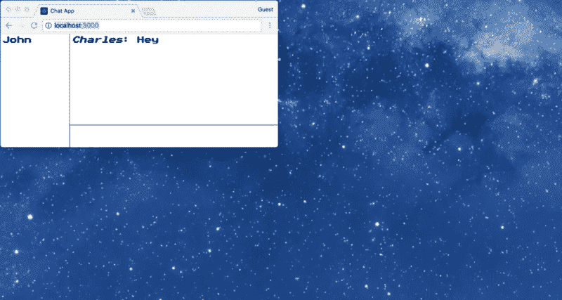
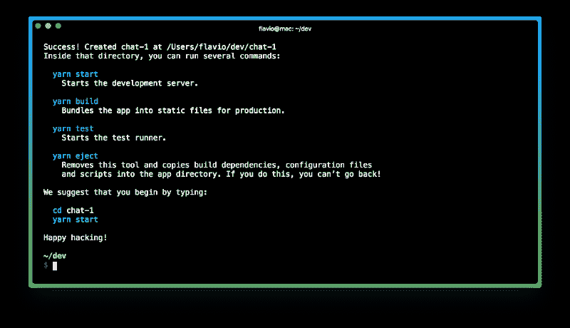
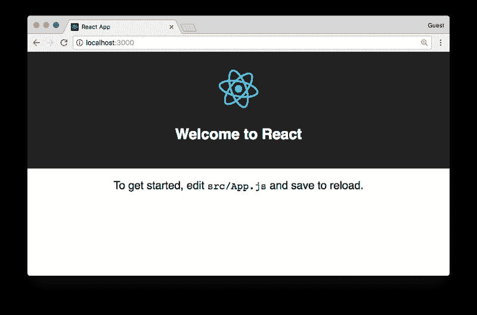
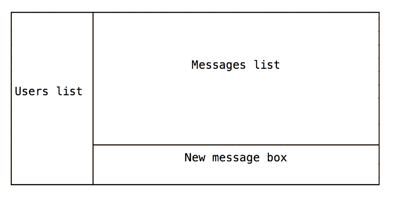
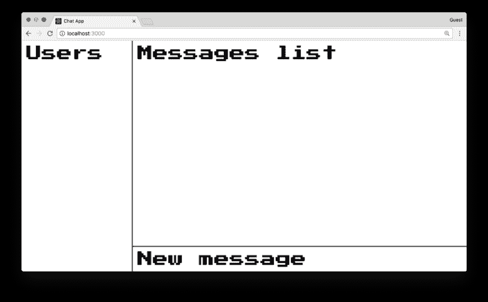
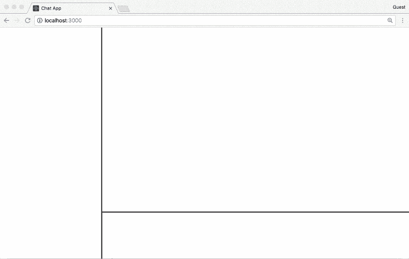
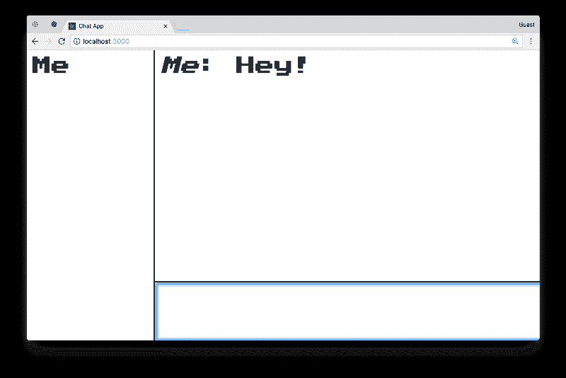

# 如何使用 React、Redux、Redux-Saga 和 Web Sockets 构建一个聊天应用程序

> 原文：<https://www.freecodecamp.org/news/how-to-build-a-chat-application-using-react-redux-redux-saga-and-web-sockets-47423e4bc21a/>

> 对学习 JavaScript 感兴趣？在 jshandbook.com 获得我的电子书

在本教程中，我将建立一个基本的**聊天室。**连接到服务器的每个用户都在连接时注册，获得一个用户名，然后可以编写消息广播到每个连接的客户端。

> 关于这个主题和新的浏览器 API，有很多东西需要学习。我每天都会在我的[博客上发布一篇关于前端开发](https://flaviocopes.com)的新教程，不要错过！

该应用是一个使用 **Node.js 服务器**构建的分布式应用，内置 **React** 的浏览器客户端，使用 **Redux** 管理数据，使用 **Redux-Saga** 管理副作用。

客户端-服务器通信通过 **WebSockets** 处理。

这个应用程序[的完整源代码可以在这里](https://github.com/flaviocopes/chat-app-react-redux-saga-websockets)找到。

### 初始化创建-反应-应用程序

让我们使用 **create-react-app** 快速启动工具`create-react-app chat`来启动这个项目

完成后，在应用程序文件夹中选择`cd`并运行`yarn start`

### 聊天应用程序布局

我们的应用程序将具有这种基本布局，这在聊天应用程序中非常常见:

为此，我们需要使用普通 HTML 和 CSS 创建一个静态版本的聊天，这是一个带有 CSS 网格的最小化的复古风格的聊天布局。

代码非常简单:

结果是一个包含用户列表的侧边栏和一个在屏幕底部带有新消息框的主区域:

### 添加 Redux 来管理状态

现在来说说数据。

我们将使用 **Redux** 来管理状态。

用`yarn add redux react-redux`安装 Redux 和 react-redux。然后，我们可以翻译我们在上面添加的基本 HTML 布局，并准备填充我们稍后将创建的组件:

我们包括了**侧边栏**、**消息列表**、**T5 和 **AddMessage** 组件。**

他们都有:

*   表示组件，管理用户界面
*   一个容器组件，它管理其行为和表示组件将显示的数据

让我们编辑主 app `**index.js**`文件来初始化 Redux，然后导入`chat`减速器，然后创建`store`。

而不是告诉 ReactDOM 呈现`<App` / >，`enter Pr` ovider，这使得商店可用于**应用程序的所有组件，而无需显式向下传递 i** t。

接下来，**动作**。

将动作常量输入到`**ActionTypes.js**`文件中，这样我们可以在其他文件中轻松引用它们:

这个文件包含了我们聊天的四个动作。您可以添加新消息，新用户也可以添加到聊天中。可以发送新消息，当某人加入或退出聊天时，服务器会向用户列表发送更新。

当创建新邮件时，我现在强制将作者姓名改为“我”我们稍后会添加用户名。

**reducer**负责在调度一个动作时创建一个新状态。特别是:

*   当我们添加一条**消息时，**我们将其添加到(本地)消息列表中
*   当**我们从服务器接收到消息**时，我们将它添加到我们的消息列表中
*   当**我们添加一个用户**(我们自己)时，我们把它放在用户列表中
*   当**我们从服务器获得更新的用户列表**时，我们刷新

让我们深入研究将呈现这些数据并触发动作的组件，从`**AddMessage**`开始:

这个功能组件非常简单，在`#new-message`部分创建一个`input`字段。当按下 **enter** 键时，我们调度`addMessage`动作，传递输入字段的值。

接下来:组件。它使用`*Author: Message*`格式呈现一条聊天消息:

它由`MessagesList`组件呈现，该组件遍历消息列表:

相反,`Sidebar`组件遍历每个用户，并打印每个加入聊天的用户的用户名:

我们通过使用`react-redux`提供的`connect()`函数，为上述表示组件生成容器组件:

这段代码给了我们这个好结果。当我们键入一条消息并按回车键时，它会被添加到消息列表中:

### 将我们自己添加到用户列表中

侧边栏应该显示用户列表。特别是，由于现在的应用程序不与任何人交谈，我们应该在侧边栏中看到`**Me**` 。稍后，我们将添加其他人加入聊天。我们已经有了`addUser` Redux 动作，所以在初始化商店之后，在我们的`**index.js**`文件中调用它是一个问题:

### 测试

让我们添加自动化测试，以确保一切正常工作，并在未来添加更多功能时继续正常工作。

由于我使用的是`create-react-app`， [Jest](http://facebook.github.io/jest/) 已经可以使用，我可以简单地开始添加测试。为了简单起见，我将测试文件添加到包含待测试文件的文件夹中。

我们从测试我们的行动开始:

我们也可以测试我们的减速器:

我们还为演示组件添加了一些基本测试:

### 添加服务器端部件

坦率地说，本地的、不与网络通信的聊天不是一个非常有趣的消磨时间的地方。让我们创建一个集中的服务器，用户可以登录到这个服务器，并且可以在这里互相交谈。

我将在浏览器中使用得到广泛支持的[原生 WebSocket 对象](https://developer.mozilla.org/en-US/docs/Web/API/WebSocket)，并在 Node.js 服务器上使用 [ws WebSocket 库](https://github.com/websockets/ws)。

先说服务器，超级简单:

客户端一连接，我们就开始监听`**ADD_USER**`和`**ADD_MESSAGE**`事件。当客户端建立连接时，它将发送一个名为`ADD_USER`的事件。我们将**将其添加到服务器端用户列表**中，然后**向所有连接的客户端发布广播**。

当一个`ADD_MESSAGE`事件被发送时，**我们将它广播给所有连接的客户端**。

在连接关闭时，我们**从列表中删除用户名**,并广播新的用户列表。

在客户端，我们需要**初始化`WebSocket`** 对象，并在连接到聊天时发送一个`ADD_USER`事件。然后**我们监听服务器广播的`ADD_USER`和`ADD_MESSAGE`事件**:

我们将从主`**index.js**`文件导入`setupSocket()`。

我们现在需要在代码中引入一种方法来让**处理副作用**,并在用户键入消息时处理创建 WebSocket 事件，这样就可以将消息广播给所有连接的客户端。

为了以一种干净的方式执行这个操作，我们将利用`[**redux-saga**](https://redux-saga.js.org/)`，这个库提供了一种处理 Redux/React 中副作用的好方法。

从`yarn add redux-saga`开始

我们初始化`redux-saga`中间件，并将其连接到 Redux store，以挂钩我们的`**saga**`:

Redux-Saga 是一个 **Redux 中间件**，所以我们需要在商店创建期间初始化它。一旦完成，我们运行中间件并传递用户名和`dispatch`函数。在这样做之前，我们初始化套接字，这样我们就可以在 saga 中引用它。

以前，用户被称为“我”，但如果每个用户都称自己为“我”就不太好了。所以我加了一个**动态用户名生成器**，使用 [Chance.js](http://chancejs.com/) 。我们每次登录时，都会通过导入`utils/name`为我们生成一个唯一的名称:

现在让我们开始我们的**传奇**:

从概念上讲，这很简单。我们采取类型为`ADD_MESSAGE`的所有动作，当这个动作发生时，我们向 WebSocket 发送一个消息，传递动作和一些细节。我们的用户发送的聊天消息可以由服务器发送给所有连接的客户端。

这里我们得到了最终的结果，下面你可以看到一张 gif 图，展示了在多个客户端连接的情况下聊天是如何进行的。我们可以打开任意多的窗口，只要我们加载了服务器 URL，我们就会以一个新的用户名连接到聊天室。我们看不到过去的消息，就像在 IRC 中一样，但我们会看到从我们登录的那一刻起写的每一条消息。

一旦我们离开，我们的用户名就会被删除，聊天中的其他人可以继续聊天。

> 对学习 JavaScript 感兴趣？在 jshandbook.com 获得我的电子书