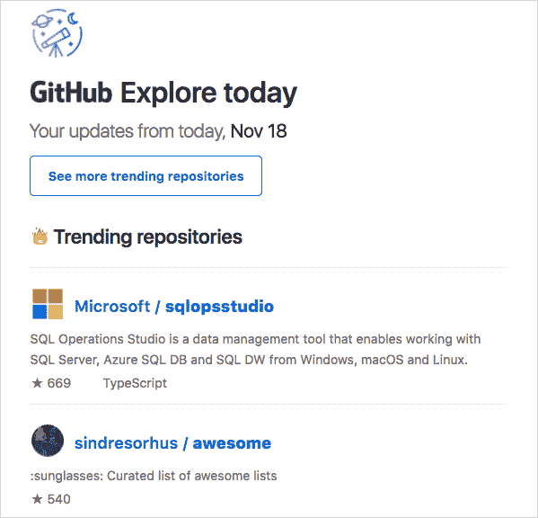
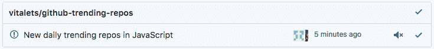
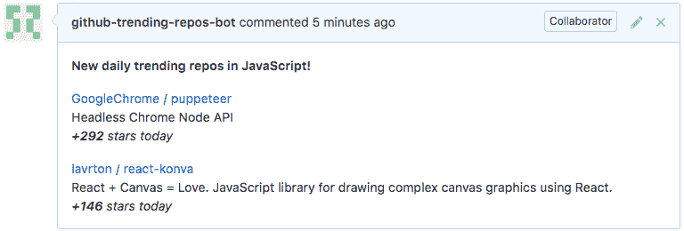
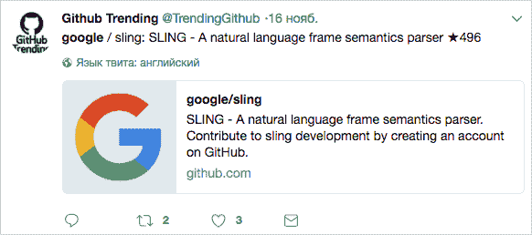
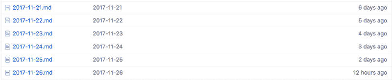
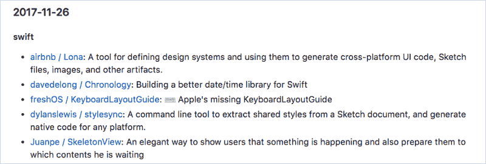

# 这里有 5 种方法可以跟踪 GitHub 上的趋势库

> 原文：<https://www.freecodecamp.org/news/five-ways-of-tracking-trends-on-github-63940fca63b/>

活力波塔波夫

# 这里有 5 种方法可以跟踪 GitHub 上的趋势库

GitHub trending 是一个不断更新的存储库列表，提供了社区最感兴趣的开源项目的视图。

趋势库根据用户每天、每周或每月给它们加星的次数来显示。你可以根据特定的编程语言对它们进行过滤，这样你就可以看到在你感兴趣的领域发生了什么。

跟踪这个页面也会让你了解到每个人都在谈论的“最热门”的项目。我在 GitHub 上尝试了五种不同的追踪趋势的方法，并做了一些比较和对比，如下所示。

#### 1.GitHub 探索时事通讯

这是来自 GitHub 的官方简讯。可以[在这里](https://github.com/explore#newsletter)订阅。电子邮件每天、每周或每月发送，取决于您的偏好。该电子邮件包含所选时间段内所有编程语言的前 5 大趋势库:

GitHub Explore newsletter

时事通讯还包含个性化推荐。例如，它可能包含您在 GitHub 上关注的人的项目列表。

**优点:**

*   官方通讯
*   每日、每周或每月邮寄时间表
*   个人推荐

**缺点:**

*   您不能订阅特定的编程语言
*   虽然在 GitHub 趋势页面上有 25 个库，但是只有前 5 个库在列表中

#### 2.GitHub 通知

GitHub 通知系统是一种追踪 GitHub 上活动的本地便捷方式。对于许多开发人员来说，这是他们日常工作过程的一部分。您可以收到关于新评论、拉取请求、提及以及您可能参与的任何其他活动的通知。

GitHub web notification bell, from [official docs](https://help.github.com/articles/accessing-your-notifications/)

GitHub-trending-repos 是一个特殊的存储库，它使用 GitHub 通知向您发送有关趋势的更新。该库中的每个问题都与特定的编程语言相关。在每天和每周的基础上，机器人检查趋势库页面并删除评论。您可以在 GitHub web 界面上或通过电子邮件订阅一期并接收更新。

GitHub web notification with new trends

Example of bot’s comment

**优点:**

*   您可以订阅特定编程语言的趋势
*   您可以通过 GitHub web 界面或电子邮件接收通知
*   您可以选择每日或每周更新

**缺点:**

*   并非所有的编程语言都可以订阅

#### 3.推特机器人

每 30 分钟 [@TrendingGithub](https://twitter.com/TrendingGithub) bot 就会发一条关于一个真实的趋势库或开发者的推文:

Example of @TrendigGithub tweet

追随者可以很容易地掌握 GitHub 趋势脉搏。在所有编程语言中选择存储库。在内部，该项目会记住 30 天的推文内容，以避免内容重复。

**优点:**

*   Twitter 是接收新闻的便捷渠道
*   您也可以跟踪趋势开发者

**缺点:**

*   不可能订阅特定的编程语言
*   每 30 分钟接收一次更新可能很烦人

GitHub 上有项目源[。](https://github.com/andygrunwald/TrendingGithub)

#### 4.Changelog 夜间简讯

[Changelog Nightly](https://changelog.com/nightly) 是美国中部时间(CT)每晚 10 点自动发送的时事通讯。它收集所有编程语言的趋势库，并将它们分成三组:

1.  *第一次* -以前未通过电子邮件发送的趋势库
2.  *全天开放源代码的热门新*趋势知识库
3.  *重复执行者-* 以前已经出现在时事通讯中的趋势库

Changelog Nightly email

这是数字媒体公司 Changelog 的一个子项目，该公司为开发者提供许多其他很酷的东西:7 个技术播客、新闻、每周有主持的电子邮件和 Slack 中的社区讨论。

**优点:**

*   项目被分成有意义的组:第一次，今天创造和重复表演者

**缺点:**

*   唯一可用的日程选项是每日电子邮件
*   不可能通过特定的编程语言进行过滤

值得一提的是，Changelog Nightly 由 GitHub Archive 提供支持，这是一个记录 GitHub 上所有公共活动的数据库。您可以使用任何 HTTP 客户端访问数据，并做出自己的分析。

#### 5.手动浏览每日更新的回购

如果不需要任何通知，可以考虑这种方法。每天， [github-trending](https://github.com/josephyzhou/github-trending) 资源库中的一个脚本都会抓取趋势项目，并将它们提交为降价文件。您可以手动浏览这些文件，并找出特定日期的趋势。

Daily markdown files with trending repositories

每个文件的内容涵盖了 7 种编程语言:Swift、Objective-C、Go、JavaScript、Ruby、Rust 和 Python。

Trending projects for Swift on 26 Nov 2017

**优点:**

*   您可以访问趋势的完整历史
*   你不会被通知所困扰

**缺点:**

*   仅支持 7 种语言
*   只有每日趋势，没有每周或每月更新
*   没有关于后天获得的恒星的信息
*   你需要手动浏览

### 结论

每种方法都有自己的优缺点。你可以全部尝试，选出最适合你的。

我相信跟踪新的 GitHub 项目是开源世界的重要组成部分。这有一个双赢的效果:

1.  作为开发人员，您可以通过使用现代方法和工具来提高自己的生产力。
2.  作为项目作者，您可以收到社区反馈和未来发展的灵感。

感谢阅读！欢迎你分享你是如何在 GitHub 上发现潮流的。