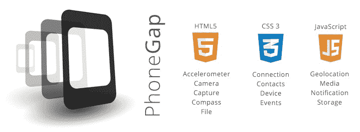
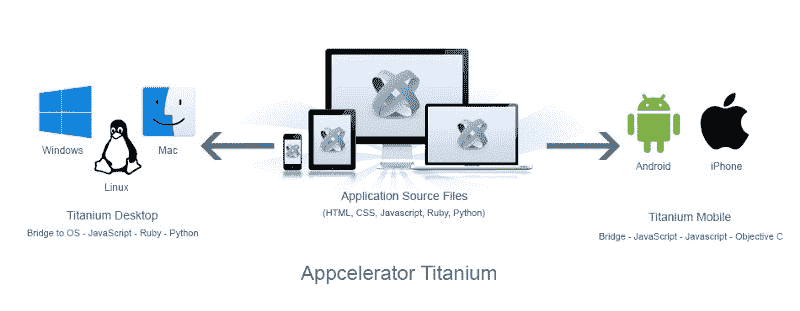
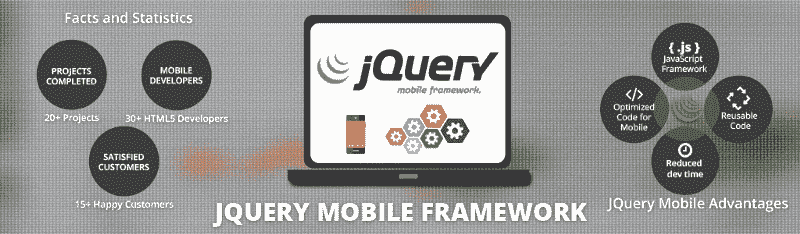
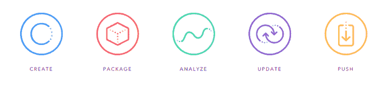

# 你在开发安卓应用吗？以下是可以使用的最佳框架。

> 原文：<https://www.freecodecamp.org/news/are-you-developing-an-android-app-here-are-the-best-frameworks-to-use-e3d1f0a98f70/>

作者:迪米特罗·布罗夫金

# 你在开发安卓应用吗？以下是可以使用的最佳框架。

我们都听说过制作应用程序有多难的故事。每个人都知道开发一个 Android 应用程序比开发一个 iOS 应用程序更耗时、更昂贵。但是如果我告诉你这不是真的呢？事实上，有各种各样的框架可以帮助越来越快地开发应用程序。

Android 有能力运行数百万个应用程序。但最重要的是，它为 Android 应用程序开发的开发者提供了一个巨大的市场。这使他们能够部署和创建自己的应用程序，并让智能手机和平板电脑用户都能使用它们。

这些 Android 框架的目的是通过提高生产率，提供内置工具来处理编码的困难部分，从而减少开发人员的工作量。我将在这里概述一些最好的框架，这样你就可以知道哪个最适合你。

#### 开源 vs .基于谷歌 vs .付费

**你得到你所付出的*是标准的陈词滥调。但是有几个开源的、有效的、免费的框架。*

*[**PhoneGap**](http://phonegap.com/) :这个框架由 Adobe 和 Apache 赞助，是一个跨平台的应用。它支持 HTML5、CSS 和 JavaScript 开发，并允许人们在编程时看到您所做的更改。*

*有了这个框架，您可以使用当前的 web 技术轻松创建应用程序。最新的 6.0 版本提供了 Windows phone 支持和各种 CLI 功能。虽然它可能更像是一个“包装器和打包器”部署环境，但是它可以集成到下面列出的各种框架中。*

**

*[**Corona SDK**:](http://phonegap.com/)Corona 的独特之处在于它支持极快的应用程序开发。它无与伦比的开发和迭代速度，得益于其优雅的 API，使其成为通用开发和游戏的理想框架。*

*这个框架进一步托管了原生 UI 支持、一个内置引擎、500 多个 API 以及一个为开发者开发的广告平台。这个框架很特别，它是用 Lua 运行的，Lua 是一种适应性很强的编程语言。*

*[**Appcelerator Titanium**](http://www.appcelerator.com/):Appcelerator Titanium 是最大的移动应用开发框架之一，支持开发者从单一 JavaScript 代码库开发原生移动应用。目前有超过 345，577，760 台设备通过各种 Appcelerator 支持的应用程序运行。该框架进一步提供了移动测试自动化，这有助于手动测试以及实时和完全密集的操作。*

**

*[**TheAppBuilder**](https://www.theappbuilder.com/)**r**:由 HTML5 支持的 the app builder 利用了一个无代码的接口，从而实现了更快、更即时的开发。最棒的是。这个框架允许你直接向 Google Play 提交应用。拖放，无代码界面允许更快的应用程序开发，社交网络应用程序的集成使其对开发人员特别有用。*

*jQuery Mobile jQuery 提供了各种有趣的特性，包括语义标记、渐进式增强和主题化设计，以及 PhoneGap/Cordova 支持。*

*此外，它的简单性意味着您只需编写一次代码，就可以在任何平台上运行。如果你也在黑莓和 Windows 手机上开发应用，这是一个很好的框架。*

*HTLM5 用户界面提供了一个触摸优化的网络框架，旨在使所有智能手机和平板设备都可以访问应用程序。它还可以用来制作响应式 web 应用程序。开发人员为每个移动设备编写独特应用程序的日子已经一去不复返了。*

**

*jQuery Mobile 将“写得更少，做得更多”的口号推向了新的高度。该框架允许开发人员制作一个高度品牌化、响应迅速的移动应用程序或网站，可以在大多数流行的智能手机、平板电脑和桌面平台上运行。jQuery Mobile builder 还生成了一个定制的 JavaScript 文件，以及用于生产的完整和纯结构样式表。*

*[**Ionic**](https://ionicframework.com/) :该框架因其跨平台特性以及集成 AngularJS 以开发高级应用的选项而广受欢迎。事实上，已经开发了 400 万个 Ionic 应用，有超过 500 万的开发者在使用这个框架。它的命令行界面允许包括实时重载、模拟器和日志记录在内的特性。它是构建移动 SDK 应用程序以开发本地 web 应用程序的开源框架之一。*

**

*Ionic 托管一个简单的 CLI 来创建、构建、测试和部署您的 Ionic 应用程序。它还提供了为高交互性应用程序构建本机应用程序组件的最佳框架之一。*

*Ionic Framework 是完全跨平台的，允许开发人员用一个代码库构建渐进的原生移动应用。此外，该框架构建为仅采用最佳实践，包括高效的硬件加速转换和触摸优化手势。*

*通过模拟原生 UI 无指南并考虑 UI 标准，Ionic 使开发人员能够通过使用 Cordova 或 Phonegap 进行原生部署，将原生应用的功能与开放 web 的功能和灵活性相结合。*

*Ionic 有现成的组件，一个可扩展的基础主题，可以自动适应你正在构建的平台，它拥有自己的排版。它拥有大量优秀的框架特性，确实是最好的框架之一。*

**

*[**Realm**](https://realm.io/) : Realm 是一个强大的移动数据库框架。它节省了数周的应用程序开发时间，比 SQLite 简单得多。该网站声称，它可以让你“以一种安全、持久和快速的方式高效地编写你的应用程序的模型层。”他们甚至推出了一个 Android 领域，仅在八周内就在他们的 iOS 平台上吸引了 20，000 名开发者。*

*Realm 自称对开发者友好，这使得开发者更容易实时构建反应式应用。它还拥有相当数量的其他协作功能，以优化在线和离线体验。*

*[**react vex**](http://reactivex.io/):对于一个架构框架，不用再看了。它是一个 Java VM 实现，是一个“通过使用可观察序列来组合异步和基于事件的程序的库”RxJava 扩展了[观察者模式](http://en.wikipedia.org/wiki/Observer_pattern)，以便更好地支持数据/事件序列。*

*该框架还增加了许多操作符，允许开发人员以声明方式将序列组合在一起。这抽象了开发人员对“低级线程、同步、线程安全和并发数据结构”的担忧它还支持 Java 6 和 Android T1，因此可用于大多数平台。*

*选择最好的框架是一个有效运行的应用程序的关键，要辨别哪个 Android 框架最适合你可能很困难。但你不必独自完成。如果您或您的公司对探索哪种移动框架最适合您和您的项目需求感兴趣，请查看我们网站页面上的[更多我们的工作](https://octodev.net/?utm_source=medium&utm_campaign=what%27sApp)和我们的投资组合，查看我们以前承担的项目。*

**

*您可以[联系我们](https://octodev.net/contact-us/)进行免费对话、咨询和调查，因此我们可以根据您的业务和技术需求以及您的创意和预算，为您提供最佳的移动框架。*

**这篇文章最初发表在 [Octodev 博客](https://octodev.net/best-frameworks-for-android-apps-development/)上。**

*如果你喜欢这篇文章，请点击下面的拍手图标告诉我！*