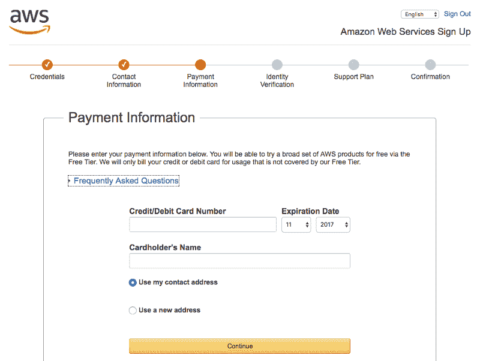
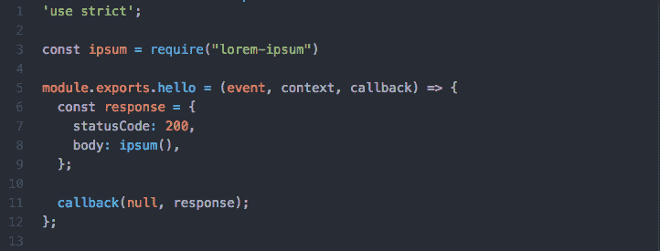
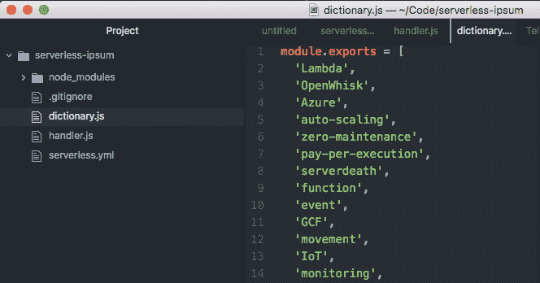
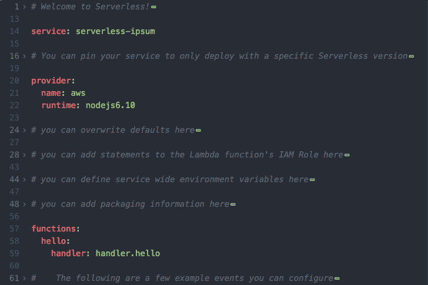
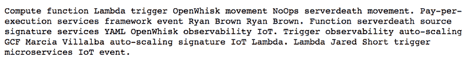

# 我刚刚部署了一个无服务器应用程序，但我不会编码。我是这样做的。

> 原文：<https://www.freecodecamp.org/news/i-just-deployed-a-serverless-app-and-i-cant-code-here-s-how-i-did-it-94983d7b43bd/>

安德烈·帕斯沃特

# 我刚刚部署了一个无服务器应用程序，但我不会编码。我是这样做的。


Such hacker, very dev ^

嘿，开发者朋友们！我设法部署了一个真正的、有效的应用程序。但是请注意，我不是你们中的一员。

我是一个以写推特和博客为生的作家。

我的命令行体验仅限于我在 iPhone 5 发布前参加的 Codecademy 课程。我知道如何输入`ls`来查看文件夹的内容，而不需要视觉样式。TL；博士，我是一个黑客坏蛋。

尽管如此，朋友们，我写了一个应用程序。而且是托管的。你可以自己去参观，从你的个人电脑上。

因为，正如我所发现的，AWSλT1 和 T2 的无服务器框架 T3 使得 T4 部署应用程序并不困难。

这也是你如何编写和部署一个无服务器的应用程序，并且基本上没有编码经验。

### 好吧，但是就像…你为什么要这么做？

很高兴你问了！因为，看，自动化就是力量。

就像你一样，我有很多事情要做，但是没有足够的资源来完成。

我想写 slack 机器人来提醒人们他们的博客草稿何时到期。我想根据用户行为创建滴滴营销活动，而不会花掉我在 15 种营销工具上的预算。我想根据预先设定的时间表自动合并博客文章。

自定义应用程序给了我这些。我可以创建一个机器人奴才团队。

### 制作应用程序

整个项目大概花了我一个小时。

这是我们要做的:

*   安装无服务器框架
*   创建 AWS 帐户
*   为我的无服务器用户设置 AWS 权限(IAM 角色)
*   在 npm 上找到一些与我想要的足够接近的免费代码
*   偷走它
*   调整它
*   使用无服务器框架将其部署到 Lambda

Lambda 最酷的一点是，我不需要管理它、供应它或扩展它**或任何东西**。我把我的代码放在那里，它在需要的时候运行。我可以部署它，然后基本上忘记它。

无服务器框架最酷的一点是，AWS 很难搞清楚。该框架负责幕后的所有细节，坦率地说，这使得它几乎不可能搞砸。

典型的例子:我。我没有搞砸。

这东西是防弹的。

### 安装无服务器框架

如果你还没有自制软件(我没有)，你需要先安装它。家酿软件使在你的机器上安装各种开发者的东西变得容易。

打开您的终端，粘贴家酿主页上的代码片段:

```
/usr/bin/ruby -e “$(curl -fsSL https://raw.githubusercontent.com/Homebrew/install/master/install)"
```

等待一个永恒(又名 5 分钟)为它完成，然后安装节点；框架要求这样运行:

`brew install node`

然后粘贴 Serverless.com 主页上的片段:

`npm install serverless -g`

恭喜你！你只用复制/粘贴就做到了这一步。

### 创建 AWS 帐户

前往[aws.amazon.com](https://aws.amazon.com/)，点击十五个有用按钮中的一个，让你创建一个新账户。我选了右上角的那个:


他们会让你回答很多问题。很抱歉。这一切很快就会结束。


当他们向你要信用卡时，你必须给他们一张。他们不会提前向你收取任何费用，但他们会把它存档，以防万一。



好吧，关于“很快结束”我撒了谎。现在他们想通过让机器人给你打电话来验证你的身份(lol)。安抚他们，这次我们真的快完成了。

当您的电话铃响时，在屏幕上输入 4 位数的 PIN。我看了看手机上的计时器；这是一个 20 秒的电话。


最后，选择你的支持计划！也就是说，不要选择支持计划。除非你是一家真正的公司，在这种情况下，你可以随心所欲地花投资者的钱。

在这里，我不是作为一个真正的公司选择“基本”选项，因为它是免费的:


现在，点击“启动控制台”并再次登录。

总而言之，这一阶段需要 5-10 分钟，取决于你是否记住了你的信用卡号码，因为你是一个多产的网上购物者。

### 配置 IAM 用户

无服务器框架需要它来代表你完成所有复杂的 Lambda 设置工作。

听起来对我来说是一个很好的交易！让我们开始吧。

值得注意的是，我使用了[这个非常有用的演练](https://serverless.com/blog/anatomy-of-a-serverless-app/)来指导我完成整个设置过程。你可能也会喜欢。

现在您已经启动了 AWS 控制台，在方便的搜索框中键入“iam ”:


是的，我们希望管理“用户访问”和“加密密钥”单击 dat。

进入 IAM 后，进入左侧菜单中的“用户”:


然后在顶部“添加用户”:


现在我们需要配置这个新用户。

你可以[观看这个 75 秒的视频](https://www.youtube.com/watch?v=yaLMc7WMmHQ&index=1&list=PLIIjEI2fYC-A5wxo521u6OqAwbsFFQFbW)并完全按照他们做的去做**或者**如果你是一个抽象的书呆子，你可以滚动浏览这些**我** 完全按照他们做的去做的截图并复制它们。

创建您想要的任何用户名，并选中“编程访问”旁边的框:


单击“直接附加现有策略”，然后选中“管理员访问”旁边的框:


值得注意的是，根据 Serverless.com 在 IAM 上的博文[，走“管理员访问”路线是“快速但有风险的 YOLO 方法”我无论如何都要这么做，因为我不是一个开发人员，因此不了解我可能造成的破坏。](https://serverless.com/blog/abcs-of-iam-permissions/)

请不要黑我。

如果你想在这方面更加勤奋，遵循他们关于缓慢但安全的方法的指导方针。

继续点击“下一步”，然后点击“创建用户”

你会在这样的屏幕上着陆。**先不要关闭这个窗口，我们会用到它**:


#### 安装 AWS CLI

这将让我们(1)用 AWS 做一些事情，而不用通过有太多图标的令人生畏的界面；(2)无意识地将东西复制/粘贴到终端上，互联网上的专家说，这将做我们想要的。

要开始这个复制/粘贴聚会，将`brew install awscli`放入您的终端，让 Homebrew 为您安装 AWS CLI。

完成后，输入`aws configure`。

现在您将需要那个 IAM 用户窗口，您肯定还没有关闭它！从该窗口复制“访问密钥 ID”和“秘密访问密钥”,并根据提示将其粘贴到终端中。

我将其他内容留空，因为(正如我们已经提到的)YOLO:

```
AWS Access Key ID [None]: PLZ-PUT-UR-ACCESS-KEY-HEREAWS Secret Access Key [None]: PLZ-PUT-UR-SECRET-ACCESS-KEY-HEREDefault region name [None]: Default output format [None]:
```

### 在 NPM 冲浪寻找预写代码

由于我是一个具有讽刺幽默感的潮人，我决定让我的第一个无服务器应用成为无服务器 Ipsum 生成器。

这就像 Lorem Ipsum，但有随机的“无服务器移动”的流行语。明白了。这是一个无服务器的应用程序。？

我去了[npmjs.com](https://www.npmjs.com/)，这是一个神奇的网站，那些比我心胸宽广得多的人在这里发布他们的 NodeJS 代码，以便其他人可以使用。…免费。我还是不敢相信这真的存在。

我在搜索框中输入“lorem ipsum ”,评估我的选项。


我点击了一个简单地叫做“lorem-ipsum”的，因为作为一个专业作家，我对单词选择极简主义有着浓厚的兴趣。(感谢 [knicklabs](https://www.npmjs.com/~knicklabs) ！)

让我们抓住它。

但首先我们需要创造一个地方来放它。一个新的无服务器项目，如果你愿意。

#### 使用无服务器框架创建新项目

还记得在这篇文章的顶部，我们做了`npm install serverless -g`？它安装了我们现在要使用的无服务器框架！

首先，让我们创建一个文件夹来保存我们所有的未来无服务器项目。我将把我的文件夹命名为“代码”，因为它与 Node 押韵，而我是一个诗人。

这就是我的黑客技能发挥作用的地方。在您的终端中，键入`ls`以查看您所有的文件夹名称。(实际上，我不认为你**需要**这样做有什么理由，但也没有理由不这样做，所以不妨热身一下。)

你现在应该看到的是你桌面上所有文件夹的列表，用的是干净的等宽字体。神奇。

现在输入`mkdir Code`——又名，“创建一个名为‘代码’的目录(文件夹)。”’‘然后用`cd Code`导航到那里。

在这个全新的“代码”文件夹中，我将创建我的第一个无服务器应用程序。看着我走:

`serverless create --template aws-nodejs --path serverless-ipsum`

`--template aws-nodejs`部分告诉 Serverless 我们正在使用 AWS 和 NodeJS。他们将利用这些信息代表我们进行神奇的设置/配置。

`--path serverless-ipsum`部分告诉 Serverless 我们的新项目叫做“serverless-ipsum”所以您应该用您希望的项目名称来替换 serverless-ipsum。

当您按“回车”时，无服务器将创建一个名为“无服务器-ipsum”的新文件夹你所有的申请材料都会放在那里。

我们刚刚做了一个应用的开端。现在让我们给它一些代码来运行。

#### 安装来自 NPM 的 lorem ipsum 软件包

通过在终端中键入`cd serverless-ipsum`,导航到我们刚刚创建的无服务器-ipsum 目录。

然后键入`npm install lorem-ipsum`安装 NPM 的 lorem ipsum 包。

现在我们的 app 文件夹里面有代码了！它基本上已经是一个应用程序了！算是吧。

#### 修改 NPM 代码

我们确实需要对代码进行一些调整，所以请打开您最喜欢的代码编辑器。我使用 Atom 是因为我没有最喜欢的代码编辑器，但是我有最喜欢的物质单元。

无论如何，现在你的`handler.js`文件应该是这样的:


打开它，把上面的东西换成这个:

```
'use strict';
```

```
const ipsum = require("lorem-ipsum")
```

```
module.exports.hello = (event, context, callback) => {  const response = {    statusCode: 200,    body: ipsum(),  };
```

```
callback(null, response);};
```

这样您的`handler.js`文件现在看起来像这样:



我们在这里做的是告诉我们的小函数处理器运行我们下载的`lorem-ipsum`包并打印输出。

我们首先要求用`const ipsum = require("lorem-ipsum")`把包放在最上面，然后告诉`body`用`body: ipsum()`把生成的 ipsum 打印出来。其他一切都保持不变。

#### 在终端本地测试它

伙计们。我们在框架中创建了一个无服务器项目。我们已经下载了一些预先编写的代码来生成 lorem ipsum。

我们可以告诉无服务器运行这个。就现在。在我们的终端里。

关键时刻到了。类型:`serverless invoke local --function hello`

等着吧…

```
{“statusCode”: 200,“body”: “Amet cillum est dolor eiusmod elit eiusmod nulla eu do.”}
```

我的天啊。

### 调整预建的 lorem ipsum 生成器

拉丁语很棒，但无服务器的胡言乱语更好。毕竟，我们正在制造一个**无服务器** Ipsum 生成器。

回到 Atom，您的“无服务器-ipsum”项目可能还在那里。它包含几个文件，我们将使它包含一个以上。

点击`cmd/ctrl + n`创建一个新文件，并将其命名为`dictionary.js`。创建一个[数组](https://developer.mozilla.org/en-US/docs/Web/JavaScript/Reference/Global_Objects/Array)，并用“Lambda”和“serverdeath”这样的行业术语填充它:



对于那些专门从事复制/粘贴工作的人来说，你可以这样做:

```
module.exports = ['auto-scaling','zero-maintenance','pay-per-execution','serverdeath','function','event','handler','cloud','NoOps','Lambda','microservices','monitoring',]
```

然后用`cmd/ctrl + s`保存文件。

我们还必须返回到我们的`handler.js`文件，并告诉它使用我们刚刚创建的字典文件。

所以点击`handler.js`，把这个贴在上面:

```
const dictionary = require("./dictionary")
```

现在再次进入函数的`body`,告诉它从刚刚创建的字典中取出所有单词，即:

```
module.exports.hello = (event, context, callback) => {  const response = {    statusCode: 200,    body: ipsum({      words: dictionary,    }),  };
```

您的`handler.js`文件现在应该是这样的:


让我们在本地再次尝试，看看输出是否是无服务器 Ipsum 而不是 Lorem Ipsum。回到终端，重新键入之前的`--function`命令:

`serverless invoke local --function hello`

等着吧…

```
{“statusCode”: 200,“body”: “Multi-cloud openWhisk google cloud functions lambda source services signature function monitoring zero-maintenance monitoring multi-cloud azure.”}
```

这是我见过的最漂亮的东西。

### 让我们把这个东西放到网上

是啊，是啊，好吧，所以它在你的个人笔记本电脑上工作。但是真正的开发者可以在 Chrome 上找到他们的东西。

那就再向前迈一小步。

#### 调整那个 serverless.yml

无服务器 YAML ( `serverless.yml`)是一个配置文件，无服务器使用它来管理部署到 Lambda 的功能(也就是代码)。我们需要告诉它为我们做一个小网站。

这是我们的`serverless-ipsum` YAML 文件目前的样子(为了简洁起见，所有的评论都被折叠起来):



我们将改变`functions`部分的一些东西。

那个“你好”的东西是默认的。我们将把它替换为“ipsum”，因为我相当合理地决定，我想用命令`ipsum`运行无服务器 Ipsum。(**注意:**这意味着从现在开始，你将跑`--function ipsum`而不是`--function hello`。)

然后我们将告诉函数处理程序，当我们运行`ipsum`时，我们实际上想要它做的是通过 HTTP 请求将无服务器 Ipsum 发布到一个公共 URL。

等等，等等，等等，在你的编辑器里转到第 57 行，用这个替换所有的东西:

```
functions:  ipsum:    handler: handler.ipsum    events:      - http:          method: get          path: /
```

而现在你的`serverless.yml`应该是这个样子！


回到你的`handler.js`文件，把`module.exports.hello`改成`module.exports.ipsum`。这是因为我们将函数名从“hello”改为了“ipsum”

所以现在您的`handler.js`文件看起来像这样:


#### 部署部署部署。

是时候了。我们已经准备好发射这个东西了。

让你自己进去。

类型`serverless deploy`。

屏住呼吸。

而且—

(!！！)


嘣。

取“获取”旁边网址:[https://791qej6263.execute-api.us-east-1.amazonaws.com/dev/](https://791qej6263.execute-api.us-east-1.amazonaws.com/dev/?paragraphs=6)

将它复制/粘贴到您的浏览器中，您会看到:



我们的应用。还活着。**在网上！**

### 我还有事情要做

好吧，让我们现实一点。用户界面不漂亮。我计划实际上为此获得一个域，并给它一些简单的前端排序，所以它看起来至少似乎很专业。

改天吧，朋友们。改天吧。

### 总而言之

我是一名作家。我不会编码。但是我做了一个无服务器的应用程序，并把它放在互联网上让所有人都能看到。

无服务器:**随便谁都可以做** *。*

AWS: **没那么可怕**毕竟*。*

希望你们都用这个来做些酷的东西。