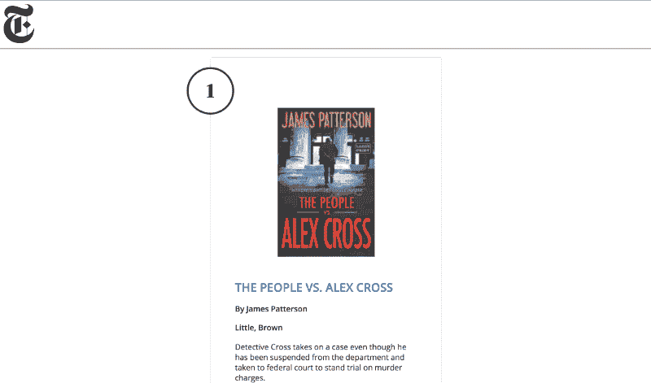
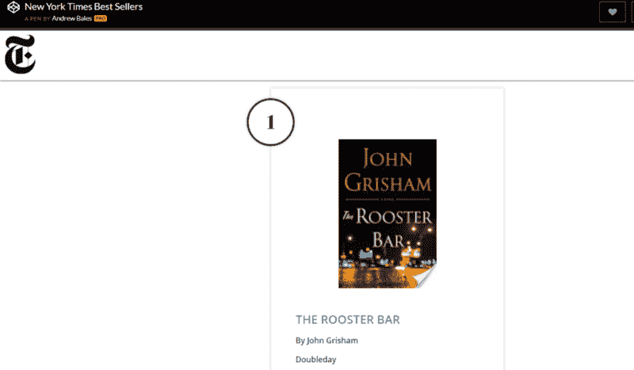

# 用纽约时报和谷歌图书 API 建立一个畅销书列表

> 原文：<https://www.freecodecamp.org/news/build-a-best-sellers-list-with-new-york-times-google-books-api-46201c30aec7/>

作者安德鲁·贝尔斯

# 用纽约时报和谷歌图书 API 建立一个畅销书列表



单个 API 可能并不总是拥有您需要的所有数据。在本文中，我们将通过使用来自纽约时报 API 的惟一标识符来从 Google Books API 获取图书封面，从而完成组合两个 API 的步骤。

你可以在 [GitHub](https://github.com/agbales/best-sellers) 上找到完整的项目，并在 [CodePen](https://codepen.io/agbales/full/LNWPYW/) 上观看演示。

以下是我们将要介绍的步骤:

1.  从纽约时报 API 获取畅销书数据。
2.  将列表附加到 DOM。
3.  使用 ISBN 号查询 Google Books API，将封面图片添加到列表中。

在教程的最后，你会有一本畅销书排行榜！这里有一个窥视:



### 等等，但是为什么？

一年多以前，我开始着手这个项目。我正在学习 API 并请求键来练习访问和显示数据。

在探索纽约时报的 API 时，我发现可以获得畅销书的列表。对于列表中的每本书，API 都提供了当前的排名和列表中的周数。它还提供了类似概要和亚马逊链接的信息。

我能够填充文本信息，但是列表缺少书籍封面的自然视觉组件。当时，我没有看到一条清晰的前进道路，所以我把这个项目搁置了。

在这个例子中，访问 API 是有帮助的，但并不完整。

本周，我带着添加书籍封面的目标回来了。我发现，当提供了 ISBN(一个唯一的识别号)时，Google Books API 会返回图书的缩略图。幸运的是,《纽约时报》的 API 提供了 ISBN。

我们在做生意！

### 入门指南

首先，我们想要生成一个畅销小说的列表，其中包含每本书的一些信息。如果能显示这本书在列表上有多长时间的信息就好了。我们还需要看到封面，并为用户提供一个链接，以了解更多关于这本书或购买一本。

纽约时报API 提供了除书籍封面之外的所有信息。获取免费的 [NYT API 密匙](https://developer.nytimes.com)开始使用。

我们将使用 [Fetch API](https://developers.google.com/web/updates/2015/03/introduction-to-fetch) 来获取精装小说作品的畅销书数据:

```
fetch('https://api.nytimes.com/svc/books/v3/lists.json?list-name=hardcover-fiction&api-key=' + apiKey, {    method: 'get',  })  .then(response => { return response.json(); })  .then(json => { console.log(json); });
```

如果您检查浏览器，您会看到控制台中记录了一个 JSON 对象。如果您以前没有使用过 API，花点时间浏览一下这个对象会很有帮助。钻研数据以准确地访问您正在寻找的内容可能需要一段时间来适应。

响应在“结果”中返回 15 个对象。每个结果是一本书。为了清楚起见，这个例子使用`.forEach()`来深入到 API 响应`nytimesBestSellers`中，该响应在每本书上循环。

```
nytimesBestSellers.results.forEach(function(book) {  var isbn = book.isbns[1].isbn10;  var bookInfo = book.book_details[0];  var lastWeekRank = book.rank_last_week || ‘n/a’;  var weeksOnList = book.weeks_on_list || ‘New this week’;
```

```
 // ...
```

```
});
```

当我们遍历每本书时，变量被设置为它们特定列表的数据，我们将在创建条目时使用这些数据。

在上面的代码清单中，

*   ISBN 号位于书的`isbns`数组中
*   我们在`book_details[0]`选择 10 位版本的 ISBN 号
*   上周排名在`rank_last_week`处，默认为“不适用”
*   它在畅销书排行榜上的周数为`weeks_on_list`，对于第一次出现在排行榜上的书籍，默认为“本周新书”

接下来，我们可以创建一个 HTML 对象添加到`best-seller-titles`列表中。确保你的项目包含了 [jQuery](https://jquery.com/) 。在 CodePen 上，你可以转到设置并将其添加到 JavaScript 面板中。

```
var listing =   '<div id="' + book.rank + '" class="entry">' +     '<p>' +       '' +     '</p>' +     '<h2><a href="' + book.amazon_product_url + '" target="_blank">' + bookInfo.title + '</a></h2>' +    '<h4>By ' + bookInfo.author + '</h4>' +    '<h4 class="publisher">' + bookInfo.publisher + '</h4>' +    '<p>' + bookInfo.description + '</p>' +     '<div class="stats">' +      '<hr>' +       '<p>Last Week: ' + lastWeekRank + '</p>' +       '<p>Weeks on list: ' + weeksOnList + '</p>' +    '</div>' +  '</div>';
```

```
$('#best-seller-titles').append(listing);
```

请注意，图像是空白的。在 [CodePen](https://codepen.io/agbales/pen/LNWPYW) 上，我添加了一个占位符图片来填充谷歌的任何未定义的响应。

最后，我们可以更新图书的等级号，并将等级和 ISBN 号传递给`updateCover()`。

```
$('#' + book.rank).attr('nyt-rank', book.rank);
```

```
updateCover(book.rank, isbn);
```

我们现在可以编写`updateCover()`，它将处理从 Google Books API 中检索缩略图。

### 谷歌图书 API

我们已经收集了清单的文本部分，但是要添加图书封面，我遇到的最简单的方法之一是调用 Google Books API。确保从 [Google Books API](https://developers.google.com/books/) 中获取一个 API 密钥。

使用 10 位数的 ISBN 号，我们可以通过再次使用`fetch()`获得一个缩略图的图书封面图像。和以前一样，我们必须深入到对象中，找到引用我们正在寻找的缩略图的单个链接:

```
function updateCover(id, isbn) {  fetch('https://www.googleapis.com/books/v1/volumes?q=isbn:' + isbn + "&key=" + apiKey, {    method: 'get'  })  .then(response => { return response.json(); })  .then(data => {    var img = data.items[0].volumeInfo.imageLinks.thumbnail;    img = img.replace(/^http:\/\//i, 'https://');    $('#cover-' + id).attr('src', img);  })    .catch(error=> {       console.log(error);  });}
```

在图像被保护后，`replace()`将所有 HTTP 链接交换到安全的 HTTPS 版本。然后，我们通过选择合适的封面 ID 并更新其图像源来更新图书封面。

### 风格

我用 SASS 添加了额外的样式。如果你更喜欢 CSS 或 SCSS，使用窗口中的下拉按钮来编译代码。

您将看到的最后一点 JavaScript 控制着徽标的缩放。当窗口滚动时触发该代码。当窗口向下滚动时，徽标从 80px 的高度压缩到 35px。

```
$(window).scroll(function (event) {  var scroll = $(window).scrollTop();  if (scroll > 50) {    $(‘#masthead’).css({‘height’:’50', ‘padding’ : ‘8’});    $(‘#nyt-logo’).css({‘height’:’35'});  } else {    $(‘#masthead’).css({‘height’:’100', ‘padding’:’10'});    $(‘#nyt-logo’).css({‘height’:’80'});  }});
```

### 最后的想法

回到一个项目并构建它的特性是令人兴奋的。虽然如果我从头开始，我可能会以不同的方式处理这个问题，但这个示例展示了一种采用典型 API 调用并添加该工作的方法。

事实上，我特别想分享这个项目的一个原因是想起当我第一次开始使用 API 时，它会让我多么沮丧。我会被文档弄得不知所措，不确定哪些特性或语法将我引向正确的方向。我经常希望有一个清晰的例子，或者有一个超越 Hello World 的接触。

每个 API 都提供一个特定的服务，有时有必要将它们结合起来。这只是将多种服务结合在一起的一种方式，但我希望它对那些探索如何组合 API 来创建更丰富内容的人有所启发。