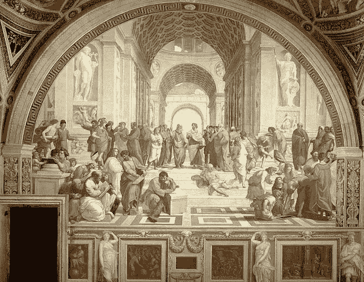
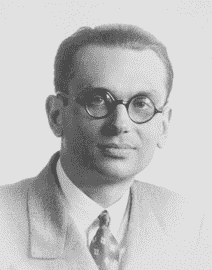

# 数学史上的 10 个尴尬时刻

> 原文：<https://www.freecodecamp.org/news/10-awkward-moments-in-math-history-d364706d902d/>

埃琳娜·尼西奥蒂

# 数学史上的 10 个尴尬时刻

我们都经历过尴尬的时刻。一些意想不到的事情发生了，有一些社会紧张和个人不安，你真的想克服它或忘记它曾经发生过。但是如果你是一个严谨的数学家，而你刚刚证明了你的世界是错误的，那该怎么办呢？

数学总是追求通过逻辑来理解世界，并用严格定义的数学语言来表达。当数学不再(暂时)有意义时，观察它真的具有指示性、教育性和趣味性。

#### **1。无理数的发现**

The School of Athens, depicting, among almost every possible ancient Greek philosopher, Pythagoras in the left corner

由于数学的严谨性起源于古希腊，数学思想开始接近宗教信仰，因此数字被认为是神圣的特征。

毕达哥拉斯学派，一个早期数学家的神秘团队，推动了数学知识的发展，像所有的邪教一样，是基于一些原教旨主义的信仰。惊讶于比率对每个实际问题的适用性，他们相信比率(是的，简单的除数)是神圣的，因为它们可以解释世界上正在发生的任何事情。

相应地，世界上正在发生的一切都应该可以用一个比率来表示，对吗？

现在，想象一下当他们应用新提出的毕达哥拉斯定理发现 2 的平方根时有多惊讶。这个无理数(无理数的意思是它不能被表达为两个数的比率)挑战了比率的神性所表达的世界秩序，并质疑了他们的整个哲学。

由于害怕这一革命性发现的后果，他们决定不告诉任何人。据说，他们甚至淹死了发现者希帕索斯。很科学，你不觉得吗？

#### **2。无穷大**

无理数的发现，尽管已经很糟糕，却把希腊人带到了一个更可怕的发现面前:无穷大。因为无理数的特点是有无限多的十进制数字，所以希腊人必须想出一个解释来解释一个永无止境的数列是如何产生的。无限的概念在今天很难理解，更不用说在宗教与科学相联系的时代，数学信仰不应该挑战我们对上帝的理解。那么，希腊人做了什么？哲学家，如亚里士多德和柏拉图，拒绝绝对无限的概念，数学家想出了创造性的方法来回避几何中对无限的需要，如 Cnidus 的 Eudoxus 发明了穷举法来计算形状的面积。直到 17 世纪晚期，牛顿和莱布尼茨才鼓励人们通过使用无穷小来考虑无穷大，而约翰·沃利斯在 1655 年引入了著名的无穷大符号。

#### **3。芝诺悖论**

当涉及到哲学推理时，希腊人无疑走了极端。

在他的前任赫拉克利特声称世界上的一切都在不断变化之后，巴门尼德声称什么都不变。结果，运动仅仅是一种幻觉，因此，用数学——根据希腊人的说法是真理的语言——来描述它是不可能的。

巴门尼德的学生芝诺设计了一系列悖论，旨在证明运动的不合理性。最著名的一个，阿喀琉斯和他的乌龟，是这样的:阿喀琉斯和一只乌龟赛跑，后者明显慢得多，在比赛开始时领先他 100 米。

为了简单起见，如果我们假设两个参赛者的速度是恒定的，阿基里斯比乌龟快 10 倍，那么我们可以说当阿基里斯到达乌龟的起点时，它已经跑了 10 米。所以，阿基里斯会试着追上去，当他到达下一个点时，乌龟会多移动一米。

这道高中数学题，虽然简单明了，却让我们得出了下面这个似是而非的结论:无论阿喀琉斯跑得多快，他永远也到不了乌龟。恭喜你，芝诺，你让运动听起来不合逻辑。

芝诺悖论被认为存在于形而上学领域，困扰了哲学家和数学家很久，但今天它们可以用微积分来解释，这是希腊人没有的数学工具。让我们继续前进。

#### **4。莫比乌斯** **带**

A make-it-yourself Möbius strip

看起来很有趣的莫比乌斯带也是在 1858 年由倒霉的李斯特独立发现的，他的名字没有触及数学史，它是一个只有一边和一条边界的曲面，经常用来迷惑年轻的数学学生。

你可以很容易地通过一张纸条，扭曲它，然后将纸条的两端连接起来。

作为第一个没有方向的表面的例子，它并没有像这个列表中的其他发现那样动摇数学的基础，但它提供了许多实际应用，如一条阻力带，并启发数学家提出了不可定向的表面，如克莱因瓶。(这个曲面的名字可能来自一个双重巧合:它的概念者克莱因最初将其命名为 flche，在德语中的意思是表面，听起来类似于 Flasche，意思是瓶子。事实上，它看起来也像一个瓶子，似乎密封的重命名)。

#### **5。** **康托尔实数的不可数性**

由于无穷已经是一个累赘，康托在 1874 年证明了事实上有不同种类的无穷。特别是，在证明实数的不可数性时，康托证明了这个集合比已经无限的自然数集合更大。

1891 年，他还提供了对角线论证，这是一个如此优雅的证明，以至于后来被用作通过使用悖论来证明的工具。他的话催生了基数理论，以及处理这样一个问题的悖论:你能处理多少个无限？

#### **6。罗素悖论**

Bertrand Russell was a mathematician, philosopher, [logician](https://en.wikipedia.org/wiki/Mathematical_logic "Mathematical logic"), mathematician, historian, writer, [social critic](https://en.wikipedia.org/wiki/Social_critic "Social critic"), political activist and, to my opinion, a personality worth studying and inspiring oneself from.

1901 年，罗素在康托迄今为止完善的集合论中发现了一个弱点，这使他陷入了一个数学界无法监督的矛盾。根据这个理论，任何事物的集合都可以是一个集合。

罗素的矛盾的例子，也称为理发师悖论，是这样的:想象一个有特殊规则的城镇；凡不自己剃的，必须由城里的理发师剃。这个尴尬的问题，你可以试着自己回答:谁给理发师刮胡子？

这一发现使他对以前集合论的基础提出了质疑，并创建了一个新的集合论，这个新的集合论比后来提出的策梅洛-弗兰科尔集合论更复杂，但没有赶上。

#### **7。哥德尔不完全性定理**

Kurt Gödel the logician, mathematician and philosopher that shook the grounds of mathematics and logic in the 19th century.

如果前面的事件看起来让你有点不舒服，那就等着下面这只尴尬的海龟吧(这比阿喀琉斯的海龟更糟糕)。

我们在谈论 20 世纪。人们不只是想知道。他们想知道是否有可能知道，并证明它。对他们来说不幸的是，以及人类理解宇宙的需要，哥德尔在 1931 年发表了两个定理，被称为不完全性定理。

解释它们的技术细节就像解释它们的结论一样困难，因为哥德尔证明的是，考虑到一个一致和完整的系统，比如算术语言，有些陈述既真实又无法被证明。他用这个简单的陈述来说明他的定理的真实性，灵感来自于[骗子悖论](http://www.iep.utm.edu/par-liar/):“这个陈述不能被证明”。如果这是真的，那么这个说法就是真的，无法证明。如果这是假的，那么这个说法就可以被证明，这就和最初的不能被证明的论点相矛盾了。

这对数学来说是非常坏的消息，剥夺了他们解释绝对真理的原始光芒。这也是希尔伯特对知识的追求的可怕回归，在他的声明“我们必须知道，我们将会知道”中表达了这一点。

#### **8。塔尔斯基不可定义定理**

塔尔斯基似乎受到了哥德尔制造的绝望的启发。1936 年，他为不可定义问题提供了证明。

虽然塔斯基的观察结果也包含在哥德尔的著作中，但有人认为塔斯基的著作具有更深远的哲学影响。塔尔斯基设法得出了一个普遍的结论，即语言本身不能定义真理。虽然这是一个重要的限制，但他认为使用更强大的元语言就足以用更简单的语言来定义真理。

现在，一个普通人可能会认为这解决了问题，但是对于一个寻找“一种语言来统治他们所有人”的数学家来说，这并不是一个安慰。

#### **9。停机问题**

艾伦·图灵试图解决决策问题，用简单的话来说，就是找到一种算法来回答一个陈述是否正确。为了解决这个概念上简单但难以解决的问题，他把它重新表述为停机问题:有没有一台机器可以告诉你一个程序是否会因某个给定的问题而停机？

停止意味着它不会永远循环。但是你怎么证明一个你知之甚少的机器的不可行性呢？这就是悖论派上用场的地方。

艾伦·图灵从假设一个机器的存在开始，这个机器给了一个输入程序，一个问题回答了它是否会停止的问题。然后，他扩充了这台机器，如果答案是肯定的，就把它的输出循环回自己，如果答案是否定的，就停止运行。

那么，增强的机器会因为停机问题而停机吗？艾伦的回答是:如果是那么不是，如果不是那么是。听起来对逻辑来说是个坏消息。

#### 10。没有免费的午餐定理

进入 21 世纪标志着从纯粹的、近乎哲学的数学向应用领域的转移，如统计学和最优化。

如果你认为自己喜欢优化，你不认为这会让你成为一个完美主义者吗？完美主义者难道不想找到优化事物的最佳方式吗？

似乎[大卫·沃伯特](https://en.wikipedia.org/wiki/David_Wolpert)和[威廉·麦克雷迪](https://en.wikipedia.org/w/index.php?title=William_G._Macready&action=edit&redlink=1)感觉到了这种需求，并给出了一个答案，当然，这个答案一点也不令人鼓舞(否则它不会出现在我们的列表中)。根据他们在 1997 年发表的优化没有免费的午餐定理，“任何两个[优化](https://en.wikipedia.org/wiki/Optimization_(mathematics))算法，当它们的性能在所有可能的问题上平均时，是等价的。”

这可能令人心碎，但并不意味着优化是徒劳的。我们永远也不会找到一个最佳的方法来做这件事。

这些时刻让数学世界感到尴尬，这是一个轻松的术语，用于描述当宇宙不再有意义时，科学家往往会经历的绝望和混乱的感觉。但是震惊是推动科学前进的方式。

数学领域被创造出来，我们有了图灵机，漂亮的表面，最重要的是，我们有能力重新审视我们的感知并相应地调整我们的工具。

这些提问的时刻帮助我们在智力上进化。

除了不完全性定理。这些简直是毁灭性的。