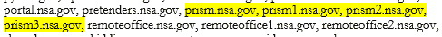
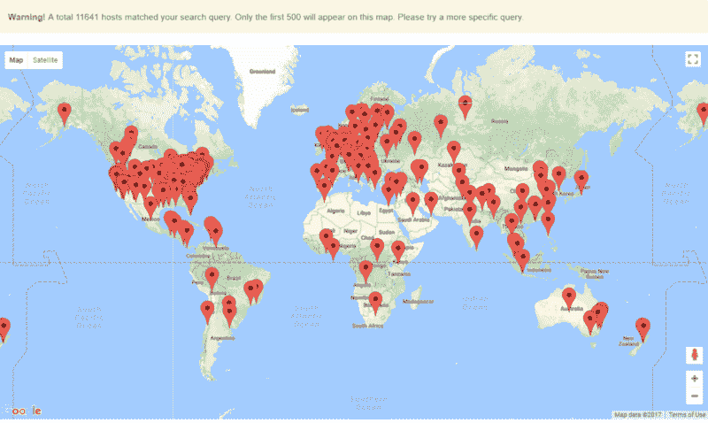
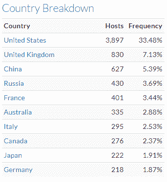
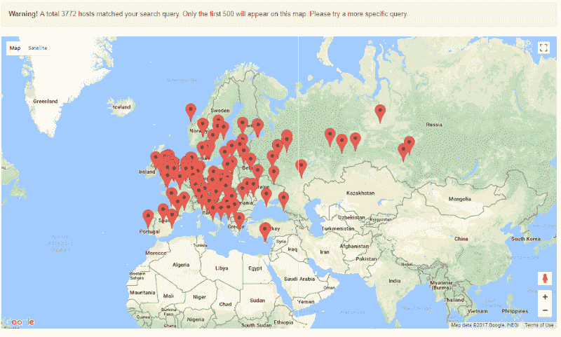
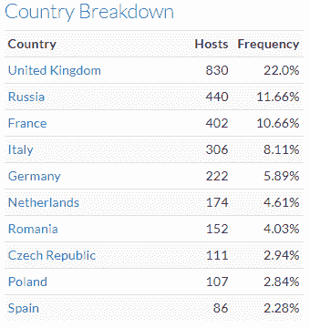
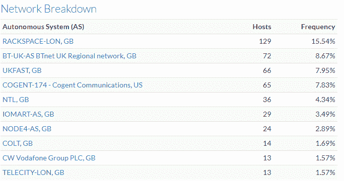
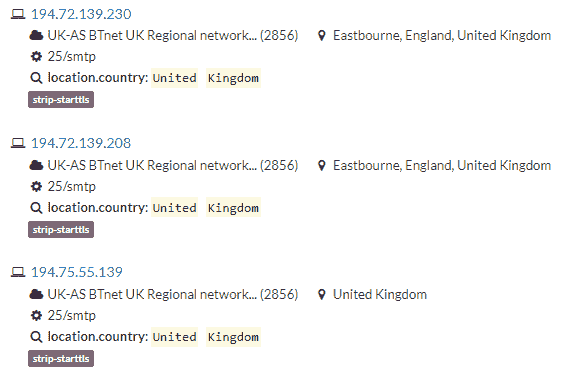
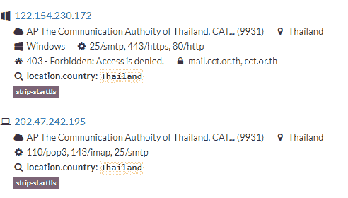
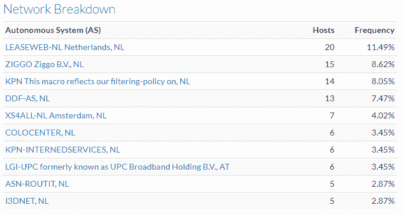
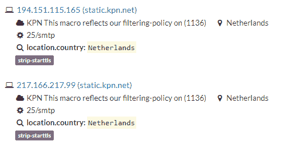

# 隐私被剥夺，一次一封邮件

> 原文：<https://www.freecodecamp.org/news/privacy-stripped-away-one-email-at-a-time-3556dab102ff/>

克里斯·库贝卡

# 隐私被剥夺，一次一封邮件

随着欧盟通用数据保护条例(GDPR)的临近，隐私剥离电子邮件设置继续在世界各地广泛使用。它威胁到包含个人身份信息、知识产权、财务信息和您最私密照片的敏感通信。

你可能会登录一个电子邮件帐户来使用它，但这并不意味着你的邮件会被安全地发送。与用户名和密码可能提供的隐私假设相反，默认情况下，电子邮件不加密发送，除非明确或有机会得到保护。电子邮件技术标准是在人们对保密性产生严重担忧之前的一个较为简单的时代制定的。

棱镜事件曝光后，电子邮件隐私成为欧盟公众的一大担忧。突然间，非技术 IT 界开始理解缺乏电子邮件加密会造成多大的损害。斯诺登爆料后，Gmail、Hotmail、私人公司和许多其他提供商决定尝试保护电子邮件通信。

配置显式安全性并不容易。它需要开销和证书管理。

机会主义安全可以帮助填补空白。尽可能加密电子邮件，有机会的话，用一个叫 Start-TLS 的设置。这种投机取巧的做法是对电子邮件内容进行加密，以防止被窃听。该设置称为 Start-TLS，可以提供基本级别或保留隐私保护。这不是一个保证，但很有帮助，类似于 HTTPS 的加密无处不在运动。

另一方面，有一种配置可以实现相反的功能，即条带启动 TLS。这种电子邮件服务器设置删除电子邮件上的任何机会加密，剥离它们，暴露对话的内容。

为什么这很重要？

早在 2014 年， [EFF](https://threatpost.com/eff-calls-out-isps-modifying-starttls-encryption-commands/109325/) 审查了一位来自金蛙 VPN 的工程师描述该问题的博客帖子。该工程师无法再向客户发送和接收加密电子邮件，因为 ISP 提供商应用了 Strip Start-TLS 设置。让通信暴露在窃听之下。任何人、黑客工具、罪犯、间谍机构都有可能阅读这些邮件。

来自[维基百科](https://en.wikipedia.org/wiki/Opportunistic_TLS)“机会 TLS 是一种[机会加密](https://en.wikipedia.org/wiki/Opportunistic_encryption)机制。因为初始握手是以纯文本形式进行的，所以控制网络的攻击者可以通过[中间人攻击](https://en.wikipedia.org/wiki/Man-in-the-middle_attack)来修改服务器消息，以使 TLS 看起来不可用(称为 **STRIPTLS 攻击**)。大多数 SMTP 客户端会以纯文本形式发送电子邮件，可能还会发送密码，通常不会通知用户。特别是，许多 SMTP 连接发生在邮件服务器之间，在这种情况下用户通知是不实际的。

如果有人怀疑电子邮件通信的价值，或者是否存在像 Prism 这样的自助餐项目。在为 Security BSides LV 2017 制作 OSINT 黑客速成课程时，使用基于网络的侦察工具弹出了四个 NSA Prism 相关的子域。

Figure 1 Highlighted list of NSA subdomains listing Prism July 2017

在过去的几年里，事情发生了很大的变化吗？可悲的是，一个响亮的不。

即使欧洲、美国和其他相关国家/地区都有数据保护法，条带开始 TLS 配置仍在广泛使用。

在没有通知的情况下使用该设置可能违反 EU-美国数据隐私保护条例。根据新的 EU-美国隐私保护协议，多个美国的欧盟合作伙伴使用 strip 机会主义电子邮件加密。

令人不安的电子邮件反隐私设置很容易被发现。使用 Censys.io 标记和两个基于 Python 的工具:ZMAP 和 StripTLS。

Censys.io 是一个基于网络的安全研究项目，由密歇根大学运营，基于 ZMAP。一个简单的搜索在几秒钟内产生了 11，641 个，显示了许多使用 Strip Start-TLS 标签的 ISP 和电子邮件提供商。基于元数据、使用的技术和通信行为将标签应用于设备。

Figure 2 Censys.io Strip Start-TLS global scan 10 November 2017

美国在互联网上返还最高比例的剥离系统——是中国的六倍多。

在美国，联邦和州一级的数据隐私法杂乱无章。然而，联邦健康保险便携性和责任法案(HIPAA)通过隐私和安全规则广泛地涵盖了医疗数据隐私。

排名第二的是英国，其他欧洲国家紧随其后。

Figure 3 Censys.io Strip Start-TLS top country report 10 November 2017

专注于欧洲内容，发现超过三千个电子邮件剥离服务器，导致太多的数据点无法在地图上显示。

除去俄国，只看欧盟 GDPR 地区，前五名分别是:英国、法国、意大利、德国和荷兰。

其中一些领域已有数据保护法，涵盖电子邮件，并立法禁止广泛收集数据和通信。

Figure 4 Censys.io Strip Start-TLS European scan 10 November 2017

Figure 5 Censys.io Strip Start-TLS top European country report 10 November 2017

英国实施了他们版本的数据隐私条例，并拥有很大的罚款权力。违反者可能面临经济处罚。

隐藏在英国互联网服务提供商和数据中心提供商背后的是银行、金融机构，如荷兰合作银行(Rabobank)和桑坦德银行(Santander)，以及旅行社。政府委员会、托管和其他互联网服务提供商，如 1stdomains.co.uk 和 1stdnsltd.co.uk。

Figure 6 Censys.io Strip Start-TLS top UK network providers report 10 November 2017

另一方面，英国电信似乎拥有和托管着几个剥离系统，比如泰国政府。

列表中的大多数 ISP 拥有并托管电子邮件安全剥离系统。法国、德国和意大利的许多 ISP 拥有电子邮件剥离系统。

Figure 7 Censys.io Strip Start TLS UK BT owned systems 15 November 2017

Figure 8 Censys.io Strip Start-TLS Thailand government telecommunications systems 15 November 2017

目前，我将荷兰作为运营基地。放大荷兰的发现，174 个系统，其中一些由全国各地的互联网服务提供商、虚拟主机提供商和私人组织运营。

Figure 9 Censys.io Strip Start-TLS top NL network providers report 10 November 2017

与泰国和标签列表上的其他顶级欧盟国家类似，大多数 ISP 似乎都拥有并托管自主系统，这些系统可以剥离机会主义电子邮件加密。KPN 有几项资产与对等政策相结合，该政策规定与 KPN 的数据对等方也必须尽可能对等地向美国传输流量。

Figure 10 Censys.io Strip Start TLS NL KPN Static owned systems 15 November 2017

欧盟 GDPR 的支柱之一是同意和意识到数据正在发生的事情。加密似乎是在倒退，而不是前进。欧洲网络、互联网服务提供商、虚拟主机、私人组织和互联网中转上这些隐私剥离电子邮件系统的惊人数量令注重隐私的人感到不安。

大多数人都不知道电子邮件的安全性可能会降低，或者之前安全的电子邮件会被暴露。直到欧盟数据监管机构意识到并取缔非法使用条带启动 TLS。如果在整个欧盟范围内降低隐私和安全性的做法在整个欧洲互联网范围内遭到广泛反对，欧盟 GDPR 就不可能实施。

以下是我在本文中使用的一些参考资料和工具:

*   [Censys.io](https://censys.io)
*   tintinweb 提供的 [StripTLS](https://github.com/tintinweb/striptls) python 工具
*   [ZMAP.io](https://zmap.io)