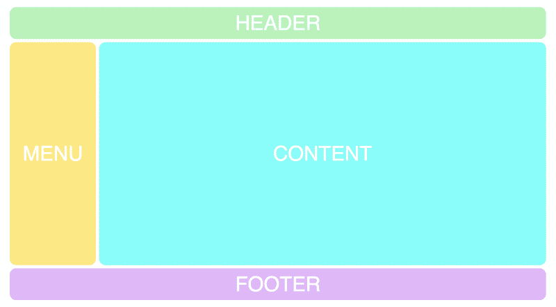
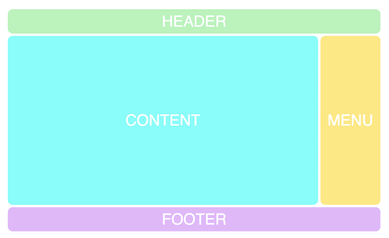
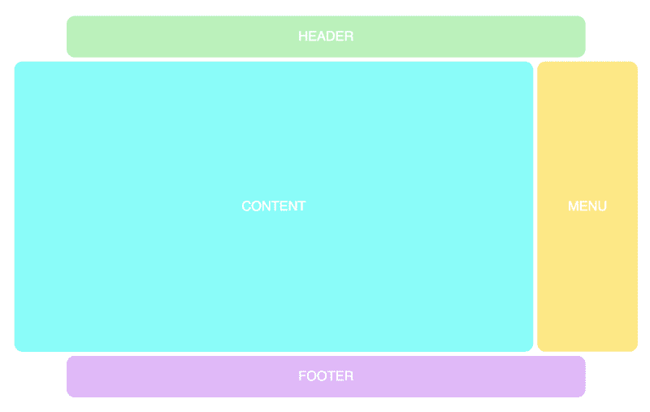
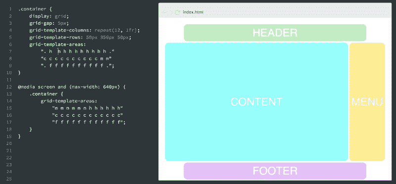

# CSS 网格教程:学习用 CSS 网格快速制作网站原型

> 原文：<https://www.freecodecamp.org/news/how-to-prototype-websites-quickly-with-css-grid-ffc9cba08583/>

CSS 网格模块是一个创建网站模型的神奇工具。它允许你比我尝试过的其他系统更快地试验布局。

在这篇文章中，我将教你如何做。

我还创建了一个免费的 CSS 网格课程。[点击此处获得全部访问权限。](https://scrimba.com/g/gR8PTE?utm_source=freecodecamp.org&utm_medium=referral&utm_campaign=gR8PTE_prototype_websites)

或者，看看这篇文章，它解释了你将在整个课程中学到的东西:

[**想学 CSS 网格？这是我的免费全程课程。圣诞快乐！**](https://medium.freecodecamp.org/heres-my-free-css-grid-course-merry-christmas-3826dd24f098)

### 我们的网格

我们将从一个模仿经典网站的非常基本的网格开始:



我对我们的例子做了一点设计，但这与 CSS 网格无关，所以我把它省略了。

首先，我将解释我们需要使用的 HTML 和 CSS，我将它们分成四个部分。一旦你理解了这些，我们将继续布局实验。

如果你对 CSS Grid 完全陌生，你可能想浏览一下我关于这个主题的 5 分钟介绍文章。

#### 1.加价

我们首先需要的是一点 HTML。一个容器(我们将把它变成一个网格的元素)和项目(标题、菜单、内容、页脚)。

```
<div class="container">  
  <div class="header">HEADER</div>  
  <div class="menu">MENU</div>  
  <div class="content">CONTENT</div>  
  <div class="footer">FOOTER</div>  
</div> 
```

#### 2.CSS 中的基本设置

然后，我们需要建立我们的网格，并指定我们需要多少行和列。这是完成这项工作的第一个 CSS:

```
.container {  
    display: grid;      
    grid-template-columns: repeat(12, 1fr);  
    grid-template-rows: 50px 350px 50px;  
    grid-gap: 5px;  
} 
```

稍后我会补充更多，但我首先想让你明白这一点。

上面的代码是这样说的:创建一个有十二列的网格，每一列的宽度是一个分数单位(总宽度的 1/12)。创建三行，第一行高 50px，第二行高 350px，第三行高 50px。最后，在网格中的项目之间添加一个间隙。

#### 3.添加网格模板区域

允许我们非常容易地试验布局的特性叫做*模板区域。*

要将它添加到网格中，我们只需给容器一个`grid-template-areas`属性。语法可能有点奇怪，因为它不同于任何其他的 CSS 语法。这是:

```
.container {  
    display: grid;  
    grid-gap: 5px;      
    grid-template-columns: repeat(12, 1fr);  
    grid-template-rows: 50px 350px 50px;  
    grid-template-areas:  
        "h h h h h h h h h h h h"  
        "m m c c c c c c c c c c"  
        "f f f f f f f f f f f f";} 
```

属性背后的逻辑是在代码中创建网格的可视化表示。正如你所看到的，它有三行十二列，就像我们在`grid-template-columns`和`grid-template-rows`中定义的一样。

每行代表一行，每个字符(h，m，c，f)代表一个网格单元。

四个字母中的每一个现在都形成了一个矩形`grid-area`。

你可能已经猜到了，我选择了字符`h`、`m`、`c`、`f`，因为我们的网格由`header`、`menu`、`content`和`footer`组成。当然，我可以随心所欲地称呼他们，但是使用他们描述的物品的第一个字符是有意义的。

#### 4.为项目提供区域

现在我们需要将这些字符与网格中的项目联系起来。为此，我们将使用`grid-area`属性:

```
.header {  
    grid-area: h;  
}

.menu {  
    grid-area: m;  
}

.content {  
    grid-area: c;  
}

.footer {  
   grid-area: f;  
} 
```

这导致了以下布局:


### 尝试布局

现在我们终于体会到了这一特性的美妙之处，因为我们可以非常轻松地对布局进行实验。这只是改变`grid-template-areas`属性的字符的问题。例如，让我们将菜单移到右边:

```
grid-template-areas:  
        “h h h h h h h h h h h h”  
        "c c c c c c c c c c m m”  
        “f f f f f f f f f f f f”; 
```

这导致了这样的布局:



我们可以用点来创建空白网格单元。

```
grid-template-areas:  
        “. h h h h h h h h h h .”  
        "c c c c c c c c c c m m”  
        “. f f f f f f f f f f .”; 
```

这就是它的样子:



现在我推荐你看一下我的 CSS 网格课程的截屏，在这里你可以自己试验代码。

### 增加组合的响应能力

将这一点与响应性结合起来也是一个杀手锏，因为这在以前仅仅用 HTML 和 CSS 是不可能做到的。比方说，当你在手机上查看菜单时，你想把它放在标题旁边。那么你可以简单地这样做:

```
@media screen and (max-width: 640px) {  
    .container {  
    grid-template-areas:  
            "m m m m m m h h h h h h"  
            "c c c c c c c c c c c c"  
            "f f f f f f f f f f f f";}  
} 
```

这将导致以下结果:



请记住，所有这些变化都是用纯 CSS 完成的，不涉及 HTML。无论 div 标签在标记中如何布局，我们都可以随意移动。

这被称为源代码顺序独立性，这是 CSS 向前迈出的一大步。

它让 HTML 成为了它本来的样子:内容的标记。而不是设计风格，因为那是 CSS 的工作。

如果你有兴趣学习更多关于 CSS Grid 的知识，[点击这里](https://scrimba.com/g/gR8PTE?utm_source=freecodecamp.org&utm_medium=referral&utm_campaign=gR8PTE_prototype_websites)查看我的全部课程。

* * *

感谢阅读！我的名字叫 Per Borgen，我是最简单的学习编码方法——Scrimba 的联合创始人。如果你想学习建立专业水平的现代网站，你应该看看我们的[响应式网页设计训练营](https://scrimba.com/g/gresponsive?utm_source=freecodecamp.org&utm_medium=referral&utm_campaign=gR8PTE_prototype_websites)。


[Click here to get to the advanced bootcamp.](https://scrimba.com/g/gresponsive?utm_source=freecodecamp.org&utm_medium=referral&utm_campaign=gR8PTE_prototype_websites)