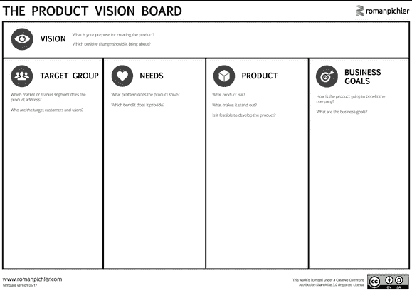
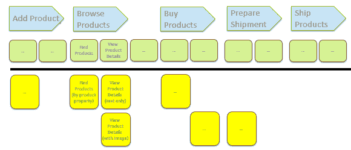

# 如何用简单的三步逃离“故事卡地狱”？

> 原文：<https://www.freecodecamp.org/news/how-to-escape-from-story-card-hell-in-three-simple-steps-4ef147e5d6dc/>

您的待办事项列表中充满了详细的用户故事。你的团队不再能够管理他们，或者对他们进行排名。

您想知道您正在构建的产品是关于什么的。利益相关者似乎一直在改变主意。你错过了大局。

我想你是在**故事卡地狱**里，正如[詹姆斯·肖尔](http://www.jamesshore.com)所说。

这里有三种逃生方法。

### 产品愿景

愿景陈述了一个目标。但是它没有告诉你如何到达它。

伟大的愿景具有挑战性和激励性。它超越了个人。它让人们团结起来为之努力。这激励了他们。

埃隆·马斯克的航空航天公司 SpaceX 的愿景是:

> SpaceX 设计、制造和发射先进的火箭和宇宙飞船。该公司成立于 2002 年，旨在革新太空技术，最终目标是让人们能够在其他星球上生活。

苹果 iPod 的产品愿景是:

> 我口袋里所有的音乐。

通常，产品经理/所有者会提出产品愿景。因此，如果你不知道愿景，就和你的产品经理谈谈。

如果你是产品经理:你会如何在 30 秒内**向潜在投资者推销** 你的产品？

你可以和其他利益相关者一起建立一个**产品视觉盒子** 。拿纸板做一个盒子。在表面上写和画。假设的产品包装会是什么样子？有限的空间将迫使你专注于产品的顶级功能。

对于更复杂的愿景描述，您可以使用**产品愿景板**:

[Product Vision Board](http://www.romanpichler.com/tools/vision-board/) by Roman Pichler (Creative Commons BY-SA 3.0)

产品愿景板解释道:

*   目标群体(谁将使用该产品)
*   (使用者的)需求
*   产品(主要特性)
*   业务目标(例如，公司如何从产品中赚钱？)

产品愿景如何帮助你逃离故事卡地狱？

愿景指引方向。这就是为什么你应该让它在开发发生的地方可见。例如，制作一张巨幅海报，挂在墙上。

每个人都可以检查新故事是否符合产品愿景。并挑战偏离预定方向的故事。

### 特种宽银幕电影

即使你有一个愿景，你可能会错过你的故事的上下文信息。这是大局。

有几个实践可以帮助你理解全局。杰夫·巴顿的**故事映射**就是其中之一。下面你会发现我练习的方法。

[Story Mapping](http://jpattonassociates.com/user-story-mapping/)

用户活动在最上面。根据特定用户想要达到的目标来设计活动。这可能是为了他们自己的利益，也可能是为了完成他们的工作。从左到右排列活动。越靠左，活动发生得越早。

在线商店的示例活动有:添加产品、浏览产品、购买产品、准备发货、运送产品*。*在大多数情况下，用户一次完成一项活动。通常在几分钟或最多几小时内。

为了达到目标，用户需要做一些事情:用户任务。示例任务是为浏览产品活动*查找产品和查看产品详细信息。*

任务和活动一起代表了**的主干**。这是你用来组织故事的结构。

从任务中，你衍生出故事。从查看产品详细信息任务中，您可以派生一个标题为查看产品详细信息(纯文本)的故事和另一个标题为查看产品详细信息(带图片)的故事。

团队把一个故事放得越高，团队就越早实现它。实现在一行中从左到右，从上到下移动。

不要将故事地图存储在电子工具中。取而代之的是，把它挂在墙上，用它在团队内部、与用户以及其他利益相关者进行交流。把它挂在那里，你会一直看到故事的背景。

理解故事背景的其他实践包括:

*   [影响映射](https://www.impactmapping.org)
*   [用例 2.0](https://www.ivarjacobson.com/publications/white-papers/use-case-ebook)

### 即时规格

逃离故事卡地狱的一个关键实践是即时规范。只详细描述接下来一到两次冲刺的故事。让我们看一个例子。

产品经理写一张故事卡:

> 作为一个顾客，我想通过一个属性找到产品，以了解该商店提供我想要的产品。

产品经理有一些具体的想法。用户应该能够通过产品名称，产品编号，产品类别和价格进行搜索。

在冲刺开始前一周，产品经理和团队讨论这个想法。开发人员告诉她，几天前，另一个团队针对不同的产品发布了一个强大的搜索功能。

它基于一个简单的文本字段，就像谷歌。重用它比开发新的东西更容易。团队同意这一点，并写下他们同意的验收标准。

所以团队在实现之前记录了故事的细节。这样，团队可以从以前的开发中获得尽可能多的知识。

### 结论

逃离故事卡地狱有几种做法:

*   产品愿景设定了一个目标，并有助于保持发展在正轨上。
*   故事映射为故事提供了一个大背景。
*   及时的规范确保你只详细描述最清楚理解的故事。

在最好的情况下，你使用所有的实践。要做到这一点，你可能需要一个产品经理

*   培养与利益相关者的关系
*   擅长沟通和解决冲突
*   不怕时不时地说“不”

*访问我的在线课程，学习如何[在实践中应用这一策略](https://skl.sh/2Edz9Zu)。*