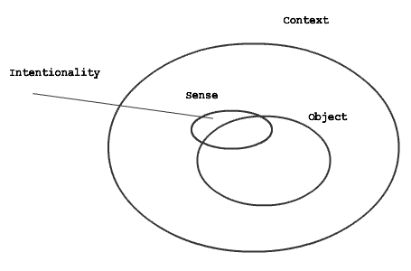
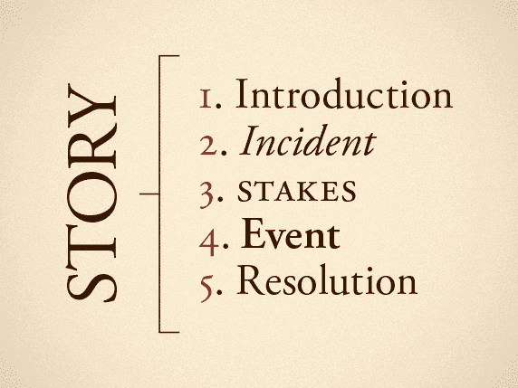
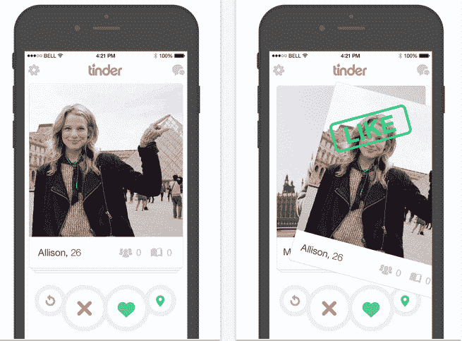
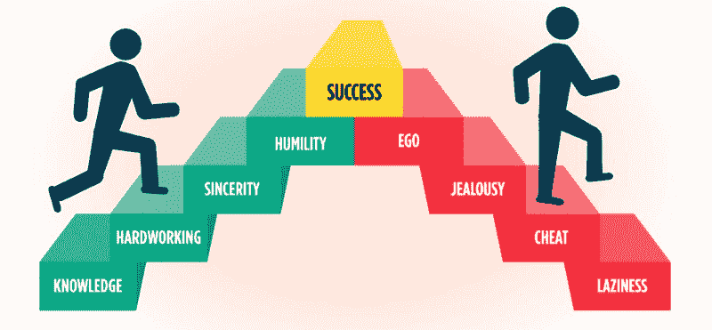

# 我以应届毕业生的身份在脸书面试。以下是我对设计的了解。

> 原文：<https://www.freecodecamp.org/news/i-interviewed-at-facebook-as-a-new-grad-heres-what-i-learned-about-design-8a1acfffb9ef/>

蒂芙尼·伊顿

# 我以应届毕业生的身份在脸书面试。以下是我对设计的了解。

[image source](https://power.pereless.com/video-interviews-discrimination-question/)

脸书是一家公司，其产品用于与朋友联系和保持联系。虽然这只是他们工作的一部分，但我相信他们的目标是满足全球数十亿人的需求。

我对脸书正在做的许多工作产生了共鸣，例如通过[社区促进](https://www.facebook.com/business/m/community-boost)增强小企业的能力，以及利用 [Messenger 的对话用户界面功能](http://mashable.com/2017/06/21/facebook-messenger-bots-social-good/#Nilrp4zzSPq4)造福社会。当你试图与正确的人联系时，这些倡议是非常相关的，它们使曾经无法获得的资源变得非常容易获得。

对于任何想要做出重大影响的有抱负的设计师来说，当我们有机会在一个以做大事而闻名的地方工作时，我们会变得异常兴奋也就不足为奇了。我最近有机会去脸书面试，他们考虑周到地给我安排了商业和广告团队。

我很高兴有机会在一个重视可访问性和包容性的环境中工作，同时在产品的所有部分发展更深层次的人际关系。这是我目前在一家公司寻找的东西。

总的来说，采访脸书是一次很好的学习经历。我更多地了解了这家公司做什么，它如何与我的工作保持一致，以及我未来想做什么。

不管结果如何，每一次面试经历都是评估我现状的一部分——从我对产品和工艺的看法，到我如何与他人交流我的设计过程。毕竟，你只能变得更强大，更清楚自己未来想做什么样的工作。

我将讨论我的采访经历中的一些收获，以及我在采访过程中瞥见的一些脸书的价值观。

### 你做的每一个设计决策背后都需要有意图

[http://www.intentionalitymodel.info/index.php?page=defining-the-intentionality-model](http://www.intentionalitymodel.info/index.php?page=defining-the-intentionality-model)

当我们谈论我们的设计过程时，我们经常忘记解释我们为什么做某事，而只是简单地陈述我们做了什么。如果有人想了解产品本身，这种谈论我们设计的方式很好。

但是对于任何设计面试，面试官都想知道你是如何找到解决方案的。哪里出了问题？什么是对的？这一步如何影响结果，下一步是什么？对于每一个设计决策，总是——解释。为什么。

意向性是重要的，因为它确保我们已经将问题联系起来，并真正理解我们的受众是谁。它向其他设计师展示了我们如何基于约束工作，我们与他人合作的能力，以及我们如何将决策与解决问题联系起来。

如果我们能够解释我们的决定，这就向人们表明，我们并不是为了做决定而做决定。相反，它表明我们理解我们的设计决策的效果，以及这些决策如何解决人们的问题。

在脸书面试时，很明显，和我交谈的设计师们想了解我的项目背后的故事，以及我的设计决策背后的意图。

### 小细节很重要

[https://marketingland.com/facebook-will-disable-like-button-third-party-mobile-apps-228159](https://marketingland.com/facebook-will-disable-like-button-third-party-mobile-apps-228159)

当我展示我的产品组合时，我想我会收到关于我整体产品思维的问题。相反，我收到了关于我设计背后的细节的问题，比如为什么我把仪表板周围的边框设为绿色，这有什么用。这是因为小细节传达了设计的大局。它们影响我们如何与产品互动，以达到我们想要的目标。

重要的是考虑每一个细节，并有一个它存在的理由——它增强了 x 特性，还是为了可见性的目的？从长远来看，这会产生很大的影响。以脸书的 Like 功能为例。

Like 功能很小，但它有许多含义。它允许人们参与他们喜欢的内容。从商业角度来看，它允许脸书根据受欢迎程度对帖子进行排名。

这是一个被广泛使用的功能，它鼓励人们长时间地相互交流。设计它的人在测试之前可能不知道它会产生多大的影响。

这里有一些讨论在脸书设计小细节的文章，如果你想更深入地了解它们的话:[凯特琳·温纳](https://www.freecodecamp.org/news/i-interviewed-at-facebook-as-a-new-grad-heres-what-i-learned-about-design-8a1acfffb9ef/undefined)的[我们如何改变脸书的朋友图标](https://medium.com/facebook-design/what-i-ve-learned-designing-small-things-at-facebook-ba2b7c6499f8)，以及[茉莉·弗里德尔](https://www.freecodecamp.org/news/i-interviewed-at-facebook-as-a-new-grad-heres-what-i-learned-about-design-8a1acfffb9ef/undefined)的[我在脸书设计小东西学到的东西](https://medium.com/facebook-design/what-i-ve-learned-designing-small-things-at-facebook-ba2b7c6499f8)。

### 给予反馈和征求反馈一样重要

[https://www.prodpad.com/blog/team-foundation-server-tfs-integration/](https://www.prodpad.com/blog/team-foundation-server-tfs-integration/)

我们需要反馈来成长，但我们也需要能够向他人提供反馈，以帮助他们成长和改进他们的设计。大多数公司都希望能够解释我们的工作，并精通设计工艺。但从我在脸书的观察来看，他们通过评估我们在产品评论中的产品思维和沟通技巧，做得更好。

产品直觉是我们都希望拥有的东西，但阐明它可能是一个挑战。你需要全面理解交互设计和视觉设计，以及这两者与产品目标的关系。所有这些都要考虑到设计的目标受众。

描述一个设计是做什么的很容易，但是我们也需要解释它如何传达价值。困难的部分是平衡我们解释细节的方式:为什么 x 一开始就被设计成这样，我们如何简明地把它和解决用户需求的方式联系起来？

如果你做不到这一点，那么你将如何沟通你的工作并向其他人提供反馈？

以下是脸书设计评论价值的一些链接:[坦纳·克里斯滕森](https://www.freecodecamp.org/news/i-interviewed-at-facebook-as-a-new-grad-heres-what-i-learned-about-design-8a1acfffb9ef/undefined)的[与脸书](https://medium.com/facebook-design/a-design-critique-with-facebook-c2a910e84de9)的设计评论和[窥视脸书设计评论](https://medium.com/facebook-design/peek-inside-a-facebook-design-critique-c4833efda26e)，以及[朱莉·卓](https://www.freecodecamp.org/news/i-interviewed-at-facebook-as-a-new-grad-heres-what-i-learned-about-design-8a1acfffb9ef/undefined)的[如何做产品评论](https://medium.com/the-year-of-the-looking-glass/how-to-do-a-product-critique-98b657050638)。

### 讲故事让我们的观点更有共鸣

[http://99u.com/articles/17652/the-five-beats-of-successful-storytelling-how-it-can-help-you-land-your-next-job](http://99u.com/articles/17652/the-five-beats-of-successful-storytelling-how-it-can-help-you-land-your-next-job)

当我们解释我们设计的结果时，无论是通过我们的原型还是关键屏幕让某人工作，我们经常解释我们的设计做了什么，但没有以涉及到人的方式来解释。我们需要记住，我们设计的东西是给真实的人看的。

我们需要解释我们的产品，以便人们能够理解产品的意图。我们希望他们理解我们产品的复杂性，而不会迷失在它如何工作的细节中。我们不想迷惑人们，而是想让他们明白产品是什么以及它为什么存在背后的故事。

当我为 QuickBooks 工作时，我正在为一个项目中的会计师和客户的合作问题提供一个解决方案。我从解释产品如何解决用户的痛点开始，但我没有把它放在一个相关的故事或上下文中。当我用“会计”和“客户”时，听起来就不那么人性化了

但是之后我描述了这两个角色，并把故事围绕在两个角色上，给他们起了名字和日常任务。这使我能够给出体验的背景，并解释这些人是谁，他们试图做什么，他们的问题是什么，以及我的解决方案如何能够帮助他们的工作流程。

通过谈论人类的体验，我可以更好地解释我的故事，而不用向外解释产品的复杂性。我不是在解释这些特性，而是在解释一个真实的人会如何在特定的环境中使用这些特性。

作为人类，我们天生会讲故事。我们使用一个基本的故事结构，因为它使事情变得简单易懂，同时将它们联系到我们都能理解的价值观上。人们会更好地理解，他们会知道你的设计是为人们设计的。这意味着人类需要出现在我们讲述的故事中，以便其他人理解我们的想法以及我们的产品在现实世界中将如何存在。

这里有一篇朱莉·卓(Julie Zhuo)写的关于推销产品(T3)的文章，以及如何以一种深思熟虑且易于理解的方式做到这一点。

### 影响力是衡量你能给组织带来的价值的一个指标

[https://momentfeed.com/blog/momentfeed-recognized-for-ad-technology-excellence-by-facebook/](https://momentfeed.com/blog/momentfeed-recognized-for-ad-technology-excellence-by-facebook/)

我的老师是脸书大学的设计经理，他强调展示真实的工作而不是理论工作。这是因为真正的工作为公司提供了杠杆和价值:这涉及到利害关系，而你正在做的事情具有切实的意义。

影响是驱使我们不断创造对我们有意义的新事物的动力。我们想找出我们可以改进的新方法，无论是为我们自己还是为他人设计更好的体验。

这就是为什么公开你的设计如此重要。真实的人会受到它的影响，并可能带来变化。设计是为了被使用而存在的——而不是作为没人会建造的人工制品。

在整个过程中，我观察到对学习和成长有强烈的好奇心是产生有影响力的作品的原因。我们被鼓励去做我们关心的事情，我们把价值传播给那些需要解决问题的人。

当我们在演示中展示影响力时，展示指标或硬数据来支持它是很重要的。虽然数据可以让好的设计变得伟大，但数据不能让糟糕的设计变得优秀。这就是为什么显示用户洞察对数据分析或两者结合的影响非常重要。这种方法表达了隐藏在数字中的用户的想法和感受。

设计直觉形式的影响也能导致有意义的对话。用数据来支持你的观点可能是对的，也可能是错的。有了用户洞察，就很难证明了，但它让双方以更批判的眼光理解问题。

### 这不全是关于内容，而是它是如何在视觉上呈现的

[https://www.smashingmagazine.com/2016/10/designing-card-based-user-interfaces/](https://www.smashingmagazine.com/2016/10/designing-card-based-user-interfaces/)

一些设计师说，只要你的产品想法是合理的，那么结果的保真度就没那么重要了。像小细节一样，视觉效果以一种更切实的方式将你的想法变成现实。视觉是人们将要面对的东西，所以有必要确保它们是以一种有意的方式呈现的。他们应该引导用户做他们需要做的事情，同时让它赏心悦目，让他们感觉良好。

看大局很重要。但我们也需要知道细节如何帮助我们理解大局。视觉和交互设计技能和产品思维技能一样重要。视觉设计突出了产品外观背后的思考过程。

即使在演示中，内容的对齐和一致性也是关键。确保你的设计有凝聚力，并理解设计工作演示文稿的基本原则:少用文字，不要让用户不知所措，使用视觉效果。

脸书想让我演示一个交互式原型，而不是使用静态屏幕。他们想看看交互设计如何与视觉系统相联系——这对于创造视觉上有凝聚力的体验至关重要。

他们还希望我展示高保真视觉设计，因为它包含了我所有的设计决策。他们想知道我的视觉效果是否与基本设计原则、问题以及我为谁设计有关。

这里有一篇文章是关于脸书对视觉设计的重视，以及为什么仅仅是产品思维是不够的: [Jasmine Friedl](https://www.freecodecamp.org/news/i-interviewed-at-facebook-as-a-new-grad-heres-what-i-learned-about-design-8a1acfffb9ef/undefined) 的[如何让你并不出色的视觉设计变得更好](https://medium.com/facebook-design/how-to-make-your-not-so-great-visual-design-better-67972eee3825)。

### 谦逊是为数百万用户设计的关键

[https://flipboard.com/@b1john/psychology-71aup88uz](https://flipboard.com/@b1john/psychology-71aup88uz)

当我问设计师们，在脸书设计产品时，他们与哪些价值观产生了共鸣，一个经常出现的词是谦逊。这意味着真正理解人们，并引导他们以细微的方式改善生活。

> “设计是为他人服务的创造力”——玛格丽特·古尔德·斯图尔特

作为产品设计师，我们设计的目的是改善生活，因为这是我们的动力。我们想给别人的生活带来意义。在内心深处，我们这样做是为了人类，也是为了看到我们为人们创造的东西改善了他们的生活而感到的快乐。对脸书来说，这可能意味着通过伟大的设计让世界更加开放和互联。

这是一个引人注目的演讲，Margaret Gould Stewart 讲述了 T2 在脸书谦逊的设计。

### 外卖食品

UX 设计要求你透过表面去看设计。你必须看到每一个设计决策背后的意图。这不仅仅是能够使用设计流程来执行。它是关于利用不同的方法和框架，让你战略性地创造深思熟虑的解决方案。当设计者能够从不同的角度为用户考虑时，设计就是有思想的。

从在脸书的采访中，我可以明确地看到他们非常关心他们的设计师:从他们关心意图和开放交流的方式到他们的产品思维和产品如何工作的基本交互。

这不仅仅是陈述一个设计做什么，而是关于为什么要做一些东西(外观、感觉和触感)。它是关于如何解决用户的问题，并将其与企业试图为用户做的事情联系起来。

在脸书的面试让我意识到这不仅仅是公司的品牌问题。它是关于一个公司正在努力实现的使命，它的价值观，以及你想要投入时间和精力的工作类型。

时间是有限的，我希望能够为一家能够帮助我成长并提供挑战的公司工作，这些挑战激励我超越目前的可能性。我对脸书的使命宣言以及他们在所有团队中所做的工作产生了共鸣，尤其是业务团队。

但如果你是单纯为了找工作而面试，你就不会满意。平均来说，需要 2-3 年的时间才能看到增长的影响。如果你对自己的工作没有热情，那会浪费很多时间。

感谢您的阅读！

*感谢 [Kevin Mao](https://www.freecodecamp.org/news/i-interviewed-at-facebook-as-a-new-grad-heres-what-i-learned-about-design-8a1acfffb9ef/undefined) 作为我的顾问和支持者， [Jasmine Friedl](https://www.freecodecamp.org/news/i-interviewed-at-facebook-as-a-new-grad-heres-what-i-learned-about-design-8a1acfffb9ef/undefined) 花时间帮助我同行阅读，并给我如何用自己的声音写作的建议，以及在整个过程中帮助我的所有人。❤*

*为了帮助你开始拥有自己的设计生涯，这里有一些来自[**【Rookieup】**](https://transactions.sendowl.com/stores/8000/107314)**的神奇工具，我曾经在一个网站上得到资深设计师的指导:***

*   **[**在经验丰富的设计师**](https://transactions.sendowl.com/stores/8221/107314) 的帮助下打造作品集**
*   ****强化和建立你的投资组合的必备工具****
*   ****成为自由职业者 ，掌控你的时间和职业****
*   ****[**获得惊人设计工作的小技巧**](https://transactions.sendowl.com/stores/8222/107314)****

*****链接到其他一些很酷的读物:*****

*   ****[**成功的 UX 设计是有意的设计**](https://uxplanet.org/successful-ux-design-is-intentional-design-73398a91ced)****
*   ****[**旅程映射是获得共鸣的关键**](https://uxplanet.org/journey-mapping-is-key-to-gaining-empathy-1da5b54655e1)****
*   ****[**让自己在 UX 行业中脱颖而出**](https://medium.muz.li/making-yourself-stand-out-in-the-ux-industry-4454286bad48)****
*   ****[**准备设计面试(我的微软现场体验)**](https://medium.freecodecamp.com/what-i-learned-from-flying-to-seattle-for-microsofts-final-wave-of-design-interviews-8eab06c50ce5#.wu5xy44c6)****
*   ****[**UX 是接地气的理，不是设计**](https://uxplanet.org/ux-is-grounded-in-rationale-not-design-49e8f77b8f58)****
*   ****[**设计研究的类型现在每个设计师都应该知道**](https://uxplanet.org/the-types-of-design-research-every-designer-should-know-now-5dad49106f02?source=user_profile---------4-----------)****
*   ****[**什么时候设计变得这么容易了？**](https://medium.muz.li/when-did-ux-design-become-so-easy-bcc13fd8a4e2)****