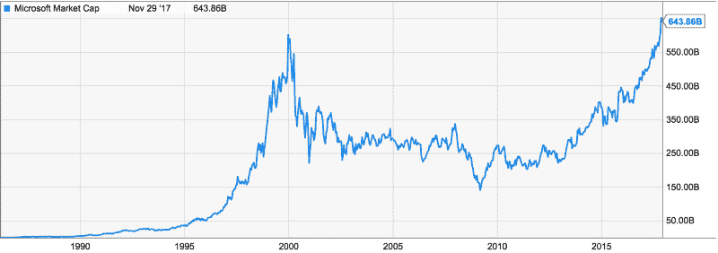
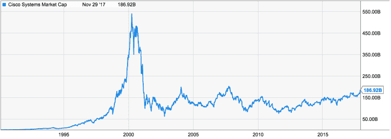
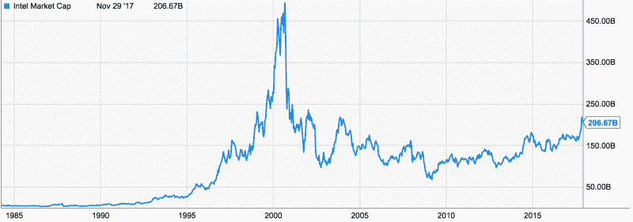
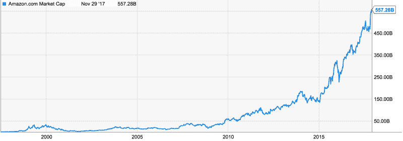
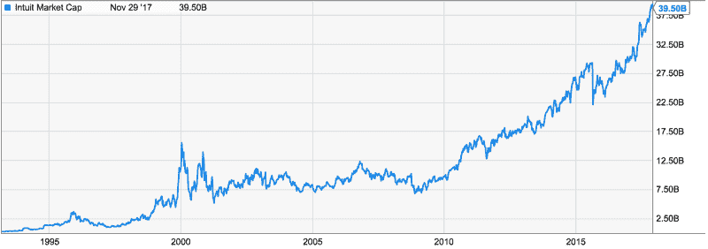
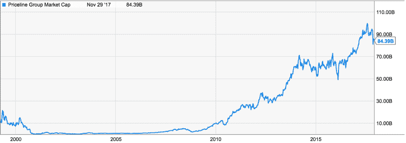
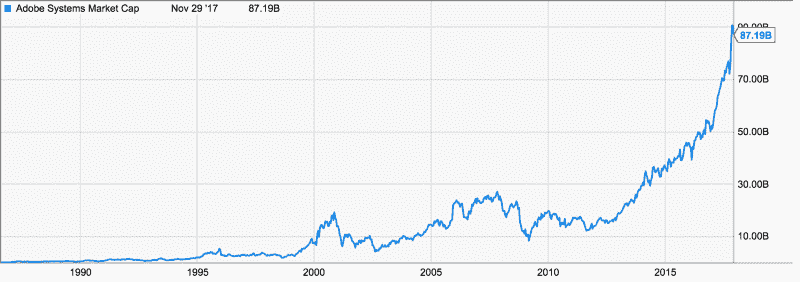

# 我们处于加密货币泡沫中吗？与 2000 年互联网泡沫的对比

> 原文：<https://www.freecodecamp.org/news/are-we-in-a-cryptocurrency-bubble-a-comparison-with-the-2000-dotcom-bubble-a463d8dd8d8b/>

作者何塞·马里亚·马塞多

# 我们处于加密货币泡沫中吗？与 2000 年互联网泡沫的对比

*“A Satire of Tulip Mania”* by Jan Brueghel the Younger (1640)

传奇投资者和诺贝尔经济学奖获得者，如沃伦·巴菲特、雷伊·达里奥、杰米·戴蒙、罗伯特·席勒和约瑟夫·斯蒂格利茨，都宣称隐货币是一个泡沫。

在这篇文章中，我开始描述什么是泡沫，以及我们是否身处其中。然后，我以 2000 年互联网泡沫为案例，研究了泡沫可能带来的影响。最后，我看看我们作为加密货币投资者和长期持有者可以实施的一些策略，以便为任何可能发生的情况做好准备。

我不会花太多时间讨论我们是否处于泡沫中(我不知道，也不认为有人能知道)，而是研究一个可能的泡沫对加密货币信徒和长期投资者的影响，以及理性的回应可能是什么。

### 什么是泡沫，我们身处其中吗？

当资产价格超过其内在价值时，泡沫就产生了。虽然“泡沫”这个词听起来很可怕，但几乎所有的新技术都会经历泡沫。有证据表明，铁路、广播和互联网在成为主流之前都经历了泡沫。正如联合广场投资公司的创始人弗雷德·威尔逊告诉我们的那样:

> *“我的一个朋友有一句很棒的台词。他说，没有非理性繁荣，就没有任何重要的东西被建造出来。这意味着你需要一些这种狂热来促使投资者打开他们的钱袋，为建设铁路、汽车或航天工业或其他任何行业融资。在这种情况下，投资的大部分资金都损失了，但也有大部分投资在了互联网的高吞吐量主干网，以及大量可用的软件、数据库和服务器结构上。所有这些东西造就了我们今天所拥有的，改变了我们所有人的生活……这就是所有这些投机狂热所构建的。”*

为什么新技术往往会冒泡？因为使用传统估值方法(贴现未来现金流的现值)很难评估新技术的内在价值，因为它们通常要到很久以后才会产生任何现金流。就区块链科技而言，这变得更加困难，因为它们中的许多永远不会产生现金流，但仍然具有难以置信的价值。

由于看不到现金流来满足人们的兴奋，炒作和 FOMO 占据了主导地位，因为人们开始猜测新技术可能取代的所有行业(即“分散一切”)，很少考虑可行性和实现这一目标需要多长时间的时间。因此，价格上涨和席勒描述的[“社会传染”效应开始发生](https://www.project-syndicate.org/commentary/bubbles-without-markets?barrier=accessreg):

> 价格上涨的消息丰富了早期投资者，创造了关于他们成功的口碑故事，激起了嫉妒和兴趣。这种兴奋吸引越来越多的人进入市场，导致价格进一步上涨，吸引更多的人，催生“新时代”的故事，如此循环往复，随着泡沫的增长。

那么，加密货币存在泡沫吗？现实情况是，这是不可能肯定的，因为准确计算技术的内在价值是极其困难的。然而，肯定有一些警告信号需要注意。约翰·罗斯柴尔德在 1996 年写道:

> 乔·肯尼迪，在他那个时代是个著名的富翁，在一个擦鞋童给了他一些提示后，他及时退出了股票市场。他认为，当擦鞋童有小费时，这个市场就太受欢迎了，这对他们自己没有好处。

看新闻或浏览脸书也会发现类似的趋势:加密货币投资现在很热，几乎每个人([包括 Paris Hilton](http://uk.businessinsider.com/paris-hilton-backs-ico-lydian-celebrities-endorsing-cryptocurrencies-2017-9) )都想加入进来。

从积极的一面来看，即使我们处于泡沫之中，2000 年的网络泡沫主要是北美现象，17 年前已经达到了 3-5 万亿美元的规模。加密货币是一种全球现象，但目前仅价值 3000 亿美元——这意味着泡沫还有很大的膨胀空间。

### **穿越泡沫——与 2000 年互联网泡沫的比较**

似乎有一种潜在的信仰(信仰？)在加密投资者中，即使存在泡沫并且这个泡沫破裂，这也不会影响长期霍德尔，因为加密市场总会复苏并在长期达到新的高度。

不要误解我的意思，如果你是一个自律的霍德勒，并且你持有的资产具有真正的潜在价值和长期潜力，那么泡沫破裂并不一定重要。从历史上看，大多数市场都从这种崩溃中恢复过来，并最终突破泡沫峰值。然而，如果你以错误的价格购买，最终可能会是很长的一段时间。作为参考，以下是 2000 年互联网泡沫的一些数据。

科技市场花了 17 年时间才回到 2000 年科技泡沫时期的水平。看一下具体的公司就会发现类似的情况。2000 年科技泡沫顶峰时，微软股价为 59 美元/股。2016 年 10 月底才再次超过这个。如果你在 1999 年中期买入(当时距离 2000 年初至 2000 年中期的泡沫峰值还很远)并决定 HODL，你必须等到 2014 年 8 月才能实现盈亏平衡。

在科技泡沫的顶峰时期，思科的定价为每股 79 美元。在 2002 年跌至 11 美元后，它现在价值 32 美元——不到网络泡沫顶峰时的一半。如果你在 1999 年年中买入，你还在等着保本。

类似地，英特尔股票在科技泡沫顶峰时价值 73.94 美元，17 年后价值 35.09 美元，不到泡沫峰值估值的一半。如果你在 1999 年中期买入，你必须等到 2014 年 5 月才能实现盈亏平衡。

即使是亚马逊这个互联网时代最成功的公司，也只是在 7 年后的 2007 年 7 月才恢复到泡沫时期的最高估值。

其他在互联网泡沫中幸存下来的著名公司，如 Intuit、Priceline、Adobe，也花了 10 多年时间才恢复到泡沫时期的峰值估值(尽管像亚马逊一样，它们后来一直在增长，远远超过了泡沫时期)。

这个分析的目的不是要吓唬你，而是要表明，无论你购买的资产有多值钱，我们都必须时刻关注价格，因为存在支付过高价格的情况。尽管这个名单上的所有公司当时都是，而且从那以后都是非常有价值的公司，取得了巨大的成功，但他们真的很难重新获得之前的估值。事实上，即使你设法选择了加密货币的亚马逊[(从这段 1999 年人们谈论亚马逊的视频中可以看出，事后来看要比现实中容易得多)](https://www.youtube.com/watch?v=6cTjhzSgdwE)，如果你在错误的时间购买，你可能仍然需要等待 7 年才能实现收支平衡。请记住，这一分析甚至没有包括绝大多数刚刚彻底失败的网络公司。

### **该怎么办？**

鉴于有证据表明我们正处于泡沫之中，而且实际上不可能预测泡沫破裂的时间，我们似乎应该做好准备。那么我们能做什么呢？作为一名前职业扑克玩家，我喜欢从期望值或 EV 的角度考虑问题。EV 就是一个随机变量所有可能值的总和，每个值乘以它出现的概率[(如果你不知道 EV 是什么，我建议你读一下这个，它会改变你的生活)](https://foreverjobless.com/ev-millionaires-math/)。我们可以使用 EV 来计算任何给定场景中最有利可图的选项。听起来很复杂？让我们列出一些数字来理解它。

假设你有 10，000 美元可以投资，你认为我们有 80%的机会处于泡沫中，当泡沫破裂时，你估计它会抹去 crypto 75%的市值。然而，你不知道泡沫什么时候会破裂，可能是 2 个月或 2 年，你估计置身市场之外会让你在此期间损失 2 倍的收益。此外，如果泡沫破裂，你相信市场将在未来 5 年内恢复到以前的价值。如果泡沫没有破裂，市场将在同一时期继续增长到 4 倍。为了简单起见，让我们假设加密市场只包含比特币，其初始价值为每枚 1 万美元。

在这种情况下:

*   如果你完全置身于密码市场之外，你只需保留你的 1 万美元。EV = 10，000 美元
*   如果你把 10，000 美元全部投资:如果泡沫破裂(80%的可能性)，你将赚到 20，000 美元，但当泡沫破裂时，损失了 75%，最终只有 5，000 美元，5 年后将恢复到 20，000 美元。如果泡沫没有破裂(20%的可能性)，你将在同一时期赚到 40，000 美元。EV = 0.8 * 2 万美元+0.2 * 4 万美元= 2.4 万美元
*   如果你最初的目标是在泡沫破裂时投资 10，000 美元:如果泡沫破裂(80%的可能性)，那么一旦泡沫破裂，你可以投资 10，000 美元，5 年后有 40，000 美元。如果泡沫没有破裂(20%的几率)，那么比特币将价值 4 万美元，你损失了 4 万美元的机会成本。EV = 0.8*4 万+ 0.2*-4 万= 2.4 万美元
*   如果你投资 2000 美元，留 8000 美元以备泡沫破裂时使用:如果泡沫破裂(80%的可能性),你将获得 1000 美元的初始投资，然后你将投入 8000 美元。5 年后，1000 美元将变成 4000 美元，8000 美元将变成 32000 美元。如果市场没有崩溃(20%的可能性)，你会赚到 8000 美元。EV = 0.8 *万+ 0.2*8 千= 3.04 万美元。

### 结论

这显然是一个简化的模型，你可以摆弄数字，得到略有不同的结果，但关键的见解是，即使你是一个狂热的加密信徒，如果你认为有一个非零的机会崩溃可能会发生，那么为了最大化你的预期价值(即赚最多的钱)，你应该保持一些%的钱在场外投资，一旦泡沫破裂，降低你的平均买入成本。你分配给崩盘的概率越高，你就应该有越多的钱保持观望，反之亦然。

非常感谢您的阅读。根据反馈，我会写更多，所以请让我知道你的想法，无论是评论还是直接留言！