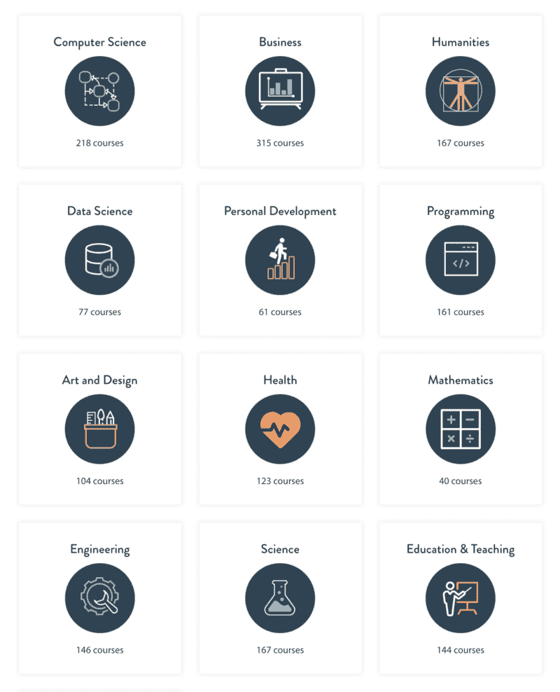

# 2017 年最好的免费在线课程有哪些？你决定吧。

> 原文：<https://www.freecodecamp.org/news/vote-best-online-courses-2017-5210e27da996/>

如果你没听说过，世界各地的大学都免费(或至少部分免费)提供在线课程。

你可以在我从 2011 年开始运营的名为 [Class Central](https://www.class-central.com) 的网站上找到 8000 多门这样的课程。Class Central 的用户也为这些课程写了超过 30，000 条评论。

整整一年，我一直在跟踪多个不同平台推出了哪些新课程。仅 2017 年，全球就有 350 所大学推出了近 2000 门免费在线课程。

这是我第三次公布这样的名单。以下是 2015 年的[和 2016 年](https://www.class-central.com/report/best-free-online-courses-2015/)的[的名单。](https://www.freecodecamp.org/news/best-free-online-courses-of-2016-c479b55ed851/)

我的方法很简单:我会根据这 2000 门课程的贝叶斯平均评级对它们进行排名，然后过滤掉评论少于 10 条的课程。

New courses launched in 2017 categorized by subject — find them [here](https://www.class-central.com/vote-best-moocs-2017).

如果你参加了今年新开设的课程，现在是时候[结束你的复习](https://www.class-central.com/vote-best-moocs-2017)了。查看我们按主题列出的[新课程的完整列表，并在今天提交您的评论。](https://www.class-central.com/vote-best-moocs-2017)

在你的帮助下，我将能够在 1 月初公布 2017 年最佳免费在线课程的名单，你将确切知道这 2000 门新课程中你应该查看哪些课程！