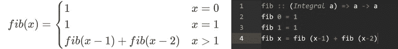

# 纯函数式编程语言如何改变你的生活。

> 原文：<https://www.freecodecamp.org/news/haskell-has-no-while-no-for-no-variables-and-will-change-you-16455c5d2426/>

安德里亚·赞恩

# 纯函数式编程语言如何改变你的生活。


我相信每个人都应该学习 Haskell，即使你不会在工作中使用它。它很美，它改变了你的思维方式。

#### 哪个哈斯克尔？

首先介绍一下:什么是 Haskell？Haskell 是一种懒惰的纯函数式编程语言。

这是什么？

好吧，懒惰意味着 Haskell 不会马上执行你的命令，而是等到你需要结果的时候。乍一看，这似乎很奇怪，但是它提供了一些非常好的特性，比如无限列表:

```
evenNumbers = [0, 2..]
```

这个代码片段将声明一个包含所有偶数的数组。但是正如我们所说的，Haskell 是懒惰的，所以它不会计算任何东西，直到被强迫这样做。

```
take 10 evenNumbers
```

代码返回偶数的前 10 个元素，所以 Haskell 将只计算这些元素。

如你所见，在 Haskell 中你调用一个没有括号的函数。您只需输入函数名，后跟参数(就像在终端中一样，如果您愿意的话)。

我们也说过 Haskell 是纯功能性的。这意味着，一般来说，函数没有副作用。它们是黑盒，接受输入并输出，而不会以任何其他方式影响程序。

额外的好处:这使得测试变得容易多了，因为你没有一些神秘的状态会破坏你的功能。函数需要的任何东西都作为参数传递，并且可以测试。

#### 数学、递归和 Haskell 进入一个酒吧

我还要补充一点，Haskell 真的很像数学。我用一个例子来解释我自己:斐波那契数列。



Fibonacci sequence as defined in math and Haskell. Haskell version is not optimized at all

如您所见，定义非常相似。你可能会说太相似了。

那么循环在哪里呢？

你不需要他们！这四行是 Haskell 计算斐波那契数列所需要的全部内容。几乎是微不足道的。这是一个递归定义，意味着函数调用自己。为了便于理解，这里有一个递归函数的例子:

```
factorial :: (Integral a) => a -> afactorial 0 = 1factorial x = x * factorial (x-1)
```

以下是计算机在计算调用*阶乘 5* 时的操作:

```
factorial 5 = 5 * factorial 4factorial 4 = 4 * factorial 3factorial 3 = 3 * factorial 2factorial 2 = 2 * factorial 1factorial 1 = 1 * factorial 0factorial 0 = 1
```

```
factorial 1 = 1 * 1 = 1factorial 2 = 2 * 1 = 2factorial 3 = 3 * 2 = 6factorial 4 = 4 * 6 = 24factorial 5 = 5 * 24 = 120
```

你可能认为这种方法效率低下，但事实并非如此。稍加小心，你可以达到类似 C 语言的速度，有时甚至更快(更多信息，请参见[这个堆栈溢出线程](https://goo.gl/qbUhR5))。

#### *等等！你说没有变量吗？*

是的，Haskell 没有变量——只有常量。理论上哈斯克尔有变量。但是你很少使用它们。

怎么会这样呢？没有变量就不能编码，那是胡说八道！

大多数语言都是命令式的。这意味着大部分代码向计算机解释如何执行某项任务。另一方面，Haskell 是声明性的。所以你的大部分代码都用来定义你想要的结果(常量≈定义)。然后编译器会想出怎么做。

正如我们已经发现的，Haskell 中的函数是纯函数。没有要修改的状态，也不需要变量。您通过各种函数传递数据并检索最终结果。

#### 类型系统(不，我不打算讨论静态和动态)

在学习 Haskell 的类型系统时，第一个让我吃惊的是代数数据类型。乍一看，它们有点像 enums。

```
data Hand = Left | Right
```

我们刚刚定义了一个 Hand 数据类型，它可以向左或向右取值。但是让我们看一个稍微复杂一点的例子:

```
data BinTree = Empty          | Leaf Int          | Node BinTree BinTree
```

我们正在定义一个二叉树，使用递归类型。类型定义可以是递归的！

#### 好吧，我明白了:哈斯克尔很棒

*   但是我在哪里可以学到更多？我个人的建议是伟大的免费书籍[为了伟大的利益](https://goo.gl/JxQy3h)学你一个 Haskell
*   但是我想要能帮我找到工作的东西！Haskell 的许多优秀特性也可以在 JavaScript 中使用(尽管语法稍微复杂一点，还需要额外的库)。要了解更多，请查看我的[JS](https://goo.gl/3CvMF7)中的函数式编程实用介绍。