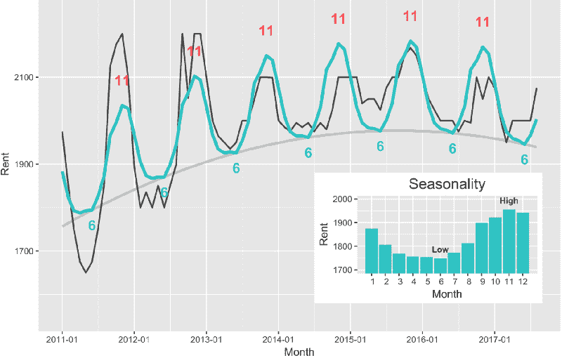
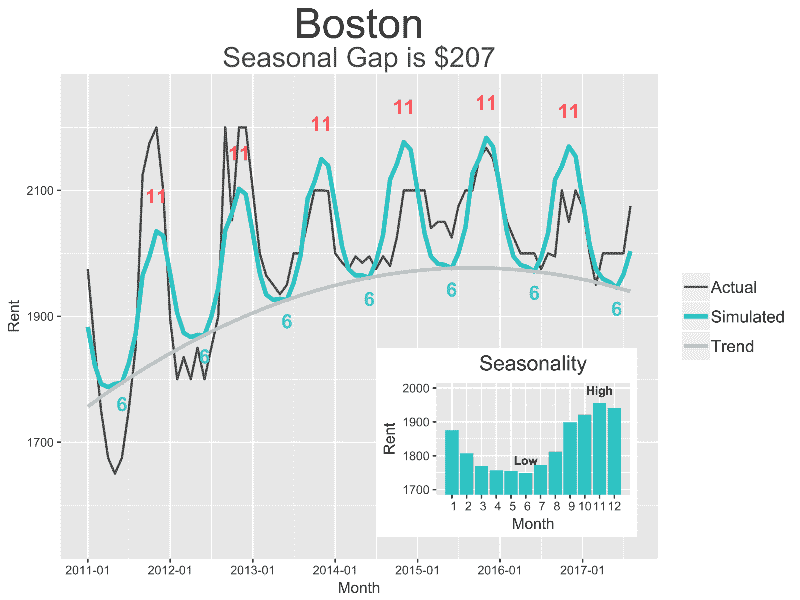
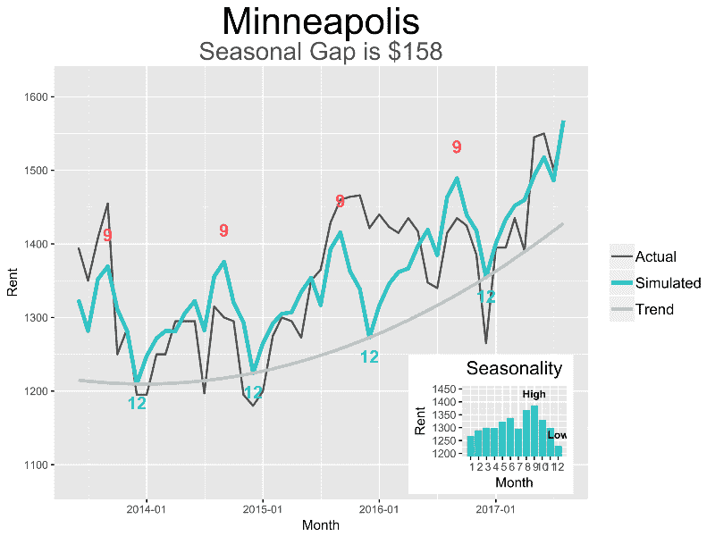
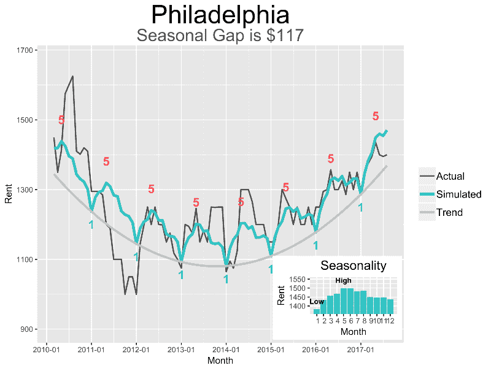
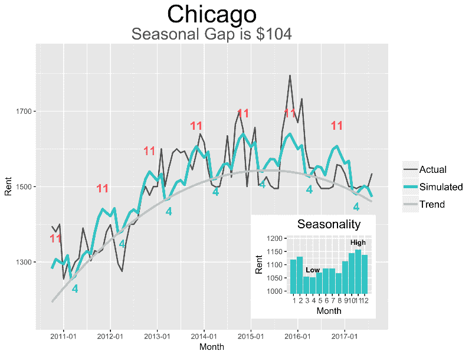
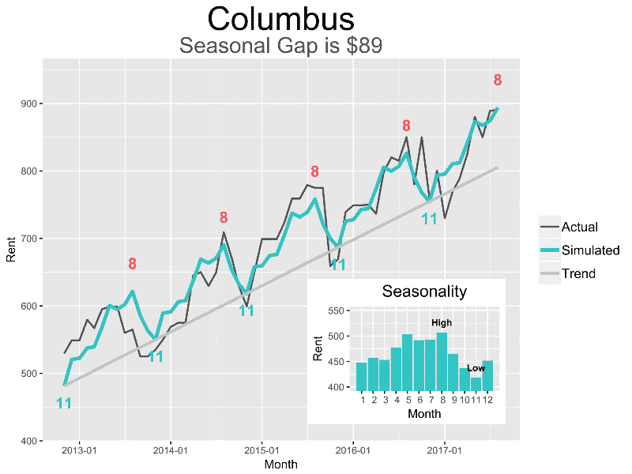
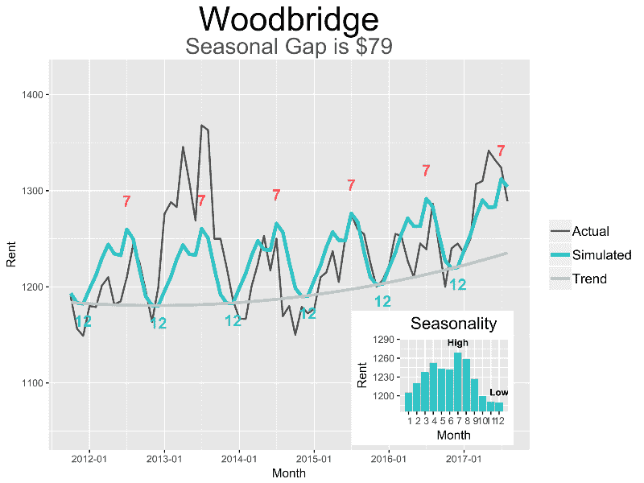
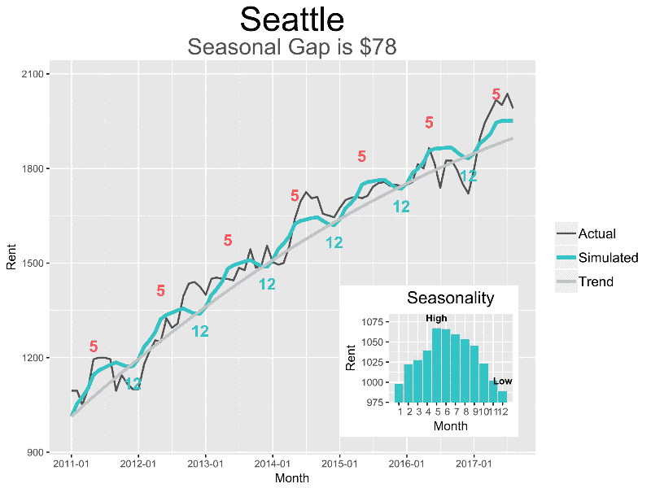
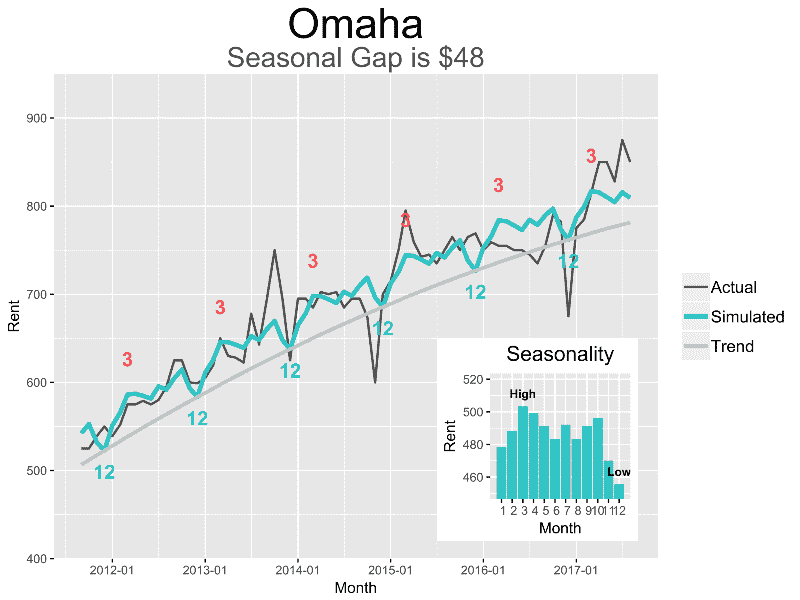

# 如何分析租赁的季节性和趋势，以节省租赁费用

> 原文：<https://www.freecodecamp.org/news/how-to-analyze-seasonality-and-trends-to-save-money-on-your-apartment-lease-714d1d82771a/>

作者:刘臻

# 如何分析租赁的季节性和趋势，以节省租赁费用

当我在寻找一个新公寓出租时，我开始想:有季节性影响吗？有没有一个月的租金是最低的，这样我可以在开始租赁时省钱？

为了解决这个问题，我在这里使用了 Zillow 的公开数据。我分析了他们从 2011 年 1 月到 2017 年 9 月的一居室租金数据，用于按规模排名的前 100 个美国城市。

**简短的回答是肯定的**。如果你选择正确的月份开始在某些城市租房，你可以从**节省 1000 到 2000 美元**。通过简单地用时间和月份拟合一个线性回归模型来估算租金，我发现了几个城市的一些有趣的季节性模式。

**方法:**

高层次上，**租金=趋势+季节性**。我为每个城市拟合了一个线性回归模型来分解趋势和季节性(使用 12 个月的周期)。

模型:预计租金(特定月份)=t+t +m1+m2+m3+…+m12

变量: **t** 和**t** 为连续变量，用于估计趋势；t 是从一个城市的开始月份算起的月数。我添加了 t 来调整二次趋势，你会在下面费城的图中看到一些清晰的曲线。

**m1** 、 **m2** 、…、 **m12** 为二进制变量(0 或 1)，表示一个数据点(租金)属于哪个月。每个租金数据点只能分配一个月变量(如 1)。其余的将是 0。

在为所有城市拟合上述模型后，我计算了有多少个月的系数在统计上明显高于估计租金最低的月份。我认为计数≥3 的城市具有潜在的巨大季节性效应。

然后，我检查了整体模型拟合，以过滤掉大量噪音的城市，并最终列出了六个最具代表性的城市。

现在我要带你去看看这些城市，这样你就可以看到你开始租房的最甜蜜的月份。我在下面绘制了模拟租金和实际租金的对比图。你可以在右下角看到每个月的纯季节差异(按每个城市的趋势调整)。以下是如何解读这些情节:

**黑线**:实际租金数据

**绿线**:给定年月回归模型模拟租金

**右上角绿色柱状图**:模型估计的纯季节效应

**灰线**:回归模型估计的趋势

**季节性差异**:最高租金减去最低租金(从回归模型中估计的最高点和最低点之间的差异，没有趋势效应)

**数字标签**:表示预计租金最高(红色)和最低(蓝色)的月份

#### 具有明显季节性效应的六个城市

如果你在这些城市的“低”月开始租房，你肯定会省钱。

1.  **波士顿**

如果你在 6 月份开始租房，与 11 月份开始租房相比，你一年可以节省大约 2484 美元(207*12)。灰色线显示了波士顿的轻微趋势，但与强劲的季节性因素相比，这并不十分显著。

2.**明尼阿波利斯**

略有上升趋势，但季节性效应比趋势更显著。如果从 12 月开始租房，你每年的储蓄可能高达 1896 美元(158*12)。实际上，这一数字可能会略低，因为上升趋势往往会缩小一点差异。

**3。费城**

在回归模型对曲线形趋势进行调整后，预计每年节省的租金为 **$1404** (117*12)。这个数字在下降趋势期间更大:你可以看到，在 2014 年之前，1 月和 5 月的租金差距进一步拉大。随着近年来整体租金的增加，预计节省的费用会更少。

**4。芝加哥**

芝加哥的总体趋势实际上与费城相反——先升后降。但经趋势调整后，季节性效应仍然显著。预计每年节省的费用为 **$1248** (104*12)。如果这种下降趋势持续下去，节省的费用将会更大——从最近几年的情况来看，11 月和 4 月之间的租金差距会进一步拉大。

**5。哥伦布**

哥伦布的房租有明显的上涨趋势，但季节性效应也相当显著。在按上升趋势调整纯季节差距(89 美元)后，估计的年节省额更小，所以你会节省大约 **$720** (60*12)。但是你还是应该考虑在 11 月开始租赁，避开 8 月。

**6 号。Woodbridge** 的缩写形式

如果你从 12 月份开始租房，与从 7 月份开始租房相比，你一年可以节省大约 948 美元。这种趋势在这里并不明显，所以仍然是季节性因素推动了伍德布里奇的租金价格。

我居住的城市西雅图怎么样？

季节性效应在西雅图也存在，并且在回归模型中表现出显著性。但是，趋势如此之大，季节性几乎无关紧要。

即便如此，了解像西雅图这样的城市的季节性也是有帮助的。虽然在一个不太忙的季节，你可能无法谈妥那么低的租金，但你可以要求免除申请费或类似的东西。

我现在的公寓在我一月份开始租赁时放弃了我的——十二月的租金最低，其次是一月。但在租金较高的繁忙月份，比如五月和六月，他们可能不会提供这项福利。

另一个趋势超过季节性的城市是奥马哈。

如果你知道这个模式，了解你所在城市租金的季节性可以帮你节省数千英镑。我用 R 做了我的分析和绘图，但是如果你只是想看看是否有任何明显的趋势和季节性，你可以简单地在 Excel 中绘制你的城市的数据。使用开源数据来破解你的生活决策和省钱其实很简单。

#### 现在，你应该签多长时间的租约？

假设你有几个不同的租期选择。通常是 9 个月到 18 个月。你知道当你签租约的时候选择什么长度最合适吗？当你选择持续时间时，实际上还有另一个省钱的技巧，我将在下一篇文章中向你展示这个技巧及其背后的数学原理。

给我几个掌声，把这个分享给可能会觉得有用的朋友们！

***这里可以找到我的代号***。