# 马里奥奥德赛跳绳挑战赛

> 原文：<https://www.freecodecamp.org/news/mario-jump-rope-challenge-f7bb44faf6bb/>

作者:安廷·哈拉西米夫

# 马里奥奥德赛跳绳挑战赛

超级马里奥奥德赛很可能是我最喜欢的马里奥游戏。以至于我竭尽全力去完成每一个挑战。但是其中一个给我的麻烦比所有其他人加起来还多:地铁王国里的跳绳天才*。*

*你甚至不需要移动。你只需要连续成功跳跃 100 次。但诀窍是每跳五次它就加速到 50，直到你几乎每秒跳两次。过早按下跳转键会失败。按跳跃键太晚，你会失败。长时间按跳跃键…你猜对了，你失败了。*

*经过几十次失败的尝试后，我开始开玩笑说，我只是造了一些东西来打败它…随着时间的推移，我仍然没有完成挑战，我的玩笑变得越来越严重，我开始想知道如何做到这一点。*

*我的第一个想法是简单地编写一个 Arduino 来桥接开关控制器上跳转按钮的连接器，但谢天谢地，我首先检查了 [iFixit 拆卸](https://www.ifixit.com/Teardown/Nintendo+Switch+Teardown/78263#s156437)，因为自 Wii 以来，任天堂控制器使用圆顶开关而不是导电橡胶垫，这使得不可能实现(为了有趣的阅读，请参见多年来任天堂控制器的[演变](https://www.fictiv.com/blog/posts/nintendo-controller-teardown-part-1))。*

*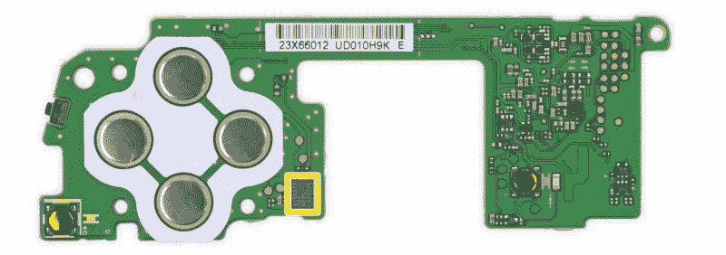

Switch Joy-Con controller* 

*我在心理上纠结是买一个容易破解的老式 GameCube 控制器(带适配器),还是用螺线管来按下开关控制器上的按钮，这两个似乎都是可行的解决方案，但在易贝出售的前几个 GameCube 控制器的出价被超过后，我决定选择螺线管路线。*

*在完成了马里奥 836 个独特挑战中的 835 个后，我把所有的注意力都转回了最终的月球。为了编写一些东西来击败它，首先我需要测量时间，所以我的意图是记录屏幕，然后计算帧数。在安装摄像机之前，我进行了几轮练习，让我感到恐怖的是，我居然合法地拍了下来。*

*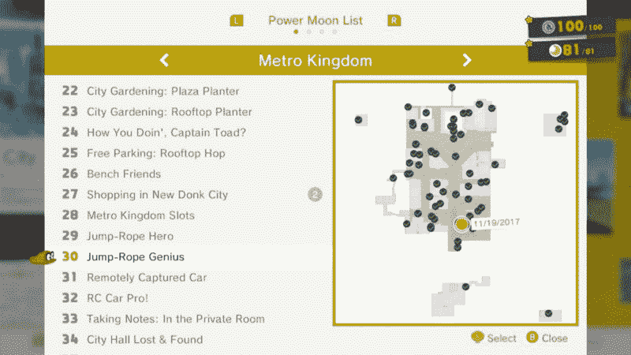***

*花了两个星期的时间告诉每个人我知道我将编写一些东西来击败它(并且让他们大多数人嗤之以鼻),失去这样做的借口是非常令人失望的。*

*然而，作为一个成年人，我意识到我真的不需要一个借口来浪费我的时间和金钱(这几乎是我们所做的一切)，所以 express 订购了一个 Arduino 和必要的组件来开始我的项目。*

*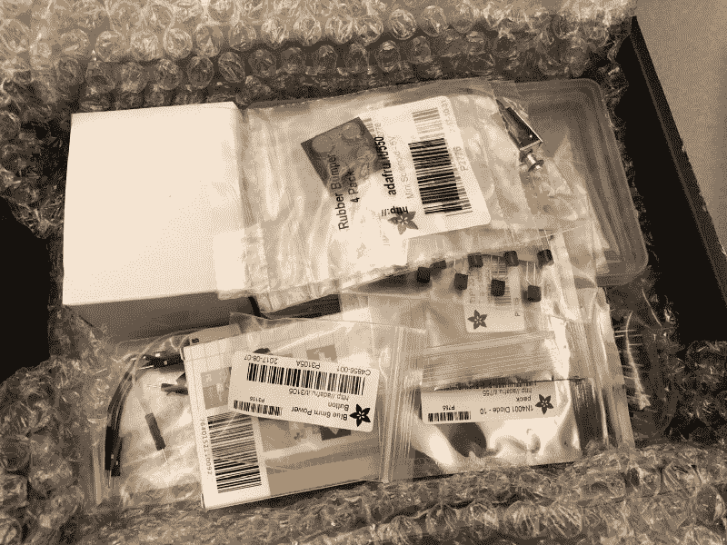**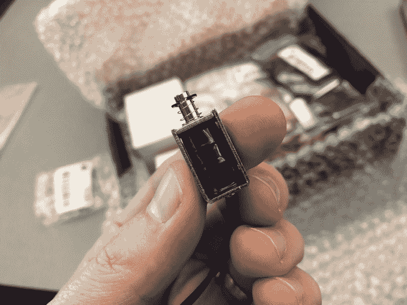*

*第一步是弄清楚如何使用 Arduino，这…实际上非常简单，在线编辑器和教程非常简单，在编程了几个闪烁的 led 后，我觉得已经准备好了。最大的障碍实际上是找到一个 USB-B 电缆，因为老实说，谁还在使用这些？*

*第二步是找出时机，我给自己出了个难题。我认为我从头顶上记录是聪明的，可以用这个女人的脚来对齐帧，当*她的手碰到她的脚*时，我会称之为一次革命，我费力地通过 QuickTime 按下箭头键一次步进一帧，并数着*一、二、三……六十八、六十九、七十*。*

*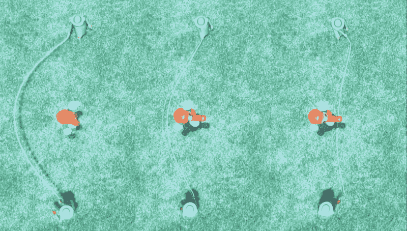

The middle frame shows her hand aligned with foot* 

*第二步半是意识到跳转计数是一个更可靠的测量方法，Final Cut Pro 会向我显示时间和帧数，让我可以真正快速地浏览视频。*

*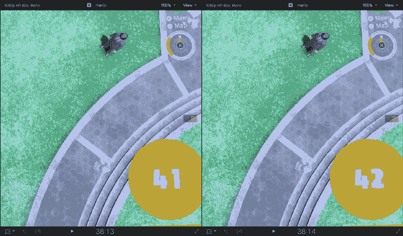

Final Cut Pro* 

*这样做 50 次……然后把所有的结果放进电子表格，你就有了跳绳成功的秘诀。最后的 50 次跳跃？你需要每 0.58 秒做一次。*

*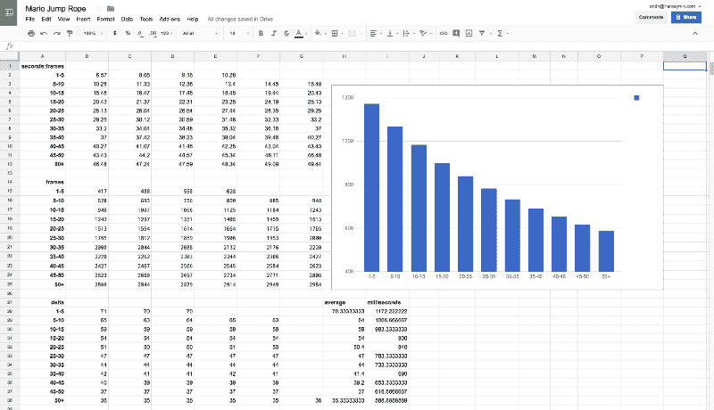

Measured timings for Mario Jump-Rope challenge* 

*计时结束后，我将注意力转向问题的电子部分，幸运的是，懂电子的人(我肯定不懂)已经[分享了](https://core-electronics.com.au/tutorials/solenoid-control-with-arduino.html)如何用 Arduino 控制螺线管。*

*对于那些不知道的人来说，螺线管实际上只是一个圆柱形线圈，当电流通过时会产生磁场。该名称可以与一些使用螺线管(线圈部分)做更复杂事情的东西互换，在这种情况下，推动一个小金属杆。打开电源，杆会向外推出，关闭电源，弹簧会将其推回。*

*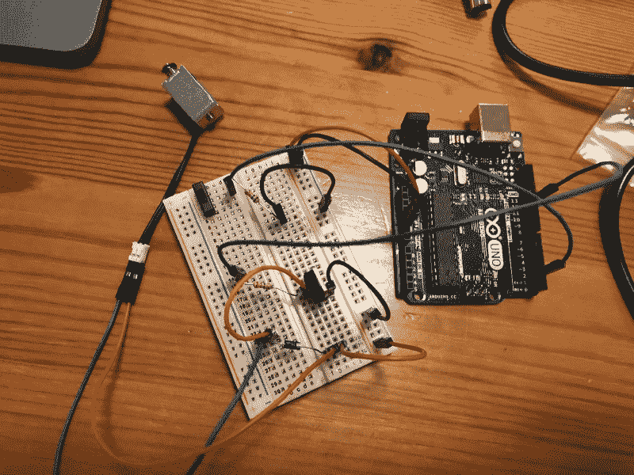**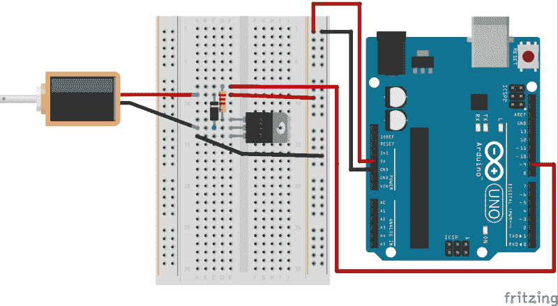

Completed circuit* 

*我用一个简单的开关和螺线管连接了一个电路，并编写了一个程序，可以循环并触发它，随着时间的推移逐渐缩短时间。扳动开关将启动循环，关闭开关将重置。*

*这将使我能够手动运行马里奥到位，并翻转开关开始，也给我一个简单的方法来重试，如果我搞砸了(我预计会经常发生)。几个小时后(加上我哥哥的一些提示),我有了一个工作电路！*

*在这一点上，我基本上假设成功了，然后现实踢了我一脚(或者说，踢了我一脚)。在我的天真中，我以为螺线管能够轻松地按下开关按钮，我买的是一个 5V 的螺线管，能够移动 3 毫米并施加 80 克的力，这看起来很多(实际上不到 1 牛顿)。*

*我把它对着控制器，什么也没有。没有移动，按钮拒绝移动。在谷歌上搜索按下一个开关控制器需要多大的力没有得到任何结果，而且在我的房子周围我没有好的工具来测量它。*

*所以，没有好的工具，我就去找一些不好的。*

*烹饪措施呢？我往杯子里装了 1/3 的水，然后把它放在一个按钮上面，一动不动。我往半个杯子里装了水，它就下沉了。这就是你的答案，一个欢乐合唱团的按钮需要三分之一到半杯水。*

*将它们转换回真实的单位，1 杯= 250 毫升，关于公制的简单的事情是重量是从水的体积得到的。250 毫升相当于 250 克，所以我的 Joy-Con 需要 83 克到 125 克的重量来降低压力。*

*突然，我的 80 克螺线管似乎不那么动力不足，如果我…制服它？我给了它要求的 5 伏电压，但我有 9 伏的电源。螺线管的磁力随着电压的增加而增加(实际上是随着电压的平方而增加)，所以在 9 伏电压下，我的螺线管应该施加接近 250 克的力，或者按照我的想法，1 杯水！*

*第四步是将螺线管连接到控制器上。考虑到我在计划这一部分时投入的思想是如此之少，这个解决方案变得如此不优雅就不足为奇了。几块木头把它抬高到其他按钮之上，几块绝缘胶带把木头固定住，一根橡皮筋把螺线管固定住。*

***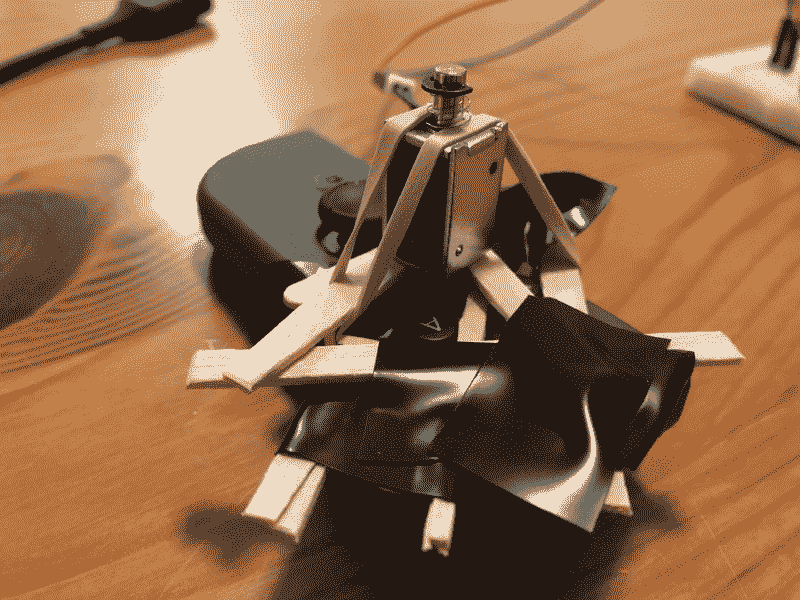**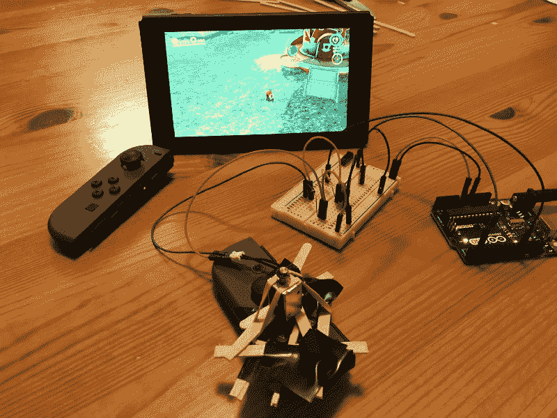*

*我终于准备好接受所有的考验，我来到了地铁王国，迎接挑战，并准备好沐浴在沾沾自喜的成功的甜蜜荣耀中。*

*而且几乎马上就失败了……我的时机不对。我手动调整了代码中的一些计时，让马里奥越来越近，再近，再近，直到他可以相当可靠地达到 86。*

*在这一点上，我没有随机调整，而是录制了它的播放，并返回到 Final Cut Pro 重新计算帧数(这次重点关注每 5 个跳跃段绳子变得更近/更远了多少帧)，虽然我在一些地方有点偏离，因为马里奥总是达到 50，唯一需要改变的是 50+的计时。我把它减少到每 35.2 帧跳一次，再试一次。*

*成功！261 跳。这感觉像是一个巨大的胜利，你可以在视频中看到它轻松击败了我 102 跳的微薄人力。我立即去叫醒我的妻子，并试图解释它有多酷，当这不能让我得到很多奉承时，我求助于告诉我的兄弟，他更适合留下深刻印象。*

*然而，它是一个机器人，为什么 261 应该是一个极限？为什么不能完美？我再次分析了画面，注意到绳子追上马里奥的速度非常慢，他需要加快速度！*

*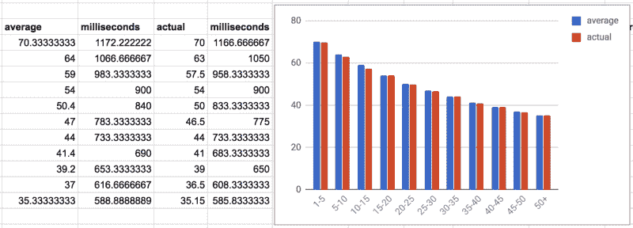

Jump timings, average was measured, actual is what is in code* 

*将时间从每 35.2 帧跳一次减少到每 35.15 帧跳一次(仅 0.14%的变化)导致了更成功的马里奥。*

*如此成功，它能够玩令人愤怒的马里奥跳绳挑战 35 分钟 21 秒，然后失败了…创下了 3613 的新高(对我来说)。*

*起初，我以为它失败了，因为我的时间仍然不知不觉地出来了，但仔细检查视频，它保持完全同步，直到它…长按！电脑犯了多么大的人为错误，它没有快速跳跃，而是按住按钮太久，让马里奥飞得太高，他在正确的时间跳跃，但着陆晚了。*

*事实上，我认为这是可怜的螺线管过热，在晚上早些时候，当我玩计时时，它也停止了运行，我认为以几乎两倍的电压驱动它是有问题的。在视频中，你甚至可以看到它在正确的时间点上第二次按下。*

*至于代码？这是最简单的部分。仅仅 76 行代码就能玩得比我更好*

*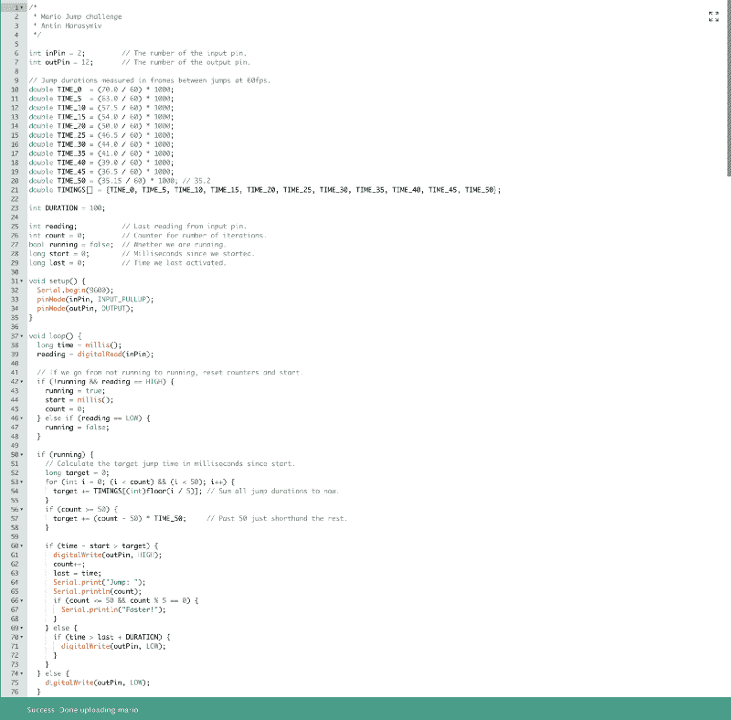*

*为了简单起见，我用跳跃之间的帧数来测量所有的时间，我可以很容易地在视频中计算帧数，然后除以 60 就可以得到秒数。*

*从挑战开始的时候起，代码使用航位推算来计算一切，我假设触发任何一次跳跃的不精确性都会被平均掉。每循环一次，代码计算在下一次跳跃之前应该经过多少毫秒，如果达到阈值，则打开螺线管；在重置之前，有一个短暂的持续时间保持螺线管打开(可能需要更短以避免长按)。*

*就这样…简单得近乎愚蠢，考虑到跳跃挑战的本质，也很恰当。*

*我可以再试一次，但是每次差不多 40 分钟，我就是不够感兴趣。此外，我发现有人比我走得更好，尽管方向略有不同。*

*他们不用按控制器上的按钮，而是使用一个库来模拟控制器，使他们能够发送信号。当他们遇到和我一样的计时挑战时(在失败之前只进行了几百次跳跃，他们使用常数 35.18 进行最后一次跳跃)，他们通过编程监控视频信号、检查乐谱区域并在它改变时进行另一次跳跃来解决这个问题。用这种方法，他们可以达到最高分 99，999！*

*你会认为有了这一切，我会在游戏中得到最高分之一…你错了！仅在一周前，我可能会进入前 100 名，但在游戏中发现了一个漏洞，使任何人都可以在这个挑战中失败，几乎不需要任何努力，你就可以获得无限的跳跃，现在已经有超过 10，000 人这样做了。也许如果任天堂修补这个并重置比分板，我会再次掸掉我的螺线管，我觉得如果你可以建立一些只使用控制器本身玩游戏的东西，那就有点合法了。*