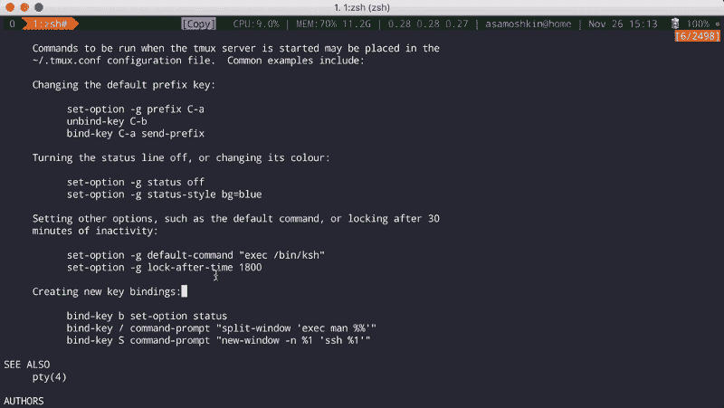
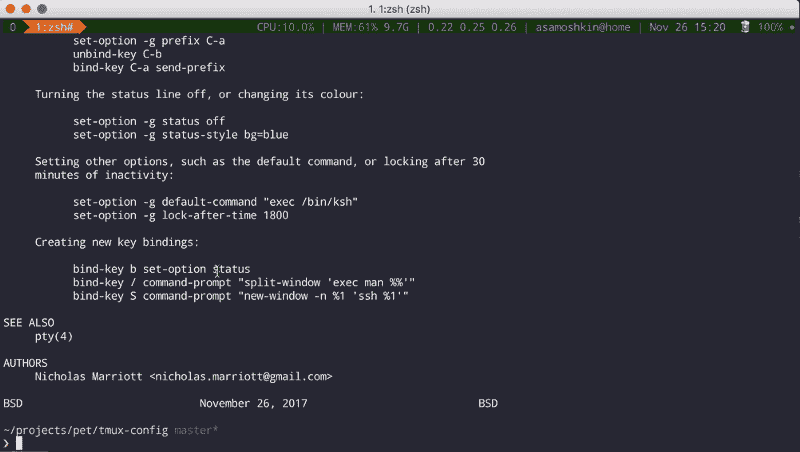

# 实践中的 tmux:回滚缓冲区

> 原文：<https://www.freecodecamp.org/news/tmux-in-practice-scrollback-buffer-47d5ffa71c93/>

阿列克谢·萨莫什金

# 实践中的 tmux:回滚缓冲区

#### 终端和 tmux 回滚缓冲区之间的区别，以及如何调整 tmux 行为的复制模式、滚动和鼠标选择。

这是我的 [tmux 实践](https://medium.com/@alexeysamoshkin/tmux-in-practice-series-of-posts-ae34f16cfab0)系列文章的第三部分。

通常，终端模拟器实现了回滚缓冲区，所以当它移出视图时，您可以浏览过去的输出。tmux 与 vim 等其他全屏终端应用程序一样，运行在父终端的所谓交替屏幕缓冲区中。备选缓冲区的宽度和高度尺寸与物理窗口尺寸完全相同。

使用备用缓冲区有几种效果:

*   任何超出备用缓冲区可见部分的输出都将丢失。一旦线条从视野中消失，它们就丢失了。为了防止历史丢失，tmux 实现了自己的“内部”回滚缓冲区。这样做的结果是，您不能像通常在终端中那样使用 tmux 内部回滚。
*   tmux 内部产生的任何输出(vim、nano、man、less 等也是如此)都不会溢出到外部终端的回滚历史中。当您关闭全屏应用程序时，您会回到启动应用程序时的状态，并且再也看不到应用程序内部的输出。

在实践中，如果您习惯了在 iTerm 中使用`⌘↑`进行回滚，并且如果您打算在运行的 tmux 会话中做同样的事情，您将控制和滚动外部 iTerm 的回滚缓冲区，而不是 tmux 的内部回滚缓冲区。

解决方法是使用 tmux 特定控件访问其自己的回卷缓冲区:`Ctrl-b`然后`[`进入复制模式，使用`Down/Up`箭头或`PageDown`和`PageUp`键，`q`或`Enter`退出复制模式。

有些人觉得这很烦人——配置 tmux scrollback buffer 以允许在父终端 scrollback buffer 中显示——这样他们就可以使用熟悉的滚动控件。[见本帖](https://dan.carley.co/blog/2013/01/11/tmux-scrollback-with-iterm2/)。但是，这种解决方案仅限于在 1 个窗口和 1 个窗格中进行 tmux 会话。当您分离/关闭 tmux 会话时，父终端会受到 tmux 窗口输出的污染。

就我个人而言，我使用 tmux scrollback，没有上面的黑客攻击，但调整了它的配置，使其更加友好和熟悉。

首先，我不喜欢`prefix,[`进入复制模式。我已经习惯了用`⌘↑`在 iTerm 中开始滚动，并且我已经添加了下面的根键绑定:

```
# trigger copy mode bybind -n M-Up copy-mode
```

一旦进入复印模式，您可以继续按`M-Up`向上滚动一行。通常的`PageDown`和`PageUp`控件可以滚动整个屏幕，额外的`M-PageDown`和`M-PageUp`可以滚动半个屏幕(非常方便)。

```
# Scroll up/down by 1 line, half screen, whole screenbind -T copy-mode-vi M-Up              send-keys -X scroll-upbind -T copy-mode-vi M-Down            send-keys -X scroll-downbind -T copy-mode-vi M-PageUp          send-keys -X halfpage-upbind -T copy-mode-vi M-PageDown        send-keys -X halfpage-downbind -T copy-mode-vi PageDown          send-keys -X page-downbind -T copy-mode-vi PageUp            send-keys -X page-up
```

此外，即使我在 tmux 会话中，我仍然可以继续使用`⌘↑`和`⌘↓`来控制内部 tmux 回滚缓冲区，而不是 iTerm 的那个。通过使用定制 iTerm 配置文件并覆盖一些键绑定来触发 tmux 动作，这是可能的。所以 iTerm 中按下的`⌘↑`只是将`M-Up`击键发送到 tmux 会话。

请阅读我之前的“tmux 实践”系列文章，了解更多详情: [tmux 实践:iTerm2 和 tmux 集成](https://medium.com/@alexeysamoshkin/tmux-in-practice-iterm2-and-tmux-integration-7fb0991c6c01)。

另一个我想改变的 tmux 默认设置是鼠标滚轮滚动。它滚动了 5 行，感觉是一个大跳跃。让我们将其缩减为滚动 2 行:

```
# When scrolling with mouse wheel, reduce number of scrolled rows per tick to "2" (default is 5)
```

```
bind -T copy-mode-vi WheelUpPane select-pane \; send-keys -X -N 2 scroll-upbind -T copy-mode-vi WheelDownPane select-pane \; send-keys -X -N 2 scroll-down
```

好了，现在让我们来谈谈一旦进入复制模式后复制文本的问题。我习惯用鼠标复制文本。让我们启用鼠标支持:

```
set -g mouse on
```

默认情况下，当你在 tmux 中用鼠标选择文本时，它会被复制到 buffer 中，你会立即退出复制模式。输出结束时，您当前的滚动位置被重置，您将进入命令提示模式。让我们来看看实际情况:



Kicked off copy mode on mouse drag end

正如你注意到的，每次我用鼠标选择文本，它就把我踢出复制模式。真的很烦。通常当我被某项任务困住时，我会在这里或那里选择一些文字来沉思(这有助于我集中注意力？).或者，您可能只想为坐在您旁边的同事选择一些突出显示的文本。

让我们调整一下。我们不想被踢出复制模式。我们不希望在鼠标拖动结束事件时清除选择。鼠标左键点击后可以复制选中的文本。

```
# Do not copy selection and cancel copy mode on drag end event# Prefer iTerm style selection: select, then mouse click to copy to bufferunbind -T copy-mode-vi MouseDragEnd1Panebind -T copy-mode-vi MouseDown1Pane select-pane \;\  send-keys -X copy-pipe "pbcopy" \;\  send-keys -X clear-selection
```

让我们来看看结果:



Stay in copy mode and do not clear selection on mouse drag end event

要访问复制缓冲区项目并粘贴最近的项目，使用`C-p`和`p`:

```
bind p paste-bufferbind C-p choose-buffer
```

今天到此为止。敬请关注。在“tmux 实践”系列的下一部分中，我们将讨论剪贴板集成，以及如何使用系统剪贴板共享在 tmux 内部复制的文本(在 OSX 和 Linux 上，包括本地和远程工作时)。

顺便说一句，你可以看到所有这些配置的调整，只需检查我的 [tmux-config](https://github.com/samoshkin/tmux-config) repo。

#### 欺骗

如果你想完全绕过 tmux 复制模式并通过 iTerm 选择文本，只需在拖动鼠标时按住`<O` pt >键。

### 资源和链接

shell —到底什么是回卷和回卷缓冲区？— Unix 和 Linux 堆栈交换—[https://Unix . Stack Exchange . com/questions/145050/what-exact-is-scroll back-and-scroll back-buffer](https://unix.stackexchange.com/questions/145050/what-exactly-is-scrollback-and-scrollback-buffer)

tmux scroll back with ITER m2 dan.carley.co—[https://Dan . carley . co/blog/2013/01/11/tmux-scroll back-with-ITER m2/](https://dan.carley.co/blog/2013/01/11/tmux-scrollback-with-iterm2/)

tmux 在释放鼠标时自动将鼠标选中的文本复制到剪贴板—堆栈溢出—[https://Stack Overflow . com/questions/36815879/tmux-copy-mouse-selected-text-to-clipboard-automatically-on-mouse-release](https://stackoverflow.com/questions/36815879/tmux-copy-mouse-selected-text-to-clipboard-automatically-on-mouse-release)

键盘快捷键— tmux —用 shift + page up/down 向上/向下滚动进入一个窗格—超级用户—[https://Super User . com/questions/702189/tmux—用 shift-page-up-down 向下滚动进入一个窗格](https://superuser.com/questions/702189/tmux-scroll-up-down-with-shift-page-up-down-into-a-pane)

[问题/请求]不自动选择窗格的复制模式？问题# 1021 tmux/tmux—[https://github.com/tmux/tmux/issues/1021](https://github.com/tmux/tmux/issues/1021)

ssh —离开 tmux scroll back in terminal(ITER m2)—堆栈溢出—[https://Stack Overflow . com/questions/12865559/Leaving-tmux-scroll back-in-terminal-ITER m2](https://stackoverflow.com/questions/12865559/leaving-tmux-scrollback-in-terminal-iterm2)

命令行—将终端滚动条与 tmux 一起使用—超级用户—[https://Super User . com/questions/310251/Use-terminal-scroll bar-with-tmux](https://superuser.com/questions/310251/use-terminal-scrollbar-with-tmux)