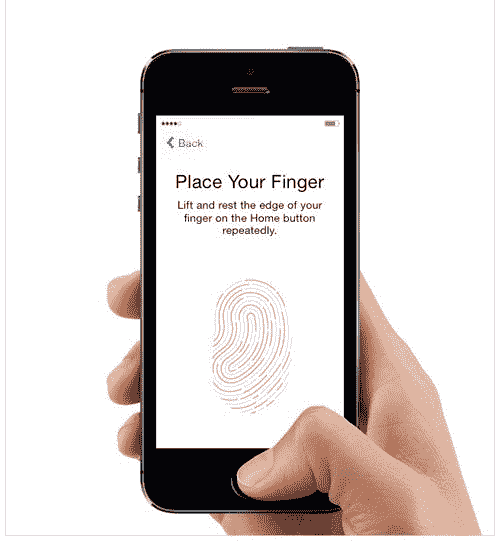
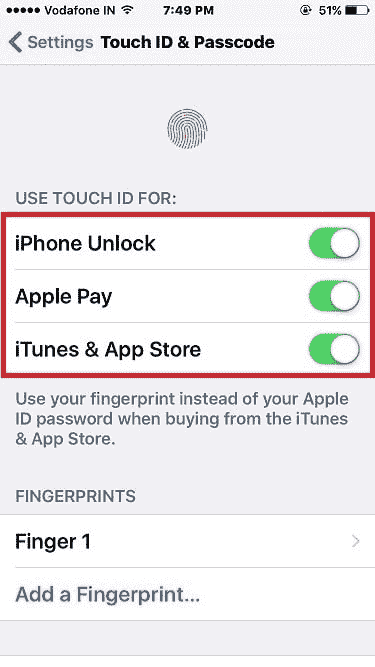
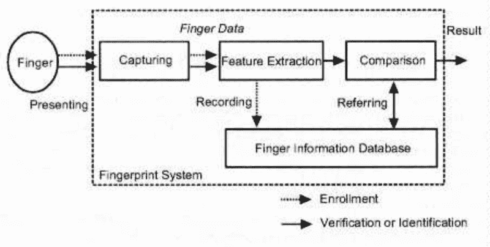
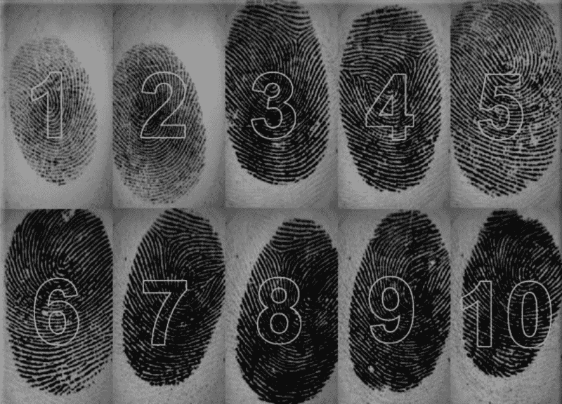
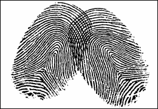

# 欺骗手机的指纹扫描仪很容易。我们应该这样解决它。

> 原文：<https://www.freecodecamp.org/news/it-is-easy-to-trick-the-mobile-phones-fingerprint-scanner-d8d7f509d128/>

Nikhil Dwivedi

# 欺骗手机的指纹扫描仪很容易。我们应该这样解决它。

上周早些时候，我在我的新 iPhone 上设置指纹传感器。就在这个时候，我的兄弟 [*@Prateek*](https://twitter.com/prateekdwv) 想出了一个测试这些移动指纹传感器的主意。

测试是在设置指纹时扫描他的手指和我的手指。你知道这些设备是如何要求你抬起手指，然后多次停留，以捕捉所有可能的角度。所以我们就这么做了——当手机希望我举起并放下我的手指时，他的手指被扫描了几次。

Image showing iPhone finger scan setup

令我惊讶的是，我们成功地骗过了电话。设置完成了，现在我们俩都可以用手指解锁手机了。这是设置的样子——只需一个手指的配置，我们俩就可以解锁手机。

iPhone Settings Page showing just one finger configured

这个想法悄悄进入我们的大脑:这是某种错误，还是什么？现在，是时候做一个有趣的练习了——在所有其他支持指纹感应的手机上尝试一下。

因此，我们开始使用各种 Android 手机，一些使用股票 ROM，另一些使用来自第三方的定制操作系统，如 Micromax、联想和小米。所有人的结果都一样。我们每个人都可以用我们的手指解锁同一部手机，而只有一个手指被设置。

### 首先，让我们了解这些移动指纹扫描仪是如何工作的

言归正传，手机指纹扫描的背后有两个热门且核心的技术。

**光学扫描仪** —这项技术使用光学图像来捕捉手指的各种图像。一种高精度相机和几个发光二极管在这里做的工作。然后，软件将这些二维图像与从扫描的手指上获取的图像进行比较。

由于这本质上只是一个被比较的图像，这些扫描仪很容易被欺骗。使用高 DPI 打印机打印的手指图像足以骗过这些类型的扫描仪。

**电容扫描仪** —这里一个电容阵列从扫描图像中捕捉图案。下面一个复杂的电路捕捉数据，并用来比较扫描的手指。

这种技术要安全得多，而且难以欺骗。手指的高清图像不能用于解锁手机。三星 Galaxy S8 手机声称使用了这一技术。

### 现在是辩论的时候了:这是对还是错？

起初，当你看到这种情况发生时，你可以看出有什么不寻常的事情正在发生。为了保证指纹扫描仪的安全，以下组件非常重要:

*   *扫描技术* —用于扫描手指并从中提取数据/模式的硬件。
*   *存储* —存储指纹数据/模式的数据库。
*   *算法* —用于存储和比较扫描的图案。

General Architecture of Mobile Fingerprint Scanner

为了整体安全，记录指纹与查询数据库进行验证一样重要。指纹的存储方式似乎存在缺陷且效率低下。

看一下上面的例子，在设置时收集的各种指纹印象被存储为一组独立的数据。当您扫描手指以解锁设备时，扫描会与设置时扫描的手指的二进制表示数组进行比较。很可能，这就是我们如何在设置时扫描另一个人的手指来欺骗手机的。

Representation — An array of fingerprints, stored at time of setup. [source](http://www.mdpi.com/1424-8220/10/5/4206/htm)

这个系统目前的运作方式似乎存在一个概念性和根本性的问题。

我不认为任何用例会导致安全漏洞。但由于基于指纹的认证的适应性正在迅速增加，其用途已经不仅仅是解锁你的设备，因此改进技术以弥合差距是有意义的。

### 那么，接下来呢？

在设置时，手指的连续扫描可以相互比较，以确保所有记录的扫描都是同一手指的。很明显，各种扫描之间存在一定比例的重叠。这样的事情会阻止 Prateek Dwivedi 在我试图设置手机时扫描他的手指。*这将保证在设置时捕获指纹的方式。*

Some overlap between two successive scans

通过不将解锁设备的扫描与仅一个预存的扫描进行比较，可以使检索更加安全。理想情况下，该扫描将与存储的表示之一进行高度比较，并且在某种程度上还将与所有其他扫描进行比较。我们不应该只依赖一个最佳匹配，而应该基于所有表示的比较来对匹配进行评分。应该考虑比较的累积百分比来进行认证。

### 结论

总之，正如我在之前的博客中指出的那样——“[生物识别&在银行移动应用中的使用](https://medium.com/@niks.dwivedi/biometric-identification-usage-in-finance-mobile-applications-11b15c8d0b88):”

生物计量认证还不够安全。最近，我们已经看到使用这些技术进行支付和金融交易的倾向和转变。手机和物联网设备的兴起增加了生物识别认证技术的适应性。现在是时候更多地考虑如何让生物识别认证技术更加安全、更难被攻破了。

*跟随我在 medium — [Nikhil Dwivedi](https://www.freecodecamp.org/news/it-is-easy-to-trick-the-mobile-phones-fingerprint-scanner-d8d7f509d128/undefined) 。*

*我的推特账号是— [@Niks_Dwivedi](https://twitter.com/Niks_Dwivedi)*