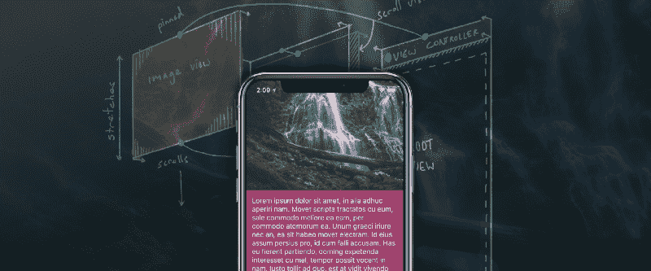
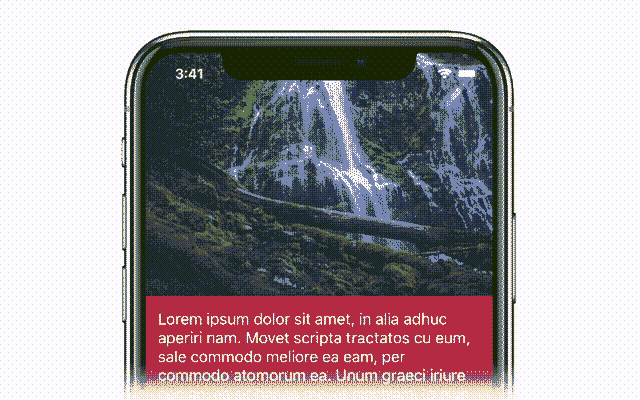
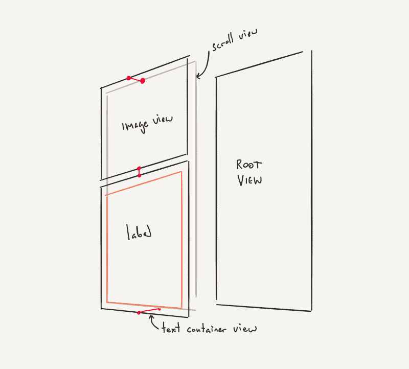
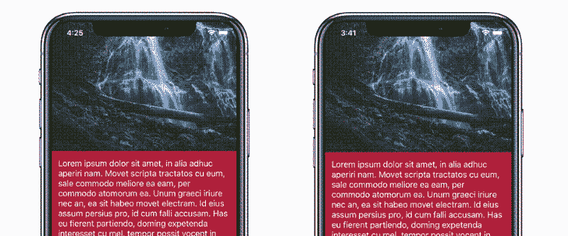
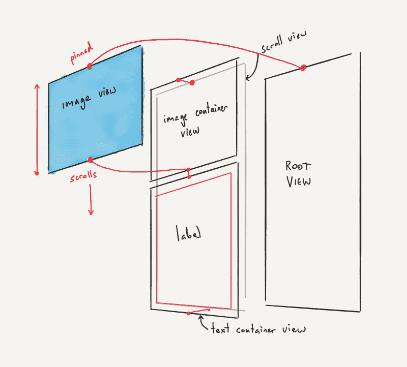
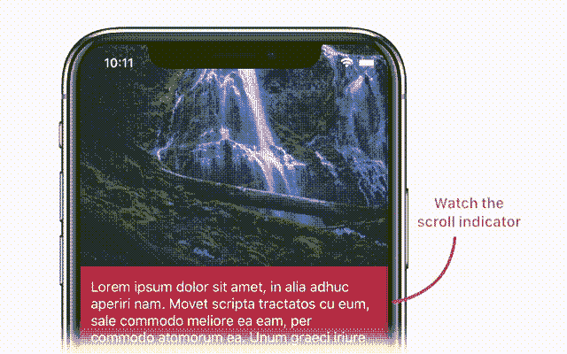
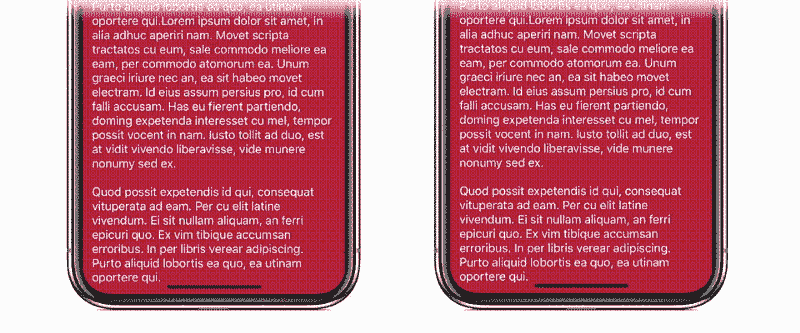
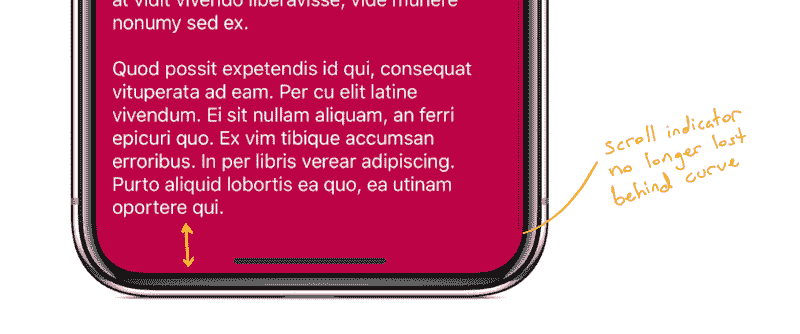
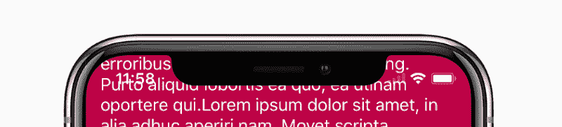
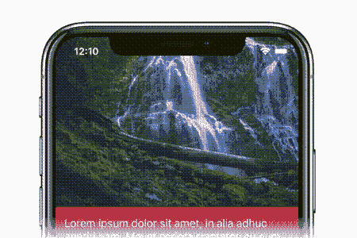

# 如何使用自动布局和 SnapKit 在 iOS 上创建漂亮的弹性布局

> 原文：<https://www.freecodecamp.org/news/tutorial-creating-stretchy-layouts-on-ios-using-auto-layout-3fa974fa5e28/>

按启用的解决方案

# 如何使用自动布局和 SnapKit 在 iOS 上创建漂亮的弹性布局



查看下图。这是一个很酷的效果。

而且在 iOS 中使用自动布局真的很容易构建。我想写这个，因为效果是如此简单。自动布局使它的实现如此优雅，我想你应该知道它。



如果你想跟着做，你可以在我们的起点复制 [demo projec](https://github.com/TwoLivesLeft/StretchyLayout/tree/Step-1) t，并在你阅读时实现效果。你将需要 Xcode 9，因为在这个例子中，我们将在 iOS 11 上全押。

```
git clone https://github.com/TwoLivesLeft/StretchyLayout.gitcd StretchyLayoutgit checkout Step-1
```

我们将这样做:

*   从基本的无弹性应用开始
*   修改视图层次结构，为
    添加必要的约束，使其具有弹性
*   为应用程序添加润饰

### 非弹性应用程序

这是应用程序基本版本的视图层次结构。你可以看到它有三个主要视图。有一个头`UIImageView`，它是文本的容器，还有一个长的`UILabel`，包含我们的文本内容。亮红线代表我们的自动布局约束。还有一个`UIScrollView`和我们的视图控制器的根视图。



我们将使用名为 [SnapKit](http://snapkit.io) 的自动布局框架来构建它。SnapKit 是一个简单的 iOS 框架，让苹果的自动布局 API…sane。它使用起来非常简单，并且让使用自动布局编程变得非常愉快。

大部分代码将存在于我们的`StretchyViewController` 类的`viewDidLoad`中。下面你可以看到初始约束是如何设置的。

我们的观点被宣布为私人成员:

```
private let scrollView = UIScrollView()private let infoText = UILabel()private let imageView = UIImageView()
```

我们的视图控制器的视图有一个滚动视图作为它的第一个子视图，后面是文本和图像视图。它还有一个背景视图，为我们提供文本背后的红色背景。

```
//Pin the edges of the scroll view to// our view controller’s viewscrollView.snp.makeConstraints { make in
```

```
make.edges.equalTo(view)}
```

```
//Pin the top of our image view to the scroll view// pin the left and right to the view controller’s view// give it an aspect ratio constraint by constraining// its height to its width with a multiplierimageView.snp.makeConstraints { make in
```

```
make.top.equalTo(scrollView) make.left.right.equalTo(view) make.height.equalTo(imageView.snp.width).multipliedBy(0.7)}
```

```
//Pin the backing view below the image view and to the// bottom of the scroll viewtextContainer.snp.makeConstraints { make in
```

```
make.top.equalTo(imageView.snp.bottom) make.left.right.equalTo(view) make.bottom.equalTo(scrollView)}
```

```
//Pin the edges of the text to the text container view, this// will force the text container to grow to encompass the// text’s heightinfoText.snp.makeConstraints { make in
```

```
make.edges.equalTo(textContainer).inset(14)}
```

**注意:**要获得此时的代码，请执行`git checkout Step-1`

### 简短的旁白

上面我们用的是 SnapKit。SnapKit 很棒——所以这里有一个关于它如何工作的初级读本。

您可以在任何一个`UIView`上访问`snp`成员对象。

您调用接受闭包的`makeConstraints`，闭包被赋予一个`ConstraintMaker`对象(这里称为`make`)。

然后使用`make`对象将一个视图的边缘或锚点固定到任何其他视图、布局指南或常量。

```
myView.snp.makeConstraints { make in
```

```
make.edges.equalTo(view)}
```

这将把`myView`的边缘固定到`view`的边缘。

可读性强，简洁明了。用这个代替默认的自动布局 API *。*

### 使它有弹性

那么我们如何从这个(没有弹性)到这个(有弹性)？



对于拉伸效果来说，重要的是自动布局将解决约束
,而不管你的视图是兄弟还是层次中的其他位置。只不过他们有共同的祖先。

但是这里有一个关键元素:滚动视图中的视图可以被限制为滚动视图之外的视图。这就是我们的工作方式。



在上图中，亮红线代表我们的约束。请注意图像视图的顶部现在是如何一直固定在根视图的顶部——在滚动视图
之外。但是它的底部固定在图像容器视图的底部，也就是滚动视图中的**T2。这意味着
当滚动视图滚动时，我们的图像视图将拉伸以满足其约束。**

因此，第一步，我们将用一个空的容器视图替换我们的`UIImageView`。

```
let imageContainer = UIView()imageContainer.backgroundColor = .darkGrayscrollView.addSubview(imageContainer)
```

```
imageContainer.snp.makeConstraints { make in
```

```
make.top.equalTo(scrollView) make.left.right.equalTo(view) make.height.equalTo(imageContainer.snp.width).multipliedBy(0.7)}
```

然后，我们将添加图像视图作为滚动视图的子视图。但是我们将把它的顶部边缘固定到我们的**视图的**顶部边缘——而不是我们的滚动视图的顶部。我们刚刚在上面添加的容器被固定在我们的滚动视图的顶部边缘。

```
scrollView.addSubview(imageView)
```

```
imageView.snp.makeConstraints { make in
```

```
make.left.right.equalTo(imageContainer)
```

```
//** These are the key lines! ** make.top.equalTo(view) make.bottom.equalTo(imageContainer.snp.bottom)}
```

上面你可以看到使这个工作的线。我们的图像容器视图
精确地显示了原始的非伸缩应用程序的滚动方式。但是我们已经在容器上方添加了实际的图像视图。我们将它的底部
固定到容器底部，而它的顶部**固定到视图控制器的视图。**

这意味着当你在滚动视图中向下拖动时，图像的顶部
“粘”在屏幕的顶部，整个图像变得更大。
因为我们使用了`imageView.contentMode = .scaleAspectFill`，当我们过度滚动滚动视图时，我们将看到图像内容在图像视图中放大。

**注意**:要获得此时的代码，请执行`git checkout Step-2`

#### 但是有一个错误

如果运行这段代码，用手指在屏幕上向下拖动会产生预期的效果:图像放大并反弹回来。但是如果你向上滚动
阅读文本…好吧，你会意识到你不能。



为什么？

因为当我们向上滚动时，我们正在将`UIImageView`压缩成一条
零高度线。它的顶部**必须**等于视图的顶部，它的底部**必须**等于文本背景视图的顶部。因此，这意味着滚动视图将继续“滚动”，但我们不会看到变化。这是因为背景视图与图像视图相冲突，图像视图拒绝移动到根视图的上方，尽管滚动视图在滚动。

自动布局在技术上解决了我们的约束，但不是我们想要的。

#### 修复 bug

我们必须改变约束图像视图的方式。这是变化:

```
imageView.snp.makeConstraints { make in
```

```
make.left.right.equalTo(imageContainer)
```

```
//** Note the priorities make.top.equalTo(view).priority(.high)
```

```
//** We add a height constraint too make.height.greaterThanOrEqualTo(imageContainer.snp.height).priority(.required)
```

```
//** And keep the bottom constraint make.bottom.equalTo(imageContainer.snp.bottom)}
```

注意我们现在有一个顶部约束，一个底部约束，**和** 一个高度
约束？这是关于自动布局的一个令人敬畏的事情:我们可以有
冲突的约束，它们将按优先级顺序被打破。这是达到我们想要的效果所必需的。

首先，我们保持原来的约束。我们图像视图的顶部被固定到我们视图的顶部。我们给它一个优先级`.high`。

然后我们添加一个额外的约束:我们的图像的高度必须大于或等于它后面的图像容器的高度(回想一下我们的图像容器有纵横比约束)。这有一个`.required`优先权。

那么当我们向上滚动时会发生什么呢？

嗯，图像**不能**变小。我们的高度约束比顶部约束有更高的优先级
。因此，当我们向上滚动时，自动布局将打破
最低优先级约束，以解决系统问题。这将打破顶部的
约束，我们的滚动行为将恢复正常。这允许我们
向上滚动并阅读文本。

注意，在这个实例中，您也可以删除高度约束，只需将顶部约束优先级设置为`.high`。这将允许 iOS 打破顶部约束**和**压缩图像视图到零高度。给定
`.scaleAspectFill`内容模式，这就产生了类似视差的效果。试试看。你可能更喜欢它的样子。

**注意**:要获得此时的代码，请执行`git checkout Step-3`

### 润饰细节

我们在这里的时候，有三个不和谐的问题需要解决。

#### 1.文本过度滚动

如果我们过度滚动视图的底部，我们会看到视图控制器丑陋的灰色背景。当我们过度滚动视图底部时，我们可以使用完全相同的方法来扩展我们的背景视图。



我不会深入研究代码，因为它与上面的图像视图基本上是相同的技术。我们在文本容器后面添加了一个额外的文本背景视图，然后将其底边固定到根视图的底边。

**注意**:要获得此时的代码，请执行`git checkout Step-4`

#### 2.尊重安全区

在 iPhone X 上，我们的文本与主屏幕指示器重叠。我们禁用了滚动视图的自动内容插入调整，以便让我们的图像内容直接显示在屏幕顶部。所以我们必须使用 iOS 11 中新的`safeAreaInsets`属性来手动处理底部插图。

我们还想使用`safeAreaInsets`来调整滚动视图的滚动指示器。这样它们就不会碰到 iPhone X 上屏幕的弧形边缘。

为了解决这两个问题，我们将覆盖`viewDidLayoutSubviews`并手动设置滚动视图的底部插图。iOS 11 通常会自动为我们做到这一点，但我们不想嵌入顶部。我们希望我们的标题图像在状态栏的后面。

我们已经告诉 iOS 11 不要触摸我们的滚动视图，将它的
`contentInsetAdjustmentBehavior`设置为`.never`。

```
override func viewDidLayoutSubviews() { super.viewDidLayoutSubviews()
```

```
//** We want the scroll indicators to use all safe area insets scrollView.scrollIndicatorInsets = view.safeAreaInsets
```

```
//** But we want the actual content inset to just respect the bottom safe inset scrollView.contentInset = UIEdgeInsets(top: 0, left: 0, bottom: view.safeAreaInsets.bottom, right: 0)}
```

当一直滚动到末尾时，我们会看到下面的外观。
注意，滚动指示器不再消失在曲线后面，我们在起始指示器上方获得了
更多的空间。



**注意**:要获得此时的代码，请执行`git checkout Step-5`

#### 3.需要时隐藏状态栏

当我们向上滚动时，我们的文本与状态栏重叠。这看起来很恶心。



当用户将文本滚动到状态栏区域时，让我们用一个很酷的动画隐藏状态栏。这个挺容易察觉的，我觉得效果看起来很棒。



我们如何做到这一点？

*   我们将`textContainer`的矩形转换成屏幕坐标。
*   我们检查该帧的最小值 Y 是否小于视图的顶部安全区域插图。这表明文本容器正在移入状态栏区域。
*   如果是这样，我们隐藏状态栏。如果没有，我们显示状态栏。

我们在
`UIScrollViewDelegate`的`scrollViewDidScroll(_:)`方法中执行这个检查。所以我们让我们的`StretchyViewController`实现这个委托，并将自己设置为滚动视图的委托。

下面是状态栏检查的代码:

```
//MARK: — Scroll View Delegate
```

```
private var previousStatusBarHidden = false
```

```
func scrollViewDidScroll(_ scrollView: UIScrollView) { //** We keep the previous status bar hidden state so that // we’re not triggering an implicit animation block for every frame // in which the scroll view scrolls if previousStatusBarHidden != shouldHideStatusBar {
```

```
UIView.animate(withDuration: 0.2, animations: { self.setNeedsStatusBarAppearanceUpdate() })
```

```
previousStatusBarHidden = shouldHideStatusBar }}
```

```
//MARK: — Status Bar Appearance
```

```
override var preferredStatusBarUpdateAnimation: UIStatusBarAnimation { //** We use the slide animation because it works well with scrolling return .slide}
```

```
override var prefersStatusBarHidden: Bool { return shouldHideStatusBar}
```

```
private var shouldHideStatusBar: Bool { //** Here’s where we calculate if our text container // is going to hit the top safe area let frame = textContainer.convert(textContainer.bounds, to: nil) return frame.minY < view.safeAreaInsets.top}
```

**注意**:要获得此时的代码，请执行`git checkout Step-6`

### 我们讨论过的内容

*   你可以把几乎任何东西都钉在其他东西上，你的观点会满足你的约束。
*   即使你在滚动，这也会起作用。
*   约束按优先级顺序被打破，所以不要害怕用冲突的约束来试验
    。
*   Use SnapKit!

西蒙·桑斯领导[使](http://enabled.com.au)的移动开发活动非常注重设计和人机交互。Simeon 还被要求会见客户，了解他们的需求并开发技术解决方案。
在推特[上关注西蒙](https://twitter.com/TwoLivesLeft)

#### 还有问题吗？给我们发推文 [@EnabledHQ](https://twitter.com/EnabledHQ)