# 我喜欢 Vim 的原因:它鲜为人知的特性让它如此神奇

> 原文：<https://www.freecodecamp.org/news/learn-linux-vim-basic-features-19134461ab85/>

作者:阿米特·库尔卡尼

自从我在 2016 年开始使用 Vim 以来，我发现了 Vim 在没有任何插件的情况下提供的几个鲜为人知的功能。

#### 在你开始漫谈这些新东西之前，你能讲一些基本知识吗？

哦当然！在我从备忘单中复制粘贴一些命令之前，我要做一个大胆的假设:如果您想要一个备忘单，并且已经了解 Vim 基础知识，您就不会阅读本文。

您可能刚刚听说 Linux 发行版附带了一个名为 Vim，的默认命令行文本编辑器，您可能想尝试一下。

所以，让我们假设你对这个游戏完全陌生，从我们需要的基础开始(没有历史/无聊的理论)。

> 注:如果你知道基础知识，[点击这里滚动浏览](#9b6b)

#### 与 Vim 上的许多其他文章相比，你在这里做了什么？

大多数关于 Vim 的介绍文章都是从 Vim 的模式、插入、保存和退出开始的。如果你真的处于理论完美的学习模式中，请随意阅读 [wikibooks](https://en.wikibooks.org/wiki/Learning_the_vi_Editor/Vim/Modes) 中任何有帮助的内容。

也有一些很棒的书籍和文章告诉你，在 Vim 的工作方式背后有一种哲学，VI/Vim 中的命令是要组合在一起的。绝对正确，我相信一旦你习惯了这个编辑器和它所提供的功能，你会喜欢它的。

#### 我听说过有趣的故事，也看到过有趣的关于 Vim 学习曲线的图片。这是真的吗？有那么糟糕吗？

嗯，仇恨者会恨吗？然而，根据我的看法，在某种程度上给出了 Vim 的适当表示的图像是:

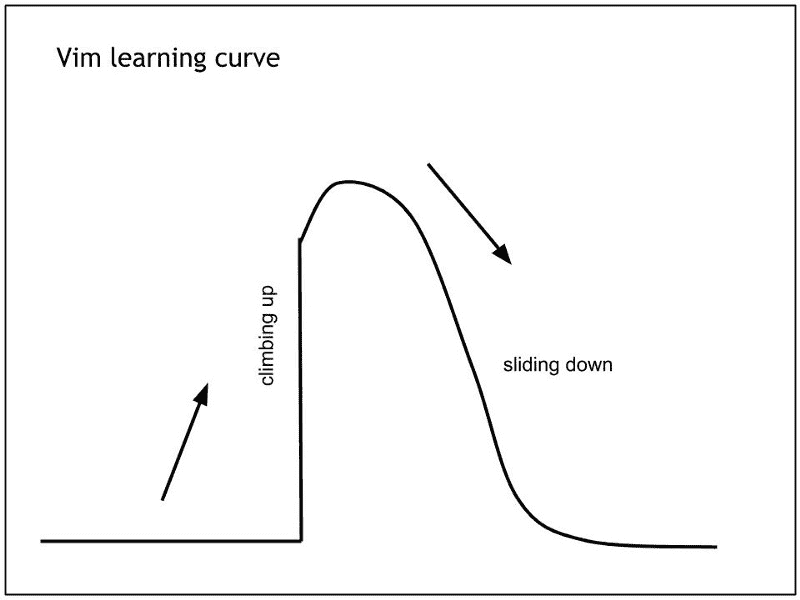

Courtesy: [https://pascalprecht.github.io/2014/03/18/why-i-use-vim/](https://pascalprecht.github.io/2014/03/18/why-i-use-vim/)

Vim 上的大部分文章都把学习曲线称为学习墙，但是也有一些积极的东西:看看墙的另一面！

对于初学者来说，这简直就是一堵墙，因为他们以前从未在命令行上使用过这样的编辑器。当我作为初学者开始学习时，最吸引我的是 Vim 的普遍性。

从任何终端登录到任何(非 windows)机器，闭上眼睛输入*vi*就可以得到一个编辑器。编辑会出现在你面前！

另一件吸引我的事情是不用鼠标工作的能力，不用在触摸板上浪费任何生产时间，也不用为笔记本电脑买鼠标。

我知道，我知道，我能听到你们中的一些人在喊“Emacs！Emacs！”我明白了。但是一旦我迷上了 Vim，我就对 emacs 不感兴趣了(可能是因为需要安装)。所以，我想 emacs 也很棒。在您开始与 VI(m)一起开始这个美丽的旅程之前，请随意跳槽。

#### 我只是打开我的终端，键入 **vi** ，然后按回车键。我只看到一个欢迎屏幕。我不会打字，也不知道怎么摆脱。你确定它是一个功能强大的编辑器吗？

百分百确定。你刚才看到的行为就是我们之前看到的那堵墙。相信我，VI(m)可以做很多其他的事情。它只是有自己的使用方式。你可以编辑文件，打开标签，水平或垂直分割屏幕，浏览文件系统，运行 linux 命令而不离开你的文件，触发从你的源代码建立而不退出文件，书签目录，甚至更好:文件的书签行，查找和替换单词，当然复制粘贴等等。

#### 耶！好像编辑支持这些是件大事。咩！每个人都这样做。有什么大不了的？

没什么大不了的，我看到的唯一的好处是不用离开键盘就能专注于你的文件/代码。真的，如果你不介意使用鼠标，那就打开你的 MS word/GUI 编辑器，做所有你想做的编辑。

#### 很公平。但是，说真的，为什么不为某些工作开发一个 IDE 呢？

好吧，那么你是一名开发人员，并且对 IDE 有所喜爱。不，VI(m)不能取代你闪亮的 IDE。VI(m)不具备 IDE 现成的强大功能。与庞大的 ide 相比，VI(m)的尺寸很小(打包和安装),不需要任何配置和安装就可以使用。说真的，VI(m)比不上你的 IDE 提供的一些很棒的东西。

#### 说够了，给我看看基本的？

当然，在开始之前，请记住，任何 Vim 用户都必须处理命令模式和插入模式。没有转义(字面意思，不是 Esc 键)。

假设你正在使用某个编辑器，你想删除 C 语言中的一个长函数。你要做的简单步骤是:将光标放在行首，然后按 Shift +向下箭头直到行尾或使用鼠标。你选择这些行的动作需要你停止打字并按键。不是吗？不要告诉我你在输入一些东西的同时按下键来神奇地选择你的函数体。

> 讲道理。您暂停了键入，并进行选择工作，以告诉您的编辑您想要对该文本进行操作(复制/剪切/粗体/斜体/任何内容)。

这种停顿相当于 VI(m)中的命令模式。这是你告诉 VI(m)你想在一些行/词/任何东西上做一些动作而你不打算打字的时候。现在，VI(m)将您从插入模式中抛出，并且您被锁定不能在文件中键入文本。显然，另一种可以实际输入文件的模式是插入模式。

顺便说一句，如果你想知道如何在不选择文本或使用鼠标的情况下选择函数体，我可以通过将光标放在左括号上并使用按键来完成

是的，这将删除函数体的内容。不，那不是什么要记住的令人毛骨悚然的组合键！`d`表示你想删除一些东西。`%`将光标移动到匹配括号的末尾。

现在，我们已经建立了基本的模式，让我们深入到基本的 VI(m)中。

如果您知道正在编写的文件的名称:

```
$ vi myfile.c
```

如果您不确定文件名并想开始键入:

```
$ vi
```

一旦打开 vi，您将处于命令模式。要进入**I**n 插入模式，按`i`。想打什么就打什么。按下`Esc`返回命令模式。现在，根据您打开 vi 的方式，您有几个退出选项。

如果你给了一个文件名:`:w`会不会**将这些更改安全地写入磁盘。`:q`将 **q** 召唤编辑。你可以用`:wq`和`Return`键组合这些动作**

如果你没有给出文件名:`:wq filename.c`将会把内容写到文件`filename.c`中，然后**问**编辑器。如果你对你写的文字不感兴趣，并希望不保存任何东西就退出:`:q!`你就出局了！最后需要`!`来说:“是的，我确定我不想保存内容，我想紧急离开”

[**【DEMO】基本 vim 用法**](https://asciinema.org/a/wLpVX8lUuaK5mfG4tyVCk61qD)
[*启动 vim 编辑器:在 shell 上使用 vim 命令开始编辑一个使用 vim 的文件，使用:vim 文件名*asciinema.org](https://asciinema.org/a/wLpVX8lUuaK5mfG4tyVCk61qD)

这就对了。您刚刚创建、编辑并保存了(也可能没有)您的第一个 vi 文件。恭喜？

正如我前面提到的，这不是一个 VI(m)的初学者入门。还有大量其他文章(我会在文章末尾提供参考)可供参考。我只是插入了那个介绍，这样你就不会在登陆这个页面后发现没什么可学的时候感到失望？

> 这是初学者向中级用户告别的地方，也是他们阅读更多精彩介绍文章的参考部分。

欢迎中级用户。这些是我以前不知道的 VI(m)的一些很酷的功能。但是现在我每天都用它们来提高效率。

对于喜欢 TL 的人来说；博士:

*   选项卡-页面
*   会议
*   行号(+标记)和复制/粘贴
*   折叠
*   用`=`缩进
*   插入-完成
*   netrw
*   拆分/窗口
*   `:!`还有一点关于`:make`

#### Vim 选项卡-页面

#### 你在 Vim 中提到标签了吗？我不知道有这种东西！

我知道，对！一个[标签页](http://vimdoc.sourceforge.net/htmldoc/tabpage.html#tab-page-intro)是一个有一个或多个窗口的页面，在顶部有一个标签(又名标签)。

如果您有兴趣了解更多关于窗口、缓冲区、标签页的信息:[技术细节](http://vimdoc.sourceforge.net/htmldoc/windows.html#windows-intro)

看一看:

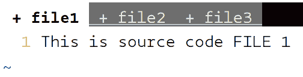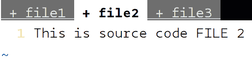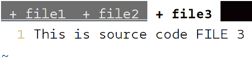

Vim tabs in action

步骤:

*   用任何文件打开 Vim 或只打开 Vim: `$ vim file1`
*   输入文件内容并进入命令模式(按`Esc`)
*   `:tabedit file2`，会打开一个新的标签页，带你去编辑`file2`
*   `:tabedit file3`，会打开一个新的标签页，带你去编辑`file3`
*   要在这些选项卡之间导航，您可以在正常模式下键入:`gt`或`gT`分别转到下一个选项卡或上一个选项卡。您也可以使用`{i}gt`导航到特定的索引标签(从 1 开始索引)，其中 I 是您的标签的索引。示例:`2gt`带您到第二个选项卡
*   要直接移动到第一个标签页或最后一个标签页，可以在命令模式下输入:`:tabfirst`或`:tablast`分别用于第一个或最后一个标签页。前后移动:`:tabn`为下一页，`:tabp`为上一页
*   您可以使用`:tabs`列出所有打开的标签
*   在标签页中打开多个文件:`$ vim -p source.c source.h`
*   关闭单个标签页:`:tabclose`，关闭除当前标签页之外的所有标签页:`:tabonly`。使用后缀`!`覆盖未保存文件的更改

VIM 中的 [**【演示】标签**](https://asciinema.org/a/ZMUyM27ZTc04yctzH7S9JyNLo)
[*VIM 支持标签打开多个文件并使用它们*asciinema.org](https://asciinema.org/a/ZMUyM27ZTc04yctzH7S9JyNLo)

我认为这个功能通过共享选项卡之间的缓冲区，使我们能够在选项卡之间复制粘贴，并为工作类别保留不同选项卡集的多个会话，从而使我们能够有效地节省时间。示例:您可以有一个包含源代码 C 文件的所有 Vim 标签的终端标签，也可以有另一个包含头文件的所有 Vim 标签的终端标签。h)。

#### 标签页提供了如此多的便利，让我可以随时打开和访问所有的文件。但是，每次重启或者关闭打开终端都要打开所有标签页不是很痛苦吗？

对！我们都喜欢有自己的工作会话，在会话中我们处理一组文件，并且希望 Vim 恢复我们离开时的选项卡会话。Vim 允许我们保存和恢复这些选项卡会话！✋

步骤:

*   打开您想要使用的任意数量的选项卡
*   在任何标签上，按`Esc`进入命令模式
*   键入`:mksession header-files-work.vim`并按回车键
*   您当前会话中打开的标签页将被保存在一个文件`header-files-work.vim`中
*   要查看运行中的恢复，请关闭所有选项卡和 Vim
*   要么使用:`$ vim -S header-files-work.vim`在您的会话中启动 vim，要么使用任何其他文件打开 vim，并进入命令模式，键入:`:source header-files-work.vim`和 BOOM！您所有的标签页都会像您保存时一样打开！
*   如果您更改了任何会话标签(关闭/打开新标签)，您可以在会话中使用:`:mks!`将其保存

VIM 中的 [**【演示】会话**](https://asciinema.org/a/NLn3NjxfBavV4mnURQWF2GlUg)
[*VIM 允许用户根据他们正在处理的项目分别存储他们的工作会话。用户可以轻松……*asciinema.org](https://asciinema.org/a/NLn3NjxfBavV4mnURQWF2GlUg)

#### 我可以不知道行号就复制/剪切粘贴吗？

哦是的！之前我经常看到我想要复制/剪切的函数的行号(`:set nu`)。假设我想复制/剪切第 34 行到第 65 行。我用了`:34,65y` (Copy/ **Y** ank)或者`:34,65d` (Cut/ **D** elete)。

> 当然，计算行数并使用`{n}yy`或`{n}dd`(其中`n`是行数)对于数百行来说不是一个选项？

有些函数可能会跨越多个页面，您不希望在往下看的时候忘记第一行的数字。有一个简单的方法可以做到这一点，而不用担心行号！

步骤:

*   进入正常模式，转到起始行
*   键入`mk`(用字母‘k’或任何其他字母标记点)
*   向下移动(向下翻页或其他方式)并移动到最后一行
*   是否将 **y** ank/copy 所有的行从头到尾
*   `d'k`将从开始到结束剪切/ **d** 删除所有行

#### 我的文件顶部有一些烦人的长函数，我不想浪费时间滚动或跳转到行。这可能是一个很大的要求，因为这不是一个 IDE，但是，我们是否可以折叠代码块？

绝对的！假设你想跳过记住那些行号，带着你新找到的爱走来走去。转到函数体的开头，键入`mb`。现在，只需使用`%`(括号匹配)或任何其他方便的技术转到函数体的末尾，然后按下`zf'b`，就大功告成了！

之前和之后:

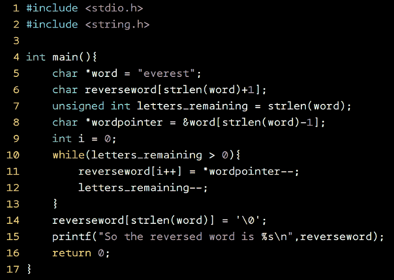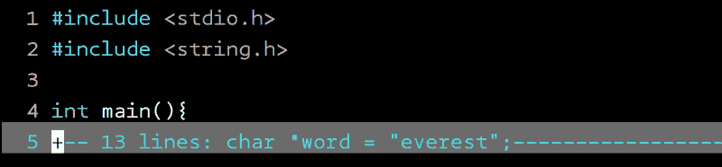

Before-After

如果你习惯使用行号，这个命令甚至更容易记住:`:5,16fo` (fo 代表代码 **fo** ld)。一旦你折叠了你的代码，使用`zo`(打开代码折叠)和`zc`(关闭代码折叠)可以很容易地在打开和关闭视图之间切换。不要强调太多。只需使用`za`在打开和关闭折叠之间切换？

假设你花了相当多的时间在一个大文件中折叠你的函数，你显然想在每次打开那个文件时保留这些折叠，对吗？(如果不是，你干嘛浪费精力去折叠它们！？)，所以您的`~/.vimrc`中就有解决方案。在`~/.vimrc`中插入以下行，您的代码折叠将被保存和恢复:

```
autocmd BufWinLeave *.* mkview
autocmd BufWinEnter *.* silent loadview
```

#### 我通常很小心我的缩进，但有时，我不得不编辑一些其他白痴的源代码，这让我无法编辑没有缩进的他/她的代码。有什么神奇的击键方法可以做到这一点吗？

当然可以！简单到:`=i{`。真的就这些了！( ***我*** 是[内心的对象](http://vimdoc.sourceforge.net/htmldoc/motion.html#text-objects))

[**【演示】VIM 中的缩进**](https://asciinema.org/a/34MuR5ZxuRTWNmSZBuce1mwRK)
[*VIM 允许通过几次击键来缩进代码块。你所要做的就是把光标放在……*asciinema.org](https://asciinema.org/a/34MuR5ZxuRTWNmSZBuce1mwRK)的一个块中

之前-之后:

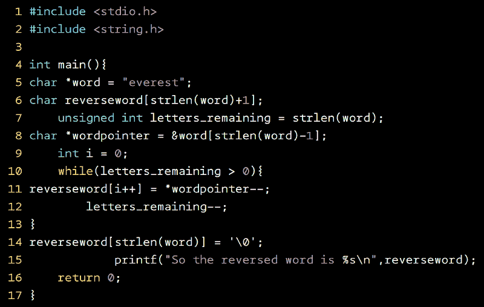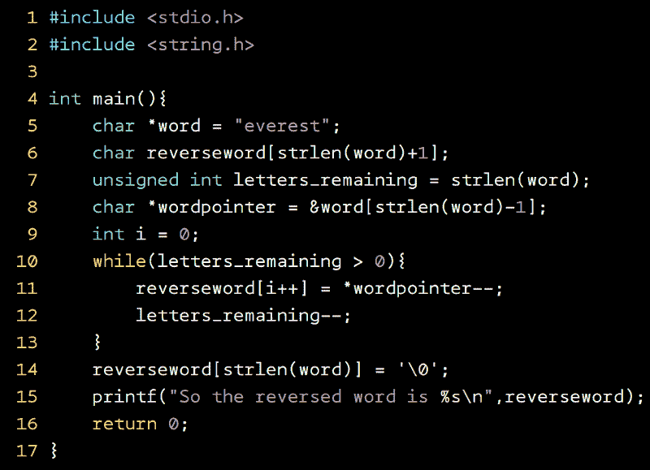

Before-After

你所要做的就是把光标放在你想要缩进的块内的任何地方，按`Esc`进入正常模式，然后:`=i{`。嘣！整个函数体(包括内部块)都是缩进的。

> 注意:不要期望你的 python 文件缩进？。只有当 Vim 可以使用左括号和右括号识别开始和结束时，它才起作用)

您也可以使用`>`增加/减少块内的缩进；`nd` I {增加一个< i{在正常模式下减少。

#### 我可能在做梦，但是(*颤抖的声音*)，我的意思是我只是想试一试，嗯，我可能在这个问题上做得太过了，但是(*5 秒钟停顿*)..没关系，让我们进入下一个问题

Vim 非常乐于接受批评或面对它不是 IDE 的事实，来吧，让我们看看你有什么。

#### 嗯，不好意思，但是如果有任何插件或者什么的话，vim 有像 IDE 一样的自动完成功能吗？

？你可能会感到惊讶，但的确如此！？你猜怎么着…
*鼓形面包*
*鼓形面包*
*鼓形面包*
*鼓形面包*

**不带插件！**

你没听错！Vim 向您显示选项的唯一条件是“Vim 应该知道您在说什么。”它可以通过包含的源文件或定义的函数或变量。

你所要做的就是开始打字，然后在插入模式下按`Ctrl+n`。

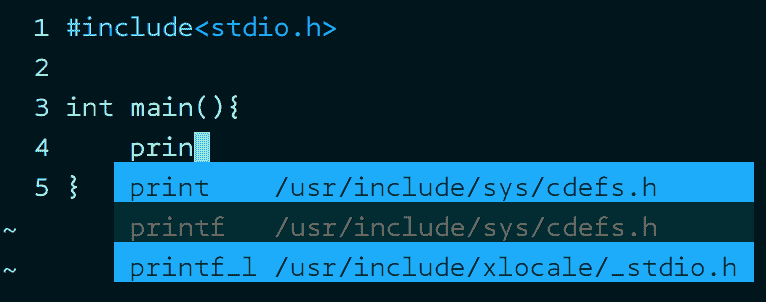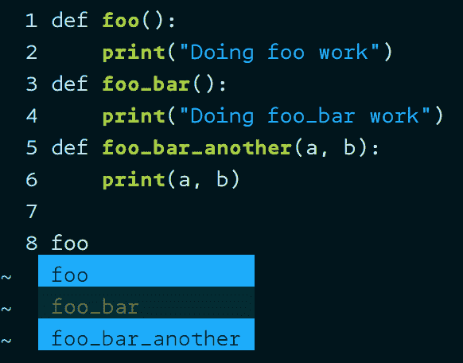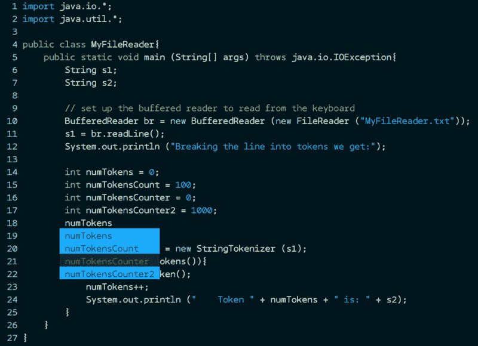

Examples in C, Python and Java

想象一下它的用途！特别是如果你正在写 C 代码，并且你不能回忆起确切的 OpenSSL 库调用，你所要做的就是包含头文件！

[**【演示】VIM 中的自动完成特性**](https://asciinema.org/a/NXJIU6fNkCz2Lk2uKYBhcv5Fi)
[*如果包含了适当的头文件或者……*asciinema.org](https://asciinema.org/a/NXJIU6fNkCz2Lk2uKYBhcv5Fi)，VIM 会自动完成关键字、函数名的建议

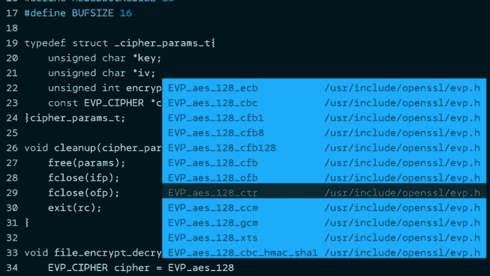

Vim auto-complete helping with OpenSSL functions

我再提醒一下:不需要插件？

> 注意:头文件可能在 Mac 上的其他位置，Vim 可能找不到它们。我只是用一台 Mac 登录到一台 linux 机器上。所以，如果你用的是 Mac，很抱歉。

#### 我知道 Vim 只是一个文本编辑器，但是如果你想让我在工作的时候不要失去焦点，不要时不时地退出 Vim，如果我记不住所有的文件名，我有什么选择呢？

简单，用 VIM 提供的文件浏览器？是的，Vim 提供了一个简单的文件浏览器(*没有任何插件*)。只要在任何 Vim 窗口输入::`Explore` ，你就会看到一个易于导航的文件浏览器，可以使用⬆️和⬇️箭头键来导航。按 E `nter/Return` 键打开一个文件/目录。使用:`q` 退出浏览器 a **nd v** im。如果您不想退出 vim 并继续使用打开的文件，您有 3 个选择:

1.  以水平(`:Sexplore`)或垂直(`:Vexplore`)分割方式打开浏览器，并使用`:q`退出浏览器
2.  使用`:Texplore`在另一个[标签页](http://vimdoc.sourceforge.net/htmldoc/tabpage.html)中打开浏览器，使用`:q`退出
3.  在当前窗口中打开文件浏览器，然后卸载当前缓冲区，并使用`:bdel`(缓冲区删除)将其从缓冲区列表中删除。

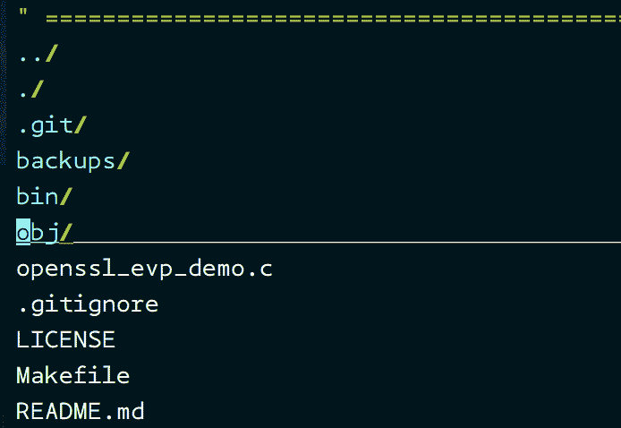

:Explore from any vim window shows the file explorer

> 注意:你也可以使用简短的命令`:Ex`来打开文件浏览器

#### 有时我不得不在一些行上重复同样的步骤来编辑一些东西。我很确定 Vim 会有一些特性让我能够做到这一点。我说的对吗？

百分之百正确！你说的是宏，Vim 支持宏。重复上一次执行的命令很简单，可以完成简单的重复性任务。但是，如果文本处理是由几个步骤组成的，那么宏就派上了用场。

考虑一个 C 头文件的例子:

```
void encrypt_text(char *text, int bytes)
void decrypt_text(char *text, int bytes)
void process_text(char *text, int bytes)
void another_important_function(int bytes, double precision)
```

哎呀！你忘了在每一行的末尾加一个分号，而且你刚刚意识到所有这些函数都返回一个整数错误代码而不是 void。

在一行中进行更改需要执行的步骤是:

*   将光标放在单词`void`的开头
*   在正常模式下按下`cw`键，删除单词`void`并键入`int`
*   按下`Esc`，使用`Shift+a`插入`;`移动到行尾
*   按`Esc`和`^`回到编辑行的开头

导致:

```
int encrypt_text(char *text, int bytes);
void decrypt_text(char *text, int bytes)
void process_text(char *text, int bytes)
void another_important_function(int bytes, double precision)
```

你可以只记录这一系列的步骤，并在所有 4 行上重放。

你所要做的就是，在开始序列之前，通过在正常模式下按下`qa`开始记录任何字母表(假设为`a`)中的宏。现在你的脚步正在被记录在`a`里。完成所有步骤后，在正常模式下按`q`即可。这将结束录制。要重放这些步骤，只需将光标保持在执行宏时的位置。按下`@a`，我们就完成了！嘣！Vim 将在那一行为您重复相同的步骤！要在多行上重复，也可以在使用一次`@a`命令后使用`@@`

#### 我知道 Vim 离 IDE 还很远，我可能有一些不合理的希望，但是有一个小问题:用 Vim 可以远程编辑文件吗？

如果你考虑可用的资源:
[1] Vim
[2] openssh-client(随大多数 Linux 版本一起安装)

你很幸运，我的朋友！是的，Vim 支持文件的远程编辑？Vim 只是利用 openssh-client 提供的 scp(安全复制)建立的安全连接。有时候你在多台远程机器上处理文件，仅仅为了编辑一个文件而登录一台机器是浪费时间！如果您知道您的远程机器凭证和路径，那么您可以在您当前的机器上放松。

```
vim scp://remoteuser@remote_IP_or_hostname/relative/path/of/file
```

例如:我需要在 10.0.18.12 编辑一个存储在`/home/dev-john/project/src/main.c`中的文件，并且我有`dev-john`的登录凭证，我可以使用以下方式访问`main.c`:

```
$ vim scp://dev-john@10.0.18.12/project/src/main.c
```

我可以使用相对路径，因为我可以从`dev-john`的主目录开始查找文件

提示:如果您经常访问远程机器，您可以创建一个 ssh 配置文件来创建连接的快捷方式。使用以下内容创建文件`~/.ssh/config`

```
Host remote-dev-machine
    Hostname 10.0.18.12
    User dev-john
    IdentityFile ~/.ssh/id_rsa
```

现在，您可以使用以下方式访问您的文件:

```
$ vim scp://remote-dev-machine/project/src/main.c
```

如果相对路径很难记忆并且不直观，您也可以用另一种方法来指定它:

```
$ vim scp://remote-dev-machine/~dev-john/project/src/main.c
```

#### 厉害！我已经对 Vim 的开箱即用功能感到兴奋不已。看起来你已经解决了很多常见的编辑问题。让我们看看。我有一个超过 2000 行的文件，我感兴趣的函数位于第 9 行、第 768 行和第 1898 行。我知道我可以使用行号跳到某一行，但是我不太擅长记住这些数字。有什么给我的吗？

太好了。您正在寻找的是 Vim 中使用字母的本地书签解决方案。你要做的就是:

*   将光标放在任意行的任意位置
*   按下`Esc`确认你处于正常模式
*   按下`m{lowercaseletter}`，其中`{lowercaseletter}`是来自`a-z`的任意一封信
*   您刚刚创建了一个本地书签来导航您的文件

要查看你所有的书签:按下`Esc`并进入命令模式，输入`:marks`并点击`Enter/Return`。您将看到您的书签列表。要在任何时候访问任何书签，只需按下`Esc`并输入``{lowercaseletter}`。咔嘣！您将到达光标所在的位置，即您添加书签的位置。示例:


Bookmarks in Vim

我使用`a`为第 21 行第 18 列创建了一个本地书签。如果我正在编辑第 1783 行的内容，我只需按下`Esc`并键入``a`:


要解决你的问题，你所要做的就是创建 3 个本地书签，并通过查看`:marks`快速跳转到它们。

问题解决了？

如果我告诉你你也可以创建全球书签呢？！？是的，也可以创建全球书签！这些相当于你的 windows 或 GUI 快捷方式(或 linux 软/硬链接)，除了你不需要创建一个实际的链接。你没听错！您可以直接从编辑/ `dir1` 中的一个文件跳到另一个文件，并从 Vim 中的/ `project/src/` 中选择一行，而无需退出！？

别担心，这不是什么需要记住的新东西。你要做的就是:
用大写字母代替小写字母，创建一个全局书签。仅此而已！真的！使用相同的过程导航到全局书签。例如:如果你已经用`mP`创建了一个书签，你所要做的就是按下`Esc`并键入``P`，然后嘭！您跳转到您的全局书签(Vim 记住了路径，所以您不必键入任何关于路径的内容)

您可以像访问本地书签一样访问全局书签:`:marks`

```
:marks
mark line  col file/text
 P     53    4 ~/project/src/large-file.c
 A     11    0 ~/project/README.md
```

注意:如果您对光标位置不感兴趣，而只想位于您书签标记的行的开头，请使用`'P`而不是``P`(使用单引号而不是反勾来定位在行的开头)

#### 我听说 Vim 支持窗口分割和标签！我知道标签很棒，你可以同时处理多个打开的文件。但是，分裂呢？我为什么要那样？

场景:

*   您可能希望通过同时查看另一个文件来编辑一个文件(可能是通过查看头文件中的声明来定义 C 函数)
*   您可能希望通过同时查看同一文件的顶部/底部来编辑文件的某个部分
*   您的工作可能需要您通过同时查看不同文件的不同部分来编辑文件

Vim 支持水平和垂直分割屏幕。更好的是，当你分割屏幕时，你甚至可以浏览文件系统来打开文件。

以下是可用的选项:

```
:split filename  - split window horizontally and load filename
:vsplit file     - vertical split and open file
ctrl-w up arrow  - move cursor up a window
ctrl-w ctrl-w    - move cursor to another window (cycle)
ctrl-w _         - maximize current window vertically
ctrl-w |         - maximize current window horizontally
ctrl-w =         - make all equal size
:sview file      - same as split, but readonly
:close           - close current window
```

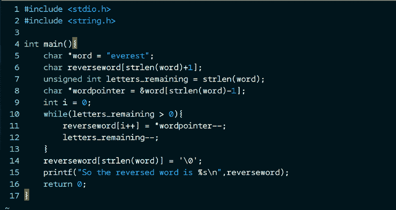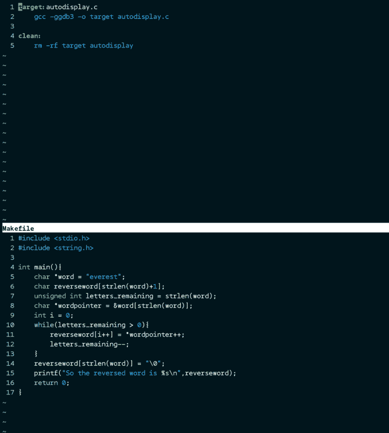

Normal window (top left), :split <file> (top right), :vsplit <file> (bottom)

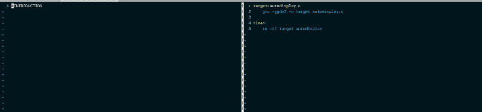

最大化工作窗口:


The pane needs to be maximized vertically and horizontally to occupy the entire window

**调整大小:**

```
CTRL-W [N] -	Decrease current window height by N (default 1)
CTRL-W [N] +	Increase current window height by N (default 1)
CTRL-W [N] <	Decrease current window width by N (default 1)
CTRL-W [N} >	Increase current window width by N (default 1)
```

当我拆分窗格时，有没有办法使用文件资源管理器？(我总是记不住并输入文件名！)

当然，你所要做的就是键入:`:Sexplore`用于水平文件浏览器，键入`:Vexplore`用于垂直文件浏览器。你也可以使用`:Vexplore!`在右边打开文件浏览器(而不是默认的左边)

再说一遍，所有这些都可以工作，不需要任何额外的插件。

#### 我正在编辑一些代码，我很快需要运行一个 shell 命令。我应该保存我的工作，退出 Vim 并运行我的命令吗？我打赌 Vim 有更好的出路

你打赌！Vim 只是不想让你离开 Vim，希望你继续专注于你的工作。因此，可以选择在 Vim 中执行 shell 命令。别担心，你所有未保存的工作都不会被丢弃，你只需执行你的命令，然后砰！您安全地回到了未保存/已保存的文件中！

假设您正在进行一个编码会话，并且您很快需要去看一下文件操作的手册页，因为您忘记了签名！您不必保存您的工作，退出 Vim，然后检查手册页，或者您不必为手册页打开另一个选项卡。您可以在 Vim 编辑器中发出这个命令。

[**【演示】VIM 的 Unix 命令**](https://asciinema.org/a/vZgdxBb0slZG3cB9ZXqNFpgpi)
[*VIM 允许用户在 VIM 内部执行 shell 命令，而无需退出。你所要做的就是输入命令……*asciinema.org](https://asciinema.org/a/vZgdxBb0slZG3cB9ZXqNFpgpi)

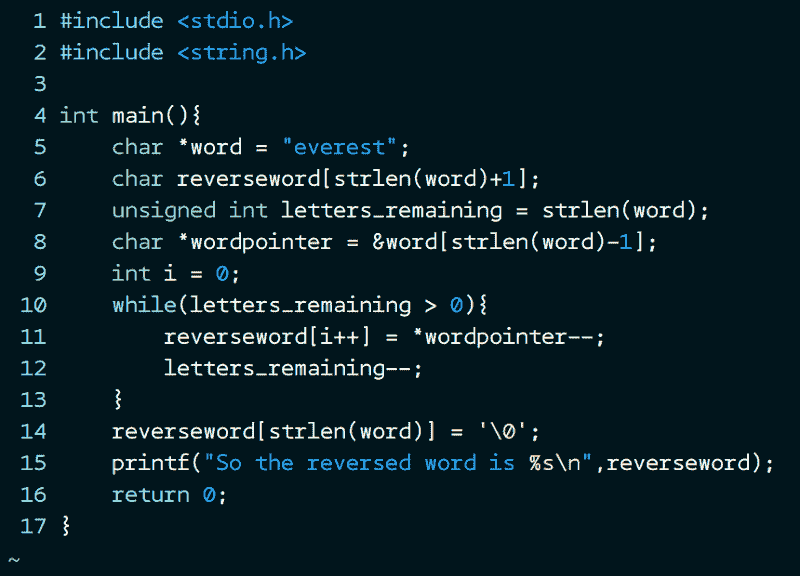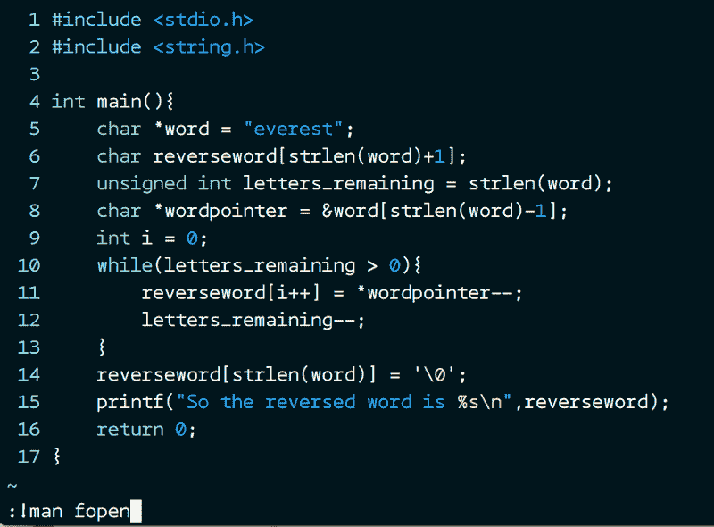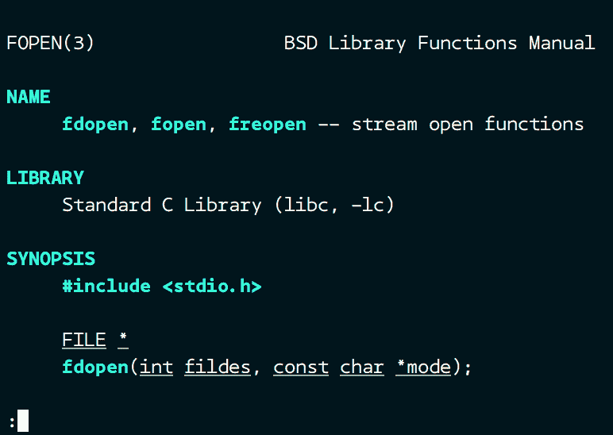

Left to Right (Execute shell commands from Vim and jump back to editor)

你猜怎么着！准备好大吃一惊吧。Vim 还支持文件中的`make`命令！你所要做的就是用`Makefile`导航到一个目录。打开任何文件(可能是你的源代码),做所有的修改并保存。等等，不需要退出来看编译结果。您可以直接在 Vim 中触发 make 构建:

[**【演示】从 vim 触发构建**](https://asciinema.org/a/148687)
[*VIM 允许用户在不退出 VIM 的情况下触发构建。我们所要做的就是进入命令模式并键入:make*asciinema.org](https://asciinema.org/a/148687)

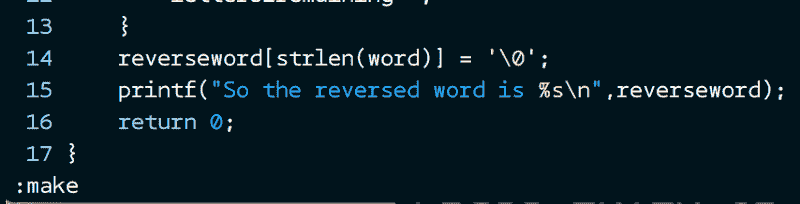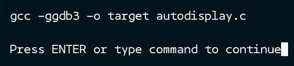

Triggering make builds from Vim

同样，您可以在 Makefile 中构建其他目标！

示例:构建目录清理

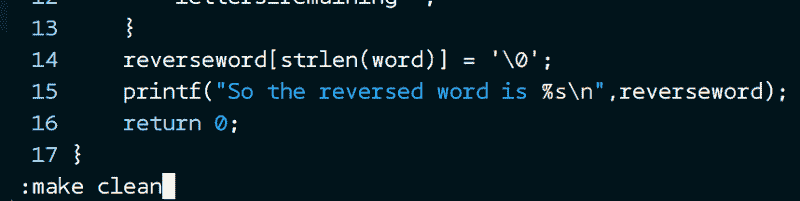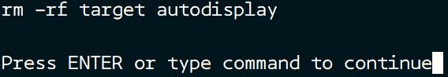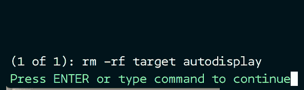

Cleaning directory using make command from VIM

我希望这些很酷的特性能帮助你更有效地使用 Vim。

我们随时欢迎您的反馈。

随意评论，批评或者鼓掌？

#### 参考资料:

*   [http://www.openvim.com/tutorial.html](http://www.openvim.com/tutorial.html)
*   [https://linuxconfig.org/vim-tutorial](https://linuxconfig.org/vim-tutorial)
*   [ftp://ftp.vim.org/pub/vim/doc/book/vimbook-OPL.pdf](ftp://ftp.vim.org/pub/vim/doc/book/vimbook-OPL.pdf)
*   [http://vim.wikia.com/wiki/Tutorial](http://vim.wikia.com/wiki/Tutorial)
*   [http://www.viemu.com/a-why-vi-vim.html](http://www.viemu.com/a-why-vi-vim.html)
*   [http://robertames.com/files/vim-editing.html](http://robertames.com/files/vim-editing.html)
*   [https://www.youtube.com/watch?v=wlR5gYd6um0](https://www.youtube.com/watch?v=wlR5gYd6um0)