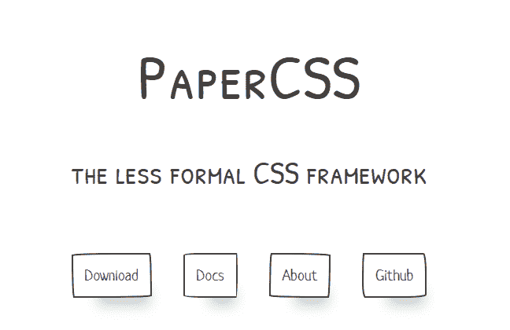
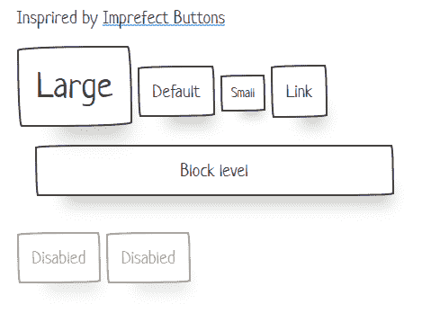
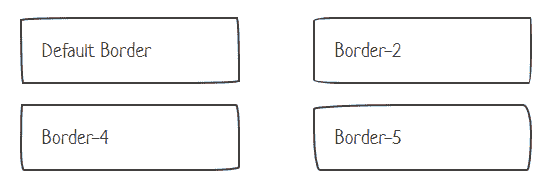
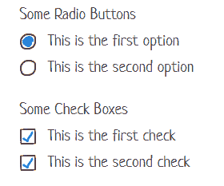
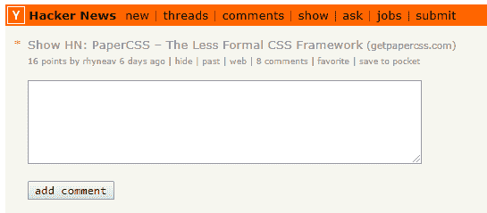
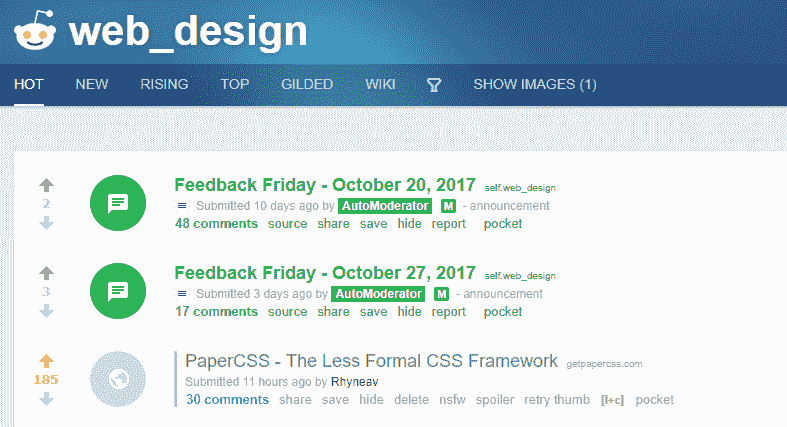
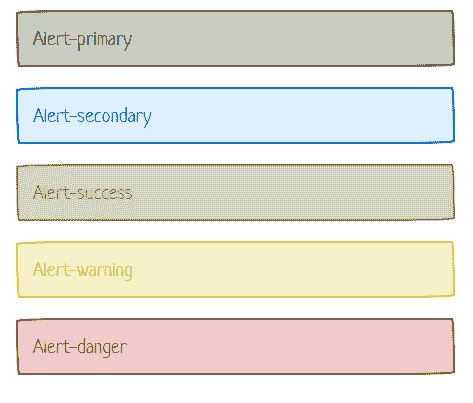
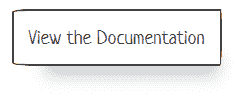
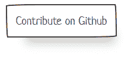
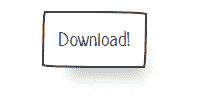

# 我是如何构建和部署 PaperCSS 的——第一周就在 Github 上获得了 125+颗星

> 原文：<https://www.freecodecamp.org/news/how-i-built-and-deployed-papercss-and-got-125-stars-on-github-the-first-week-89f8d6ac14b1/>

作者:雷恩·弗拉瑟维奇

# 我是如何构建和部署 PaperCSS 的——第一周就在 Github 上获得了 125+颗星

#### 背景

我刚刚结束了在纽约作为软件工程师的暑期实习。在我的离职面谈中，我询问了一些关于我可以改进的地方的反馈。由于我对前端 web 开发非常感兴趣，我从那次谈话中得到的主要收获是越来越好地使用 CSS。

我认为学习 CSS(以及如何用更少的[来构建它)的最好方法是创建我自己的 CSS 框架。我不想只是盲目地使用](http://lesscss.org/)[引导程序](http://getbootstrap.com/)，而是想完全理解引擎盖下的一切。另外，这个 CSS 框架可能是我未来所有项目的基础。

我现在知道我想建立一个 CSS 框架，但我几乎没有方向，直到我偶然发现了 [Tiffany Rayside 的不完美按钮代码笔](https://codepen.io/tmrDevelops/pen/VeRvKX)。我喜欢它的边界不直，也不完美。我认为这个概念如果应用到其他类型的 HTML 元素上会很酷。PaperCSS 就这样诞生了。

#### 建筑用纸

接下来的几周，我为这个框架构建了一些类。我从 Flexgrid 开始，因为我真的想了解更多关于 flexbox 的使用和应用。我也知道为文档网站建立一个定位元素的系统会很有用。然后，当我有时间的时候，我添加了更多的特性和风格。

Example of a feature, borders!

我花时间学习如何自动构建 CSS。我所要做的就是将样式添加到一个. less 文件中，然后让 Gulp 为我构建 CSS。然后我可以立即在文档/演示网站上查看它。我使用了[无吞咽观看](https://www.npmjs.com/package/gulp-watch-less)模块，所以我甚至不用重新加载网站就能看到变化。

学习 Gulp 的工作方式和使用它的所有不同模块是很有趣的。感觉就像你需要的任何东西都能一饮而尽。

总的来说，构建这个框架非常简单。我想让它尽可能简单，这样人们可以更容易地做出贡献。但稍后会详细介绍。

#### 部署 PaperCSS

我最终在 [Netlify](https://www.netlify.com/) 上部署了这个框架。您所要做的就是连接您的 Git repo、您的构建命令和您的域名(如果您有的话)。他们甚至让你只需点击两下就能添加 https。我喜欢他们的服务(这么说并没有报酬)。

从那里，对主分支的任何推送都会自动触发站点的重建和重新部署。

Another feature, custom Radio Buttons and Boxes

老实说，这个部署最困难的部分(到目前为止)是挑选域名。papercss.com 被带走了，所以我必须发挥创造力。我最终选择了 getpapercss.com，因为其他框架都把“get”放在了它们实际名称的前面(咳咳，Bootstrap)。我喜欢的一些其他选项是 papercss.style 和 papercss.style。

#### 启动 PaperCSS

从朋友和以前的同事那里得到一些反馈后，我决定在网上分享 PaperCSS。我把它贴在了[黑客新闻](https://news.ycombinator.com/item?id=15584262)和 [r/web_design](https://www.reddit.com/r/web_design/comments/79n3qh/papercss_the_less_formal_css_framework/) 上。我为 web 开发人员创建了这个框架，所以我认为这两种受众是最理想的。

我做了一些快速调查，发现向 Reddit 发帖的最佳时间是周日[&周一早上](http://maxcandocia.com/article/2017/Jul/29/what-time-to-post-to-reddit/)。由于我的谷歌搜索发生在周日晚上，我选择在周一早上发布到这两个频道。

黑客新闻得到了一点点的关注，评论中有一些很好的反馈。

[Hacker News Submission](https://news.ycombinator.com/item?id=15584262)

但是它真的在 Reddit 上起飞了 。通常，当我启动一个小应用程序或 Chrome 扩展时，我会得到三张赞成票，或许还有一条评论说“哼”但是 PaperCSS 不知怎么就上了 r/web_design 的顶，在顶帖位置呆了将近两天。

[r/web_design submission](https://www.reddit.com/r/web_design/comments/79n3qh/papercss_the_less_formal_css_framework/) after day 1

但是发起的最好的部分是对贡献的直接兴趣。那天下午，当我打开邮件时，已经有三个拉取请求了！

我突然感到一种责任感。这不再是一个我可以忘记并留下的随机项目。人们有足够的兴趣想让它变得更好。我觉得这是我欠他们和所有使用 PaperCSS 的人的，以确保他们的贡献被包括在内。这个项目必须继续下去！

#### 第一周

以下是 PaperCSS 第一周的简要概述:

*   500 多行新代码
*   Github 上超过 125 颗星
*   13 期
*   12 个拉取请求
*   6 个新功能(工具提示、卡片、提醒、徽章、边框样式、禁用按钮)
*   以及大量的支持和反馈！

New alerts feature

你想知道整件事最疯狂的部分吗？我个人没有添加任何新功能。这是忙碌的一周，所以我花了很多时间在 PaperCSS 上评论问题，拉请求，并把它们合并在一起。

站在拉请求的另一边感觉很奇怪。感谢**托托明尼克**、**弗雷姆**和**乔尔沃利斯**迄今为止所做的贡献！感谢大家对黑客新闻、Reddit 和 Github 的反馈。

#### 纸的未来

这个项目的未来取决于每个人想把它带到哪里。我喜欢围绕它发展起来的小社区，希望它成为一个有机发展的框架。我喜欢不断地添加功能，清理代码库，让它成为一个简单的项目，容易为之做出贡献。

我真的想尽快处理一些有形的东西:

*   在 CDN 上获取 PaperCSS。这样的话，用户就不需要下载它了，只需要外部链接就可以了。
*   轻松获得 NPM 证件`npm install`
*   找出确保文档与最新版本相匹配的最佳方法
*   添加示例页面
*   将庞大的 index.html 文件分割成小块，同时使其易于理解和贡献。

说到最后一点:Github 上的许多项目在本地安装起来都令人生畏——但 PaperCSS 不是。理解它并添加特性相对容易，因为唯一移动的部分是。少文件和 index.html 文件。我想继续保持它的简单性，并保持较低的准入门槛。

对于任何想开始一个开源项目的人来说，这是一个很好的地方。如果您以前没有打开过拉取请求，我很乐意向您介绍这一过程。

#### 结论

总而言之，这是疯狂的一周。PaperCSS 超出了我 1000%的预期，我对它的发展感到兴奋。关于如何管理框架和贡献，我还在学习很多东西，如果有任何关于这个问题的建议，我将不胜感激。此外，请考虑在您的下一个项目中使用 PaperCSS，并给我发送一个链接，告诉我结果如何:)

