# 如何管理 iOS 项目的不同环境和配置

> 原文：<https://www.freecodecamp.org/news/managing-different-environments-and-configurations-for-ios-projects-7970327dd9c9/>

作为 iOS 开发者，我们已经意识到要管理不同的环境，比如开发、QA、Beta 和生产。对于这些不同的环境，有不同的服务器 URL、应用程序图标和配置。

因此，在创建指向环境的新构建之前，我们需要记住，我们还必须更改服务器 URL。我们可以通过改变常量文件中的一些硬编码标志值或者使用宏来做到这一点，但是这会使一切变得更加复杂。

但是如果我们想一会儿，我们可以想出一个主意。通过应用这个想法，我们可以轻松处理任何情况。因此，我们的想法是，如果我们创建不同的模式和配置，那么它允许我们更改应用服务器 URL、应用程序图标、Plist 文件和配置。

在本教程中，我将向您展示如何使用模式和配置管理不同的环境。

这些是步骤:

#### **项目设置:**

打开 XCode，用正确的名称创建一个新的单视图应用程序。

#### **添加模式和配置:**

在添加模式之前，我们需要知道每个 XCode 模式都有两种不同的构建配置: **Debug** 和 **Release。**然后，如果我们愿意，我们可以针对特定的构建配置进行更改。

现在添加我们的构建配置，在左边的 **Project Navigator** 窗格中选择项目。然后从两个选项(**信息**和**构建设置)**中选择**信息**。在**配置**中，我们必须为那里的五个环境(开发、生产、QA、Beta 和 UAT)添加我们自己的配置。

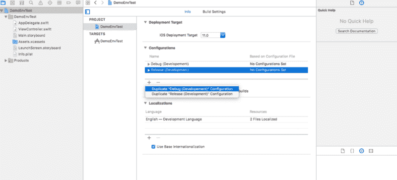

Add a new configuration for an Environment (Debug and Release)

首先双击 **Debug** ，重命名为 **Debug(开发)。**同样，双击**发布**，重命名为**发布(开发)。**现在点击+，选择**复制** **调试(开发)**和**复制发布(开发)**，然后用其他可用的名称更改复制的环境名称。

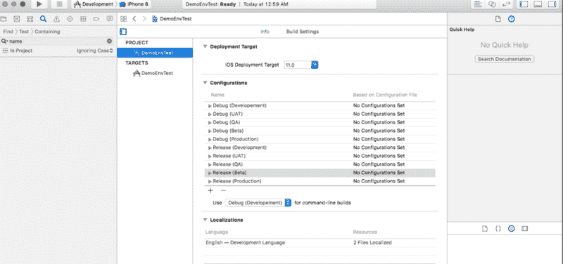

After adding all the configurations for different environments

对于**模式创建**，转到 XCode 左上角的管理模式。在这里，您可以看到已经有一个模式可用。将其重命名为**开发—** 或者您可以删除现有的并添加一个名为**开发**的新项目。然后为其他环境添加其余的四个模式。

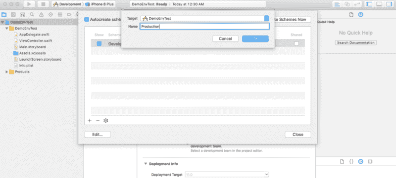

Add a new schema for an Environment

哎呀，别忘了勾选那里的共享框。添加所有模式后，管理模式屏幕应如下所示:

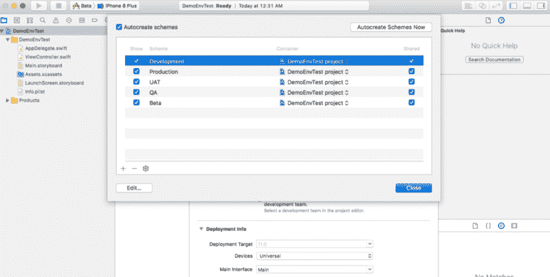

All the schemas are added

#### 添加配置设置文件:

右键单击项目，选择新建文件，然后添加配置设置文件，并给它一个与环境相同的名称。

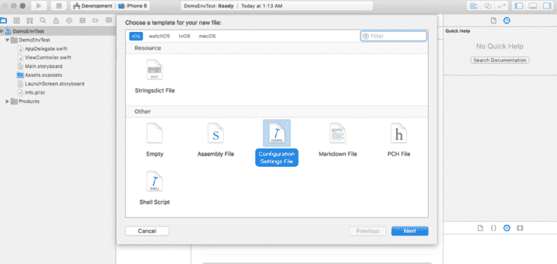

Configuration Settings File

添加所有配置文件后，项目导航器的左窗格应该如下所示:

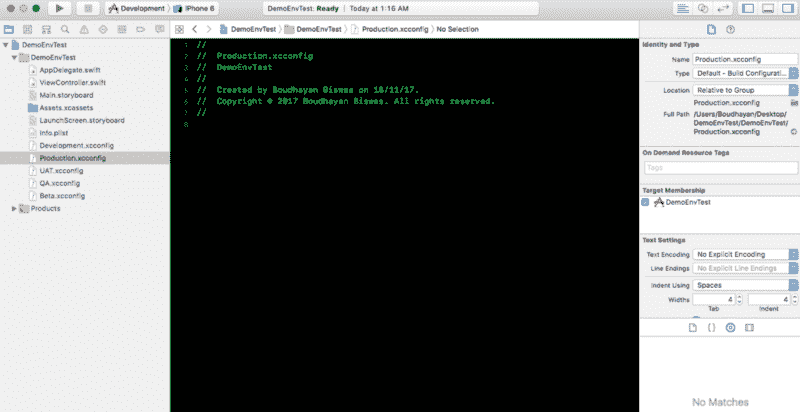

Configuration Files added

现在最重要的部分开始了:在相应的配置文件中添加您的**服务器 URL** 和其他定制的键值。

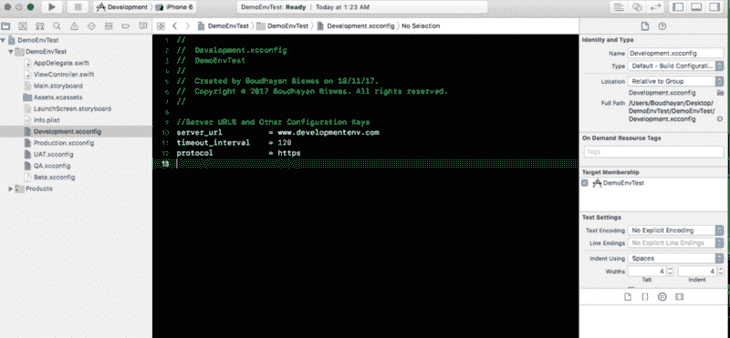

Server URL added in Configuration File

#### 添加 Plist 文件:

将 info.plist 文件重命名为 development.plist。为项目中的不同环境复制并粘贴相同的 plist 文件，并使用环境的名称重命名每个 plist 文件。您可以在 plist 文件中设置一些特定于环境的键和值。之后，将配置文件中的密钥添加到 plist 文件中，如下所示:

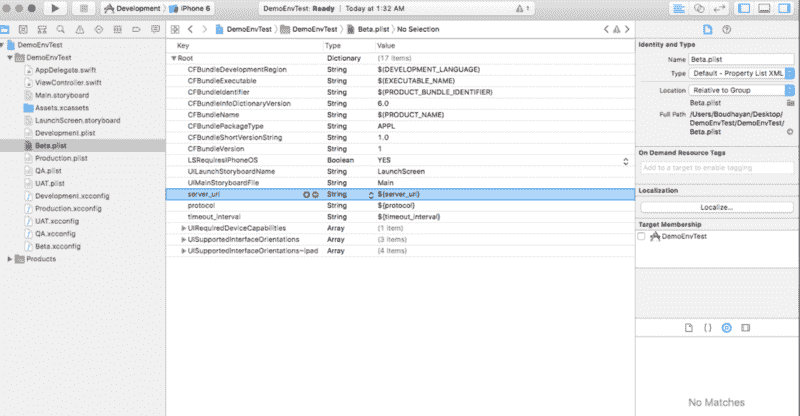

Add keys in Plist File

现在我们必须为每个构建配置设置合适的 plist 路径。从目标中，只需选择一个 plist 文件，并使用与**调试**和**发布**配置相同的名称对其进行重命名。

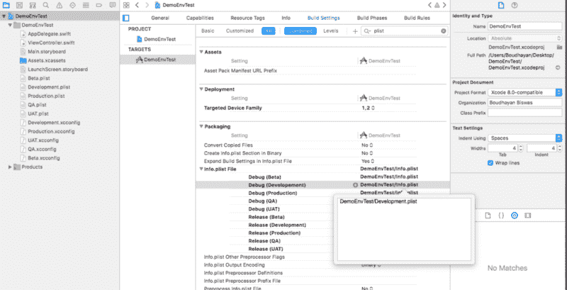

Add Plist Path for build configuration

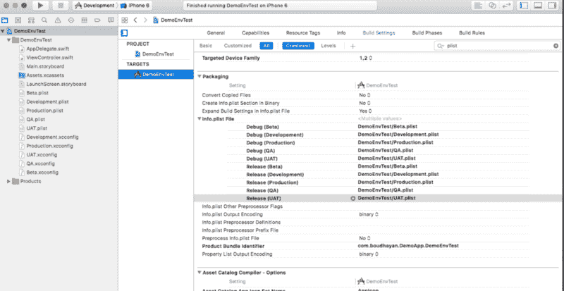

Renamed Plist Files

#### 将生成配置与配置文件链接:

逐一选择**项目信息**中的所有构建配置(调试和发布)。然后设置您已经添加到项目中的适当的配置文件。

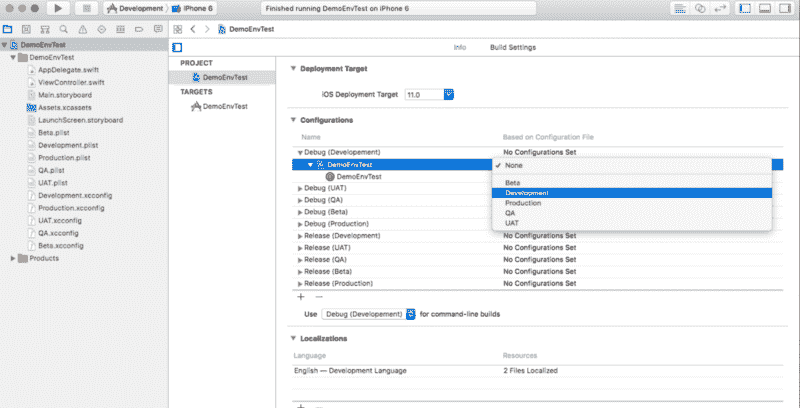

Set Configuration File to Build Configuration

添加所有配置文件后，您的构建设置应该如下所示:

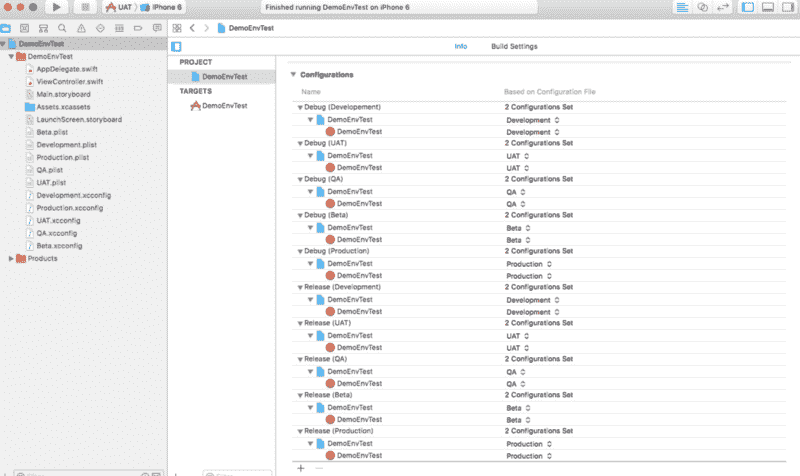

Configuration File and Build Configuration

现在，我们已经成功地将所有的配置文件链接到了各自的构建配置。

#### 将架构与生成配置相链接:

现在，最后一步是将模式与构建配置链接起来。为此，选择任意模式，转到 edit schema，并在那里设置适当的构建配置。

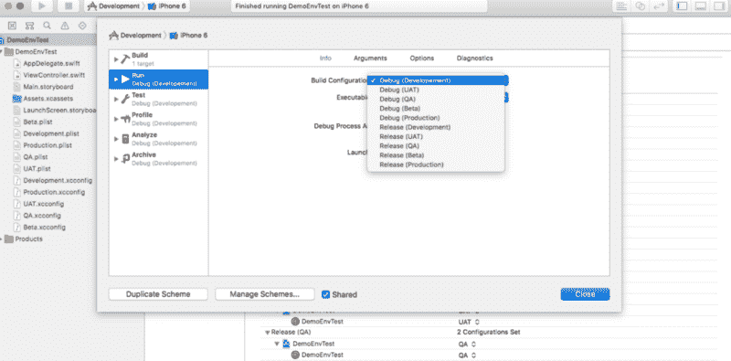

Linking Schema and Build Configuration

#### 准备运行项目:

现在所有的设置都完成了。您唯一需要做的事情就是选择模式并运行——环境会自动为您选择。因此，为了获取服务器 URL 和其他值，我创建了一个 Environment.swift 文件。看看这个:

获取 ViewController 中的服务器 URL 或其他设置。Swift 或任何其他文件，您只需编写一行代码:

您还可以从构建设置中管理不同环境的不同应用程序图标。然后，您只需花一秒钟的时间来查看您的设备上安装了哪个环境版本。

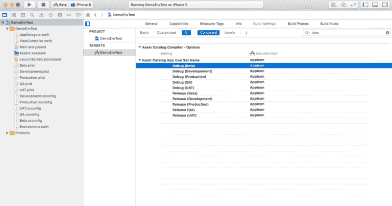

完整的项目可以在 [GitHub](https://github.com/boudhayan/DemoEnvTest) 上找到。有问题可以下载。

每次构建项目时，不要花费额外的时间来更改服务器 URL 或其他配置。这是管理不同环境、应用程序图标和配置的最简单方法。

如果你喜欢这个，请别忘了鼓掌。会给我更多启发。如有任何建议，请随时给*mail2boudhayan@gmail.com 写电子邮件。*