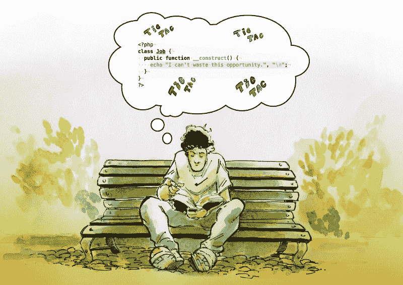
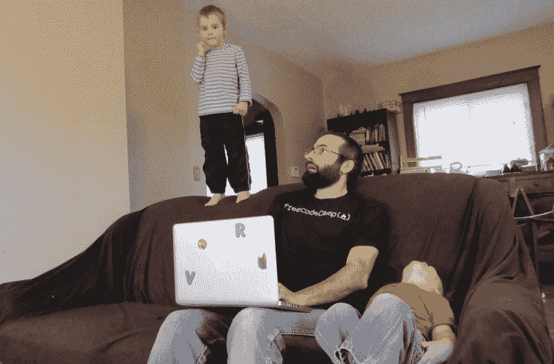
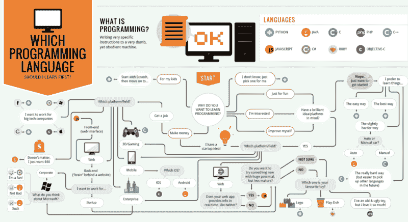

# freeCodeCamp 播客直播。这里有 6 集你可以尽情聆听。

> 原文：<https://www.freecodecamp.org/news/the-first-6-episodes-of-the-new-freecodecamp-podcast-ready-for-you-to-binge-on-e9391055edc0/>

freeCodeCamp 播客现已上线。你可以去任何你想去的地方听苹果 iTunes 、 [Google Play](https://play.google.com/music/m/Dlihoa2pxggmrdbosa24kddqu2u?t=How_I_went_from_Selling_Food_in_the_Street_to_Working_as_a_Developer_at_Companies_Like_Apple_Part_1_) 或[的前 6 集。](http://freecodecamp.libsyn.com/)

我们每周一会发布新的剧集，记得订阅哦。

您可以给我们留下 5 星评价，帮助我们的播客达到 88 英里每小时。

## 以下是前六集的列表:

### 第一集:我是如何从街头卖食品到在公司做开发人员的，第一部分——学习编码

Art by [Sebastian Navas](https://twitter.com/SebastianNavasF)

[在苹果 iTunes 上收听](https://itunes.apple.com/us/podcast/the-freecodecamp-podcast/id1313660749#) | [在谷歌 Play 上收听](https://play.google.com/music/m/Dlihoa2pxggmrdbosa24kddqu2u?t=How_I_went_from_Selling_Food_in_the_Street_to_Working_as_a_Developer_at_Companies_Like_Apple_Part_1_) | [在浏览器上收听](http://freecodecamp.libsyn.com/episode-1-how-i-went-from-selling-food-in-the-street-to-working-as-a-developer-at-companies-like-apple-part-1-learning-to-code)

### 第二集:我如何从街头卖食品到为顶级科技公司做开发人员，第二部分——面试

Art by [Sebastian Navas](https://twitter.com/SebastianNavasF)

[在苹果 iTunes 上收听](https://itunes.apple.com/us/podcast/the-freecodecamp-podcast/id1313660749#) | [在谷歌 Play 上收听](https://play.google.com/music/m/D43e3dd5ov2z4dmb2dnonzjqeli?t=How_I_Went_From_Selling_Food_in_the_Street_to_Working_for_Top_Firms_in_Tech_Part_2_-_The_Interview-T) | [在浏览器上收听](http://freecodecamp.libsyn.com/how-i-went-from-selling-food-in-the-street-to-working-for-top-firms-in-tech-part-2-the-interview)

### 第三集:我是如何从街头卖食品变成顶级科技公司的开发人员的，第三部分——工作的第一周

Art by [Sebastian Navas](https://twitter.com/SebastianNavasF)

[在苹果 iTunes 上收听](https://itunes.apple.com/us/podcast/the-freecodecamp-podcast/id1313660749#) | [在谷歌 Play 上收听](https://play.google.com/music/m/Dhdxcun7vucjsj3xnmrg43hwjn4?t=How_I_Went_From_Selling_Food_in_the_Street_to_Working_for_Top_Firms_in_Tech_Part_3_-_First_Week_on_t) | [在浏览器上收听](http://freecodecamp.libsyn.com/how-i-went-from-selling-food-in-the-street-to-working-for-top-firms-in-tech-part-3-first-week-on-the-job)

### 第 4 集:当我学习如何编码时，我希望有人告诉我的事情

Source: [freeCodeCamp’s Instagram account](https://www.instagram.com/p/BbkAdPnlqsl/?taken-by=freecodecamp)

[在苹果 iTunes 上收听](https://itunes.apple.com/us/podcast/the-freecodecamp-podcast/id1313660749#) | [在谷歌 Play 上收听](https://play.google.com/music/m/Drgjdanbmi5mztu47urekf55ria?t=Things_I_Wish_Someone_Had_Told_Me_When_I_was_Learning_How_to_Code-The_freeCodeCamp_Podcast) | [在浏览器上收听](http://freecodecamp.libsyn.com/things-i-wish-someone-had-told-me-when-i-was-learning-how-to-code)

### 第 5 集:我是如何一边工作一边抚养两个孩子，在短短一年内获得了第二个学位和 5 个开发人员认证的

Photo credit: [Beau Carnes](https://twitter.com/carnesbeau)

[在苹果 iTunes 上收听](https://itunes.apple.com/us/podcast/the-freecodecamp-podcast/id1313660749#) | [在谷歌 Play 上收听](https://play.google.com/music/m/D32wps57ewd7kdsigvr6sgtcyga?t=How_I_got_a_second_degree_and_earned_5_developer_certifications_in_just_one_year_while_working_and_r) | [在浏览器上收听](http://freecodecamp.libsyn.com/how-i-got-a-second-degree-and-earned-5-developer-certifications-in-just-one-year-while-working-and-raising-two-kids)

### 第六集:应该先学哪种编程语言？

[Image credit](http://carlcheo.com/startcoding)

[在苹果 iTunes 上收听](https://itunes.apple.com/us/podcast/the-freecodecamp-podcast/id1313660749#) | [在谷歌 Play 上收听](https://play.google.com/music/m/D3a4cr2bd4bzeonaazoynvxxjfq?t=Which_Programming_Language_Should_You_Learn_First-The_freeCodeCamp_Podcast) | [在浏览器上收听](http://freecodecamp.libsyn.com/which-programming-language-should-you-learn-first)

## 我喜欢播客，我想你也会喜欢的。

我每周听几个小时的播客。当我跑来跑去不能阅读的时候，它们是学习新东西的一种方便的方式。

每天当我通勤或者试图摇着我的新生儿睡觉时，有太多的空闲时间。播客帮助我用开发者的故事和对技术的见解来充实这段时间。

这个文氏图展示了听播客可以补充你的其他学习的所有情况:

Image credit: [Jeff Meyerson](https://twitter.com/the_prion)

如果你是播客新手，一定要查看我们的播客指南。它涵盖了大量伟大的编码播客，以及收听它们的最佳工具。

享受 freeCodeCamp 播客，让我知道你的想法:)