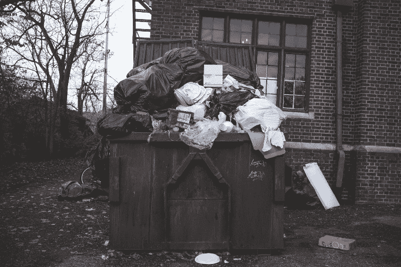
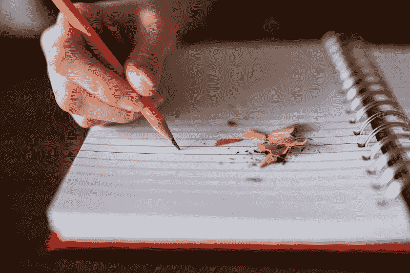
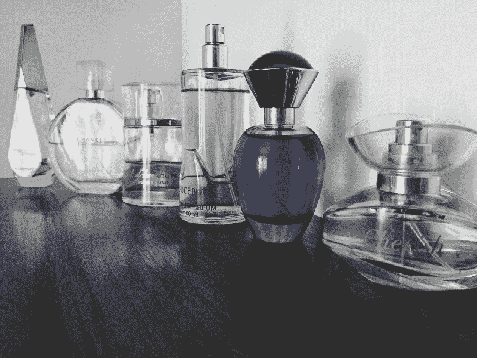

# 你的代码糟透了。这里是你能做的。

> 原文：<https://www.freecodecamp.org/news/your-code-stinks-heres-what-you-can-do-about-it-3f9650653447/>

乔纳森·索罗扎诺-汉密尔顿

([source/CC0](https://pixabay.com/en/dog-snail-to-watch-animal-sniff-1492672/))

# 你的代码糟透了。这里是你能做的。

人类很臭。这没什么好羞愧的:这是我们动物本性的必然结果。

但是人类渴望超越动物。

纵观历史，人类唯一的努力就是消除臭味。我们一直很讨厌它。甚至在古代，我们就派人乘坐摇摇晃晃的帆船环游世界，骑着小马穿越沙漠，去寻找治疗的方法。

我们迭代了几千年才达到一个没有臭味的世界。从肥皂和牙膏的发明到 Yankee Doodle Candle Co .和 Febreze——我们的肥皂、蜡烛和喷雾剂现在给了我们一种方法，让食物垃圾和工业垃圾闻起来像山上的雨滴和糖饼干。

Mmmm! Pumpkin spice! (Photo by [NeONBRAND](https://unsplash.com/photos/8Yk4T-tDSYY?utm_source=unsplash&utm_medium=referral&utm_content=creditCopyText) on [Unsplash](https://unsplash.com/?utm_source=unsplash&utm_medium=referral&utm_content=creditCopyText))

然而，每一次创新，我们都找到了新的发臭方式。

就像我们在抗生素和细菌之间的战斗一样，我们在自己和环境之间展开了一场无休止的军备竞赛。现在我们正在超越实物产品的时代。

随着我们的进步，我们也带来了臭味——一如既往。我们创造了信息时代。

我们制造了信息恶臭。

#### 我应该喝这个吗？

垃圾被掩盖在各种奇妙的气味中。作为一个新的父亲，一扇门为我打开了，让我进入一个未被发现的充满恶臭的国度。此前，我只从幸存下来的少数父母那里听说过这个世界的传闻。谣言总是伴随着千码凝视。

正是如此，臭信息的种类很多。中欧的青少年为社交媒体点击撰写假新闻文章。总有一个[医生不想让你知道的更奇怪的把戏](http://www.slate.com/articles/business/moneybox/2013/07/how_one_weird_trick_conquered_the_internet_what_happens_when_you_click_on.html)。

今天，在这篇文章中，我们将讨论这一切。我们正潜入我们新信息时代的最深处，去了解我们摩洛克人在我们自己的产品中制造的臭味。我说的是代码味。

Kent Beck 和 Martin Fowler 将代码气味定义为通常对应于系统中更深层次问题的表面迹象。

汪。

一个更简单的版本是，发臭的代码让你看一眼就说“这似乎不太对劲”。已经开始发臭的代码就像快要变质的牛奶。看起来**可能**没问题，但似乎有点“偏离”。

That’s… awfully foamy. ([source](https://www.pexels.com/photo/healthy-drink-glass-milk-46520/))

而且——就像有臭味的牛奶一样——如果你想确保第二天还能工作，你可能不想勉强接受有臭味的代码。那么你准备好面对你的代码味道了吗？

#### 学习嗅觉

接受是杀死代码臭味的第一步。我知道你的代码很糟糕。也许不是你所有的代码，但肯定是你的一些代码。就像我说的，这是自然的事实——动物制造臭味，作为编码员，我们只是技术动物。Technanimals？

你必须接受你的代码并不总是闻起来像玫瑰。尤其是你的初稿。你的初稿永远不会是你最好的。

Photo by [Thought Catalog](https://unsplash.com/photos/RdmLSJR-tq8?utm_source=unsplash&utm_medium=referral&utm_content=creditCopyText) on [Unsplash](https://unsplash.com/?utm_source=unsplash&utm_medium=referral&utm_content=creditCopyText)

没错，你的“草稿”你需要开始像对待其他工作一样对待编码。你需要计划从头开始迭代。

从幼儿园开始，你可能已经花了整个教育过程来学习大纲、初稿、重写、编辑、同行编辑和写作的其他步骤。你想忘记这一切，把编码当成意识流练习吗？

不要。就像你写一个论点一样编码:在头脑中有一个清晰的计划好的结论，一个达到目的所需的逻辑步骤的大纲，和一系列的草稿。如果你愿意，可以称之为“[重构](https://refactoring.com/)”。在代码中揉自己的鼻子会教你一开始就让代码不那么臭。

像所有的气味一样，一旦你对代码气味敏感了，你会更好地察觉它们。你会发现学习最常见的气味以及如何识别它们是值得的。有很多[有用的](https://blog.codinghorror.com/code-smells/) [文章](https://sourcemaking.com/refactoring/smells)关于特定的代码气味以及如何对待它们。

科技也可以帮助你远离气味。你有除臭剂吗？今天你的 IDE 可能没有插件除臭器。但是有可能！静态代码分析和[林挺](https://guide.freecodecamp.org/javascript/code-linting-in-javascript/) [工具](https://medium.freecodecamp.org/how-to-set-up-eslint-in-atom-to-contribute-to-freecodecamp-3467dee86e2c)给你的代码洗个澡，防止它变得太臭。

([source](https://www.pexels.com/photo/black-and-white-blue-bottles-close-up-339835/))

如果你还没有习惯单元测试，这是一个开始的好理由。编写单元测试迫使你回顾你的代码，找出在哪里和测试什么。如果你同时捏着你的鼻子，这是一个非常困难的任务。审查代码以进行测试为您提供了一个机会，也为您提供了一个激励，以获得更好的(更少臭味的)编码。

#### 谁闻到了它…

让我们面对现实吧。别人会在你之前注意到你身上的臭味。这基本上是社会的第一法则。人类第一次开始组合成群体，以获得嘲弄他人的机会。这是一个考古 fact™️.我的妻子是一名考古学家，我 100%肯定她读到这封信时会手足无措。

找到并修复代码中有问题的地方的最好方法是和其他人一起检查。同行代码评审有很多好处。第一个好处是你可以激怒你的同事。当你点击“提交拉动请求”后，你会立刻发现你的第一份工作写得有多糟糕，办公室里弥漫着沮丧的呻吟声。

Photo by [Helloquence](https://unsplash.com/photos/5fNmWej4tAA?utm_source=unsplash&utm_medium=referral&utm_content=creditCopyText) on [Unsplash](https://unsplash.com/?utm_source=unsplash&utm_medium=referral&utm_content=creditCopyText)

另一个减少臭味的好方法是审查别人的代码。乐于指出他们的缺点和不足！然后悄悄地意识到自己一直在犯同样的错误。一个好的同行评审系统将帮助你比其他任何事情都更快地成为一个更好的开发者。

但是，如果你没有同事或朋友，整天独自在黑暗的地下室写代码，那该怎么办呢？好吧，亲爱的没有朋友的自由职业者，没有比现在更好的时机开始[参与开源](https://medium.freecodecamp.org/i-just-got-my-free-hacktoberfest-shirt-heres-a-quick-way-you-can-get-yours-fa78d6e24307)了。 [freeCodeCamp](https://www.freecodecamp.org/) 是一个很好的起点。

#### 结论

没人想发臭。你不需要这么做。编码发臭就像所有其他的发臭一样:只要一点点卫生，它是可以被管理的。

([source](https://www.pexels.com/photo/blur-close-up-focus-indoors-78931/))

是时候检查你的编码过程了。是迭代吗？你会寻求他人的反馈吗？你是否使用免费工具来检查你的代码中的“语法”错误？你在测试吗？

也是时候了解常见的代码味道以及如何避免它们了。一个好的编码过程就像一个好的写作过程，有大量的草稿和编辑。编码技能也是如此，就像写作技能一样:有已知有效的修辞手段，也有已知失败的谬误。

你不必自己去发现它们。仔细阅读已知的代码味道和重构技术。

最后，坚持练习磨练自己的技能。做兼职项目和开源来获得更多更好的反馈。

你的鼻子会感谢你的。

拜托了。让我知道你是否喜欢这篇文章！