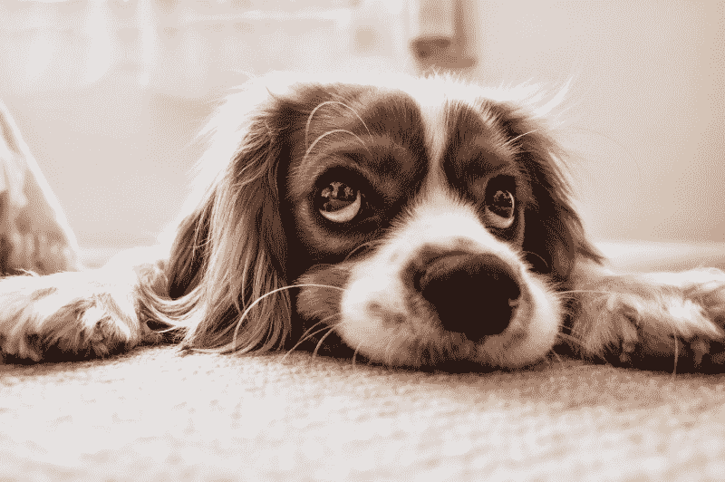
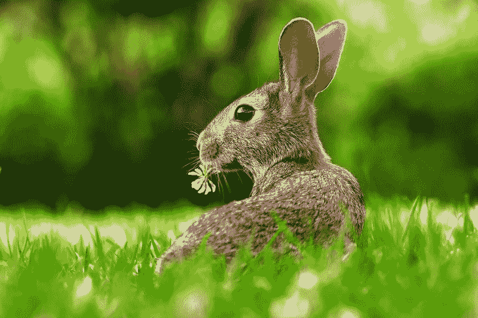
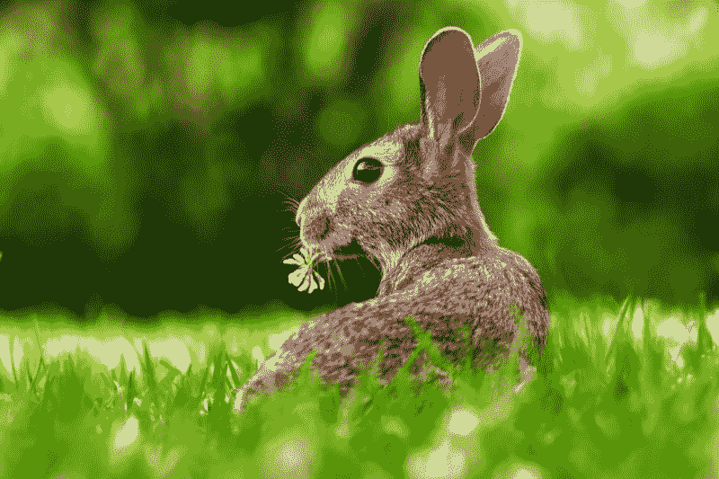
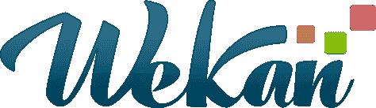
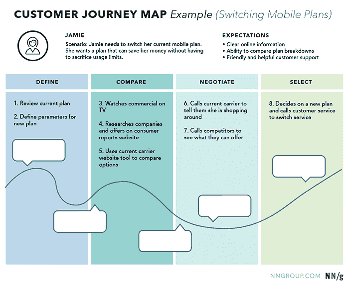
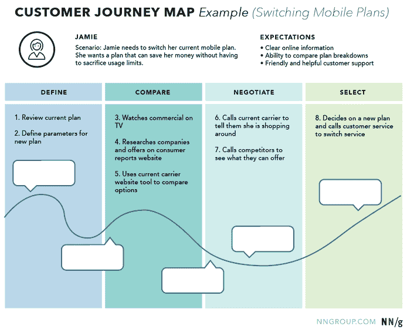
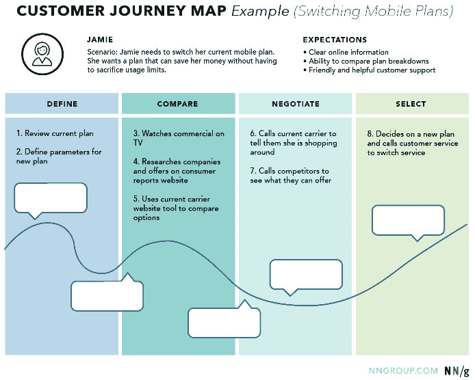

# ？？？？？？？？？？？？？？？？？？？？？？？？？？

> 原文：<https://www.freecodecamp.org/news/898b38a6c0e1/>

Artem Syzonenko

# ？？？？？？？？？？？？？？？？？？？？？？？？？？

在互联网的早期，我们在图像清晰度方面没有任何问题，因为我们不需要在移动设备上显示网站。

今天，我们看到了移动网上冲浪的巨大增长。以至于今年，它甚至超过了台式机的流量。

大多数客户试图为他们的网站创建响应界面，这样他们就可以很容易地从任何类型的设备上访问。许多布局开发人员已经开始使用它，这似乎并不奇怪

```
img {    width: 100%;    height: auto;}
```

为了他们的形象。因此，它们可以在任何浏览器窗口分辨率下无缝工作，根据可用空间进行扩展。

从概念上讲，一切看起来都很好。设计师创造漂亮的大图像，开发者将这些图像用于每一个设备。在某些情况下，开发人员会创建同一个图像的多个版本，因此为移动屏幕下载较小的图像，为桌面下载较大的图像。

不幸的是，Chrome 不想像优秀的图像编辑器那样调整图像大小。相反，它输出的图像的锐度与初始图像的锐度不同或相似。

出现这种情况的主要原因可能是性能。当一个网页有许多图像，并且设备处理器效率不高时，额外的图像处理可能会导致页面渲染的更大延迟，因此 Chrome 省略了这一过程，因为这对最终用户来说并不重要。

我将向你展示一些使用 Chrome 浏览器，然后使用其他浏览器的例子。这是一张在 Photoshop 中缩小到 1000 像素的图片:


同一张图片以原始尺寸上传，然后被浏览器缩小。比较一下狗狗眼睛的锐利程度。



Photoshop:



浏览器:



当你在缩小尺寸后在 Photoshop 中添加锐度时，事情会变得更糟。但在这种情况下，照片更宽容，因为它们通常没有很多锐利的边缘。任何矢量插图另存为的问题。png 图像更加引人注目。常见案例——网站徽标。

[Asana](https://asana.com/) 的标志，初始文件:


在 Photoshop 中调整大小:


在浏览器中呈现:


[Wecan](https://discourse.wekan.io/) 的 logo，初始文件:



在 Photoshop 中调整大小:


在浏览器中呈现:


和几个额外的浏览器渲染的徽标:


我在 UX 相关网站上发现了最有趣的模糊图像对比。 *Smashingmagazine* [工作区](https://jobs.smashingmagazine.com/)，在浏览器中:


在 Photoshop 中:


[尼尔森诺曼集团](https://www.nngroup.com)，[移情映射](http://Empathy Mapping)文章，渲染图:


使用 Photoshop 调整大小:



我必须承认这个问题只是 Chrome 才有。IE 渲染好得多；值得注意的是，一些细线是像素化的，这对于文本来说很好:



Firefox 也有很好的渲染效果；平滑会使文本比在 IE 中可读性稍差，但对徽标更好:


开发人员现在应该做的是打开 webkit 自动锐化属性:

```
img {    image-rendering: -webkit-optimize-contrast;}
```

如果它被打开，我们会得到如下结果:



因此，在世界上最流行的浏览器实现良好的图像下采样算法之前，我们可以使用 webkit-optimize-contrast 属性，它允许我们网站的访问者欣赏我们的照片，辨别我们在线商店中的项目细节，并欣赏我们的截图和图表的可读性。但是要小心，在某些情况下，这可能会导致像素化的结果。