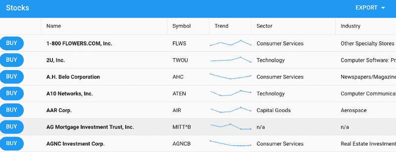
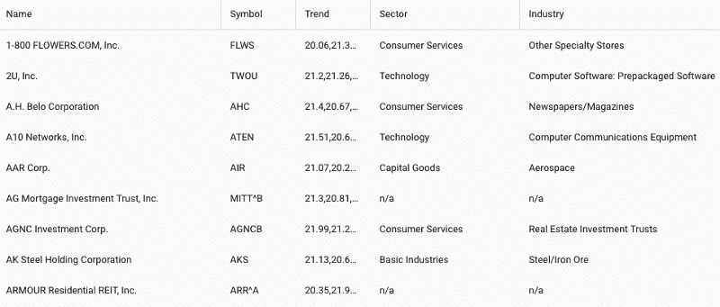
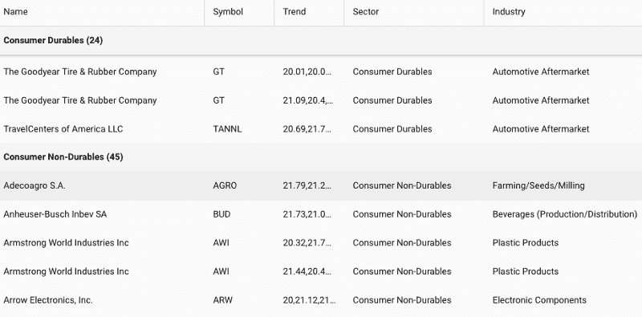
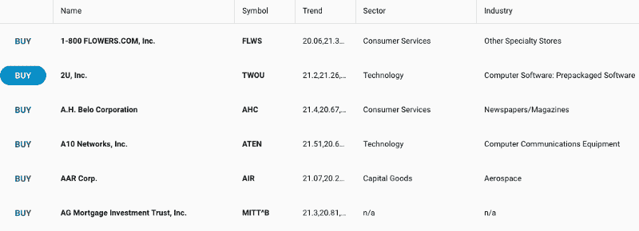
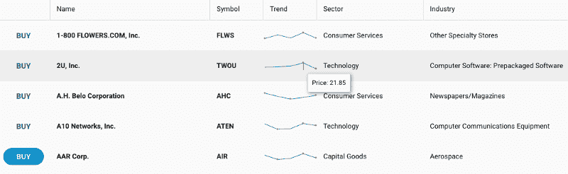
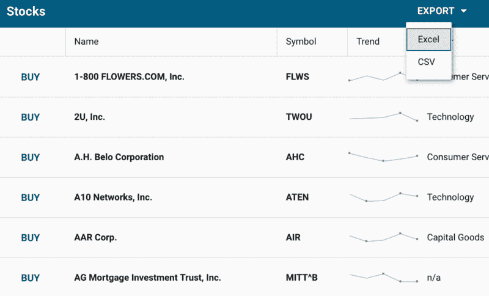
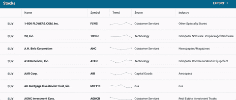
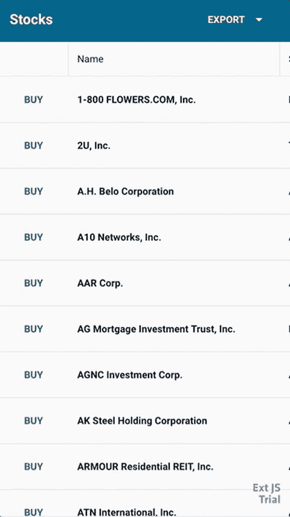

# 如何用 React 16 建立一个很棒的股票电子表格

> 原文：<https://www.freecodecamp.org/news/how-to-build-an-awesome-stocks-spreadsheet-with-react-16-f945b3137a42/>

作者 Sandeep Adwankar

# 如何用 React 16 建立一个很棒的股票电子表格

React 16 是基于 React 全新核心架构打造的 React 首个版本，代号“纤程”。React 16 从头开始设计，支持异步渲染。这允许在不阻塞主执行线程的情况下处理大型组件树。

React 16 很受欢迎，因为它支持许多关键功能，例如使用错误边界捕捉异常，从 render 返回多个组件，减小文件大小，以及对 MIT 许可证的支持。

为了构建像股票电子表格这样的数据驱动的 web 应用程序，您需要一个类似电子表格的界面来为您的用户显示数据。



Stocks Spreadsheet

用户希望应用程序中的电子表格能够:

*   使用固定标题滚动
*   通过单击列标题进行排序
*   显示和隐藏特定列
*   分页、分组和总结
*   编辑单元格中的数据
*   导出到 Excel
*   向下钻取/行扩展

然而，电子表格或网格可能是 React 中最棘手、最复杂的 UI 组件之一。这是因为许多必要的特性既需要丰富的 React 专业知识，也需要深入研究 DOM 的意愿和能力。

如果您想使用 HTML 表格或另一个第三方组件来编写网格代码，您必须实现几个常见的特性。这些功能包括单击网格列标题进行排序，或者单击列标题之间的分隔线来调整大小，或者滑动页面并获取下一页数据。

为了快速构建这个应用程序，我们将使用 Sencha 的 ExtReact 组件。Sencha 的 ExtReact 是一个由 115 个以上预建 UI 组件组成的组件集，您可以轻松地与 React 16 应用程序集成。ExtReact 中的一个关键组件是网格。它提供了快速构建股票电子表格应用程序所需的类似电子表格的功能。我们将利用 ExtReact Grid 来显示股票和股票公司的信息。

让我们开始使用 Sencha 的 ExtReact 网格构建一个股票应用程序。

### 脚手架股票电子表格应用程序

要创建应用程序支架，请遵循以下步骤:

*   **确保您已经设置了一个节点环境**

首先，确保您的系统上安装了 Node 8.11+和 NPM 6+。您可以从[节点网站](https://nodejs.org/en/download/)下载最新的节点版本。如果您已经安装了 Node，那么您可以使用这些命令轻松检查 Node 和 npm 版本: *node -v* 和 *npm -v*

*   **获取您的 NPM 紧急回购登录凭证**

ext rect NPM 包托管在 Sencha 的私人 NPM 回购。您只需登录 repo 一次，就可以访问所有 ExtReact 包。要获得登录凭证，请转到[extra 30 天免费试用](https://www.sencha.com/products/extreact/evaluate/?utm_source=freecodecamp&utm_medium=advertising&utm_campaign=sncextreact&utm_content=180914-ft-sncextreact)页面并填写表格。我们将向您发送一封电子邮件，其中包含登录详细信息以及一些资源链接，如文档和示例项目。

*   **登录提取 NPM 回购并获取应用生成器**

下一步是登录 Sencha 的私有 npm repo，它托管 ExtReact 包。使用您的 npm 登录名(在 ExtReact 试用电子邮件中提供)将 npm repo 与@sencha 范围相关联，并在出现提示时输入凭据:

```
npm login — registry=http://npm.sencha.com — scope=@sencha
```

下一步是安装 ExtReact 生成器包。

```
npm install -g @sencha/ext-react-gen
```

*   **创建你的第一个 React 应用**

运行 extract 应用程序生成器创建您的第一个 extract 应用程序:

```
ext-react-gen app your-app-name-here -i
```

应用生成器会问你几个问题，比如应用的名称。默认情况下，该应用程序使用材料主题(基于[谷歌的材料设计指南](https://material.io/guidelines/)),作为起始主题是一个不错的选择。

在其中一个提示中选择“生成空应用程序”。生成器还会提示您为项目创建一个新目录。然后，生成器将下载并创建您的示例应用程序，包括相关的依赖项。

*   **运行你的 React 应用**

在生成器输出中，您将找到运行应用程序的步骤。切换到新的应用程序目录，并使用以下命令运行应用程序:

```
npm start
```

这将启动应用程序，您的空 React 应用程序将显示应用程序的标题。应用程序中的主要组件(例如 StocksGrid)在根处有一个容器。这被标记为全屏，布局被设置为适合，这意味着它将拉伸其子元素以填充它。

[在 GitHub 上查看到此步骤](https://github.com/adwankar/react16-stocks-grid/tree/empty-extreact-app)的代码。

### 向应用程序添加股票网格

#### **添加股票数据**

我们将向应用程序添加一个 10，000 行的示例数据集，名为 stocks.json。每个数据行都包含公司名称、股票代码、所在部门和行业。该行还包含一组*分笔成交点*，它们是该股票的最近 5 次销售。

这是我们将要在网格中显示的数据。在本教程中，我们将从 stocks.json 静态加载数据，但是您也可以构建一个后端 rest API 来获取相同的数据。

#### **创建基本网格**

在 StockGrid React 组件中，在 render 方法中，我们将返回一个包含列的网格。

为了在网格中添加列，我们使用了一个列组件。列组件采用与股票数据的名称字段相同的数据索引。该列接受一个文本属性，即列标题文本。我们也可以给列一个宽度，比如一个固定的宽度或者一个伸缩，或者伸缩和最小或者最大的组合。我们将为公司名称、符号、记号、部门和行业添加列组件。这将创建一个新的 StocksGrid 类，网格如下所示

```
<Grid >       <Column dataIndex="name" text="Name" width={300} />       <Column dataIndex="symbol" text="Symbol" />       <Column dataIndex="ticks" text="Trend" />       <Column dataIndex="sector" text="Sector" width={200} />       <Column dataIndex="industry" text="Industry" width={350} /></Grid>
```

您的应用程序将返回 StockGrid 作为 render 的一部分，如下所示:

```
export default class App extends Component {
```

```
 render() {        return (            <ExtReact>                <StocksGrid />            </ExtReact>            )    }}
```

[在 GitHub 上查看到此步骤](https://github.com/adwankar/react16-stocks-grid/tree/adding-stocks-grid-component-6.6)的代码。

运行时，您将能够在 *npm start* 看到带有空网格的 web 应用程序

### 将股票数据与网格绑定

ExtReact grid 是一个类似电子表格的表格，它从数据存储中提取并呈现数据。在 ExtReact 中，Store 是一种数据结构，允许您在网格中对数据进行排序和过滤。

我们现在可以开始加载股票数据并创建一个商店。网格将从存储中获取数据。与网格的交互将触发存储上的事件，比如重新加载、排序或分页。

ExtReact 数据存储的概念与 Flux 存储略有不同。网格和存储与标准的 React 方法有一点不同，这是因为两者是紧密集成的。通常，您可以将数据直接传递给存储，或者存储可以使用代理从后端自行提取数据。ExtReact Grid 提供交互式功能，如过滤、排序、分页、分组和汇总，无需任何额外的代码。

对于这个例子，我们将数据从股票数据文件直接传递到商店。或者，您可以创建一个带有代理配置的存储——有了代理，我们可以做各种各样很棒的事情，比如远程分页、过滤和排序。对于这个应用程序，我们将 autoload 设置为 true，因此它会自动将数据加载到网格中。原始数据没有按照任何标准进行排序，因此我们将通过指定 name 属性在客户端对其进行排序。

```
this.store =        new Ext.data.Store({            data: stocks,            autoLoad: true,            sorters: [{                property: 'name'            }],            listeners: {                update: this.onRecordUpdated            }})
```

在网格中，将商店配置分配给我们创建的商店。

```
<Grid store={this.store}>
```

```
 ...</Grid>
```

现在运行 *npm start* ，我们的应用程序有一个包含所有数据的网格，如下所示:



Basic Grid with data

使用这个简单的 React 代码，您可以免费获得许多功能。这些特性包括排序，允许你点击任何列标题，它会在客户端自动排序。如果我们实现了一个真正的后端 API，我们可以配置存储代理在后端进行远程排序，并在数据库中使用“order by”子句进行排序。ExtReact Grid 还免费提供可调整大小的列。因此用户可以左右拖动该列。

ExtReact Grid 还提供了一个很好的分组特性。您的应用程序用户可以按行业分组，应用程序将按行业对所有数据进行分组。当您向下滚动每个分组时，ExtReact Grid 将为您提供一个固定标题。



Grouping by Industry

当您运行应用程序时，您会注意到这一数据很快就呈现出 10，000 条记录。它渲染如此之快是因为它使用了我们称之为*的缓冲渲染*。使用*缓冲渲染*，在初始加载时，Grid 渲染的数据会比你实际看到的“视口高度”多一点当您向下滚动时，实际上是在商店中向下翻页时用较新的记录替换网格单元格的内容。所以网格实际上尽可能地保存了 DOM 元素。通过保持 DOM 较小，它保持了较小的内存消耗并确保了较高的应用程序性能。

[在 GitHub 上查看到此步骤](https://github.com/adwankar/react16-stocks-grid/tree/adding-stocks-store-6.6)的代码。

### **设计你的股票网格**

您希望设计网格的样式，以便更容易分析数据。

#### **使用网格单元属性**

让我们来看看如何控制网格单元格的样式。我们希望将名称加粗—最好的方法是使用单元格属性。网格单元采用许多配置来控制单元的外观。我们将在那里放一个样式配置，然后我们说 fontWeight 等于 bold。

```
cell={ { style: {fontWeight:'bold'}}}
```

#### **在一行中添加一个按钮**

现在，假设我们想有一个按钮，我们可以点击购买这些股票之一。为此，我们可以添加一个带有按钮的列。这一次我们不打算添加数据索引，因为它与存储中的任何字段都不对应。我们将添加一个带有按钮的 WidgetCell。我们将做一些样式设计，我们将在它上面放置一个圆形的动作 UI，这样这个按钮将有一个圆形的动作外观，如下所示:

```
<Column >    <WidgetCell>        <Button ui ="round action"                 handler = {this.buyHandler}                  text = "Buy"/>    </WidgetCell></Column>
```

我们将要使用的购买处理程序非常简单。当你点击“购买”按钮时，我们将显示一条简短的信息，说明你所购买股票的符号。当你点击它的时候，它会调用这个函数:

```
buyHandler = (button) => {      let gridrow = button.up('gridrow'),      record = gridrow.getRecord();      Ext.toast(`Buy ${record.get('name')}`)}
```



Adding button in a grid

从这个例子中你可以看到，你基本上可以在一个 extract 网格单元中嵌入任何 extract 组件，而且它是完全交互式的。

[在 GitHub 上查看到此步骤](https://github.com/adwankar/react16-stocks-grid/tree/adding-stocks-grid-component-6.6)的代码

### 向股票网格添加趋势迷你图

在股票数据中，我们有一组最近五次股票销售的分笔成交点。让我们将它作为迷你图嵌入网格中。同样，我们将使用 Widgetcell 来呈现网格单元中的 ExtReact 组件。

```
<Column dataIndex="ticks"         text="Trend"         sortable={false}         cell = { {                xtype: 'widgetcell',               forceWidth: true,               widget: {                        xtype: 'sparklineline',                        tipTpl:                        'Price: {y:number("0.00")}'               }        } }/>
```

当您使用 *npm start* 运行您的应用程序时，使用鼠标悬停在迷你图中的不同点上，它将显示带有两个小数点的 Y 值。



Trends chart in a grid

[在 GitHub 上查看到此步骤](https://github.com/adwankar/react16-stocks-grid/tree/adding-sparkline-chart-6.6)的代码。

### 将股票数据导出到 Excel

与任何数据密集型应用程序一样，我们希望能够将数据导出到 Excel。为了添加该功能，我们将把 gridexporter 添加到适合网格插件中，如下所示:

```
<Grid      ..      plugins={{            gridexporter: true,      }}>
```

我们将向应用程序添加一些组件，以便于调用导出功能。我们将在网格顶部添加标题栏和停靠标题栏，并在里面放一个菜单。当您单击“导出”按钮时，您可以选择导出到 Excel 或 CSV 格式。

```
<TitleBar docked="top" title="Stocks">           <Button align="right" text="Export">                    <Menu indented={false}>                           <MenuItem text="Excel"                                 handler=                               {this.export.bind(this, 'excel07')}/>                            <MenuItem text="CSV"                                  handler=                                  {this.export.bind(this, 'csv')}/>                     </Menu&gt;            </Button></TitleBar>
```

导出处理程序将传递导出的类型和文件名的扩展名，如下所示:

```
export = (type) => {            this.grid.cmp.saveDocumentAs(           { type, title: 'Stocks' });}
```

您需要在 package.json 依赖项中传递导出器，如下所示:

```
"@sencha/ext-exporter": "~6.6.0"
```

你将需要安装依赖与 *npm 安装*然后 *npm 星* t 运行应用程序。



Exporting grid data

Exporter 插件支持将数据导出为各种文件格式。它支持原生的 XSLX、Excel XML 以及 HTML 和 CSV/TSV(逗号/制表符分隔值)格式。

[在 GitHub 上查看到此步骤](https://github.com/adwankar/react16-stocks-grid/tree/adding-exporter-6.6)的代码。

### 向股票网格添加编辑功能

电子表格需要编辑数据的能力。为了增加这种能力，我们需要添加另一个名为 gridcellediting 的网格插件。通过添加这个插件并将列标记为可编辑，您现在就有了一个可以通过双击任何网格单元来编辑的电子表格。您可以通过在网格单元格间切换来继续编辑网格。

添加带有 *gridcellediting: true* 的网格单元格编辑插件，并使“名称”在网格列中可编辑，如下所示:

```
<Column        dataIndex="name"        text="Name"        width={300}        cell={ { style: {fontWeight:'bold'}}}        editable/>
```

当您使用 *npm start* 运行应用程序时，您现在将能够编辑网格单元。



Edit capability in a Grid

#### **处理编辑事件**

编辑完网格单元后，您将需要侦听存储区上的事件以了解数据更改。您可以通过添加一个监听器配置和一个用于“更新事件”的监听器来实现。update 事件将传递许多参数，包括 store、updated record、描述发生的操作的对象，然后传递一个已更改的字段名数组。您将在处理程序中添加它。

在这个应用程序中，我们只是显示一条祝酒词。在现实世界的应用程序中，您将实际应用业务逻辑，比如在数据库中持久化更改。

```
...
```

```
listeners: {            update: this.onRecordUpdated }
```

```
...
```

```
onRecordUpdated = (store, record, operation, modifiedFieldNames) => {      const field = modifiedFieldNames[0];      Ext.toast(`${record.get('name')}                  ${field} updated to  ${record.get(field)}`) }
```

#### **向网格单元格添加选择选项**

如果您想在网格单元格中添加“选择”选项，可以使用另一个名为 SelectField 的 ExtReact 组件。您只需在 required 列中添加 SelectField ExtReact 组件。

```
<Column dataIndex="sector" text="Sector" width={200} editable>         <SelectField options={sectors}/&gt;</Column
```

当您使用 *npm start* 运行您的应用程序时，您将能够看到如下所示的选择选项:


Adding select option to grid

[在 GitHub 上查看到此步骤](https://github.com/adwankar/react16-stocks-grid/tree/adding-grid-editing-6.6)的代码。

### 为移动体验优化股票电子表格

这个应用程序很适合桌面体验，但是当在手机浏览器上使用相同的应用程序时，您可能希望提供优化的体验。对于这款 app 来说，单元格编辑可能不是小屏手机编辑的最佳体验。对于小屏幕设备，您可能想要选择不同的编辑样式。

extract*platform config*选项允许您指定桌面或移动的行为。你可以基于*平台配置*设置任何道具不同的值，这里我们基于平台设置插件。在这个例子中，当应用程序在桌面上时，我们将使用 *gridcellediting* 。当应用程序在移动设备上运行时，我们将使用*grided table*，它提供了在移动设备上编辑数据的更好方法，如下所示:

```
platformConfig= {{                desktop: {                        plugins: {                            gridexporter: true,                            gridcellediting: true                        }                },                '!desktop': {                        plugins: {                            gridexporter: true,                            grideditable: true                        }                }}}
```

当您使用 *npm start* 运行您的应用程序时，您将能够看到如下所示的移动视图:



Stocks app on a mobile device

[在 GitHub 上查看到此步骤](https://github.com/adwankar/react16-stocks-grid)的代码。

### 摘要

这个股票电子表格应用程序展示了使用 React 16 和 Sencha ExtReact 在数据驱动的 web 应用程序中创建类似电子表格的界面是多么容易。可以在 [Sencha Fiddle](https://fiddle.sencha.com/?extreact#view/editor&fiddle/2l0s) 查看完成的跑步 app。