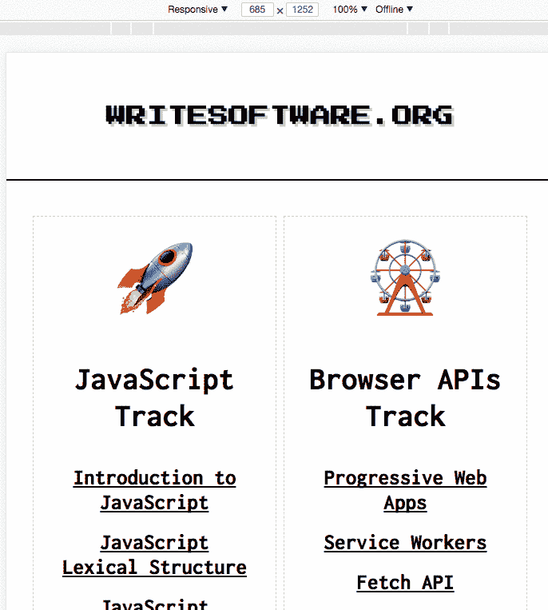
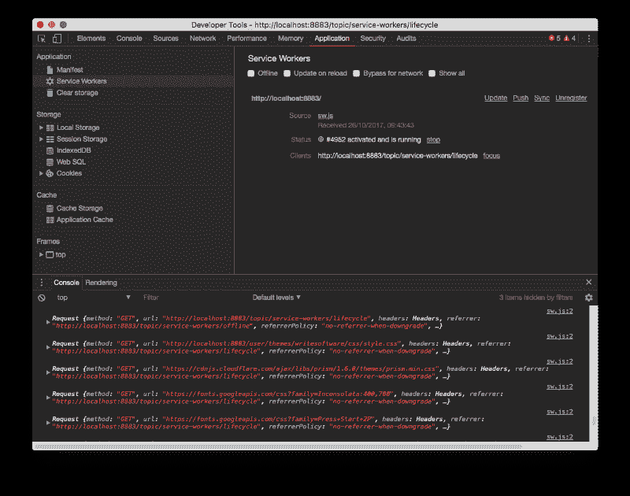
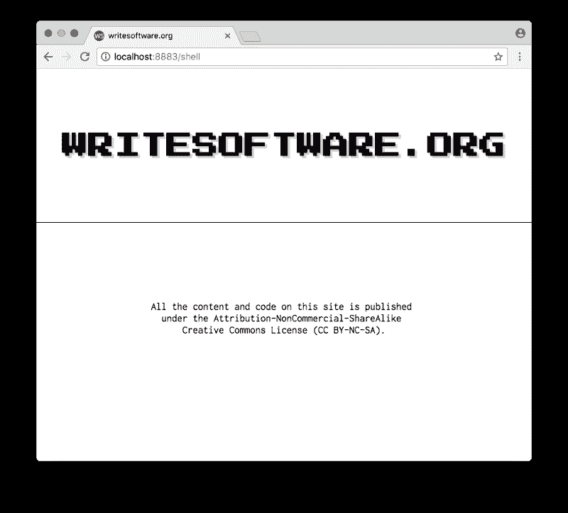
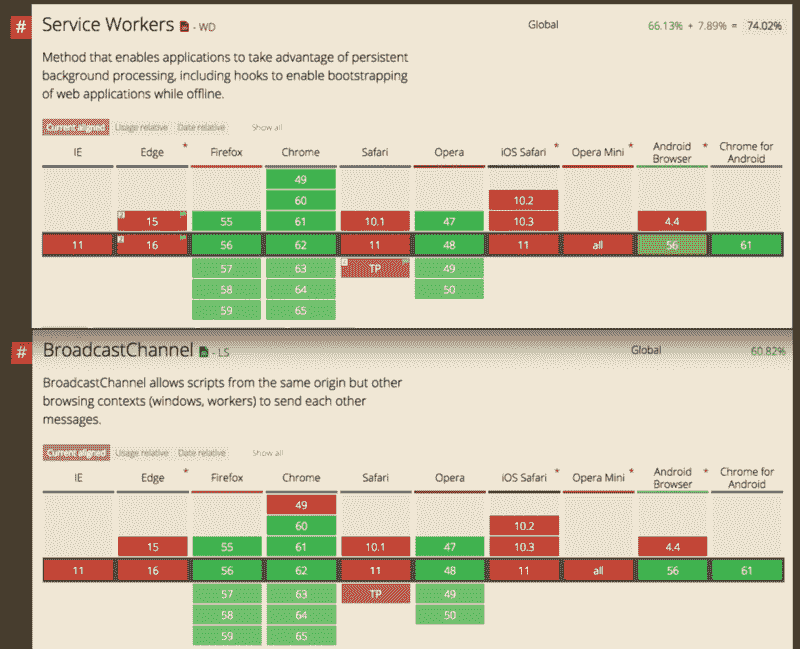

# 我如何让我的基于 CMS 的网站离线工作

> 原文：<https://www.freecodecamp.org/news/how-i-made-my-cms-based-website-work-offline-f34afc393ca8/>

> 对学习 JavaScript 感兴趣？在 jshandbook.com 获得我的电子书

这个案例研究解释了我是如何将离线工作的能力添加到 writesoftware.org 网站的(这个网站是基于 Grav 的，Grav 是一个很棒的面向开发者的基于 PHP 的 CMS 网站)。我通过引入一组名为 ****渐进式 Web 应用**** 的技术来做到这一点(特别是 ****服务工作者**** 和 ****缓存 API**** )。

> 关于这个主题和新的浏览器 API，有很多东西需要学习。我在我的[博客上发表了很多关于前端开发](https://flaviocopes.com)的相关内容，不要错过！

我将展示我可用的选项，以及为什么我选择了一种方法。

当我们完成后，我们将能够在移动设备或桌面浏览器上使用我们的网站，甚至在离线时，就像我在这里展示的那样:



Notice the “Offline” option in the network throttling settings

## 第一种方法:缓存优先

我首先通过使用缓存优先的方法来处理这个任务:当我们在服务工作器中拦截一个获取请求时，我们首先检查我们是否已经缓存了它。如果没有，**我们从网络上获取**。

这样做的好处是，当加载已经缓存的页面时，甚至是在线时，网站**速度会非常快**——特别是在慢速网络和[](https://developers.google.com/web/fundamentals/performance/poor-connectivity/#what_is_lie-fi)****的情况下。B** 但是当我发布新内容时，它也引入了一些管理缓存更新的复杂性。**

***这不会是我采用的最终解决方案*，但出于演示的目的，它值得一试。**

**我会经历几个阶段:**

1.  **我**引入一个服务工作者**并使用 JS 脚本加载它**
2.  **安装服务人员时，我**缓存了站点*骨架*****
3.  **我**拦截去往附加链接的网络请求**并**缓存它们****

### **介绍服务人员**

**我在站点根目录的一个`sw.js`文件中添加了服务工作者。这给了它足够的范围来处理所有的站点子文件夹，以及站点主页(更多关于 ****的[服务人员的范围](https://www.writesoftware.org/topic/service-workers/lifecycle)**** 这里)。目前的软件非常简单，因为它只记录任何网络请求:**

```
`self.addEventListener('fetch', (event) => {
  console.log(event.request)
})` 
```

**sw.js**

**我需要注册服务人员，我通过包含在每个页面中的脚本来完成此操作:**

```
`window.addEventListener('load', () => {
  if (!navigator.serviceWorker) {
    return
  }

  navigator.serviceWorker.register('/sw.js', {
    scope: '/'
  }).then(() => {
    //...ok
  }).catch((err) => {
    console.log('registration failed', err)
  })
})` 
```

**script.js**

**如果有服务人员，我们注册`sw.js`文件，下一次我刷新页面时，它应该工作正常:**

****

**此时，我需要在网站上做一些繁重的工作。首先，我需要想出一种方法来只为 ****应用程序外壳**** 提供服务:一组基本的 HTML + CSS 和 JS，它们将始终可用并显示给用户，即使在离线时也是如此。**

**它基本上是一个精简版的网站，有一个`<div class="wrapper row" id="content-wrapper"></div>`空元素，我们稍后会用内容填充它，可在`/shell`路径下获得:**

****

**所以用户第一次加载站点，会显示一个页面的普通版本(全 HTML 版本)，安装服务人员**。****

****现在，点击的任何其他页面都会被我们的服务人员拦截。每当一个页面被加载时，我们首先加载外壳，然后加载一个页面的精简版本，没有外壳， ****只有内容**** 。****

**怎么会？**

**我们监听`install`事件，该事件在安装或更新服务工作者时触发。当这种情况发生时，我们用 shell 的内容初始化缓存:基本的 HTML 布局，加上一些 CSS、JS 和一些外部资产:**

```
`const cacheName = 'writesoftware-v1'

self.addEventListener('install', (event) => {
  event.waitUntil(caches.open(cacheName).then(cache => cache.addAll([
    '/shell',
    'user/themes/writesoftware/favicon.ico',
    'user/themes/writesoftware/css/style.css',
    'user/themes/writesoftware/js/script.js',
    'https://fonts.googleapis.com/css?family=Press+Start+2P',
    'https://fonts.googleapis.com/css?family=Inconsolata:400,700',
    'https://cdnjs.cloudflare.com/ajax/libs/prism/1.6.0/themes/prism.min.css',
    'https://cdnjs.cloudflare.com/ajax/libs/prism/1.6.0/prism.min.js',
    'https://cdn.jsdelivr.net/prism/1.6.0/components/prism-jsx.min.js'
  ])))
})`
```

**sw.js**

**然后当我们执行获取时，我们拦截对我们页面的请求， ****从缓存中获取外壳，而不是去网络**** 。**

**如果 URL 属于 Google Analytics 或 ConvertKit，我会避免使用本地缓存，并且在不使用****【CORS】****的情况下获取它们(因为我不允许通过这种方法访问它们)。**

**然后，如果我请求一个**(只是一个页面的内容，而不是整个页面)，我只需发出一个获取请求就可以得到它。****

****如果不是偏的， ****我们返回外壳**** ，这是 ****在服务工人第一次安装的时候已经缓存**** 。****

**一旦获取完成，我就缓存它。**

```
`self.addEventListener('fetch', (event) => {
  const requestUrl = new URL(event.request.url)

  if (requestUrl.href.startsWith('https://www.googletagmanager.com') ||
      requestUrl.href.startsWith('https://www.google-analytics.com') ||
      requestUrl.href.startsWith('https://assets.convertkit.com')) {
    // don't cache, and no cors
    event.respondWith(fetch(event.request.url, { mode: 'no-cors' }))
    return
  }

  event.respondWith(caches.match(event.request)
    .then((response) => {
      if (response) { return response }
      if (requestUrl.origin === location.origin) {
        if (requestUrl.pathname.endsWith('?partial=true')) {
          return fetch(requestUrl.pathname)
        } else {
          return caches.match('/shell')
        }

        return fetch(`${event.request.url}?partial=true`)
      }
      return fetch(event.request.url)
    })
    .then(response => caches.open(cacheName).then((cache) => {
      cache.put(event.request.url, response.clone())
      return response
    }))
    .catch((error) => {
      console.error(error)
    }))
})` 
```

**sw.js**

**现在我编辑`script.js`文件来引入一个重要的特性:每当一个链接在我的页面上被点击，我就拦截它，并向 ****广播频道**** 发出一条消息。**

**由于服务人员目前仅在 Chrome、Firefox 和 Opera 中受支持，我可以放心地依靠 [BroadcastChannel API](https://developers.google.com/web/updates/2016/09/broadcastchannel) 来实现这一点。**

****

**首先，我连接到`ws_navigation`通道，并在其上附加一个`onmessage`事件处理程序。每当我收到一个事件，它都是来自服务人员的通信，有新的内容要在应用程序外壳中显示。所以我只是查找 id 为`content-wrapper`的元素，并将部分页面内容放入其中，有效地改变了用户看到的页面。**

**服务人员一注册， ****我就向这个渠道**** 发出一个消息，带有一个`fetchPartial`任务和一个 ****部分页面 URL 来获取**** 。这是初始页面加载的内容。**

******外壳被立即加载**** 因为它总是被缓存。不久之后，实际的内容被查找，也可能被缓存。**

```
`window.addEventListener('load', () => {
  if (!navigator.serviceWorker) { return }
  const channel = new BroadcastChannel('ws_navigation')

  channel.onmessage = (event) => {
    if (document.getElementById('content-wrapper')) {
      document.getElementById('content-wrapper').innerHTML = event.data.content
    }
  }

  navigator.serviceWorker.register('/sw.js', {
    scope: '/'
  }).then(() => {
    channel.postMessage({
      task: 'fetchPartial',
      url: `${window.location.pathname}?partial=true`
    })
  }).catch((err) => {
    console.log('SW registration failed', err)
  })
})` 
```

**script.js**

**缺少的位是 ****手按页面上的**** 。当一个链接被点击时，我拦截该事件，暂停它，并向服务工作者发送一条消息以获取带有该 URL 的部分。**

**当获取部分内容时，我会附加一个`?partial=true`查询来告诉我的后端只提供内容，而不是外壳。**

```
`window.addEventListener('load', () => {

  //...

  window.onclick = (e) => {
    let node = e.target
    while (node !== undefined && node !== null && node.localName !== 'a') {
      node = node.parentNode
    }
    if (node !== undefined && node !== null) {
      channel.postMessage({
        task: 'fetchPartial',
        url: `${node.href}?partial=true`
      })
      return false
    }
    return true
  }
})` 
```

**script.js**

**现在我们只是错过了处理这个事件。在服务人员端，我连接到`ws_navigation`通道并监听事件。我监听`fetchPartial`消息任务名称，虽然我可以简单地避免这个条件检查，因为这是这里发送的唯一事件。请注意，广播通道 API ****中的消息不会被分派到发出它们的同一个页面****——它们只在页面和 web worker 之间分派。**

******我检查 URL 是否被缓存**** 。如果是这样，我只是在通道上发送它作为响应消息并返回。**

**如果它没有被缓存，我获取它，作为消息发送回页面，然后缓存它以备下次访问。**

```
`const channel = new BroadcastChannel('ws_navigation')
channel.onmessage = (event) => {
  if (event.data.task === 'fetchPartial') {
    caches
      .match(event.data.url)
      .then((response) => {
        if (response) {
          response.text().then((body) => {
            channel.postMessage({ url: event.data.url, content: body })
          })
          return
        }

        fetch(event.data.url).then((fetchResponse) => {
          const fetchResponseClone = fetchResponse.clone()
          fetchResponse.text().then((body) => {
            channel.postMessage({ url: event.data.url, content: body })
          })

          caches.open(cacheName).then((cache) => {
            cache.put(event.data.url, fetchResponseClone)
          })
        })
      })
      .catch((error) => {
        console.error(error)
      })
  }
}` 
```

**sw.js**

**我们快完成了。**

**现在，一旦有用户来访，服务人员就会被安装到网站上。后续的页面加载通过 [Fetch API](https://www.writesoftware.org/topic/fetch-api) 动态处理，不需要完整的页面加载。第一次访问后，页面被缓存，加载速度快得令人难以置信，更重要的是， ****甚至在离线时加载**** ！**

**而且——这一切都是一个**的渐进增强。旧的浏览器和不支持服务人员的浏览器只能正常工作。****

****现在，劫持浏览器导航会带来一些问题:****

1.  ****当显示新页面时, **URL 必须改变**。后退按钮应该正常工作，浏览器历史也是如此。****
2.  ****页面标题**必须改变**以反映新的页面标题。****
3.  ****我们需要**通知 Google Analytics API** 一个新的页面已经被加载，以避免遗漏一个重要的指标，比如每个访问者的页面浏览量。****
4.  ****当动态加载新内容时，**代码片段不再突出显示**。****

****让我们解决这些挑战。****

### ****使用历史 API 修复 URL、标题和后退按钮****

****除了在 script.js 的消息处理程序中注入部分 HTML 之外，我们还触发了`history.pushState()`方法:****

```
**`channel.onmessage = (event) => {
  if (document.getElementById('content-wrapper')) {
    document.getElementById('content-wrapper').innerHTML = event.data.content
    const url = event.data.url.replace('?partial=true', '')
    history.pushState(null, null, url)
  }
}`** 
```

****script.js****

****这是可行的，但是页面标题在浏览器 UI 中没有改变。我们需要以某种方式从页面中获取它。我决定在保留页面标题的页面内容部分中放置一个隐藏的 span。然后我们可以使用 DOM API 从页面中获取它，并设置`document.title`属性:****

```
**`channel.onmessage = (event) => {
  if (document.getElementById('content-wrapper')) {
    document.getElementById('content-wrapper').innerHTML = event.data.content
    const url = event.data.url.replace('?partial=true', '')
    if (document.getElementById('browser-page-title')) {
      document.title = document.getElementById('browser-page-title').innerHTML
    }
    history.pushState(null, null, url)
  }
}`** 
```

****script.js****

### ****修复谷歌分析****

****Google Analytics 开箱即用，但当动态加载页面时，它无法创造奇迹。我们必须使用它提供的 API 来通知它有新的页面加载。由于我使用了全球站点标记(`gtag.js`)跟踪，我需要调用:****

```
**`gtag('config', 'UA-XXXXXX-XX', {'page_path': '/the-url'})`** 
```

****script.js****

****到上面处理页面变化的代码中:****

```
**`channel.onmessage = (event) => {
  if (document.getElementById('content-wrapper')) {
    document.getElementById('content-wrapper').innerHTML = event.data.content
    const url = event.data.url.replace('?partial=true', '')
    if (document.getElementById('browser-page-title')) {
      document.title = document.getElementById('browser-page-title').innerHTML
    }
    history.pushState(null, null, url)
    gtag('config', 'UA-XXXXXX-XX', {'page_path': url})
  }
}`** 
```

****script.js****

****如果…用户离线了怎么办？理想情况下，应该有一个`fetch`事件监听器来缓存任何发送到 Google Analytics 的请求，并在我再次上线时重放它们。****

****谢天谢地[有一个库完全做到了这一点](https://developers.google.com/web/updates/2016/07/offline-google-analytics)，依靠 IndexedDB 来存储数据。如果你更喜欢使用这个库来处理更高层次的缓存，那么它已经被[移到了 Workbox](https://workboxjs.org/reference-docs/latest/module-workbox-google-analytics.html) 中。****

### ****修复语法突出显示****

****我需要在页面上修改的最后一件事是突出显示代码片段的登录。我使用 Prism syntax highlighter，它们让事情变得非常简单——我只需要在我的`onmessage`处理程序中添加一个调用`Prism.highlightAll()`:****

```
**`channel.onmessage = (event) => {
  if (document.getElementById('content-wrapper')) {
    document.getElementById('content-wrapper').innerHTML = event.data.content
    const url = event.data.url.replace('?partial=true', '')
    if (document.getElementById('browser-page-title')) {
      document.title = document.getElementById('browser-page-title').innerHTML
    }
    history.pushState(null, null, url)
    gtag('config', 'UA-XXXXXX-XX', {'page_path': url})
    Prism.highlightAll()
  }
}`** 
```

****script.js****

****`script.js`的完整代码是:****

```
**`window.addEventListener('load', () => {
  if (!navigator.serviceWorker) { return }
  const channel = new BroadcastChannel('ws_navigation')

  channel.onmessage = (event) => {
    if (document.getElementById('content-wrapper')) {
      document.getElementById('content-wrapper').innerHTML = event.data.content
      const url = event.data.url.replace('?partial=true', '')
      if (document.getElementById('browser-page-title')) {
        document.title = document.getElementById('browser-page-title').innerHTML
      }
      history.pushState(null, null, url)
      gtag('config', 'UA-1739509-49', {'page_path': url})
      Prism.highlightAll()
    }
  }

  navigator.serviceWorker.register('/sw.js', {
    scope: '/'
  }).then(() => {
    channel.postMessage({
      task: 'fetchPartial',
      url: `${window.location.pathname}?partial=true`
    })
  }).catch((err) => {
    console.log('SW registration failed', err)
  })

  window.onclick = (e) => {
    let node = e.target
    while (node !== undefined && node !== null && node.localName !== 'a') {
      node = node.parentNode
    }
    if (node !== undefined && node !== null) {
      channel.postMessage({
        task: 'fetchPartial',
        url: `${node.href}?partial=true`
      })
      return false
    }
    return true
  }
})`** 
```

****script.js****

****和`sw.js:`****

```
**`const cacheName = 'writesoftware-v1'

self.addEventListener('install', (event) => {
  event.waitUntil(caches.open(cacheName).then(cache => cache.addAll([
    '/shell',
    'user/themes/writesoftware/favicon.ico',
    'user/themes/writesoftware/css/style.css',
    'user/themes/writesoftware/js/script.js',
    'user/themes/writesoftware/img/offline.gif',
    'https://fonts.googleapis.com/css?family=Press+Start+2P',
    'https://fonts.googleapis.com/css?family=Inconsolata:400,700',
    'https://cdnjs.cloudflare.com/ajax/libs/prism/1.6.0/themes/prism.min.css',
    'https://cdnjs.cloudflare.com/ajax/libs/prism/1.6.0/prism.min.js',
    'https://cdn.jsdelivr.net/prism/1.6.0/components/prism-jsx.min.js'
  ])))
})

self.addEventListener('fetch', (event) => {
  const requestUrl = new URL(event.request.url)

  if (requestUrl.href.startsWith('https://www.googletagmanager.com') ||
      requestUrl.href.startsWith('https://www.google-analytics.com') ||
      requestUrl.href.startsWith('https://assets.convertkit.com')) {
    // don't cache, and no cors
    event.respondWith(fetch(event.request.url, { mode: 'no-cors' }))
    return
  }

  event.respondWith(caches.match(event.request)
    .then((response) => {
      if (response) { return response }
      if (requestUrl.origin === location.origin) {
        if (requestUrl.pathname.endsWith('?partial=true')) {
          return fetch(requestUrl.pathname)
        } else {
          return caches.match('/shell')
        }

        return fetch(`${event.request.url}?partial=true`)
      }
      return fetch(event.request.url)
    })
    .then(response => caches.open(cacheName).then((cache) => {
      if (response) {
        cache.put(event.request.url, response.clone())
      }
      return response
    }))
    .catch((error) => {
      console.error(error)
    }))
})

const channel = new BroadcastChannel('ws_navigation')
channel.onmessage = (event) => {
  if (event.data.task === 'fetchPartial') {
    caches
      .match(event.data.url)
      .then((response) => {
        if (response) {
          response.text().then((body) => {
            channel.postMessage({ url: event.data.url, content: body })
          })
          return
        }

        fetch(event.data.url).then((fetchResponse) => {
          const fetchResponseClone = fetchResponse.clone()
          fetchResponse.text().then((body) => {
            channel.postMessage({ url: event.data.url, content: body })
          })

          caches.open(cacheName).then((cache) => {
            cache.put(event.data.url, fetchResponseClone)
          })
        })
      })
      .catch((error) => {
        console.error(error)
      })
  }
}`** 
```

****sw.js****

## ****第二种方法:网络-首先，放弃应用外壳****

****虽然第一种方法给了我们一个完全正常工作的应用程序，但我有点怀疑并担心在客户端缓存页面的副本太长时间。所以我决定尝试一种网络优先的方法:当用户加载一个页面时，首先从网络上获取。****

****如果网络调用由于某种原因失败，我会在缓存中查找页面，看看我们是否缓存了它。否则，如果页面完全脱机，我会向用户显示一个 GIF，如果页面不存在，我会显示另一个 GIF(我可以找到它，但我得到了一个 404 错误)。****

****一旦我们得到一个页面，我们就缓存它(不检查我们以前是否缓存过它，我们只存储最新的版本)。****

****作为一个实验，我还完全去掉了应用程序外壳，因为在我的情况下，我还没有打算创建一个可安装的应用程序。没有最新的 Android 设备，我无法真正测试它，而且我更喜欢避免在没有适当测试的情况下扔掉东西。****

****为此，我从`install`服务工作者事件中剥离了应用程序外壳。我依靠服务人员和缓存 API 来交付站点的普通页面，而不管理部分更新。当加载一个完整页面时，我也放弃了`/shell` fetch 劫持。在第一个页面加载时没有延迟，但我们仍然在以后导航到其他页面时加载片段。****

****我仍然使用`script.js`和`sw.js`来托管代码，其中`script.js`是初始化服务工作者的文件，并且还拦截客户端的点击。****

****这里是`script.js`:****

```
**`const OFFLINE_GIF = '/user/themes/writesoftware/img/offline.gif'

const fetchPartial = (url) => {
  fetch(`${url}?partial=true`)
  .then((response) => {
    response.text().then((body) => {
      if (document.getElementById('content-wrapper')) {
        document.getElementById('content-wrapper').innerHTML = body
        if (document.getElementById('browser-page-title')) {
          document.title = document.getElementById('browser-page-title').innerHTML
        }
        history.pushState(null, null, url)
        gtag('config', 'UA-XXXXXX-XX', { page_path: url })
        Prism.highlightAll()
      }
    })
  })
  .catch(() => {
    if (document.getElementById('content-wrapper')) {
    document.getElementById('content-wrapper').innerHTML = `<center><h2>Offline</h2></center>`
    }
  })
}

window.addEventListener('load', () => {
  if (!navigator.serviceWorker) { return }

  navigator.serviceWorker.register('/sw.js', {
    scope: '/'
  }).then(() => {
    fetchPartial(window.location.pathname)
  }).catch((err) => {
    console.log('SW registration failed', err)
  })

  window.onclick = (e) => {
    let node = e.target
    while (node !== undefined && node !== null && node.localName !== 'a') {
      node = node.parentNode
    }
    if (node !== undefined && node !== null) {
      fetchPartial(node.href)
      return false
    }
    return true
  }
})`** 
```

****script.js****

****这里是`sw.js`:****

```
**`const CACHE_NAME = 'writesoftware-v1'
const OFFLINE_GIF = '/user/themes/writesoftware/img/offline.gif'
const PAGENOTFOUND_GIF = '/user/themes/writesoftware/img/pagenotfound.gif'

self.addEventListener('install', (event) => {
  event.waitUntil(caches.open(CACHE_NAME).then(cache => cache.addAll([
    '/user/themes/writesoftware/favicon.ico',
    '/user/themes/writesoftware/css/style.css',
    '/user/themes/writesoftware/js/script.js',
    '/user/themes/writesoftware/img/offline.gif',
    '/user/themes/writesoftware/img/pagenotfound.gif',
    'https://fonts.googleapis.com/css?family=Press+Start+2P',
    'https://fonts.googleapis.com/css?family=Inconsolata:400,700',
    'https://cdnjs.cloudflare.com/ajax/libs/prism/1.6.0/themes/prism.min.css',
    'https://cdnjs.cloudflare.com/ajax/libs/prism/1.6.0/prism.min.js',
    'https://cdn.jsdelivr.net/prism/1.6.0/components/prism-jsx.min.js'
  ])))
})

self.addEventListener('fetch', (event) => {
  if (event.request.method !== 'GET') return
  if (event.request.headers.get('accept').indexOf('text/html') === -1) return

  const requestUrl = new URL(event.request.url)
  let options = {}

  if (requestUrl.href.startsWith('https://www.googletagmanager.com') ||
      requestUrl.href.startsWith('https://www.google-analytics.com') ||
      requestUrl.href.startsWith('https://assets.convertkit.com')) {
    // no cors
    options = { mode: 'no-cors' }
  }

  event.respondWith(fetch(event.request, options)
    .then((response) => {
      if (response.status === 404) {
        return fetch(PAGENOTFOUND_GIF)
      }
      const resClone = response.clone()
      return caches.open(CACHE_NAME).then((cache) => {
        cache.put(event.request.url, response)
        return resClone
      })
    })
    .catch(() => caches.open(CACHE_NAME).then(cache => cache.match(event.request.url)
      .then((response) => {
        if (response) {
          return response
        }
        return fetch(OFFLINE_GIF)
      })
      .catch(() => fetch(OFFLINE_GIF)))))`**
```

****sw.js****

### ****第三种方法:变得更简单，完全没有偏音****

****作为一个实验，我放弃了获取部分内容的点击拦截器，我依靠服务人员和缓存 API 来交付站点的普通页面，而不管理部分更新:****

****`script.js`:****

```
**`window.addEventListener('load', () => {
  if (!navigator.serviceWorker) { return }
  navigator.serviceWorker.register('/sw.js', {
    scope: '/'
  }).catch((err) => {
    console.log('SW registration failed', err)
  })
})`** 
```

****script.js****

****`sw.js`:****

```
**`const CACHE_NAME = 'writesoftware-v1'
const OFFLINE_GIF = '/user/themes/writesoftware/img/offline.gif'
const PAGENOTFOUND_GIF = '/user/themes/writesoftware/img/pagenotfound.gif'

self.addEventListener('install', (event) => {
  event.waitUntil(caches.open(CACHE_NAME).then(cache => cache.addAll([
    '/user/themes/writesoftware/favicon.ico',
    '/user/themes/writesoftware/css/style.css',
    '/user/themes/writesoftware/js/script.js',
    '/user/themes/writesoftware/img/offline.gif',
    '/user/themes/writesoftware/img/pagenotfound.gif',
    'https://fonts.googleapis.com/css?family=Press+Start+2P',
    'https://fonts.googleapis.com/css?family=Inconsolata:400,700',
    'https://cdnjs.cloudflare.com/ajax/libs/prism/1.6.0/themes/prism.min.css',
    'https://cdnjs.cloudflare.com/ajax/libs/prism/1.6.0/prism.min.js',
    'https://cdn.jsdelivr.net/prism/1.6.0/components/prism-jsx.min.js'
  ])))
})

self.addEventListener('fetch', (event) => {
  if (event.request.method !== 'GET') return
  if (event.request.headers.get('accept').indexOf('text/html') === -1) return

  const requestUrl = new URL(event.request.url)
  let options = {}

  if (requestUrl.href.startsWith('https://www.googletagmanager.com') ||
      requestUrl.href.startsWith('https://www.google-analytics.com') ||
      requestUrl.href.startsWith('https://assets.convertkit.com')) {
    // no cors
    options = { mode: 'no-cors' }
  }

  event.respondWith(fetch(event.request, options)
    .then((response) => {
      if (response.status === 404) {
        return fetch(PAGENOTFOUND_GIF)
      }
      const resClone = response.clone()
      return caches.open(CACHE_NAME).then((cache) => {
        cache.put(event.request.url, response)
        return resClone
      })
    })
    .catch(() => caches.open(CACHE_NAME).then(cache => cache.match(event.request.url)
      .then((response) => {
        return response || fetch(OFFLINE_GIF)
      })
      .catch(() => fetch(OFFLINE_GIF)))))`** 
```

****sw.js****

****我认为这是一个在保持简单的同时给网站增加离线功能的简单例子。任何类型的网站都可以添加这样的服务人员，而不需要太多的复杂性，如果这对你来说足够了。****

## ****我最终在我的网站上实现了什么****

****最后，我不认为这种最新的方法是可行的。但是我也避免了应用程序外壳，因为我不想创建一个可安装的应用程序，在我的特殊情况下，它使我的导航变得复杂。我用 fetch 做了部分更新，避免了从服务器重新加载第一页后的整个页面。****

****所有这些都采用了网络优先的方法，以避免必须处理缓存更新和版本控制资产:毕竟，它仍然完全依赖于从磁盘加载缓存页面的客户端缓存策略，因此我仍然可以从缓存中受益，而不会使部署变得复杂。****

> ****对学习 JavaScript 感兴趣？在 jshandbook.com 获得我的电子书****