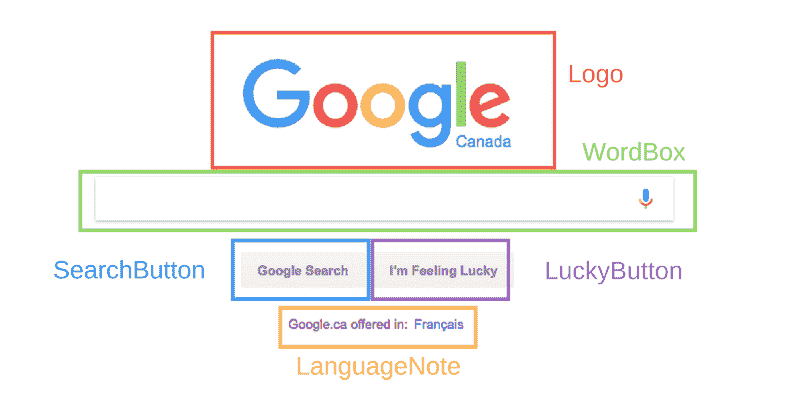

# 关于 React 你应该知道的一切:你需要开始构建的基础

> 原文：<https://www.freecodecamp.org/news/everything-you-need-to-know-about-react-eaedf53238c4/>

斯科特·多姆斯

# 关于 React 你应该知道的一切:你需要开始构建的基础


你是不是对 React 很好奇，一直没机会学？或者也许你过去尝试过教程，但很难掌握核心概念？或者可能你已经学了基础，但是想巩固知识？不管怎样，这篇文章是给你的。

我们将构建一个简单的 React 音乐播放器，并在此过程中加入新的 React 概念。

以下是我们将要介绍的内容:

*   什么是 React 组件？
*   反应随机渲染
*   类别与功能组件
*   JSX
*   状态
*   事件处理
*   异步设置状态
*   小道具
*   参考文献

这就是构建和维护 React 应用程序所需的一切。但是我们将一点一点地介绍它。

### 设置

情况是这样的:一家小型初创企业向你寻求帮助。他们为用户创建了一个上传音乐的页面，并以鲜艳的颜色显示出来。但是他们需要你去做困难的部分——也就是让它工作。

首先，创建一个新的项目目录，并添加以下三个文件。

在本教程中，确保你使用的是最新版本的 [Chrome](https://www.google.com/intl/en/chrome/browser/desktop/index.html) ，否则上面代码中的动画将无法工作。

感谢 [Steven Fabre](https://twitter.com/stevenfabre) 的播放按钮 CSS 和 [Justin Windle](https://codepen.io/soulwire/) 的可视化代码([你可以在这里查看原文](https://codepen.io/soulwire/pen/Dscga))。

在代码编辑器和浏览器中打开`index.html`，让我们开始吧！

### 什么是反应？

React 是一种构建用户界面的方式。它只关心你在前端看到的东西。React 通过将每个页面切割成小块，使得用户界面非常容易构建。我们称这些零件为组件。

下面是一个将页面剪切成组件的示例:



上面突出显示的每个部分都被视为一个组件。但是这对一个开发者来说意味着什么呢？

### 什么是 React 组件？

React 组件是代表页面一部分的一段代码。每个组件都是一个 JavaScript 函数，它返回一段代表一个网页的代码。

为了构建一个页面，我们按照一定的顺序调用这些函数，将结果放在一起，并显示给用户。

先写一个组件在`<scri`pt>t`ag in inde`x.html 机智`h th` e ty `pe of “text/`巴别塔里面:

```
<script type="text/babel">  function OurFirstComponent() {    return (      // Code that represents the UI element goes here    );  }</script>
```

当我们调用`OurFirstcomponent()`函数时，我们将获得页面的一部分。

您也可以编写这样的函数:

```
const OurFirstComponent = () => {  return (    // Stuff to make this component goes here  );}
```

React 使用一种叫做 JSX 的语言，它看起来像 HTML，但在 JavaScript 内部工作，而 HTML 通常不这样做。

您可以将纯 HTML 添加到此部分，使其出现在用户界面上:

```
<script type="text/babel">  function OurFirstComponent() {    return (      <h1>Hello, I am a React Component!</h1>    );  }</script>
```

当我们调用`OurFirstComponent()`函数时，我们得到一点 JSX。我们可以用一个叫做 [ReactDOM](https://www.npmjs.com/package/react-dom) 的东西把它放到页面上。

```
<script type="text/babel">  function OurFirstComponent() {    return (      <h1>Hello, I am a React Component!</h1>    );  }
```

```
 const placeWeWantToPutComponent = document.getElementById('hook');  ReactDOM.render(OurFirstComponent(), placeWeWantToPutComponent);</script>
```

现在我们的`<` h1 >标签将被放入带有`ID of`钩子的元素中。刷新浏览器时，它应该是这样的:


我们也可以这样编写我们的 JSX 组件:

```
ReactDOM.render(<OurFirstComponent />, placeWeWantToPutComponent);
```

这是标准的——像编写 HTML 一样调用组件。

### 将组件组装在一起

我们可以将 React 组件放在其他组件中。

```
<script type="text/babel">  function OurFirstComponent() {    return (      <h1>I am the child!</h1>    );  }
```

```
 function Container() {    return (      <div>        <h1>I am the parent!</h1>        <OurFirstComponent />      </div>    );  }
```

```
 const placeWeWantToPutComponent = document.getElementById('hook');  ReactDOM.render(<Container />, placeWeWantToPutComponent);</script>
```


这就是我们如何从 React 片段中构建页面——通过将组件嵌套在彼此内部。

### 类别组件

到目前为止，我们一直把组件写成函数。这些被称为*功能组件。*

但是你可以用另一种方式编写组件，比如 JavaScript 类。这些被称为类组件。

```
class Container extends React.Component {  render() {    return (      <div>        <h1>I am the parent!</h1>        <OurFirstComponent />      </div>    );  }}
```

```
const placeWeWantToPutComponent = document.getElementById('hook');ReactDOM.render(<Container />, placeWeWantToPutComponent);
```

类组件必须有一个名为`render()` *的功能。*渲染函数返回组件的 JSX。它们可以像功能组件一样使用，比如:`<AClassComponent` / >。

你应该使用功能组件而不是类组件，因为它们更容易阅读，除非你需要组件状态。

### JavaScript 在 JSX

您可以将 JavaScript 变量放入 JSX 中，如下所示:

```
class Container extends React.Component {  render() {    const greeting = 'I am a string!';    return (      <div>        <h1>{ greeting }</h1>        <OurFirstComponent />      </div>    );  }}
```

现在“我是一根绳子！”会在`h1`里面。

你也可以做更难的事情，比如调用一个函数:

```
class Container extends React.Component {  render() {    const addNumbers = (num1, num2) => {      return num1 + num2;    };    return (      <div>        <h1>The sum is: { addNumbers(1, 2) }</h1>        <OurFirstComponent />      </div>    );  }}
```


### JSX 抓到你了

将`OurFirstComponent()`重命名为`PlayButton`。我们希望它返回以下内容:

```
<a href="#" title="Play video" class="play" />
```

但是有一个问题:`class`是 JavaScript 中的一个关键字，所以我们不能使用。那么我们如何给出我们的`<`；一部>一部`ss o` f 剧？

请改用名为`className` 的属性:

```
<script type="text/babel">  function PlayButton() {    return <a href="#" title="Play video" className="play" />;  }
```

```
 class Container extends React.Component {    render() {      return (        <div>          <PlayButton />        </div>      );    }  }
```

```
 const placeWeWantToPutComponent = document.getElementById('hook');  ReactDOM.render(<Container />, placeWeWantToPutComponent);</script>
```

### 这个组件在做什么？

类组件可以存储关于它们当前情况的信息。这些信息被称为`state`，存储在一个 JavaScript 对象中。

在下面的代码中，我们有一个表示组件状态的对象。它有一个`isMusicPlaying`的`key`，它有一个`false`的`value`。这个对象在第一次使用这个类时被调用的`constructor`方法中赋给了`this.state`。

```
class Container extends React.Component {  constructor(props) {    super(props);    this.state = { isMusicPlaying: false };  }    render() {    return (      <div>        <PlayButton />      </div>    );  }}
```

React 组件的`constructor`方法总是需要在调用其他任何方法之前调用`super(props)`。

好吧，那么我们该怎么处理`state`？为什么会存在？

### 基于状态更改我们的 React 组件

状态是基于*事件*更新我们的 UI 的方法。

在本教程中，我们将基于用户点击播放按钮，使用状态将播放按钮从*暂停*改为*播放*。

当用户点击按钮时，状态会更新，然后更新 UI。

我们是这样开始的。我们可以用`this.state`来看组件状态。在下面的代码中，我们查看状态并使用它来决定向用户显示什么文本。

```
class Container extends React.Component {  constructor(props) {    super(props);    this.state = { isMusicPlaying: false };  }
```

```
 render() {    const status = this.state.isMusicPlaying ? 'Playing' : 'Not playing';    return (      <div>        <h1>{ status }</h1>        <PlayButton />      </div>    );  }}
```

在渲染函数中，`this`总是引用它所在的组件。


但是这并没有多大用处，除非我们有办法改变`this.state.isMusicPlaying`。

### 当我们的组件发生问题时

用户可以通过点击播放按钮与我们的组件进行交互。我们想对那些事件做出反应(哈…哈…)。

我们通过处理事件的函数来做到这一点。我们称这些*事件处理器为*。

```
class Container extends React.Component {  constructor(props) {    super(props);    this.state = { isMusicPlaying: false };  }
```

```
 handleClick(event) {    // Do something about the click  };
```

```
 render() {    let status = this.state.isMusicPlaying     ? 'Playing :)'     : 'Not playing :(';    return (      <div>        <h1 onClick={this.handleClick.bind(this)}>{ status }</h1>        <PlayButton />      </div>    );  }}
```

当用户点击`h1`时，我们的组件将运行`handleClick`函数。该函数获取事件对象作为参数，这意味着它可以根据需要使用它。

我们在`handleClick`上使用`.bind`方法来确保`this`指的是整个组件，而不仅仅是`h1`。

### 这个组件应该做什么

当我们改变组件的状态时，它会再次调用 render 函数。

我们可以用`this.setState()`改变状态，如果我们给它一个代表新状态的新对象。

页面上的组件将始终表示其当前状态。React 为我们做到了这一点。

```
handleClick() {    if (this.state.isMusicPlaying) {      this.setState({ isMusicPlaying: false });    } else {      this.setState({ isMusicPlaying: true });    }  };
```

但是点击一个`h1`不如点击我们实际的播放按钮。让我们成功吧。

### 组件之间的对话

您的组件可以相互通信。让我们试一试。

我们可以用一个叫做 T1 的东西来判断音乐是否在播放。属性是从父组件到子组件共享的信息。

JSX 的道具看起来和 HTML 属性一样。

我们给`PlayButton`一个道具叫`isMusicPlaying`，和`this.state`里的`isMusicPlaying`一样。

```
class Container extends React.Component {  constructor(props) {    super(props);    this.state = { isMusicPlaying: false };  }
```

```
 handleClick() {    if (this.state.isMusicPlaying) {      this.setState({ isMusicPlaying: false });    } else {      this.setState({ isMusicPlaying: true });    }  };
```

```
 render() {    return (      <div>        <PlayButton isMusicPlaying={this.state.isMusicPlaying} />      </div>    );  }}
```

当`Container`的状态改变时，`PlayButton` prop 也会改变，`PlayButton`函数会被再次调用。这意味着我们的组件将在屏幕上更新。

在`PlayButton`内部，我们可以对变化做出反应，因为`PlayButton`得到了作为参数的道具:

```
function PlayButton(props) {  const className = props.isMusicPlaying ? 'play active' : 'play';  return <a href="#" title="Play video" className={className} />;}
```

如果我们将状态更改为 `this.state = { isMusicPlaying: true };`并重新加载页面，您应该会看到暂停按钮:


### 作为道具的事件

你的道具不一定只是信息。它们可以是函数。

```
function PlayButton(props) {  const className = props.isMusicPlaying ? 'play active' : 'play';  return <;a onClick={props.onClick} href="#" title="Play video" className={className} />;}
```

```
class Container extends React.Component {  constructor(props) {    super(props);    this.state = { isMusicPlaying: false };  }
```

```
 handleClick() {    if (this.state.isMusicPlaying) {      this.setState({ isMusicPlaying: false });    } else {      this.setState({ isMusicPlaying: true });    }  };
```

```
 render() {    return (      <div>        <PlayButton           onClick={this.handleClick.bind(this)}           isMusicPlaying={this.state.isMusicPlaying}         />      </div>    );  }}
```

现在，当我们点击`PlayButton`，它将改变`Container`的状态，这将改变`PlayButton`的`props`，这将导致它在页面上更新。

### setState 的不好之处在于

不好是因为它不能马上做事情。React 等待一段时间，看看是否有更多的变化，然后它做状态改变。

这意味着你不能确定当你调用`setState`时你的状态是什么。

所以你不应该这样做:

```
handleClick() {  this.setState({ isMusicPlaying: !this.state.isMusicPlaying });};
```

如果你在旧状态的基础上改变你的状态，你需要做不同的事情。

你需要给`setState`一个函数，而不是一个对象。这个函数获取旧状态作为参数，并返回一个新状态的对象。

看起来是这样的:

```
handleClick() {  this.setState(prevState => {    return {       isMusicPlaying: !prevState.isMusicPlaying       };  });};
```

这更困难，但只有在您使用旧状态创建新状态时才需要。如果没有，可以只给`setState`一个对象。

### 什么是裁判？

让我们来点音乐吧。

首先，我们添加一个`<aud` io >标签:

```
class Container extends React.Component {  constructor(props) {    super(props);    this.state = { isMusicPlaying: false };  }
```

```
 handleClick() {    this.setState(prevState => {      return {         isMusicPlaying: !prevState.isMusicPlaying         };    });  };
```

```
 render() {    return (      <div>        <PlayButton           onClick={this.handleClick.bind(this)}           isMusicPlaying={this.state.isMusicPlaying}         />        <audio id="audio" />      </div>    );  }}
```

我们需要一种方法来获得那个`<aud` io >标签，并在其上调用 e `ither` play `() or p` ause()。我们可以做 `with document.getElementById('audio').` play()，但是有更好的反应方式。

我们给它一个名为`ref`的属性，调用它时将`<aud` io >元素作为第一个参数。它需要 `that &`lt；audio >元素并作为 this.audio 的`signs it t`

```
<audio id="audio" ref={(audioTag) => { this.audio = audioTag }} />
```

这个函数将在每次`Container`渲染时被调用，这意味着`this.audio`将总是最新的，并等于`<aud` io >标签。

然后我们可以播放和暂停音乐:

```
handleClick() {  if (this.state.isMusicPlaying) {    this.audio.pause();  } else {    this.audio.play();  }  this.setState(prevState => {    return {       isMusicPlaying: !prevState.isMusicPlaying       };  });};
```

使用`Choose files`按钮上传一个音乐文件(最好是 mp3 文件),然后点击播放，就可以欣赏了！

### 离开 Index.html

正如你可能已经猜到的，我们的 React 不应该永远存在于`<scri` pt >标签中。

React 需要大量的构建配置。幸运的是，像 [Create React App](https://github.com/facebookincubator/create-react-app) 这样的工具会帮你处理所有这些事情。

安装它来创建您自己的 React 项目。遵循他们的简短教程，开始编辑`src`目录中的 JavaScript，应用您在这里学到的所有 React 知识！

### 恭喜你！

你现在可以做出反应了。

接下来，查看几篇文章以获取更多信息。一个是关于 [React 最佳实践](https://engineering.musefind.com/our-best-practices-for-writing-react-components-dec3eb5c3fc8)，另一个是关于 React 的有用部分，叫做[生命周期方法](https://engineering.musefind.com/react-lifecycle-methods-how-and-when-to-use-them-2111a1b692b1) **。**

如果你从这篇文章中学到了什么，请点击那些拍手的手，并与你的朋友分享。

你也可以在[媒体](https://medium.com/@scottdomes)和[推特](https://twitter.com/scottdomes)上关注我。