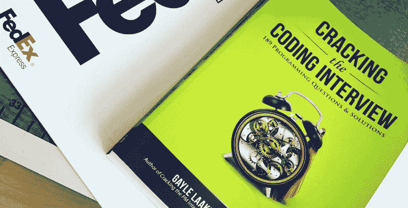
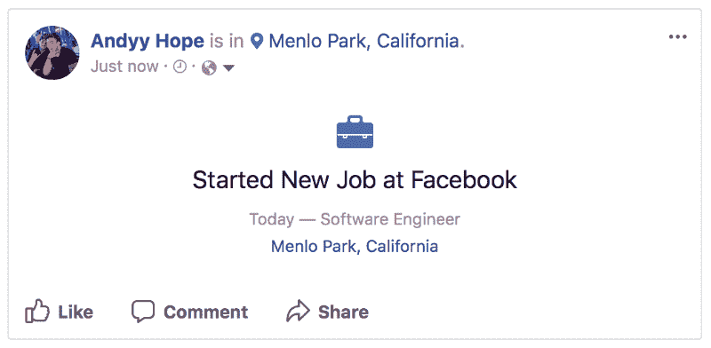

# 我刚在脸书找到一份开发人员的工作。以下是我如何准备面试的。

> 原文：<https://www.freecodecamp.org/news/software-engineering-interviews-744380f4f2af/>

安迪·霍普

# 我刚在脸书找到一份开发人员的工作。以下是我如何准备面试的。

我刚刚结束了在硅谷科技公司的七次现场面试。我最终接受了脸书提供的一份软件工程工作。

以下是我是如何准备这些面试的，以及我一路走来学到的东西。

### 我多年的硅谷之旅

当我在澳大利亚的大学学习计算机科学时，我总是想象我的未来是在硅谷当一名软件工程师。

我喜欢处于所有科技行业创新的中心的想法——也喜欢它的失误。这个目标让我保持动力。它让我保持专注。

为了学习，我离开了在墨尔本一家了不起的公司担任 iOS 首席工程师的职位，回到了我的家乡珀斯。在那里，我会为即将到来的硅谷面试做准备。我知道会非常困难和艰巨。

如果你向一屋子的软件工程师提及技术面试过程，许多人会大声反对常见的面试做法。许多争论来自于这样的推理，即在白板上解决算法实际上并不代表，或者转化为软件工程师的日常任务。

为了这篇文章，我就不深入讨论这个话题了。相反，我将从候选人的角度探索这些不同类型的面试实践，我也将关注我从这个过程中学到的东西。

### 面试是一种技能

在准备期间，我一直知道面试会很有挑战性。但老实说，直到我深入第一次面试时，我才知道这有多难。

在面试的准备阶段，我使用了付费和免费的服务，通过电话模拟编码和白板面试，与有行业面试经验的人进行面试。那些面试练习对我应对相关压力至关重要。但我后来意识到，它们只是真正面试的一小部分。

我建议不要在没有几次模拟或真实面试的情况下参加你梦想中的工作的面试。这种紧张感是难以置信的，只有通过练习才能减轻。

就像生活中的许多其他事情一样，练习会提高你的自信。

### 我遇到的不同类型的面试

如果你在初步的电话面试中准备充分并且表现出色，你将有机会到现场进行一整天的面试。这些面试通常会持续四到六个小时，这取决于你面试的公司。

在我的硅谷之行中，我总共安排了 7 次现场面试。这让我对当前的采访形势有了一个独特的视角。

通常，一个现场会议将涵盖三个主要主题:算法、架构设计和行为，这也是我所学习和准备的。然而，有一些公司似乎逆势而为，将面试范围扩大到更实用的技能。

我将简要回顾一下我遇到的每个话题。

#### 算法面试

你会遇到的最常见的面试类型。面试官将要求你在白板上解决一个问题，这将评估你在数据结构、排序算法、递归、时间/空间复杂性分析以及模式和边缘案例识别方面的知识。在这次面试中，你通常会提出一个强力解决方案，然后尝试改进该解决方案，并讨论你提出的不同解决方案之间的权衡(如果有的话)。

这是我准备工作的主要内容，在六周的时间里，我每天都在一个廉价的悬挂式白板上解决算法，分析它们的时间/空间复杂性，并真正试图理解每行代码发生了什么。

就我个人而言，我真的很喜欢白板算法，因为我不必担心编写可编译的语法(大多数时候)，这让我可以专注于手头的问题。其他人可能不喜欢白板，但对他们来说，我会说坚持练习，这可能会改变他们的想法。

#### 建筑设计面试

这是一次有趣的采访，也是一次我严重低估的采访。面试官会要求你设计一个系统(当然是在白板上),比如停车场票务系统、聊天工具、twitter feed 以及其他常见系统。

你被评估的是你如何采用一个宽泛的概念，设计一个满足所有要求和约束的系统。但这取决于候选人提出正确的问题，这些问题定义了需求和约束。这次采访更多的是一次对话，夹杂着一些图表，甚至可能是课堂结构。一切都是相当高级的，所以您不用编写任何实际的实现代码。

自然地，你应该引导谈话涵盖你的系统如何工作的知识。如果你是一个后端工程师，除非你以前在这个领域有一些专业知识，否则你不会真正进入客户端应用程序细节的机制。我是一名 iOS 工程师，所以我谈论了架构模式、功能模块化、设计模式，而不是如何扩展 API 端点、添加工人、AWS 等等。

#### 行为访谈

面试官会问你一些关于你自己和你如何处理某些情况的问题。这一次的准备并不像其他的那样困难，但是确实需要你自己进行大量的自省。

这些问题通常是这样的:
*你如何应对失败？*
*你最大的弱点是什么？*
*你是如何化解矛盾的？*
*你会有什么不同的做法？*

我觉得很难把这件事搞砸，但我听说很多人都这么做了。他们试图将自己的优势伪装成劣势，对他们认为面试官想要听到的事情做出回应，甚至只是将失败项目的责任推给其他人。
*“我的弱点是太专注”*
*“都是杰瑞的错，他在项目的大部分时间都在生病”*

这些面试官经过训练和校准，能够识别蹩脚的人，并对胡说八道有着敏锐的注意力。这是把你的候选资格扔出窗外的快捷方式。只要真诚，表现出对工作的热情，承认自己的缺点，表现出改进的主动性，你就会做得很好。

#### 文化契合度

这通常与行为面试相结合，重点在于发现你是否与公司的价值观一致。例如，脸书遵循黑客般的文化，大胆提出新想法，不断尝试，不怕打破常规。然而，Airbnb 希望创造一个世界，让人们无论去哪里都有归属感，所以他们寻找具有出色待客技能的人。

许多大型科技公司非常重视文化，并根据员工与公司价值观的契合度来雇佣员工。如果你在这些公司中的一家面试，重要的是你要了解他们的价值观，找到过去的经验，这样你就可以和面试官交流。

#### 结对编程

这是一个有趣的类别，你将与另一名工程师在一台已经设置了开发环境的计算机前配对，就像你在现实世界中使用的一样。给你一个基本任务，上面有一个你必须完成的需求列表，当你完成每个任务时，面试官会要求你实现更多的功能，直到时间到了。您可以随意使用任何您想要的资源，比如堆栈溢出或在线文档。

我觉得候选人在这次面试中的成功很大程度上取决于对真实世界经历的接触。与白板不同，需要编写语法正确的代码，因此您应该对您的语言和环境了如指掌，因为您不想花费太多时间在互联网或文档上寻找答案。

在我之前的工作中，我会在处理一项任务时编写干净的代码，然后在我觉得任务完成时进行优化。这种工作流程不利于这种类型的面试。我设法通过过早优化将自己清理到一个角落，这使得恢复起来更加困难。我发现写一些杂乱无章的代码，并向面试官提到我会在生产中用不同的方式来做，这比写干净和优化的代码要好得多。

#### 查找和修补 bug

作为工程师，我们所做的很多事情都围绕着寻找和修补各种来源向我们报告的错误。在这次访谈中，您将会看到一份需要查找和修补的错误列表，以及在此过程中识别其他潜在的有问题的代码。

我只看过一次这种类型的面试，我觉得对于一个人来说，真正准备好是很困难的，尤其是对于大三学生来说。每个编码环境都有自己的小怪癖和细微差别，我做的许多修补工作来自于我多年来积累的 IDE(集成开发环境)和相关框架的经验。

#### 测试领域知识

在我们今天看到的大多数通用语言中，编程基本上是相同的。如果你知道一种语言的面向对象编程，这些技能很可能会转移到另一种语言中。

不过这个面试重点是语言或框架之间不能转移的方面。您将接受与 API、内存管理、功能、约束、历史等相关的环境特性的面试。

对于这个特定的主题，练习可能具有挑战性。类似于 Bug 发现和修补访谈，我觉得很多答案都源于以前的经验。根据你申请的职位级别，你提供的答案可能会有不同的权重。例如，如果申请初级职位的人不知道为什么一个 API 是以一种特定的方式构建的，他们可能会得到让步。然而，如果申请高级职位的候选人不知道，那么他们可能会受到更严厉的批评。

#### 了解操作系统

根据你面试的角色或团队，你可能会有一个只关注操作系统的面试。在这次面试中，你将被问到一些问题，这些问题将评估你对计算机操作系统底层机制的理解。

诚然，这次面试让我措手不及。操作系统是我早些年在大学里学过的东西，但从那以后，我对这个学科的知识变得模糊不清，这反映在我的表现上。

### 你应该如何准备

正如我之前写的，面试本身就是一种技能。即使你在日常工作中已经是一名优秀的程序员，或者在学习中取得了优异的成绩，当你在一个狭小的面试房间里时，这些技能也不会完全 1:1 地转移。坚持，重复，以及与面试准备和实践的一致性将是你结果的关键决定因素。

#### 最低限度的知识

如果有人问我，我觉得应该关注哪些领域，我会提出以下建议:

*   **先学会在纸上和白板上手写代码**,然后把它扔进 IDE 中突出语法，这应该成为你的第二天性。
*   **深入了解数据结构**，以及它们之间的优势和劣势。我发现，从零开始实现数据结构和它们的行为教会了我比从抽象概念中学到的更多。
*   **完全理解大 O 符号**的时间和空间复杂性，这将与你的算法和排序问题完美配对。
*   **掌握所有主要的排序算法**因为时间/空间复杂性的差异有可能会破坏你试图解决的算法的最优解。

#### 什么时候开始

根据你的时间表，你可能想尽早开始。我面试过的许多公司都有 12 个月的冷却期，然后失败的候选人才能重新申请。另一方面，如果你知道自己不会在一年内准备好，你不妨现在就开始这个过程，体验一下面试的过程，这样当你准备好的时候，就不会那么可怕了。

#### 别担心

你能行的。

### **资源**

#### **模拟面试**

*   [interview . io](https://interviewing.io)(beta)，免费
*   Pramp ，免费
*   [职业杯](https://careercup.com/interview)，带薪

#### 算法

*   [破解密码采访](https://www.amazon.com/Cracking-Coding-Interview-Programming-Questions/dp/0984782850/ref=sr_1_1?s=books&ie=UTF8&qid=1506042558&sr=1-1&keywords=cracking+the+code+interview)，本书
*   [逐字节](http://www.byte-by-byte.com)，网站和 YouTube
*   [CS50](https://www.youtube.com/user/cs50tv) ，YouTube
*   [面试蛋糕](https://www.interviewcake.com)，网站
*   [黑客排名](https://www.hackerrank.com)，网址
*   [读取代码](https://leetcode.com)网站

#### 操作系统

*   [操作系统概念](https://www.amazon.com/Operating-System-Concepts-Abraham-Silberschatz/dp/1118063333/ref=sr_1_1?s=books&ie=UTF8&qid=1506042402&sr=1-1&keywords=Operating+System+Concepts)，书

#### 建筑设计

*   [架构和系统介绍](https://www.youtube.com/watch?v=ZgdS0EUmn70)，YouTube

#### 行为的

*   [行为访谈简介](https://www.youtube.com/watch?v=PJKYqLP6MRE)，YouTube

如果你喜欢今天读到的内容，你可以查看我在 iOS 和 Swift development 上的其他[文章](https://medium.com/@AndyyHope)，或者如果你想与我取得联系，请发推文给我或者在 Twitter 上关注我[**@ andyyphope**](http://www.twitter.com/andyyhope)，这真的让我开心。

[**、Andyy Hope(@ Andyy Hope)| Twitter**](https://twitter.com/AndyyHope)
[*iOS 工程师。Swift 的博客作者/发言人&iOS*twitter.com](https://twitter.com/AndyyHope)