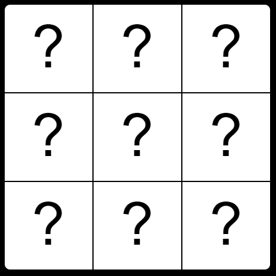
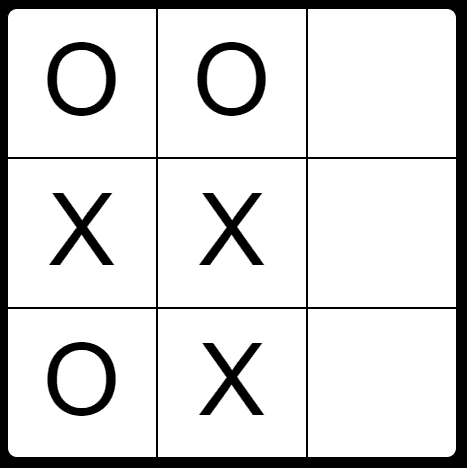
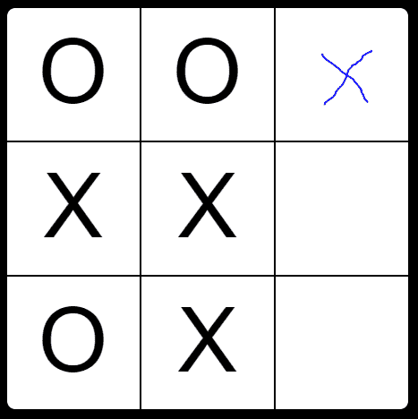
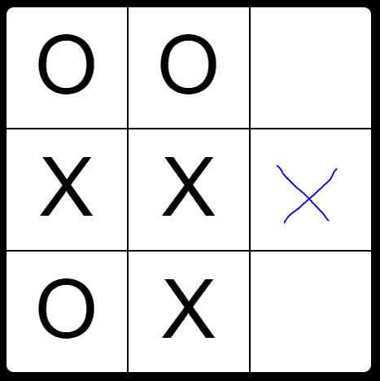
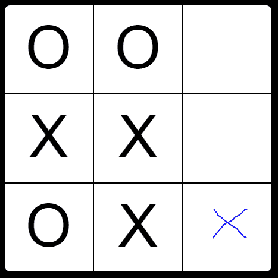
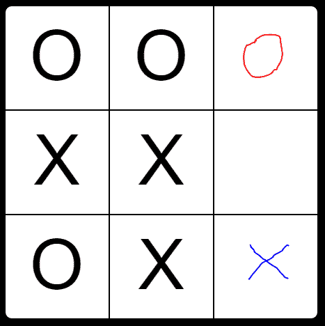
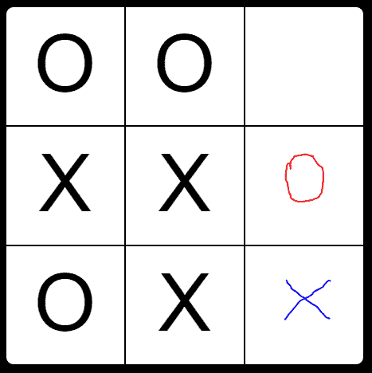
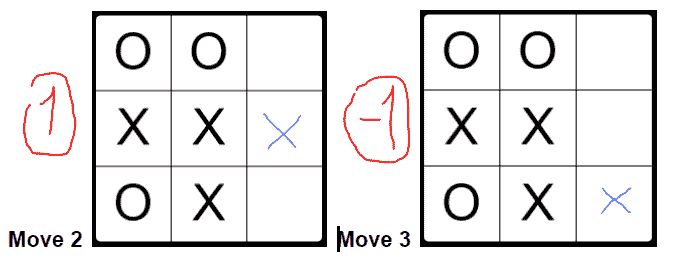

# 为井字游戏挑战构建人工智能算法

> 原文：<https://www.freecodecamp.org/news/building-an-ai-algorithm-for-the-tic-tac-toe-challenge-29d4d5adee07/>

本·卡普

# 为井字游戏挑战构建人工智能算法


作为自由代码营课程的一部分，我被要求开发一个 T2 井字游戏网络应用。这真是一种享受。

该应用程序包括一个终极电脑播放器。它可以优化井字游戏棋盘上任何给定的情况。结果令我吃惊。

即使在这么简单的游戏中，电脑玩家也教了我一些新的动作。至于我写的代码，有些独特，探索起来很有趣。

### 仔细讨论

访问[此链接](https://carpben.github.io/TicTacToe/)，选择与电脑对战。**我挑战你赢**。你可能会发现…你不能。

然而，如果你在防守上很努力，你可能会发现计算机也不能赢。我凭经验了解到井字游戏有一个简单的**非输**策略。

这意味着，如果你设法得到一个平局，你就做出了正确的防守选择。计算机仍然优化它的移动。所以，对于像你这样的玩家来说，最好的结果可能只是平局。

### 主要解决步骤

### 1.电路板数据结构

```
_gameBoard: [[“”, “”, “”],[“”, “”, “”],[“”, “”, “”]]
```

电路板阵列包含 3 个阵列，每个阵列代表一行。
每个行数组包含 3 个字符或字符串元素。

这些元素是:

*   " "作为空字符串，表示空单元格
*   “X”代表 X 玩家
*   “O”代表 O 玩家

### 2.getResult 函数

[从第 59 行开始](https://github.com/carpben/TicTacToe/blob/ea8a67918f0ab97bca40e4383839e95695da803f/tictactoe.js#L59)

在任何给定的状态下，板将处于且仅处于这些可能状态中的一种:

*   不完全的
*   玩家 X 赢了
*   玩家 O 赢了
*   或者领带

`getResult`函数接收一个棋盘数组，遍历所有行、所有列和两条对角线。它检查符号的连续性。然后，它让我们知道该板的当前状态。

### 3.getBestMove 函数

这里变得更加困难。当棋盘是空的时，很难确定最佳的可能棋步。看看这块板。


哪一步可能是最好的？



当棋盘上的人多了，最好的棋就会出现在我们眼前。



让我们使用这个填充板作为我们的起点。让我们决定下一步是我们的，我们的符号是一个“X”。

让我们试着用现有的工具找出最好的可能的行动。有 3 个空单元格对应于 3 种可能的移动。让我们检查每个选项的结果。

我们可以通过迭代可能的移动来做到这一点，对于每一个移动:

*   创建新的公告板
*   将我们的符号添加到相应的空单元格中
*   将此板发送到`getResult`功能



**Move 1**



**Move 2**



**Move 3**

从上图的 3 块板中，当我们将第二块板发送到`getResult` 函数时，我们将收到我们的奖杯。

请集中精力完成接下来的重要步骤:

1.  我们需要给可能的动作分级，这样我们就可以比较它们。让我们决定，如果一步棋产生了一个获胜的棋盘，我们将把它定为 1。如果它产生一个失败的棋盘，它将得到-1 的等级。平局将得到 0 分。
2.  移动 2 将获得等级 1。当我们发现一个等级为 1 的移动时，我们可以忽略所有其他可能的移动。没有比取得绝对胜利更好的可能举措了。
3.  但是为了便于理解，我们如何给第 1 步或第 3 步，或者任何结果不完整的其他步打分呢？

让我们把注意力集中在第三步。解决方法是将相应的板子递归发送给`getBestMove`函数。

你可能会想，“但是等等！我们的对手下一步棋。”没错。让我们看看我们的对手在未来的最佳行动中得到什么分数。

我们的对手只有两种可能:



**Move 3–1**



**Move 3–2**

棋步 3-1 将有利于我们的对手赢得比赛。由于我们使用完全相同的`getBestMove`函数，移动 3–1 将得到等级 1。

这可能有点令人困惑，因为我们的胜利和失败都将得到 1 分。我们需要记住，这个函数调用属于我们的对手，他的胜利就是我们的损失，反之亦然。

我们必须否定由`getBestMove`函数返回给`getBestMove`函数的任何等级。

移动 3–1 的等级为 1。`getBestMove`函数返回等级 1，我们可以用-1 对 Move 3 进行等级划分。



以这种方式，`getBestMove`功能继续探索移动和后续移动。这一过程将持续到:

1.  它找到一个等级为 1 的移动，在这种情况下，它将立即返回移动
2.  它将继续下去，直到每一个可能的举动有一个等级。可能的移动(等级 0 和-1)存储在一个数组中
3.  然后数组会:
    [a]随机化
    [b]从高到低排序
    [c]返回第一个元素

这些步骤保证:

1.  除非是唯一的选择，否则会避免失败
2.  电脑玩家可以玩各种各样的游戏

#### 结束注释:

1.  人们对人工智能带来的风险有着强烈的合理担忧。
    让我们用人工智能造福全人类。最好的人工智能软件是能够防止我们滥用人工智能的软件。
2.  在写这个应用的过程中，我咨询了阿萨夫·温伯格

参见 GitHub 上的[我的代码](https://github.com/carpben/TicTacToe/blob/master/tictactoe.js)。