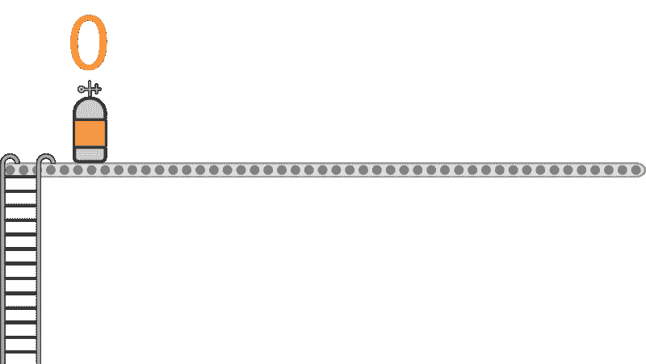
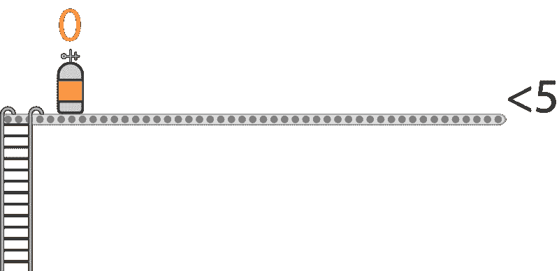
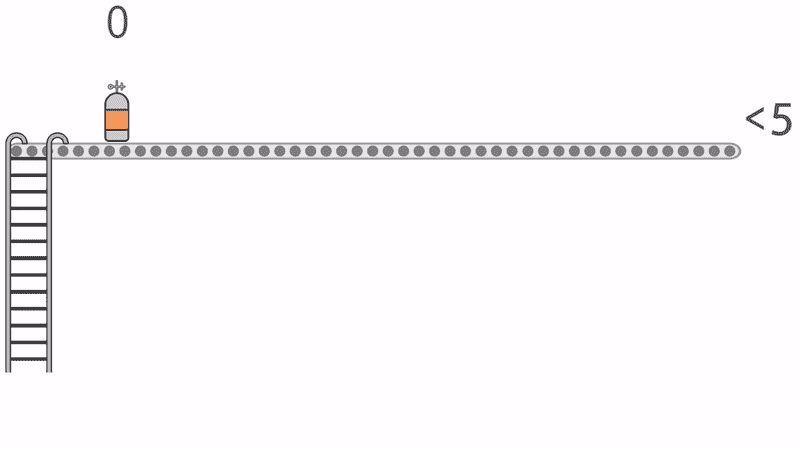
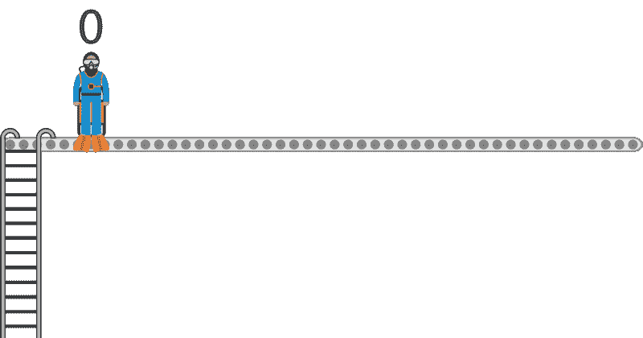
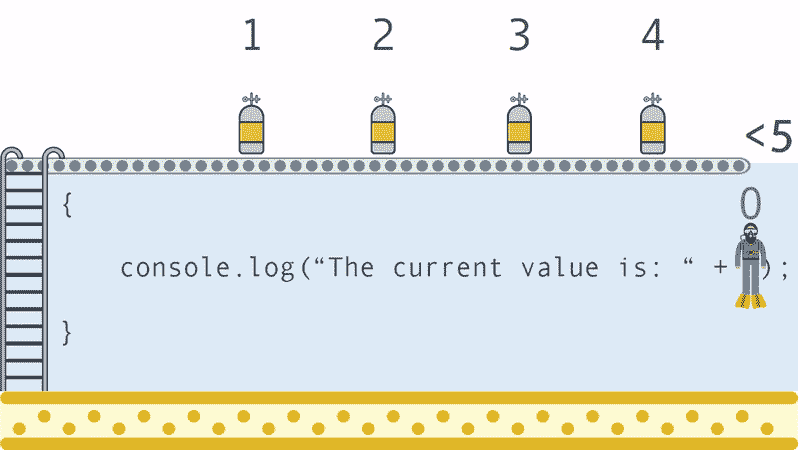
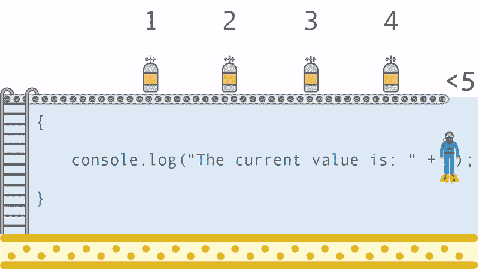
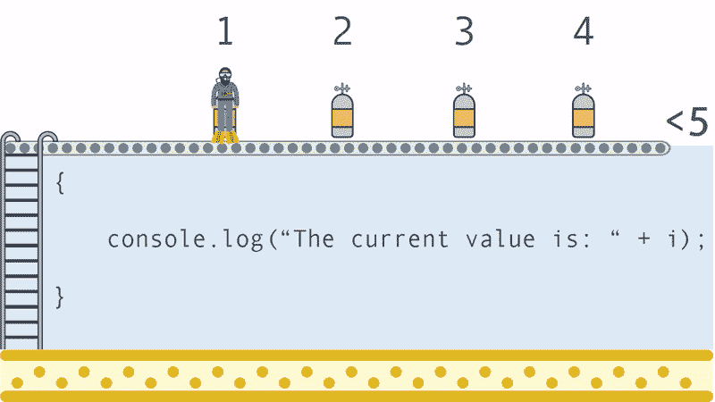
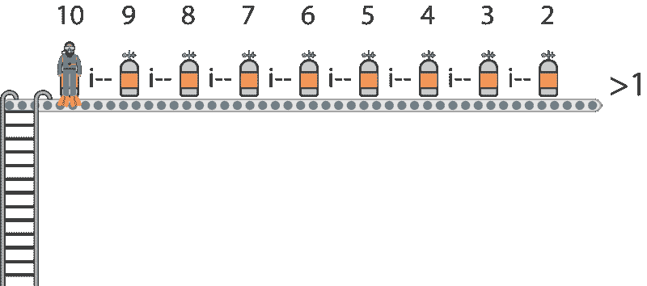
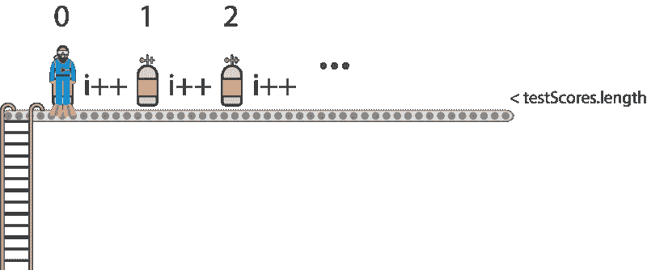
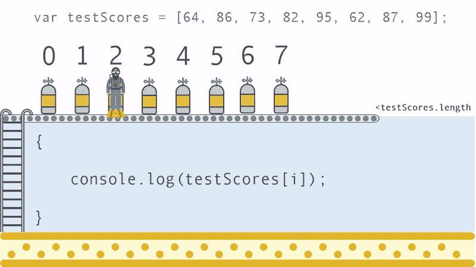

# 想了解 JavaScript 的 for 循环吗？这个动画水肺潜水员可以帮助！

> 原文：<https://www.freecodecamp.org/news/want-to-learn-about-javascripts-for-loops-this-animated-scuba-diver-can-help-76a038a09cc8/>

凯文·科诺年科


# 想了解 JavaScript 的 for 循环吗？这个动画水肺潜水员可以帮助！

如果你是第一次学习编码，循环可能很难理解。这个动画解释应该会使它稍微容易一些。

循环是 web 开发中几乎所有语言的基本组成部分。你会在每堂计算机科学 101 课的第一周学到它们，它们将成为任何介绍性在线课程的一部分。

即便如此，如果 JavaScript 是你的第一种编码语言(就像我一样)，for 循环的概念仍然有点神秘。当然，你可能在原则上理解它。但是一旦你开始把其他概念放在最上面——比如数组、对象和更复杂的数学——你可能会发现你不能像你希望的那样清楚地理解它们。

所以，我想创造一个清晰的解释，让它留在你的大脑里。当你接触到更复杂的概念时，在 for 循环中使用它们会很容易。

#### 那么什么是循环呢？

如果您还不熟悉的话，for 循环允许您对一系列元素进行操作，而无需显式命名每个元素。

假设您有以下元素列表:0，1，2，3，4。您不希望手动将它们插入函数或访问数组的索引。您可能希望遍历它们，并自动对列表中的每个元素执行操作。一会儿我会解释更多。

#### 为什么我需要 for 循环的解释？

我们来看一个基本的。

这将输出:

```
01234
```

以下是我看到的两个问题:

*   *i* 是什么概念？它的用法与其他变量不同。
*   迭代发生在哪里？换句话说， *i* 什么时候增加？


我们将从不同的角度来看 for 循环。**假设你是一名潜水者，**你正计划去一个新地方进行一整天的旅行。你正在检查一个新的珊瑚礁，所以你可能会想要多次到海底，以确保你看到所有的珊瑚和海洋生物。

#### 准备下潜(初始化和状态)

在你开始潜水之前，你需要确定你一天需要多少氧气罐。

*设 I = 0；*

这是**初始化。**它**告诉你第一个氧气罐的价值。在这种情况下，您从坦克 0 开始。**



*我<T1；5*

这就是**条件**。这有点像船的容量。你只能添加你的船能容纳的氧气罐。



#### 设置氧气瓶(更新)

到目前为止，我们知道我们第一个氧气罐的值是 0，最后一个一定小于 5。但是需要准备多少坦克呢？

最后一部分叫做**更新**，告诉我们需要多少辆坦克排队。

*i++*

这是: *i = i+1* 的简写

这意味着每次我们完成一个循环，我们都要给 I 加 1，因为 I 是从 0 开始的，这就是它的样子。



我们继续添加氧气罐，直到达到极限。当我们一次添加一个油箱时，满足**条件**的最后一个值是 4。

#### 水肺潜水员进行第一次旅行(迭代)

至此，我们知道了 *i* (0)的起始值以及满足**条件**(0–4)的 *i* 的各个值。我们都准备好了。现在，我们需要让潜水者进入并执行 for 循环中的语句。

假设我们正在运行这个循环:

所以，你的潜水者从 0 值开始。



你明白我们的目的了吗？你的水肺潜水员实际上是我！它将遍历 for 循环的内容，然后进入另一个容器。


现在，这个循环只有一条语句。下面是第一次迭代将会发生的情况。



控制台会记录:“当前值为 0”，因为 *i* 为 0。你的水肺潜水员携带的价值，每个氧气罐，因为它通过数组移动。

#### 游回来(第二次迭代)

因为这个 for 循环只有一条语句，所以您刚刚完成了第一次迭代。现在，您需要使用下一个值来遍历它。

您通常会发现您的 for 循环有许多行代码。但是目前，我们只是坚持一条线，这样你就可以追踪到 *i* 的路径。

当您点击最后一个括号时，会发生以下情况:}。



戴水肺的潜水员放下 0 号罐，爬上梯子，抓住第二个罐，值为 1。戴水肺的潜水员正在进行某种奇怪的单人接力赛，但嘿，这就是 for 循环的本质。你希望它越快越好。现在，潜水员准备再次通过值为 1 的循环。

#### 剩余的氧气罐(每次迭代)

现在潜水员需要带着每个氧气罐穿过环路，直到它们都消失了。

每次，我们都会在控制台上记录一条新的语句。



最终输出将是:

```
The current value is 0The current value is 1The current value is 2The current value is 3The current value is 4
```

在循环结束时， *i* 等于 4，并且由于**条件**不能再高，因此循环结束。如果再次运行循环， *i* 将由于**初始化**而再次从 0 开始。

为什么没有多个水肺潜水员？因为只有一个*我*！任何时候都只能有一个值 *i* 通过循环。*我*需要爬回顶端去抓取下一个值。

#### 改变条件

假设现在，你不是从 0 到 5 向上计数，而是从 10 到 2 向下计数所有整数。你会怎么做？



既然起始值是 10，就需要**初始化** *i* 为 10。

*设 i = 10*

然后，既然希望最后一个数字是 2，那么就需要为所有大于 1 的数字设置一个**条件**。

*我>T1；一*

并且，我们用 *i - -* 代替 i++，相当于 *i= i-1。*

完整代码:

```
for ( let i = 10; i > 1; i --){}
```

#### 在数组旁边使用 for 循环

在阅读本节之前，您应该了解数组。如果你以前没有研究过它们，请点击这里查看我的指南。

For 循环通常用于迭代数组。假设你有一个充满测试分数的数组。

```
var testScores = [64, 86, 73, 82, 95, 62, 87, 99];
```

您希望在控制台中记录与每个分数相关的消息。当你遍历你的循环时，你需要能够将当前值 *i* 与数组的**索引**对齐。因此，您需要确保 for 循环遍历数组中的每一项，不管数组中有多少测试分数。

我们可以使用数组的[长度](https://developer.mozilla.org/en-US/docs/Web/JavaScript/Reference/Global_Objects/Array/length)属性来发现它包含多少个元素。在这种情况下，它是 8。记住数组也是以 [0 为索引的](https://developer.mozilla.org/en-US/docs/Web/JavaScript/Reference/Global_Objects/Array)，这意味着数组的第一个元素的索引为 0。



我们**将** *i* 初始化为 0。我们实际上可以在条件中使用 testScores.length，这样无论数组中有多少个元素，它都会工作。

我<测试分数

我们可以通过使用 *i* 作为索引来引用数组中的每一项。

*测试分数[i]*

回到我们的潜水者:数组中的元素有多少，它就需要走多少趟。这就是为什么跟踪 *i* 对我们如此重要。在此示例中，坦克的值映射到数组中的特定项目。



上面的例子显示了循环的第三次迭代，它将访问索引 2 处数组的第三个元素。明白这有多棘手了吧？

这是最终的代码:

你喜欢这个吗？为它鼓掌，这样其他人也能发现它。如果你想在我发布使用类比的教程时得到通知，请在这里注册: