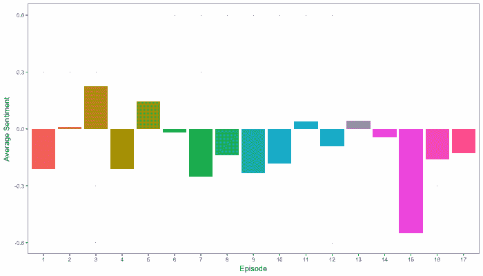
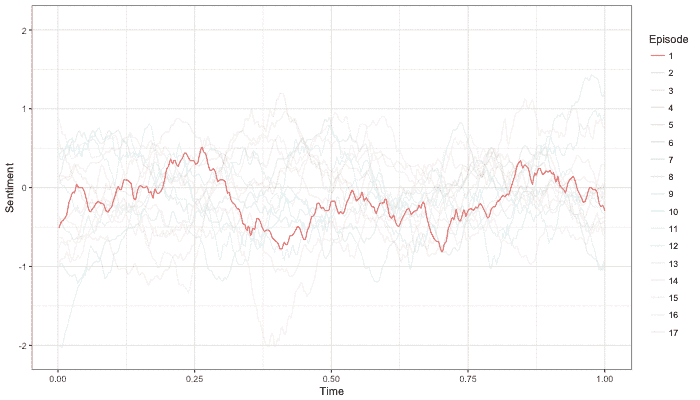
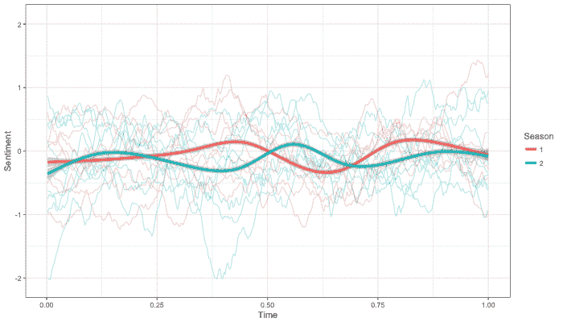
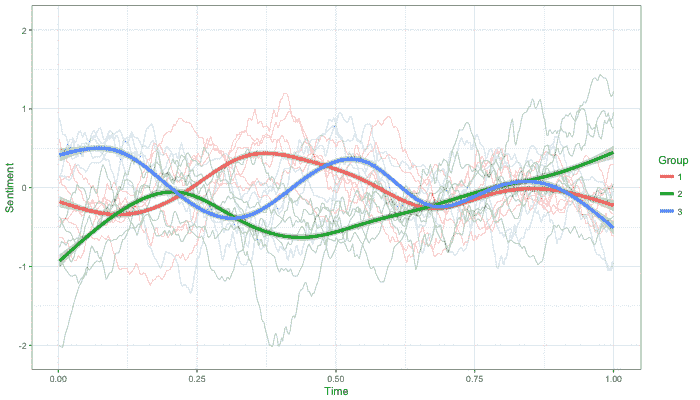
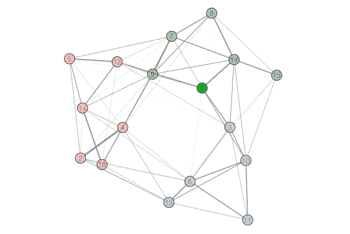

# 对陌生事物情感的统计好奇心之旅

> 原文：<https://www.freecodecamp.org/news/a-statistical-curiosity-voyage-through-the-emotion-of-stranger-things-e7bc8b2a6395/>

乔丹·德沃金

# 对陌生事物情感的统计好奇心之旅


像其他几百万人一样，我在 2017 年 10 月 27 日的周末观看了《陌生人事物 2》，并在接下来的一周处理了轻微的[戒断](https://twitter.com/search?f=tweets&vertical=default&q=stranger%20things%20withdrawal&src=typd)。

为了应对这种情况，并回到我的研究中，我决定将情感分析和网络分析的统计[桨](https://i.pinimg.com/originals/3f/38/e3/3f38e374b22804b066db9b05e2ca15b8.jpg)应用于第一季和第二季的剧本，并考虑结果可能会对该剧每集的情感结构产生什么影响。

为了开始理解陌生事物的情感，我下载了[脚本](https://www.springfieldspringfield.co.uk/episode_scripts.php?tv-show=stranger-things-2016)，并根据每个单词的[正价或负价](http://www2.imm.dtu.dk/pubdb/views/publication_details.php?id=6010)为其分配一个数值。情绪最简单的方面是每一集的平均效价。该度量是通过取一集中所有单词的平均情感值而获得的，而不管它们被说出的顺序。



这些价值观通常是你可能从一个关于失踪儿童和异次元怪物的节目中期待的，大多数剧集显示的负面情绪多于正面情绪。

最有趣的发现似乎是不太受欢迎的《芝加哥》(第 15 集)的负面程度是其他任何一集的两倍多。这可能是由于其黑暗的情节和霍金斯团伙缺乏任何喜剧救济的结合。

然而，这些平均值中遗漏了许多时间信息，所以让我们来看看在剧集中情绪基调是如何随着时间变化的。

一种方法是使用滑动窗口技术。对于这个版本的滑动窗口，我们将取一个中心词周围的 40 个词的平均值，然后不断移动一个词，取一个新的平均值。在每一集的过程中，这产生了一个情感效价的平滑轨迹。



虽然仅仅通过观察轨迹很难学到很多东西，但还是有一些事情是突出的。

首先，除了一个例外(你猜对了，芝加哥那集)，即使是最黑暗的一集通常也有一些充满积极情绪的场景。

第二，在 17 集里，只有三集以高潮结束:第一季大结局、第二季首播和第二季大结局。

第三，这些情节在结构上有很多变化，它们似乎没有遵循明确的情感模式。让我们来看看最后一点，看看我们是否能描述一些变化。

作为比较的基线，我们可以检查一集出现的季节是否包含足够的信息来解释情感轨迹的相似性和差异。



不出所料，答案是否定的。总的来说，第一季和第二季在剧集结构上都有很大的变化。平均轨迹都倾向于在中性线附近徘徊。

为了找到更好的分类，让我们首先通过计算每对剧集的时间相关性，将剧集之间的关系概念化为一个网络。在这种情况下，节点是情节，而边代表了情感对表现出相似情感模式的程度。

一旦构建了这个网络，我们就可以应用从[图论](https://en.wikipedia.org/wiki/Graph_theory)中借用的[方法](https://perso.uclouvain.be/vincent.blondel/research/louvain.html)来发现我们数据中的社区。在这种情况下，揭示了三个不同的情节组，并且组内相似性大于预期偶然发生的相似性`(*p* < .0` 01)。

现在我们已经找到了我们感兴趣的社区，让我们将它们映射回情感轨迹，看看它们是否捕捉到了更多的可变性。



与按季节划分不同，这些平均群体轨迹似乎描述了三种不同的模式。他们似乎也能很好地追踪他们潜在的事件轨迹。

查看平均模式，我们可以看到，组 1 包含以中性情绪开始和结束并在中间缓慢波动的情节，组 2 包含以负面情绪开始并逐渐向积极结局攀升的情节，组 3 包含以积极基调开始并向更黑暗结局振荡的情节。

除了绘制情绪模式的社区，让我们看看完整的网络结构。



第一件突出的事情是，每组包含第一季和第二季大约相同数量的剧集。这支持了早期的发现，即季节不是情节相似性的良好预测因子。我们还可以看到，第 15 集再次脱颖而出。这一次是因为它与图表的其余部分的联系比其他任何一集都要松散。

也许最有趣的是，电视网揭示出，剧集往往不像你想象的那样会偶然发生。此外，从第 1 集→第 2 集、第 2 集→第 3 集和第 3 集→第 4 集的过渡，在该剧发生的 16 个过渡中，有三个在情感结构上发生了最大的转变。

总之，这些结果表明，每集不同的情感轨迹可能是让观众着迷的一种策略。

未来的剧集会继续展现这些情感结构的变化吗？他们会遵循同样的三条主导情感轨迹吗？未来创作大胆不同剧集的尝试会比《芝加哥》更成功吗？把这些记为第三季更多未解之谜。

***杂项观察【前方有剧透】***

*   第一季大结局中拜尔斯家的圣诞节。

```
What are you - What are you doing? [Jonathan] Documenting.Oh, why? - Because - [Joyce chuckles] - It looks great. - [Joyce] Oh, this is just so overcooked. - And look, the potatoes are runny.- [Jonathan] Mom. - [Joyce] They're so runny.- [Jonathan chuckles] Mom, it's gonna be great.
```

*   系列情感低谷#1:追逐场景开启第二季。

```
[Horns honking] Shit! Shit! Shit! Shit! Shit! [Cackles] [Exhales] Okay. Okay.[Police sirens wailing] - Son of a bitch! We got more! - [Mick] Oh, shit! They're headed down 7th.
```

*   系列情感低谷#2:第二季大结局史蒂夫 vs 比利。

```
[Steve] Get out.[Dustin] Yes! Kick his ass, Steve! - [Mike] Get him! - [Dustin] Murder the son of a bitch! - [Dustin] Now! Now! - [Mike] Get that shithead! - [Dustin] Kill the son of a bitch! - [Lucas] Steve! - [Max] Billy! - [Mike] Holy shit! Shit!
```

*   因缺少对话而未被计算在内的最佳场景荣誉奖:镜中的比利。

```
[Billy preens]
```

对于那些感兴趣的人来说，这个项目的代码是公开的[在这里](https://www.dropbox.com/s/6hvtd9m8d9dvl86/EmotionOfStrangerThings.R?dl=0)。