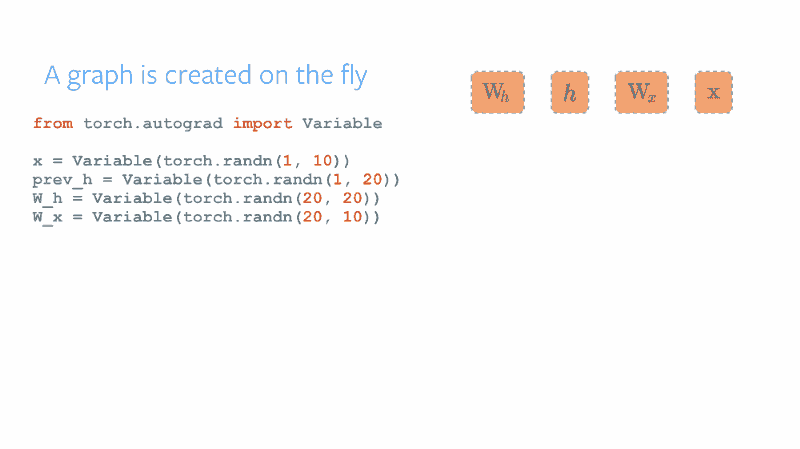
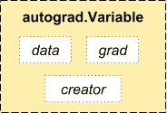

# Pytorch 如何利用深度学习给出大图

> 原文：<https://www.freecodecamp.org/news/how-pytoch-gives-the-big-picture-with-deep-learning-e4a0f372f4b6/>

作者德博拉·梅斯基塔

# Pytorch 如何利用深度学习给出大图

Pic from [https://www.pexels.com/](https://www.pexels.com/) (they’re great and don’t even require attribution!)

前段时间我们看到了[如何用神经网络](https://medium.freecodecamp.org/big-picture-machine-learning-classifying-text-with-neural-networks-and-tensorflow-d94036ac2274)对文本进行分类。本文涵盖了以下主题:

*   什么是机器学习模型
*   什么是神经网络
*   神经网络如何学习
*   如何处理数据并将其传递给神经网络输入
*   如何运行模型并获得预测结果

在今天的文章中，我们将构建相同的网络，但我们不使用 [TensorFlow](https://www.tensorflow.org/) ，而是使用 [**Pytorch**](http://pytorch.org/) **。我们将只关注代码。因此，如果你需要一本关于神经网络的入门书，最好查阅一下[之前的文章](https://medium.freecodecamp.org/big-picture-machine-learning-classifying-text-with-neural-networks-and-tensorflow-d94036ac2274)。:)**

我们将创建一个机器学习模型，将文本分类。数据集是 20 个新闻组，包含 18000 篇关于 20 个不同主题的帖子。我们将只使用 3 个类别:comp.graphics、sci.space 和 rec.sport.baseball

### Pytorch 是什么？

> Pytorch 是一个基于 Python 的科学计算包，是对 [NumPy](http://www.numpy.org/) 的替代，使用图形处理单元的能力。它也是一个深度学习研究平台，提供了最大的灵活性和速度。

Pytorch 和 Tensorflow 最大的区别是 Pytorch 可以动态创建图形。这使得调试变得更加容易(而且有趣！).

A primer on Pytorch dynamics

当你执行一行代码时，它就会被执行。不存在不同步的世界观。当您将它放入调试器中，或者收到错误消息和堆栈跟踪时，理解它们是非常简单的。堆栈跟踪指向定义代码的确切位置。

### 构建网络

好的，让我们看看 Pytorch 是如何工作的。

#### 基础知识

像往常一样，我们有**张量**，它是包含单一数据类型元素的多维矩阵。

**torch** 包包含多维张量和数学运算的数据结构。

*   [**torch.nn**](http://pytorch.org/docs/master/nn.html)
*   [**torch . autograted**](http://pytorch.org/tutorials/beginner/former_torchies/autograd_tutorial.html)是一个基于磁带的自动微分库，支持 torch 中所有的可微分张量运算

#### 步骤 1:定义网络

对于 TensorFlow，每个图层操作都必须明确命名:

用 Pytorch 我们用 **torch.nn** 。我们需要将每个输入节点乘以一个权重，并添加一个偏差。类`**torch.nn.Linear**`为我们做了这项工作。

*   `**torch.nn.Linear**`对输入数据进行线性变换， *y* = *Ax* + *b*

所有神经网络模块的基类是 **torch.nn.Module** 。`**forward**` (*input)定义了每次调用时执行的计算，所有子类都应该覆盖它。

很酷，对吧？

#### 步骤 2:更新权重

神经网络“学习”的方式是更新权重值。在 Pytorch 中，我们使用**torch . autograted**包来完成这项工作。

**torch . autograded . variable**包装一个张量并记录应用于它的运算。这非常方便，使我们能够以非常简单的方式处理梯度下降。让我们仔细看看文档。

一个变量**是一个张量对象的薄薄的包装，它还保存了梯度**和对创建它的函数的引用。这种引用允许我们跟踪创建数据的整个操作链。

Variable

我们没有像在 TensorFlow 中那样指定权重张量，因为`**torch.nn.Linear**`类有一个带形状的变量**权重**(out _ features x in _ features)。

*   `**torch.nn.Linear**`(输入特征，输出特征，偏差=真)

为了计算梯度，我们将使用方法[自适应矩估计(Adam)](http://sebastianruder.com/optimizing-gradient-descent/index.html#adam) 。 **Torch.optim** 是一个实现各种优化算法的包。

要使用`[**torch.optim**](http://pytorch.org/docs/master/optim.html#module-torch.optim)`，您必须构建一个优化器对象，它将保存当前状态，并根据计算出的梯度更新参数。

要构造一个`[**optimizer**](http://pytorch.org/docs/master/optim.html#torch.optim.Optimizer)**,**`，你必须给它一个包含参数的 iterable(所有参数都应该是`[**variable**](http://pytorch.org/docs/master/autograd.html#torch.autograd.Variable)**s**`)来优化。然后，您可以指定特定于优化器的选项，如学习率、权重衰减等。

让我们构建我们的优化器:

来自 **torch.nn.Module** 的`**parameters()**`方法返回模块参数的迭代器。为了计算损失，我们将使用`**torch.nn.CrossEntropyLoss**`

关于`**torch.nn.CrossEntropyLoss**`的一件重要事情是，输入必须是大小为(minibatch，n) 的 2D 张量，目标期望一个类索引(0 到 nClasses-1)作为大小为 minibatch 的 1D 张量的每个值的目标。例如:

所以我们需要修改前一篇文章中的`get_batch()`函数，使其像上面例子中那样工作。

现在让我们更新权重，看看变量的魔力。

方法**torch . autograded . backward**计算给定变量的梯度之和。正如文档所说，这个函数在树叶中累积梯度，**，所以你可能需要在调用它们之前将它们归零**。为了更新参数，所有优化器都实现了一个`[**step()**](http://pytorch.org/docs/master/optim.html#torch.optim.Optimizer.step)`方法。一旦计算出梯度，就可以调用这些函数，例如，您可以使用`[**backward(**](http://pytorch.org/docs/master/autograd.html#torch.autograd.Variable.backward)**)**` 来调用它们。

在[神经网络术语](http://stackoverflow.com/questions/4752626/epoch-vs-iteration-when-training-neural-networks)中，一个历元等于一次正向传递(获取输出值)，一次反向传递(更新权重)等于 ***所有*** 训练实例。在我们的网络中，`get_batch()`函数给出了批量大小的文本数量。

把所有这些放在一起，我们得到这个:

仅此而已。

我从没想过我会对一段代码这么说，但它很美。

不是吗？

现在让我们测试模型:

仅此而已。

您已经创建了一个使用神经网络将文本分类的模型。

恭喜你。？

这里可以看到**最终代码** [的笔记本。](https://github.com/dmesquita/understanding_pytorch_nn)

你觉得这篇文章有帮助吗？我尽力每个月写一篇深度文章，当我发表一篇新的文章时，你可以收到一封电子邮件。