# 关于树形数据结构你需要知道的一切

> 原文：<https://www.freecodecamp.org/news/all-you-need-to-know-about-tree-data-structures-bceacb85490c/>

当您第一次学习编码时，通常将数组作为“主要数据结构”来学习

最终，你也会了解`hash tables`。如果你正在攻读计算机科学学位，你必须上一门数据结构的课。您还将了解到`linked lists`、`queues`和`stacks`。这些数据结构被称为“线性”数据结构，因为它们都有一个逻辑起点和一个逻辑终点。

当我们开始学习`trees`和`graphs`时，可能会变得非常混乱。我们不以线性方式存储数据。两种数据结构都以特定的方式存储数据。

这篇文章是为了帮助你更好地理解树数据结构，并澄清你可能对它的任何困惑。

在本文中，我们将了解:

*   什么是树
*   树的例子
*   它的术语和工作原理
*   如何在代码中实现树形结构？

让我们开始这次学习之旅。:)

### 定义

当开始编程时，通常比像树和图这样的数据结构更好地理解线性数据结构。

众所周知，树是一种非线性数据结构。它们不以线性方式存储数据。他们按等级组织数据。

### 让我们深入现实生活中的例子！

我说的分层次是什么意思？

想象一个家谱图，它包含了所有世代的关系:祖父母、父母、子女、兄弟姐妹等等。我们通常按等级组织家谱。

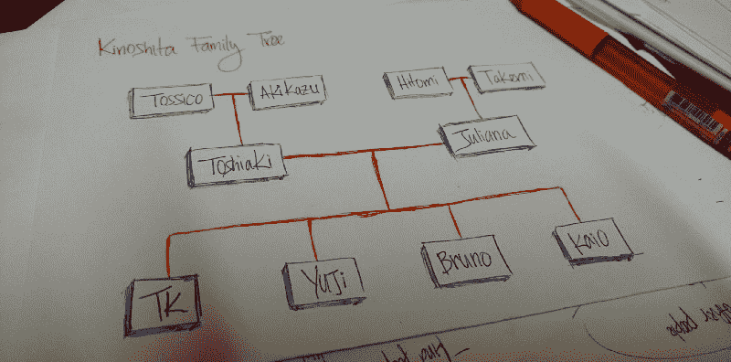

My family tree

上面的图是我的家谱。`Tossico, Akikazu, Hitomi,`和`Takemi`是我的爷爷奶奶。

`Toshiaki`和`Juliana` 是我的父母。

`TK, Yuji, Bruno`，和`Kaio`是我父母(我和我哥哥)的孩子。

组织结构是层级的另一个例子。


A company’s structure is an example of a hierarchy

在 HTML 中，文档对象模型(DOM)像树一样工作。


Document Object Model (DOM)

`HTML`标签包含其他标签。我们有一个`head`标签和一个`body`标签。那些标签包含特定的元素。`head`标签有`meta`和`title`标签。`body`标签包含显示在用户界面中的元素，例如`h1`、`a`、`li`等。

### 技术定义

一个`tree`是被称为`nodes`的实体的集合。节点由`edges`连接。每个`node`包含一个`value`或`data`，它可能有也可能没有`child node`。

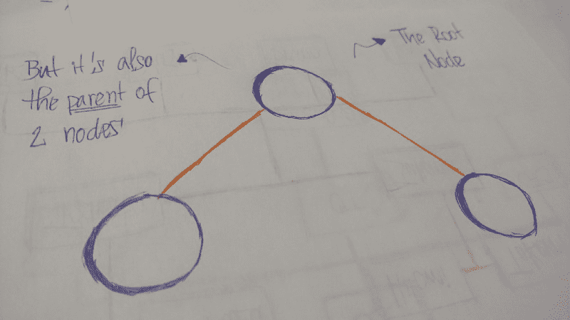

`tree`的`first node`称为`root`。如果这个`root node`由另一个`node`连接，那么`root`是一个`parent node`，并且连接的`node`是一个`child`。


所有的 `Tree nodes`都由称为`edges`的链路连接。它是`trees`的重要组成部分，因为它管理着`nodes`之间的关系。

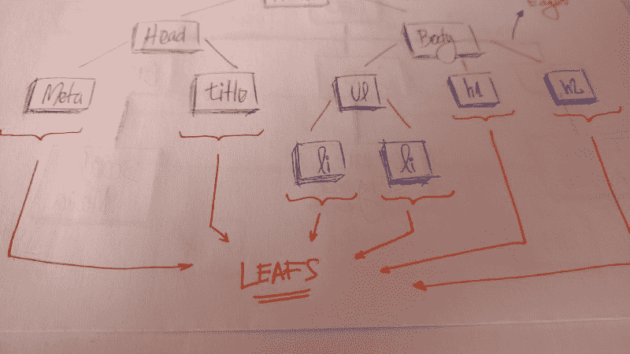

`Leaves`是`tree.`上的最后一个`nodes`它们是没有孩子的节点。像真树一样，我们有`root`、`branches`，最后还有`leaves`。

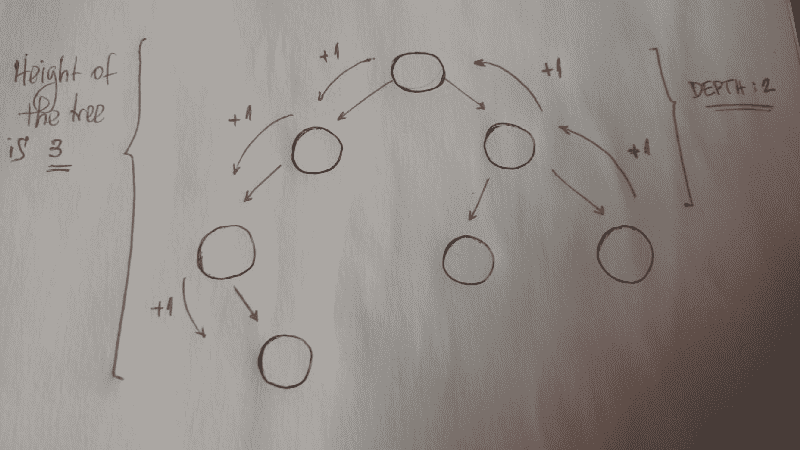

其他需要理解的重要概念是`height`和`depth`。

一条`tree`的`height`是到一条`leaf`的最长路径的长度。

一个`node`的`depth`是到它的`root`的路径长度。

### 术语摘要

*   **根**是`tree`的最顶端`node`
*   **边**是两个`nodes`之间的联系
*   **子**是一个`node`，它有一个`parent node`
*   **父**是一个`node`，它有一个`edge`到一个`child node`
*   **叶子**是在`tree`中没有`child node`的`node`
*   **高度**是到 a `leaf`的最长路径的长度
*   **深度**是路径到其`root`的长度

### 二叉树

现在我们将讨论一种特定类型的`tree`。我们称之为`binary tree`。

> 在计算机科学中，二叉树是一种树形数据结构，其中每个节点最多有两个子节点，称为左子节点和右子节点— [维基百科](https://en.wikipedia.org/wiki/Binary_tree)

所以我们来看一个`binary tree`的例子。

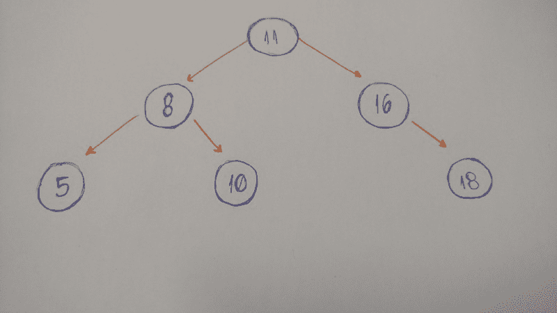

### 让我们编码一个二叉树

当我们实现一个`binary tree`时，我们需要记住的第一件事是它是一个`nodes`的集合。每个`node`都有三个属性:`value`、`left_child`和`right_child`。

我们如何实现一个简单的用这三个属性初始化的`binary tree`?

让我们来看看。

```
class BinaryTree:
    def __init__(self, value):
        self.value = value
        self.left_child = None
        self.right_child = None
```

在这里。我们的`binary tree`班。

当我们实例化一个对象时，我们将`value`(节点的数据)作为参数传递。看看`left_child`和`right_child`。两者都被设置为`None`。

为什么？

因为当我们创建我们的`node`时，它没有任何子代。我们只有`node data`。

让我们来测试一下:

```
tree = BinaryTree('a')
print(tree.value) # a
print(tree.left_child) # None
print(tree.right_child) # None
```

就是这样。

我们可以将`string` ' `a`'作为`value`传递给我们的`Binary Tree node`。如果我们打印出`value`、`left_child`和`right_child`，我们可以看到这些值。

让我们进入插入部分。我们在这里需要做什么？

我们将实现一个方法，将新的`node`插入到`right`和`left`中。

规则如下:

*   如果当前的`node`没有`left child`，我们就创建一个新的`node`，并将其设置为当前节点的`left_child`。
*   如果它有`left child`，我们创建一个新的节点并把它放在当前`left child`的位置。将这个`left child node`分配给新节点的`left child`。

让我们把它画出来。:)


代码如下:

```
def insert_left(self, value):
    if self.left_child == None:
        self.left_child = BinaryTree(value)
    else:
        new_node = BinaryTree(value)
        new_node.left_child = self.left_child
        self.left_child = new_node
```

同样，如果当前节点没有`left child`，我们只需创建一个新节点，并将其设置为当前节点的`left_child`。或者我们创建一个新的节点，并把它放在当前`left child`的位置。将这个`left child node`分配给新节点的`left child`。

我们做同样的事情来插入一个`right child node`。

```
def insert_right(self, value):
    if self.right_child == None:
        self.right_child = BinaryTree(value)
    else:
        new_node = BinaryTree(value)
        new_node.right_child = self.right_child
        self.right_child = new_node
```

完成了。:)

但不完全是。我们还需要测试它。

让我们构建下面的`tree`:

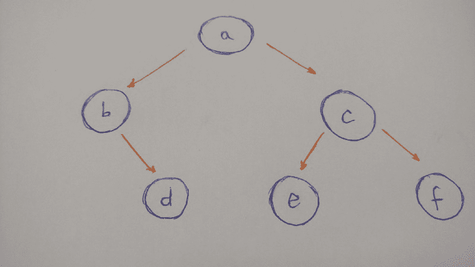

总结此树的图示:

*   `a` `node`将是我们`binary Tree`的`root`
*   `a` `left child`是`b` `node`
*   `a` `right child`是`c` `node`
*   `b` `right child`是`d` `node` ( `b` `node`没有`left child`)
*   `c` `left child`是`e` `node`
*   `c` `right child`是`f` `node`
*   `e`和`f` `nodes`都没有孩子

下面是`tree`的代码:

```
a_node = BinaryTree('a')
a_node.insert_left('b')
a_node.insert_right('c')

b_node = a_node.left_child
b_node.insert_right('d')

c_node = a_node.right_child
c_node.insert_left('e')
c_node.insert_right('f')

d_node = b_node.right_child
e_node = c_node.left_child
f_node = c_node.right_child

print(a_node.value) # a
print(b_node.value) # b
print(c_node.value) # c
print(d_node.value) # d
print(e_node.value) # e
print(f_node.value) # f
```

插入完成。

现在我们必须考虑`tree`遍历。

这里我们有**两个选项**:**深度优先搜索(DFS)** 和**广度优先搜索(BFS)** 。

*   **DFS** 是一种遍历或搜索树形数据结构的算法。一种是从根开始，在回溯之前尽可能地沿着每个分支探索。”*——[维基百科](https://en.wikipedia.org/wiki/Depth-first_search)*
*   **BFS** “是一种遍历或搜索树形数据结构的算法。它从树根开始，首先探索邻居节点，然后移动到下一级邻居。”*——[维基百科](https://en.wikipedia.org/wiki/Breadth-first_search)*

所以让我们深入研究每一种树遍历类型。

#### 深度优先搜索

在**回溯**并探索另一条路径之前，DFS 探索一条路径直到一片叶子。让我们看一个这种类型遍历的例子。

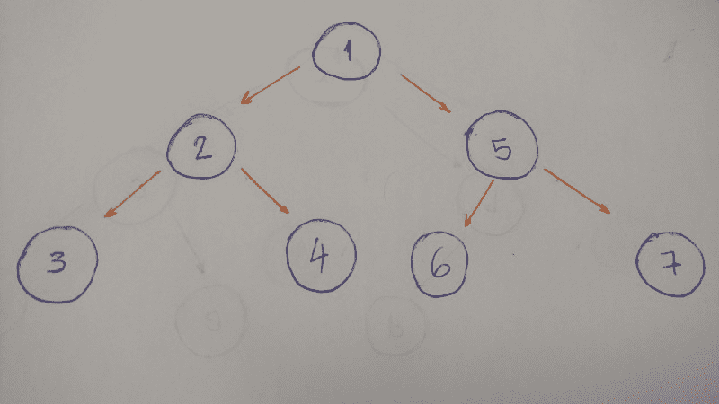

该算法的结果将是 1–2–3–4–5–6–7。

为什么？

我们来分解一下。

1.  从`root` (1)开始。打印出来。

2.转到`left child` (2)。打印出来。

3.然后转到`left child` (3)。打印出来。(这个`node`没有孩子)

4.回溯并执行`right child` (4)。打印出来。(这个`node`没有孩子)

5.回溯到`root` `node`并转到`right child` (5)。打印出来。

6.转到`left child` (6)。打印出来。(这个`node`没有孩子)

7.回溯并转到`right child` (7)。打印出来。(这个`node`没有孩子)

8.完成了。

当我们深入到叶子并回溯时，这就叫做 **DFS** 算法。

既然我们已经熟悉了这个遍历算法，我们将讨论 **DFS** : `pre-order`、`in-order`和`post-order`的类型。

#### 预购

这正是我们在上面的例子中所做的。

1.  打印`node`的值。
2.  转到`left child`并打印。这是当且仅当它有一个`left child`。
3.  转到`right child`并打印。这是当且仅当它有一个`right child`。

```
def pre_order(self):
    print(self.value)

    if self.left_child:
        self.left_child.pre_order()

    if self.right_child:
        self.right_child.pre_order()
```

#### 按顺序


这个`tree`示例的有序算法的结果是 3–2–4–1–6–5–7。

左边第一个，中间第二个，右边最后一个。

现在让我们编码。

```
def in_order(self):
    if self.left_child:
        self.left_child.in_order()

    print(self.value)

    if self.right_child:
        self.right_child.in_order()
```

1.  转到`left child`并打印。这是当且仅当它有一个`left child`。
2.  打印`node`的值
3.  转到`right child`并打印。这是当且仅当它有一个`right child`。

#### 后期订单


这个`tree`示例的`post order`算法的结果是 3–4–2–6–7–5–1。

先左后右，最后中间。

让我们编码这个。

```
def post_order(self):
    if self.left_child:
        self.left_child.post_order()

    if self.right_child:
        self.right_child.post_order()

    print(self.value)
```

1.  转到`left child`并打印。这是当且仅当它有一个`left child`。
2.  转到`right child`并打印。这是当且仅当它有一个`right child`。
3.  打印`node`的值

#### 广度优先搜索(BFS)

**BFS** 算法对`tree`逐层逐深度遍历。

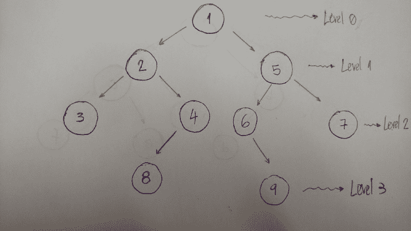

下面是一个有助于更好地解释该算法的示例:


所以我们一层一层地穿越。在本例中，结果是 1–2–5–3–4–6–7。

*   级别/深度 0:只有值为 1 的`node`
*   级别/深度 1: `nodes`值为 2 和 5
*   级别/深度 2: `nodes`值为 3、4、6 和 7

现在让我们编码。

```
def bfs(self):
    queue = Queue()
    queue.put(self)

    while not queue.empty():
        current_node = queue.get()
        print(current_node.value)

        if current_node.left_child:
            queue.put(current_node.left_child)

        if current_node.right_child:
            queue.put(current_node.right_child)
```

为了实现一个 **BFS** 算法，我们使用`queue`数据结构来帮助。

它是如何工作的？

下面是解释。

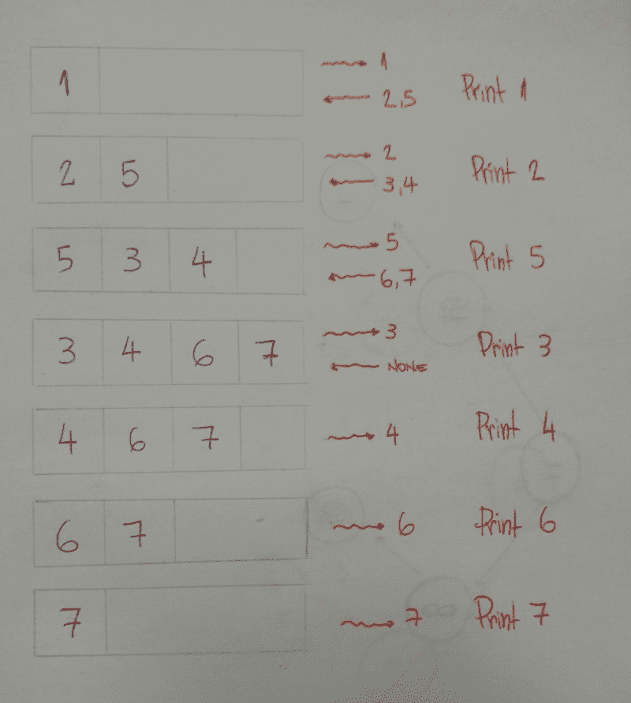

1.  首先用`put`的方法将`root` `node`添加到`queue`中。
2.  当`queue`不为空时迭代。
3.  获取`queue`中的第一个`node`，然后打印其值。
4.  将`left`和`right` `children`都添加到`queue`(如果当前`node`有`children`)。
5.  完成了。我们将使用我们的`queue`助手逐层打印每个`node,`的值。

### 二叉查找树

> “二叉查找树有时被称为有序或排序二叉树，它以排序的顺序保存其值，以便查找和其他操作可以使用二分搜索法的原理。”——维基百科

`Binary Search Tree`的一个重要性质是`Binary Search Tree` `node`的值大于其`left child`的后代的值，但小于其`right child.`的后代的值

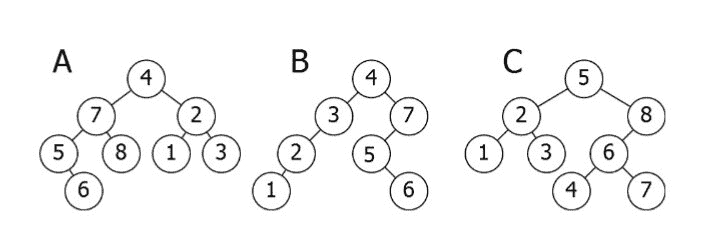

下面是对上图的分解:

*   **一只**被倒置。`subtree`7–5–8–6 需要在右侧，而`subtree`2–1–3 需要在左侧。
*   **B** 是唯一正确的选项。它满足`Binary Search Tree`属性。
*   **C** 有一个问题:值为 4 的`node`。它需要在`root`的左侧，因为它小于 5。

### 让我们编码一个二叉查找树！

现在该编码了！

我们会在这里看到什么？我们将插入新的节点，搜索一个值，删除节点和`tree`的余额。

我们开始吧。

#### 插入:向我们的树添加新节点

假设我们有一个空的`tree`,我们想添加一个新的`nodes`,其值依次为:50，76，21，4，32，100，64，52。

我们需要知道的第一件事是 50 是否是我们的树的`root`。

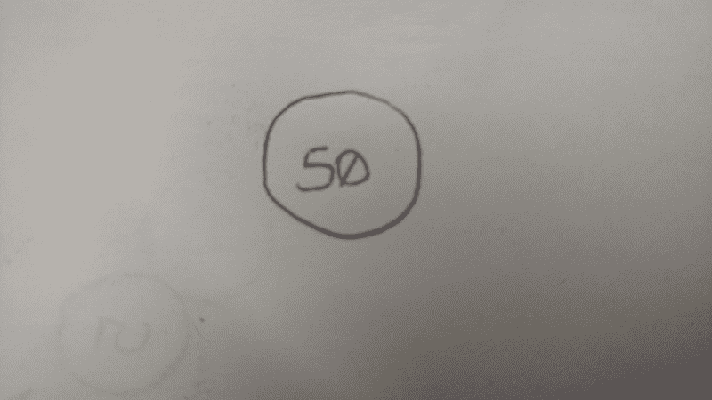

我们现在可以开始通过`node`插入`node`。

*   76 大于 50，所以在右侧插入 76。
*   21 小于 50，所以在左侧插入 21。
*   4 小于 50。值为 50 的`Node`有一个`left child` 21。因为 4 比 21 小，所以把它插在这个`node`的左边。
*   32 比 50 小。值为 50 的`Node`有一个`left child` 21。因为 32 大于 21，所以在这个`node`的右侧插入 32。
*   100 大于 50。值为 50 的`Node`有一个`right child` 76。因为 100 大于 76，所以在这个`node`的右边插入 100。
*   64 大于 50。值为 50 的`Node`有一个`right child` 76。因为 64 比 76 小，所以在这个`node`的左侧插入 64。
*   52 大于 50。值为 50 的`Node`有一个`right child` 76。由于 52 小于 76，所以值为 76 的`node`有一个`left child` 64。52 比 64 小，所以把 54 插在这个`node`的左边。

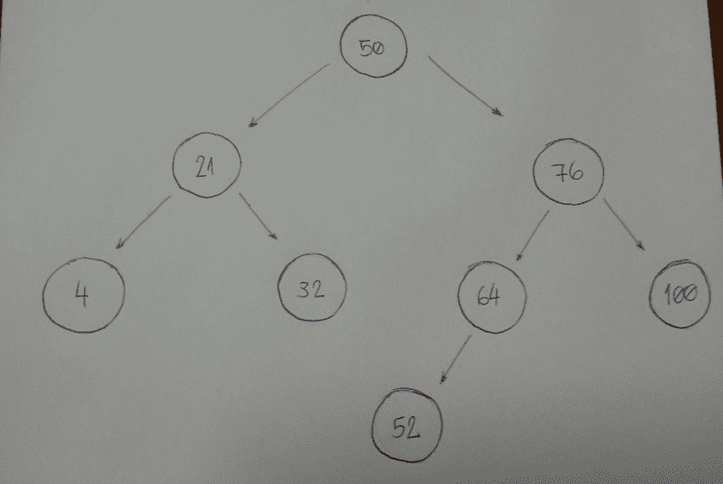

你注意到这里的模式了吗？

我们来分解一下。

1.  新的`node`值是大于还是小于当前的`node`？
2.  如果新`node`的值大于当前`node,` 的值，则转至右侧`subtree`。如果当前的`node`没有`right child`，将其插入，否则返回步骤#1。
3.  如果新的`node`值小于当前的`node`，则转到左边的`subtree`。如果当前的`node`没有`left child`，将其插入，否则返回步骤#1。
4.  我们这里不处理特殊情况。当新的`node`的值等于`node,`的当前值时，使用规则 3。考虑在`subtree`的左侧插入相等的值。

现在让我们编码。

```
class BinarySearchTree:
    def __init__(self, value):
        self.value = value
        self.left_child = None
        self.right_child = None

    def insert_node(self, value):
        if value <= self.value and self.left_child:
            self.left_child.insert_node(value)
        elif value <= self.value:
            self.left_child = BinarySearchTree(value)
        elif value > self.value and self.right_child:
            self.right_child.insert_node(value)
        else:
            self.right_child = BinarySearchTree(value)
```

看起来很简单。

这个算法最强大的部分是递归部分，在第 9 行和第 13 行。两行代码都调用了`insert_node`方法，并分别将其用于其`left`和`right` `children`。行`11`和`15`是为每个`child`执行插入的行。

#### 让我们搜索节点值…或者不…

我们现在要构建的算法是关于搜索的。对于给定的值(整数)，我们会说我们的`Binary Search Tree`是否有那个值。

需要注意的一个重要事项是我们如何定义树**插入算法**。首先我们有我们的`root` `node`。所有左边的`subtree` `nodes` 将具有比`root` `node`更小的值。并且所有右边的`subtree` `nodes` 将具有大于`root` `node`的值。

让我们看一个例子。

想象一下我们有这个`tree`。


现在我们想知道是否有一个基于值 52 的节点。

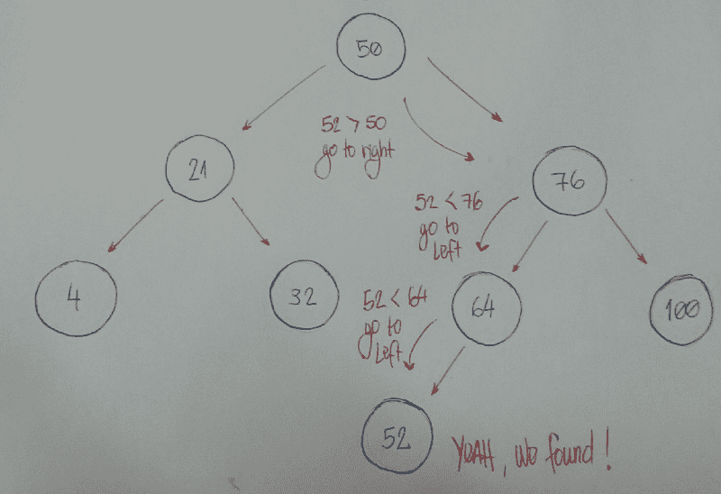

我们来分解一下。

1.  我们从`root` `node`开始作为我们当前的`node`。给定值是否小于当前`node`值？如果是，那么我们将在左边搜索`subtree`。
2.  给定值是否大于当前`node`值？如果是，那么我们就在右边搜索`subtree`。
3.  如果规则#1 和#2 都为假，我们可以比较当前的`node`值和给定值是否相等。如果比较返回`true`，那么我们可以说:“耶！我们的`tree`有给定值，”否则，我们说，“不，它没有。”

现在让我们编码。

```
class BinarySearchTree:
    def __init__(self, value):
        self.value = value
        self.left_child = None
        self.right_child = None

    def find_node(self, value):
        if value < self.value and self.left_child:
            return self.left_child.find_node(value)
        if value > self.value and self.right_child:
            return self.right_child.find_node(value)

        return value == self.value
```

让我们来分析一下代码:

*   第 8 行和第 9 行属于规则#1。
*   第 10 行和第 11 行属于规则#2。
*   第 13 行属于规则 3。

我们如何测试它？

让我们通过用值 15 初始化`root` `node`来创建我们的`Binary Search Tree` 。

```
bst = BinarySearchTree(15)
```

现在我们将插入许多新的`nodes`。

```
bst.insert_node(10)
bst.insert_node(8)
bst.insert_node(12)
bst.insert_node(20)
bst.insert_node(17)
bst.insert_node(25)
bst.insert_node(19)
```

对于每个插入的`node`，我们将测试我们的`find_node`方法是否真的有效。

```
print(bst.find_node(15)) # True
print(bst.find_node(10)) # True
print(bst.find_node(8)) # True
print(bst.find_node(12)) # True
print(bst.find_node(20)) # True
print(bst.find_node(17)) # True
print(bst.find_node(25)) # True
print(bst.find_node(19)) # True
```

是的，它适用于这些给定值！让我们测试一个不存在于我们的`Binary Search Tree`中的值。

```
print(bst.find_node(0)) # False
```

哦是的。

我们的调查结束了。

#### 删除:移除和组织

删除是一个更复杂的算法，因为我们需要处理不同的情况。对于给定的值，我们需要用这个值去掉`node`。想象一下这个`node`的以下场景:它没有`children`，只有一个`child`，或者有两个`children`。

*   **场景#1** :一个没有`children` ( `leaf` `node`)的`node`。

```
#        |50|                              |50|
#      /      \                           /    \
#    |30|     |70|   (DELETE 20) --->   |30|   |70|
#   /    \                                \
# |20|   |40|                             |40|
```

如果我们想要删除的`node`没有子节点，我们就删除它。算法不需要重组`tree`。

*   **场景#2** :只有一个孩子的`node`(`left`或`right`孩子)。

```
#        |50|                              |50|
#      /      \                           /    \
#    |30|     |70|   (DELETE 30) --->   |20|   |70|
#   /            
# |20|
```

在这种情况下，我们的算法需要使`node`的父节点指向`child`节点。如果`node`是`left child`，我们让`left child`的父对象指向`child`。如果`node`是其父节点的`right child`，我们让`right child`的父节点指向`child`。

*   场景三:一个有两个孩子的`node`。

```
#        |50|                              |50|
#      /      \                           /    \
#    |30|     |70|   (DELETE 30) --->   |40|   |70|
#   /    \                             /
# |20|   |40|                        |20|
```

当`node`有 2 个孩子时，我们需要找到具有最小值的`node`，从`node`的`right child`开始。我们将把这个具有最小值的`node`放在我们想要移除的`node`的位置。

是时候编码了。

```
def remove_node(self, value, parent):
    if value < self.value and self.left_child:
        return self.left_child.remove_node(value, self)
    elif value < self.value:
        return False
    elif value > self.value and self.right_child:
        return self.right_child.remove_node(value, self)
    elif value > self.value:
        return False
    else:
        if self.left_child is None and self.right_child is None and self == parent.left_child:
            parent.left_child = None
            self.clear_node()
        elif self.left_child is None and self.right_child is None and self == parent.right_child:
            parent.right_child = None
            self.clear_node()
        elif self.left_child and self.right_child is None and self == parent.left_child:
            parent.left_child = self.left_child
            self.clear_node()
        elif self.left_child and self.right_child is None and self == parent.right_child:
            parent.right_child = self.left_child
            self.clear_node()
        elif self.right_child and self.left_child is None and self == parent.left_child:
            parent.left_child = self.right_child
            self.clear_node()
        elif self.right_child and self.left_child is None and self == parent.right_child:
            parent.right_child = self.right_child
            self.clear_node()
        else:
            self.value = self.right_child.find_minimum_value()
            self.right_child.remove_node(self.value, self)

        return True
```

1.  **第一个**:注意参数`value`和`parent`。我们想找到拥有这个`value`的`node`，而`node`的父代对于移除`node`很重要。
2.  **第二个**:注意返回值。我们的算法将返回一个布尔值。如果找到了`node`并删除了它，它将返回`True`。否则它将返回`False`。
3.  **从第 2 行到第 9 行**:我们开始搜索拥有我们正在寻找的`value`的`node`。如果`value`比`current nodevalue`小，我们递归地去`left subtree`(当且仅当`current node`有一个`left child`)。如果`value`大于，递归地转到`right subtree`。
4.  **第 10 行**:我们开始考虑`remove`算法。
5.  **从第 11 行到第 13 行**:我们把`node`盖上没有`children`，从它的`parent`开始就是`left child`。我们通过将`parent`的`left child`设置为`None`来移除`node`。
6.  **第 14 行和第 15 行**:我们把没有`children`的`node`盖住，从它的`parent`开始就是`right child`。我们通过将`parent`的`right child`设置为`None`来移除`node`。
7.  **清除节点方法**:下面我将展示`clear_node`代码。它设置节点`left child , right child`，并将其`value`设置为`None`。
8.  **从第 16 行到第 18 行**:我们用一个`child` ( `left child`)覆盖`node`，从它的`parent`开始就是`left child`。我们将`parent`的`left child`设置为`node`的`left child`(它唯一的孩子)。
9.  **从第 19 行到第 21 行**:我们用一个`child` ( `left child`)把`node`盖住，从它的`parent`开始就是`right child`。我们将`parent`的`right child`设置为`node`的`left child`(它唯一的孩子)。
10.  **从 22 线到 24 线**:我们用一个`child` ( `right child`)把`node`盖住，从它的`parent`开始就是`left child`。我们将`parent`的`left child`设置为`node`的`right child`(它唯一的孩子)。
11.  **从第 25 行到第 27 行**:我们用一个`child` ( `right child`)来覆盖`node`，它是从它的`parent`来的`right child`。我们将`parent`的`right child`设置为`node`的`right child`(它唯一的孩子)。
12.  **从第 28 行到第 30 行**:我们用`left`和`right`的孩子覆盖`node`。我们得到具有最小`value`的`node`(代码如下所示)并将其设置为`current node`的`value`。通过移除最小的`node`来完成。
13.  **第 32 行**:如果我们找到我们要找的`node`，它需要返回`True`。从 11 号线到 31 号线，我们处理这个案子。所以只要返回`True`就可以了。

*   要使用`clear_node`方法:将`None`值设置为所有三个属性— ( `value`、`left_child`和`right_child`)

```
def clear_node(self):
    self.value = None
    self.left_child = None
    self.right_child = None
```

*   使用`find_minimum_value`方法:一直走到左边。如果我们找不到更多的节点，我们找到了最小的一个。

```
def find_minimum_value(self):
    if self.left_child:
        return self.left_child.find_minimum_value()
    else:
        return self.value
```

现在我们来测试一下。

我们将使用这个`tree`来测试我们的`remove_node`算法。

```
#        |15|
#      /      \
#    |10|     |20|
#   /    \    /    \
# |8|   |12| |17| |25|
#              \
#              |19|
```

让我们用`value` 8 拆下`node`。这是一个没有孩子的`node`。

```
print(bst.remove_node(8, None)) # True
bst.pre_order_traversal()

#     |15|
#   /      \
# |10|     |20|
#    \    /    \
#   |12| |17| |25|
#          \
#          |19|
```

现在让我们用`value` 17 拆下`node`。这是一个只有一个孩子的`node`。

```
print(bst.remove_node(17, None)) # True
bst.pre_order_traversal()

#        |15|
#      /      \
#    |10|     |20|
#       \    /    \
#      |12| |19| |25|
```

最后，我们将去掉一个有两个孩子的`node`。这是我们`tree`的`root`。

```
print(bst.remove_node(15, None)) # True
bst.pre_order_traversal()

#        |19|
#      /      \
#    |10|     |20|
#        \        \
#        |12|     |25|
```

测试现在已经完成。:)

### 暂时就这样吧！

我们在这里学到了很多。

恭喜你完成了这个密集的内容。理解一个我们不知道的概念真的很难。但是你做到了。:)

这是我在学习和掌握算法和数据结构的旅程中又前进了一步。你可以在我的 [**文艺复兴开发者出版物**](https://medium.com/the-renaissance-developer) 上看到我完整旅程的文档。

玩得开心，不断学习，不断编码。

我的[Twitter](https://twitter.com/LeandroTk_)&[Github](https://github.com/LeandroTk)。☺

### 额外资源

*   [由**my deschool**介绍树形数据结构](https://www.youtube.com/watch?v=qH6yxkw0u78&index=25&list=PL2_aWCzGMAwI3W_JlcBbtYTwiQSsOTa6P)
*   [树乘**百科**](https://en.wikipedia.org/wiki/Tree_(data_structure))
*   [如何不被才华横溢的 Vaidehi Joshi 的树难住](https://medium.com/basecs/how-to-not-be-stumped-by-trees-5f36208f68a7)
*   [树木介绍，讲座教授**乔纳森·科恩**](http://www.cs.jhu.edu/~cohen/CS226/Lectures/Trees.pdf)
*   [树木介绍，讲座教授**大卫·施密特**](http://people.cs.ksu.edu/~schmidt/300s05/Lectures/Week7b.html)
*   [树木介绍，教授讲座**维克多亚当奇克**](http://www.cs.cmu.edu/~clo/www/CMU/DataStructures/Lessons/lesson4_1.htm)
*   [树与**格利·拉克曼·麦克道尔**](https://www.youtube.com/watch?v=oSWTXtMglKE)
*   [二叉树实现](https://github.com/leandrotk/algorithms/blob/master/computer_science/data_structures/binary_tree/binary_tree.py)和[测试](https://github.com/leandrotk/algorithms/blob/master/computer_science/data_structures/binary_tree/test_binary_tree.py)通过[TK](https://www.freecodecamp.org/news/all-you-need-to-know-about-tree-data-structures-bceacb85490c/undefined)
*   [Coursera 课程:数据结构**加州大学圣地亚哥分校**](https://www.coursera.org/learn/data-structures)
*   [Coursera 课程:数据结构与性能**加州大学圣地亚哥分校**](https://www.coursera.org/learn/data-structures-optimizing-performance)
*   [二叉查找树的概念和实现由**保罗编程**](https://www.youtube.com/playlist?list=PLTxllHdfUq4d-DE16EDkpeb8Z68DU7Z_Q)
*   [二叉查找树实施](https://github.com/leandrotk/algorithms/blob/master/computer_science/data_structures/binary_search_tree_without_node/binary_search_tree.py)和[测试](https://github.com/leandrotk/algorithms/blob/master/computer_science/data_structures/binary_search_tree_without_node/test_binary_search_tree.py)通过[TK](https://www.freecodecamp.org/news/all-you-need-to-know-about-tree-data-structures-bceacb85490c/undefined)
*   [树遍历通过**维基百科**](https://en.wikipedia.org/wiki/Tree_traversal)
*   [二叉查找树删除节点算法由**GeeksforGeeks**](http://www.geeksforgeeks.org/binary-search-tree-set-2-delete/)
*   [二叉查找树](http://www.algolist.net/Data_structures/Binary_search_tree/Removal)通过**算法表**删除节点算法
*   [从零到英雄学习 Python](https://www.freecodecamp.org/news/learning-python-from-zero-to-hero-120ea540b567/)