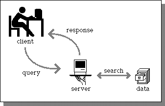
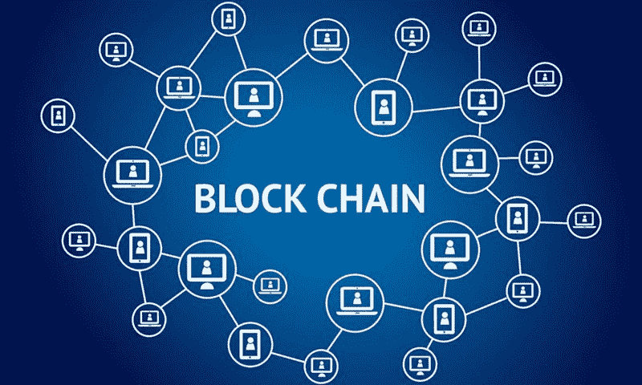
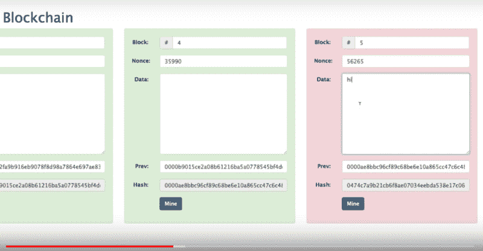
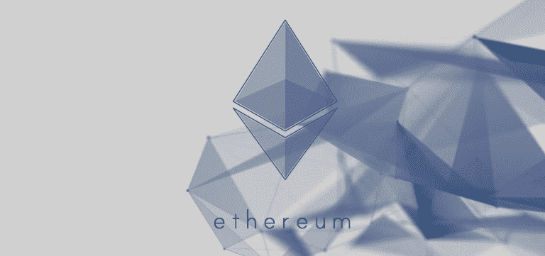
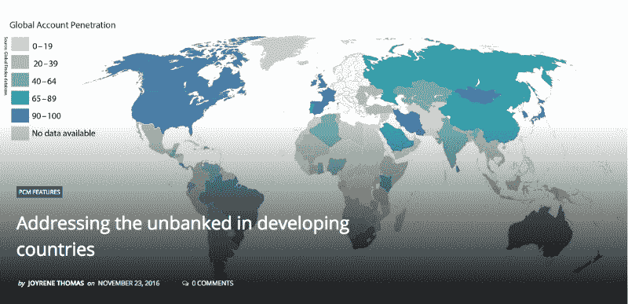
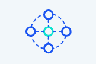
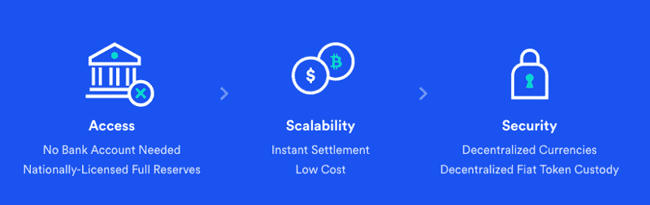
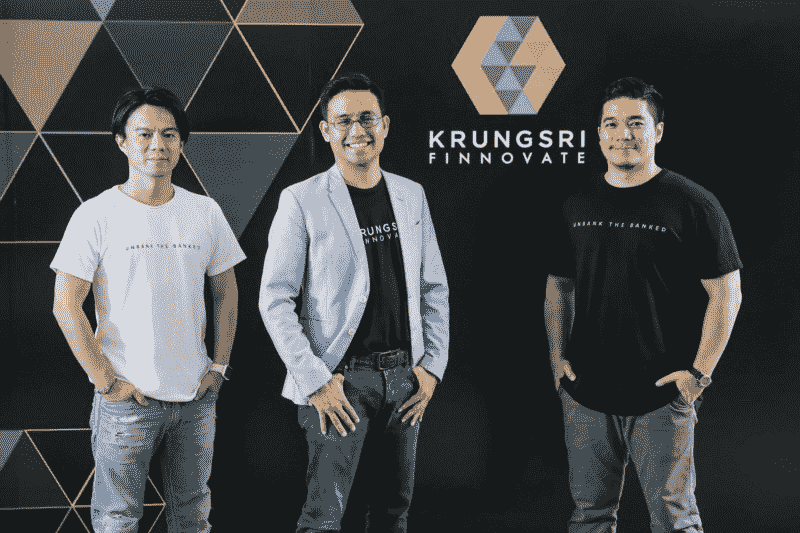
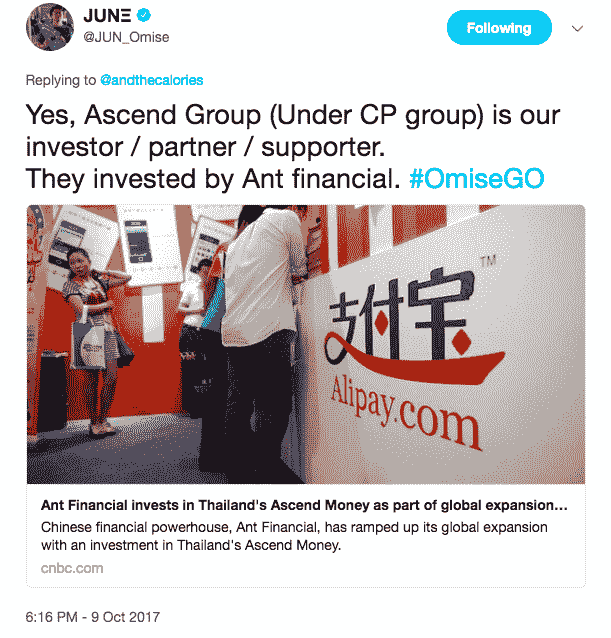
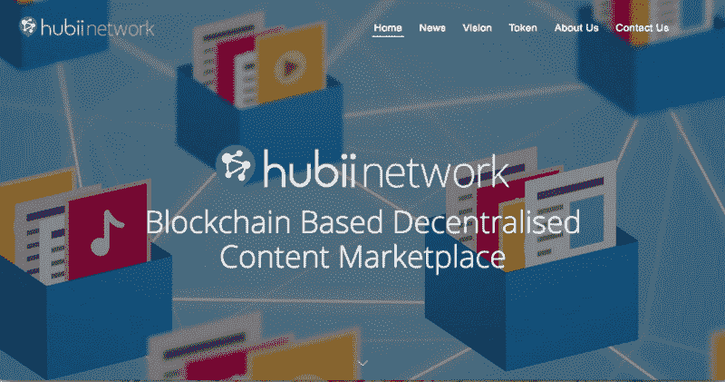

# 权威的 OmiseGO 初学者指南

> 原文：<https://www.freecodecamp.org/news/the-definitive-omisego-beginners-guide-f95dcdf8635c/>

热雷米·格兰瑟恩

# 权威的 OmiseGO 初学者指南

随着对区块链项目和加密货币的兴趣呈指数增长，**似乎是最强大和最令人兴奋的项目之一。尽管如此，由于它涉及相当复杂的概念，对于寻找介绍的初学者来说，很难找到一个**清晰而完整的指南** : OmiseGO 的网站提供了所有必要的文件，尤其是“[白皮书](https://cdn.omise.co/omg/whitepaper.pdf)”，对整个系统的深入解释，但尽管这是一个非常深思熟虑和精确的文件，但乍一看假装它不是一本难读的书将是一个谎言。**

**也有一些高质量的评论，但尽管它们非常有用，它们通常专注于事情的一个特定点，如商业伙伴关系，而没有花时间向完全陌生的人介绍整个项目。**

**所以我决定写一个全面的指南，从一开始就包含所有的内容，让每个人都能清楚地阅读，同时以最精确和准确的方式展示所有的内容，以便让这个非常雄心勃勃的项目获得广泛的受众和理解。**

**当我把事情从基础带回来的时候，如果你觉得你已经清楚了一些要点，请随意跳过它们，直接进入你感兴趣的要点。我试图给这篇文章一个清晰的架构，清晰的标题和一个介绍性的总结，这样如果你不想从头到尾读一遍，你可以很容易地浏览这个指南。**

**请注意，无论你在本指南中读到什么，它只是出于解释的目的，在任何情况下都不是投资建议:我没有资格这样做，我也不想这样做，一个人用自己的钱做出的选择是他或她自己的选择。投资任何项目，尤其是在加密领域，总是一项高风险的工作，对此我没有什么建议。甚至标题为“为什么投资 OmiseGO”的部分也被认为是一个简单的解释，说明如果你选择投资这个项目，投资的理由是什么，而不是假装你应该或不应该投资的建议。**

**我只是试图清楚地解释 OmiseGO 是什么，它正在构建什么，以及它在未来会是什么，同时在同一篇文章中回答我在专门论坛上看到和分别回答的许多问题。**

**本文将涵盖以下几点:**

****1)公司**
Omise 是什么？
omis ego 是什么？
谁是团队？【Omise 是如何推出 OmiseGO 的？**

****2)项目**
**A .基础知识:区块链/以太坊**
互联网服务在没有区块链的情况下如何工作？
传统模式存在哪些问题？什么是区块链？
以太坊是什么？
**b . OMI sego**
OMI sego 想解决什么现实世界的问题？
OMI sego 的目标客户是哪些？
什么是 OmiseGO 建筑？
什么是区块链奥米塞戈？
什么是去中心化交易所(DEX)？
什么是 OmiseGO 钱包？
什么是白标钱包 SDK？
OMG 令牌有什么用？
**C .与其他项目的互动**
以太坊和 OmiseGO 会如何互动？
什么是血浆？**

****3)合作伙伴和投资者**
T3)a .国家和银行 1 .泰国
2。日本
3。新加坡和泰国
**B .私人合伙人和投资者**
1。TrueMoney
2。麦当劳泰国
3。凸版印刷
4。全球脑
5。讨论阶段:Greylock Partners
**c . OMI sego 采用者****

****4)未来**
a .奥米塞哥的未来 奥米塞和奥米塞哥之间会发生什么？
OMI sego 的路线图是什么？
**B .为什么要投资 OmiseGO****

****5)常见问题**
网络的费用是多少？
下注所需的最低 OMG 币金额是多少？
OMG 是 ERC20 令牌吗？
OMG 令牌将来会被另一个令牌取代吗？
OMG 代币存放在哪里？
OMG 哪里买？**

****

### ****1)公司****

*****什么是 Omise？*****

**Omise 是一家现实世界的公司，自 2013 年在泰国、日本、新加坡和印度尼西亚成立。它提供了一个已经被成千上万的客户使用的在线支付解决方案:这些客户是商家，使用 Omise 支付解决方案向他们自己的客户销售他们的产品或服务。**

**Omise 在 2016 年被《福布斯》泰国版选为金融科技摇滚明星，并被泰国总理授予年度数字创业公司奖。**

****

*****omis ego 是什么？*****

**OmiseGO 是 Omise 的扩展，诞生于 2017 年，旨在利用区块链技术提出一个完整的系统，旨在通过提供一种安全、完全开放的方式来彻底改变人们控制自己的金融和有价值资产并相互交换的方式，这种方式没有边界，不依赖于第三方。**

****

*****团队是谁？*****

**长谷川润是 Omise 和 OmiseGO 的首席执行官，唐尼·哈林苏特是 Omise 和 OmiseGO 的首席运营官。Joseph Poon 是《闪电网络》和《等离子体》的合著者，他是 OmiseGO 的主要作者，顾问团队的著名成员包括以太坊的创始人 Vitalik Buterin 和《等离子体》的合著者，以太坊的联合创始人 Gavin Wood，Tendermint 和 Cosmos Network 的创始人 Jae Kwon，以太坊的 Casper 研究主管 Vlad Zamfir，假人的创始人 Julian Zawitowski，以及以太坊、Cosmos Network 和 Streamr 的成员 Thomas Greco。**

**

Thomas Greco, Vansa Chatikavanij, Gavin Wood, Vitalik Buterin, Donnie Harinsut, Jun Hasegawa** 

*****Omise 是如何推出 OmiseGO 的？*****

**Omise 已经计划了一个 ICO 来启动他们的 OmiseGO 项目。ICO 是首次发行硬币，这是一种通常用于区块链项目的筹资方式，公司或项目在有限的时间内以非常特殊的价格出售硬币，这是对相信项目并预计项目在未来会升值的投资者的激励，并允许公司筹集资金。**

**通常，当公司达到硬上限时，ICO 就会停止，硬上限是他们希望通过 ICO 筹集的最大金额，或者换句话说，是他们希望通过 ICO 出售的最大代币金额。但 ICO 通常会先以特别的价格向选定的投资者进行私人销售，OmiseGO 因通过私人销售达到 2500 万美元的硬上限而闻名，这意味着甚至没有公开的 ICO。他们本来可以制作一个 ICO 来筹集更多的资金，而且仅在 ICO 发售前就有超过 1 亿美元的利息，但他们决定一旦达到项目所需的资金就停止。作为旁注，这可以被认为是一个公平的举动和信任的暗示。**

### ****2)项目****

#### ****A .基础知识:区块链/以太坊****

**没有区块链，互联网服务如何工作？**

**没有区块链的传统工作方式是**集中式数据库** **模式**。一家公司拥有一个私有数据库，它是一个数据库，存储在一台或多台被称为服务器的计算机上。该公司还提供了一个公共网站，人们可以通过互联网访问，这要归功于 TCP/IP 协议，该协议允许计算机在输入某个地址时连接到一个特定的服务器(或服务器集合)。例如，输入 http://www.facebook.com 的[将带你去脸书的网站，这意味着由于 TCP/IP 协议，当你输入 Facebook 的 http 地址时，你的电脑将连接到脸书的服务器，而且只能连接到这些服务器。](http://www.facebook.com)**

**当用户通过浏览器在某个网站的界面上请求一个动作时，例如当点击一个链接或填写一个表格时，网站将在它的服务器上，换句话说，在它的私人数据库中寻找相关的信息(例如:下一页的内容),并将这些信息传送到用户的屏幕上。如有必要，网站还将根据用户的操作更新其数据库信息，例如在用户档案的创建、编辑或删除的情况下。**

**在这种模式下，该公司拥有一个数据库，它既是程序指令的集合，也是用户在屏幕上看到的内容的技术矩阵，换句话说，就是定义网站允许的操作的规则；第二，包含网站使用的所有数据的库，例如网站上使用的图像，以及用户可能在网站上输入的所有数据，例如他们的身份信息、个人资料图片、搜索和浏览历史记录、支付信息以及您在使用某个网站时可能提供的任何信息。**

**

Image source [Infomotions.com](http://infomotions.com/musings/waves/clientservercomputing.html)** 

*****传统模式存在哪些问题？*****

**传统的集中式数据库模型有 3 个主要问题:**

**-第一个问题是**安全**:如果黑客成功攻破数据库的安全(有时他们确实做到了)，大量敏感内容可能会泄露，危及用户的安全或隐私。**

**-第二个问题是**隐私**，这意味着网站对人们个人数据的使用:尽管这取决于每个网站的政策，但在其服务器上包含用户信息的网站可以将这些信息出售给第三方，要么匿名(大数据)，要么即这些信息是否将用于直接定制营销(最常见)，要么用于个人或行业间谍活动。**

**-最后，第三个问题，包括前两个问题，也超出了前两个问题，即无论服务提供商是什么，如商业公司、银行、政府办公室，无论他们打算以什么方式处理人们的数据，当使用他们的服务时，这些结构的一个共同点是需要**信任**:用户信任他们，他们给他们敏感信息， 假设并希望该服务不会对他们的数据做任何他们不想做的事情，这将危及他们的隐私或使他们处于危险之中。 这适用于整个公司(你信任公司)，也适用于公司员工:你相信没有任何恶意个人是公司团队的一部分，可以访问你的数据。**

**这种信任系统还意味着用户对自己的数据没有**控制权**，而是将这种控制权委托给第三方(公司、银行或服务)，他决定足够信任以使用(在线市场)，或者社会强烈鼓励他使用(银行)。**

*****什么是区块链？*****

**简言之，区块链是一个分散的数据库，也是一个网络。**

**那是什么意思？**

**传统系统基本上由两个实体组成:用户的客户端(他的计算机和互联网浏览器或连接的应用程序)，以及与客户端通信的网站服务器/数据库。**

**如果 10，0 00 个用户连接到同一个网站，您仍然有 10，0 00 个客户端在一边，1 个数据库在另一边(或者当网站很大时，许多数据库的集合，但是它们最终仍然等于一个集中的数据库)。信息(数据)以两种二进制方式移动:从客户机到服务器，或者从服务器到客户机。**

**现在，假设网站没有私有数据库，而 10 000 个客户端中的每一个除了作为客户端(用户)之外，还拥有数据库的相同副本。**

**

Image source [Seats2meet.com](https://magazine.seats2meet.com/more-about-blockchain/)** 

**想象一下，如果一个黑客隐藏在这 10 000 个用户中，并想为了自己的利益错误地删除或添加或编辑数据库中的信息(例如:从受害者用户的帐户向他自己的帐户添加资金转移)，他自己的副本将与其他 9999 个副本不同，因此他的数据库副本将被自动拒绝，并且他的欺诈企图也将被拒绝。**

**再想象一下，数据库不再像传统数据库那样由行、行和条目组成，您可以在其中编辑条目，而是由信息块组成，这些信息块随着时间的推移垂直排列并相互添加，并且一旦被确认并放入信息块行(区块链)，任何信息块都不能在将来被编辑或删除。**

**最后，想象一下，要将一个新块添加到链中以对其进行验证，它必须在水平方向上被接受，这意味着它必须由拥有数据库副本的所有用户(或足够数量的随机用户)进行确认，还必须在垂直方向上被接受，这意味着要被确认为链中的块 3456，它必须提供非常复杂的密码证明，否则它将无法挂钩到块 3455，并且无法被添加到链中。**

**这是**区块链作为** **分散数据库**:该数据库现在由数千台计算机完全相同地共享，并且在数据库中没有一行可以被擦除或改变(永远)，并且没有一行可以被添加，除非提供非常具体的证明，并且让这数千台计算机确认它也将检查它是否与它们之前的块垂直匹配。其结果是，有能力破坏中央数据库的安全性并窃取其敏感内容的黑客，现在将不得不打破极其复杂的密码屏障，而且还要同时打开数千台计算机的大门，以修改数据库的数千个现有副本中的每一个:这就是为什么区块链被认为是几乎不可破解的。为了更深入地了解这个问题，了解哈希和随机数，你可以在这里观看安德斯·布朗沃思[制作的这个非常清晰有趣的视频。](https://anders.com/blockchain/)**

**

Watch Anders Brownworth’s [video](https://anders.com/blockchain/) and give a meaning to these colourful boxes and numbers** 

**作为一个网络的**区块链仅仅意味着所有这些拥有它们自己的分散数据库的相同副本的计算机，也都运行某个应用程序，由于这个原因，它们都被连接在一起，并构成一个大网络。这个网络的每一个点，即拥有这个数据库拷贝并运行这个应用程序的每一台计算机，被称为一个节点，因为，如同在一个物理网络或 web 中一样，它充当几条线路交汇的链接和节点。由于这种节点和线路水平架构，任何节点都可以虚拟地链接到任何其他节点，信息(数据)现在不仅可以以二进制方式从服务器到客户端或客户端到服务器，而且可以从任何节点到任何节点，因为每个人现在都既是客户端又是服务器。这种数据可以是你能想象到的任何类型的信息，这种网络结构，任何类型的信息可以从任何节点传输到任何其他节点，这就是网络的区块链。****

**然后，用户也可以使用在该网络上运行的应用程序，而无需自己运行节点，也无需拥有自己的数据库副本。**

*****以太坊是什么？*****

**在区块链协议之上，术语以太坊既指**以太坊区块链**也指运行在这个区块链上的**以太坊应用层**。以太坊区块链是某种区块链，意思是由成千上万台充当以太坊节点的计算机组成的某种网络。并且，运行在以太坊区块链上，术语以太坊也指一个补充应用协议层，开发者可以使用它在以太坊网络上开发他们自己的应用。**

**以太坊还推广了**智能合同**的概念，该合同定义了两个参与者之间的规则，因此，当且仅当两个参与者接受的参数得到满足时，特定的交易才会发生，不允许两个参与者中的一个在没有另一个同意的情况下改变合同条款:这是技术和法律透明度的保证。契约可以是财务上的，也可以发生在任何其他层面。同时，以太坊协议还包含了自己的令牌 Ether (ETH)。**

**

Image by *Maria Kuznetsov, source [Coindesk.com](https://www.coindesk.com/information/what-is-ethereum/)*** 

**换句话说，术语区块链既指计算机之间的某种类型的**协议**和进程，也指基于区块链协议构建的一个特定的现有**网络**。要开发一个区块链应用程序(因为您希望您的应用程序能够利用区块链协议的优势，如去中心化、安全性和隐私)，您需要创建一个特定的区块链，并且您需要在其上开发一个应用程序。两者都是复杂而昂贵的操作，因为区块链的生态系统和发展仍然是一种**【认知的狂野西部】**。在这个狂野的西部，以太坊开始牵着每个人的手，通过提供一个可用和有效的区块链，以及一套特定的开发工具来构建:一种受 JavaScript 启发的编程语言，称为 Solidity，以及一个基于 Solidity 的开发框架，开发人员可以使用它在以太坊区块链上开发和运行他们的应用程序。**

**以太坊受欢迎的原因在于以太坊区块链的健壮性和质量，在于智能合约流程的开发，以及以太坊作为应用层允许开发人员开发他们想要的任何类型的应用程序，跳过区块链构建流程，以降低的开发成本和学习曲线打开了基于区块链的应用程序的全新世界的大门。以太坊已经很活跃了(2015 年 7 月的第一个版本),并且仍在开发中，许多观察家认为它可能会带来相当大的范式转变，改变我们认识世界和与他人互动的方式，就像几十年前互联网改变它一样。知道以太坊是由年轻的 Vitalik Buterin 创建的，这也是区块链和计算机文化的一部分。**

#### **b .奥米塞戈**

*****OMI sego 想解决哪些现实世界的问题？*****

**OmiseGO 正在解决两种类型的问题:**

**-第一个问题或事实是，亚洲有数亿人，全球有 20 亿人没有银行账户。他们没有银行账户，也不能在日常生活中使用，或者远程汇款或收款，除非使用昂贵的解决方案(这对打算汇款给家人的移民工人来说往往是个问题)。另一方面，尤其是亚洲显示出异常的互联网渗透率:许多人没有银行账户，但越来越多的人联网。**

**OmiseGO 希望为没有银行账户的人提供一个简单、开放的解决方案，允许他们以非物质化的形式拥有、发送和接收资金，无论他们想发送何种货币或资产，并且成本最低。**

**

2016 map. Source [PaymentsCardsAndMobile.com](http://www.paymentscardsandmobile.com/addressing-unbanked-developing-countries/)** 

**-第二个问题是 OmiseGO 定义的支付处理器、网关和金融机构之间的基本**协调问题**:这意味着经济和金融世界充满了封闭的网络，可以在一个网络内汇款，但跨网络汇款或价值更困难或成本更高。**

**OmiseGO 希望为用户和商家提供一个**通用的、分散的解决方案**，使得从任何网络向任何网络汇款变得容易且无成本，不考虑货币或资产类型、国家和司法管辖区。**

**作为副作用，这种通过设计同样允许通过区块链安全网络在任何资产或价值(忠诚度积分)上交换法定货币(由国家发行的货币)、加密货币(计算机创建的数字货币)的网络，易于使用且成本最低，也可能增加加密货币在人们日常生活中的使用。**

*****OMI sego 的目标客户是哪些？*****

**OmiseGO 瞄准了两类客户:**

**-第一类是**个人用户**，尤其是首先在东南亚，为他们提供一种简单的日常解决方案，可以作为银行账户的积极替代，允许他们在开放的网络上轻松、安全、快速、低成本地保存、发送和接收资金，而不依赖于银行的承兑，也不依赖于银行作为可信任的第三方，允许他们控制自己的财务自主权**

**-第二类是商家和钱包提供商，更普遍的是电子支付提供商，允许他们提出解决方案，让他们的客户可以无缝地保存、发送、接收和交换任何类型的价值，从任何网络到任何其他网络，给予他们比现在更多的自由，并且成本更低。**

**

If you have nothing better to do on Philippines’ Panglao Island, you can use your OmiseGO wallet / Photo Reinhard Dirscherl, Getty, source [Travel + Leisure](http://www.travelandleisure.com/slideshows/best-secret-beaches-on-earth#panglao-island-phillippines)** 

*****什么是 OmiseGO 建筑？*****

**OmiseGO 正在构建一个完全去中心化的系统，以便在基于以太坊的区块链上实现实时和点对点的价值交换，无论价值类型是什么(法定货币、加密货币、任何资产或任何可计算的价值，如里程或忠诚度积分)，也无论是否跨越司法管辖区。**

**-这个完整的系统将在奥米塞戈**区块链**(网络)上进行，并将在这个区块链上包括:**

**-一个**分散化的** **交易所** (DEX)，一个流动性提供者机制，一个票据交换所信息网络和一个资产支持的区块链网关**

**—**奥米塞戈** **钱包****

**-一个**白标钱包** **软件开发工具包** (SDK)**

**OmiseGO 网络自己的令牌:**OMG**令牌**

*****什么是区块链尾身？*****

**奥米塞戈正在建立自己的网络，奥米塞戈区块链。OmiseGO 区块链将不会作为自己的财产由 OmiseGO 公司拥有，但将是一个开放的和未经许可的网络，属于所有使用它的人。使用 OmiseGO 产品(这些产品是 DEX、OmiseGO wallet 和用 OmiseGO SDK 构建的钱包或应用程序)进行的操作将部分在 OmiseGO 区块链上进行，部分在以太坊区块链上进行。操作将如何在这两个网络之间分配将在下面的以太坊和 OmiseGO 如何交互？。**

**

Source [OmiseGO](https://omg.omise.co/)** 

*****什么是去中心化交易所(DEX)？*****

**为了能够在网络上发送和接收任何货币或资产，OmiseGO 区块链将包括一个分散式交易所(DEX ),允许价值与其他价值进行实时交易。**

**通过这种方式，使用 OmiseGO 网络的电子支付提供商不仅可以让他们的客户在 EPP 自己的网络内发送和接收支付，还可以通过**跨网络**发送和接收支付:OmiseGO 区块链不仅将充当区块链本身，还将充当其他区块链可以连接到的**枢纽**，并且可以连接到其他区块链，打破各种支付渠道之间的传统界限。换句话说，OmiseGO 将允许**电子钱包交换**，而 OmiseGO 区块链将保留每个电子钱包服务当前余额的分类账。**

**OmiseGO 区块链还将包括一个分散的订单簿和交易引擎。各种电子钱包自己的法定货币之间的直接交叉可能太多，以至于无法使用区块链进行足够快速的处理:这就是为什么预计 EPPs 将为其最受欢迎的目的地的小额转账保留一定的流动性池。对于更高金额的转移，这是 OmiseGO 网络的真正目标和优势，为了创造一个**流动市场**并允许快速交易和转移，一些 ETH 将被绑定到 OmiseGO 链上的智能合同中(或比特币类令牌将被绑定到绑定清算所中)，这将允许任何法定货币或加密货币与 ETH 进行交易。**

**这意味着，举例来说，如果 A 想发送日元给 B，但 B 想收到美元，A 将发送日元，日元将被交易为 ETH，然后 ETH 将被交易为美元，美元将到达 B。**

**不过，使用 ETH 作为交易的参考货币并不是强制性的，但使用加密货币作为 pairs 的参考货币会更高效、更快捷。**

**为了**扩大**网络规模，并防止流动性池造成集中化(流动性池是用户向网络提供的流动性，以创建流动网络和快速交易，因此如果用户拥有大量流动性，他们可能会在网络上消耗过多的电力)，一种[闪电网络](http://lightning.network/)风格的建设，称为**等离子**，目前正在开发中， 将允许卸载大量链外操作:每个电子支付提供商(EPP)将为小额转账建立一个进入 ETH 智能合同的通道，允许其向自己的链外集中网络提供流动性，而不会因过多的小额交易而使 OmiseGO 分散的区块链网络不堪重负。**

**最后必须指出的是，OmiseGO 网络的设计目标并不是成为一个处理大量小额交易的高容量低价值网络，而是成为卓越的高价值交易和结算平台。**

**

Source [OmiseGO](https://omg.omise.co/)** 

*****OMI sego 钱包是什么？*****

**钱包本质上是一个应用程序，你可以用它来存储、发送、接收金钱和评估资产。**

**在 OmiseGO 区块链，以及在区块链的各种项目中，一个钱包，当它被打开时(也就是当应用程序被启动时)，也是让你的计算机成为区块链的一个**节点**的原因。换句话说，区块链是一个在电脑上运行的开放式钱包网络。**

*****什么是白标钱包 SDK？*****

**SDK 是一个软件开发工具包，也称为**编程框架**。如果你了解 React、Angular、Ruby on Rails，这些也是框架。SDK 是用于特定用途的预定义编程功能的集合，允许开发人员以比从头开始编写所有代码更快、更高效的方式开发应用程序。例如，SDK 提供了某个“do-this”函数:在这个函数后面是 1000 行代码，使用 SDK 的程序员不必编写这些代码，因为他将只使用 SDK 的“do-this”指令。SDK 提供了许多“做这件事”的功能，每一个都为开发者和公司节省了时间和成本。**

**OmiseGO 构建的白标钱包 SDK，顾名思义，将是一个框架，供开发者和公司快速高效地为自己的客户开发钱包，并且在最终产品上没有任何强制性设计或 OmiseGO 提及，因为 SDK 将只是一组编程功能(许多“做这个”)。任何开发人员都可以开发和设计自己的产品，只需使用 SDK 来加快进程，节省资金和时间，并避免构建自己的区块链的痛苦过程和完全理解复杂的区块链模型的痛苦学习曲线。**

**

Source [OmiseGO](https://omg.omise.co/)** 

**OmiseGO 白标钱包 SDK 将免费供任何人使用，通过使用该 SDK 开发的应用程序进行的每笔交易都将自动在 OmiseGO 区块链上进行**。****

**OmiseGO 的声明是，现有的主要参与者将有兴趣开发自己的区块链和自己的钱包，但很快会有一大批中小型钱包提供商进入金融和价值转移市场，这将极大地有利于 OmiseGO 的 SDK。这也将因此加速广大观众对基于区块链和区块链的钱包的采用。**

*****OMG 令牌有什么用？*****

**OmiseGO 钱包应用程序将不仅仅作为一种发送和接收钱的方式。**

**在区块链中，当交易发生时(例如，A 想要向 B 汇款)，该交易被包括在一个块中，该块是交易的集合，并且为了使该块有效并被添加到区块链中，它必须由网络的参与者确认，换句话说，由节点确认，换句话说，由打开钱包的计算机确认。**

**但是，仅仅打开钱包是不够的:如果你的钱包是空的，你将无法确认任何区块。那么它是如何工作的呢？**

**在你的钱包里保留一定数量的 OMG 代币**可以购买你确认封锁的权利**。(作为旁注，为了增加网络的安全性，需要 OMG 验证器也运行以太坊网络的完整节点，它使用相同的验证过程工作。)**

**现在，你为什么想拥有这个权利？**

**因为 OmiseGO 区块链将通过**股权证明**系统(PoS)工作，这意味着在 OmiseGO 区块链上发生的每笔交易都将产生一小笔费用(金额待定)，许多交易将产生许多小的**费用**。如果交易数量足够多，巨额小额费用可以转化为非常重要的全球金额。把你的代币放在你的钱包里叫做押上它们，押上系统的证据意味着:**

**-网络产生的费用将在代币持有者(赌注者)之间分配。**

**-你**下注**的硬币越多(你钱包里的硬币越多)，你从其他下注者那里获得的费用就越多。钱包里有 2000 英镑的赌注者将获得 1000 英镑赌注者的两倍。**

**

Passive income / Credit Don Rosa, Disney, Glénat** 

**-如果你被发现滥用网络(以任何方式作弊，可能是为了你自己的利益)，你下注的所有代币都被**烧掉**，这意味着销毁，这意味着:你赔钱。你失去了为获得这些 OMG 代币而支付的金额，你失去了它们此刻的价值，当然你也失去了从网络收取费用的能力。**

**因此，如果你下注更多的硬币，你会得到更多的报酬，因为如果你想攻击系统，你会冒更大的风险，所以人们认为你不会想攻击系统:代币充当**债券。**您的赌注越多，如果您作弊，您的损失就越大，因此您越能被视为值得信任的节点，并且您的 blocks 确认活动获得的经济补偿也越多。**

**

Hackers got caught, tokens got slashed / Credit Don Rosa, Disney** 

**但是，如果你知道用于比特币的工作证明系统(PoW ),并且在他们的利益证明系统准备好之前，目前也在以太坊上，那么需要注意的是，与工作证明相反，在利益证明协议中，知道哪个节点(哪个用户)确认了一个块，对谁收到费用没有影响。只有一个人押多少硬币才重要。(这也使得利益证明系统在生态上比工作证明系统成本低得多，在工作证明系统中，每台机器都花费大量的能量来竞争确认交易。)**

**这种**经济激励**是 OmiseGO 网络上发生的交易越多，OMG 持有者获得的被动收入就越多，因此 OMG 令牌的价值就越高的原因。**

**此外，OMG 令牌将可用作支付令牌，商家接受它。**

#### **c .与其他项目的互动**

*****以太坊和 OmiseGO 会如何互动？*****

**如上所述，OmiseGO 正在建立自己的区块链，但实际上，并不是所有的操作都将在 OmiseGO 区块链上进行:所有遵循 OMG 规则决定资金流向和交易指令执行方式的事情都将在 OmiseGO 区块链上进行，但最终的交割将在区块链以太坊进行。换句话说，每个决策操作(清算和结算)都发生在 OmiseGO 链上，而实际的最终资金转移则委托给以太坊区块链。**

*****什么是血浆？*****

**虽然与传统的集中式数据库模型相比，区块链有许多非常积极的方面，但它仍然有一个需要解决的**可伸缩性**问题:不能同时快速发生太多事务。Plasma 是由 Joseph Poon 和 Vitalik Buterin 共同开发的解决方案，他们都是 OmiseGO 项目的主要顾问，该解决方案具有极大的可扩展性，每秒钟可能更新数十亿次状态，状态是数据情况的快照。说白了，它将使**能够非常快速地处理极高数量的交易**，使 OmiseGO 网络的效率与 Visa 网络的效率不相上下。**

**OmiseGO 将是第一个实施等离子体技术的项目，但由于等离子体目前正在开发中，值得注意的是，OmiseGO 将能够在开始时不使用等离子体，并将在第一阶段使用具有中等可扩展性的**宇宙网络**用于相同的目的，其中 OmiseGO 网络尚未完全公开(参见下文“什么是 OmiseGO 的路线图？”详情)。**

**

Cosmos Network’s logo. Source [Cosmos Network](https://cosmos.network/).** 

### ****3)合作伙伴和投资者****

#### ****A .国家和银行****

****1。泰国****

**Omise 是一家在泰国扎根很深的公司，很自然地，在泰国和它的 2016 年度数字初创企业之间会发生很多事情。**

**-首先，必须强调的是，泰国财政部已经启动了一项国家电子支付总体计划，以促进电子支付，目标是**创建一个无现金社会**。到目前为止，认为这与 Omise 和 Vitalik Buterin 与泰国**中央银行**的会议有关只是推测，但无论是否有关，如何有关，重要的是 Omise 和 OmiseGO 的主要植入国家已经宣布了这一目标，OmiseGO 在这方面可以成为一个优秀的解决方案提供商，而且泰国的部门和公司似乎关系非常好。**

**更具体地说，泰国财政部成功推出了 Omise 的 FacePay 技术，允许通过面部识别进行支付。**

**-泰国还推出了一个新的银行间移动支付系统 **PromptPay** ，通过一个“比传统银行提供的更便宜、更容易”的解决方案，在不同银行的账户之间“实现资金转移”。参与 PromptPay 的授权由财政部授予，获得该授权的两家银行财团之一是泰国联盟支付系统，其中包括最近对 OmiseGO 进行了 3000 万美元战略投资的**Ayudhya**(通常称为 Krungsri)的**银行。****

**值得提醒的是，A 公司对 B 公司的战略投资不同于普通投资。定期投资是指 A 公司预期 B 公司的成长，并期望从这种成长中获得分红。但是战略投资意味着 A 公司期望个人的成长，作为一个公司，从 B 公司的成长中。这意味着 Ayudhya 银行投资了 OmiseGO，因为 Ayudhya 银行预计，由于 OmiseGO，Ayudhya 银行本身将会增长。**

**

Omise CEO Jun Hasegawa, Krungsri Finnovate MD Sam Tanskul, Omise COO and co-founder Donnie Harinsut. Source [Digital News Asia](https://www.digitalnewsasia.com/startups/krungsri-finnovate-leads-latest-funding-round-omise)** 

**到目前为止，还只是推测，但有意义的推测，期待拥有 70 亿美元市值的 Ayudhya 银行(见福布斯评论[此处](https://www.forbes.com/companies/bank-of-ayudhya/))在未来为他们的用户提供在 OmiseGO 网络上运行的金融应用程序。同样，在 OmiseGO 网络上发生的任何交易，例如通过银行向其客户提供的应用程序，都将产生费用，这些费用将在 OMG 硬币持有者之间分配。**

**还应注意的是，尽管潜在影响较小，但构成泰国联盟支付系统的其他 4 家银行已被授权加入银行间 PromptPay 系统，它们也都受到 Omise 当前在线支付系统的支持。**

****2。日本****

**与泰国一样，日本是 Omise 和现在 OmiseGO 的另一个主要植入国，因为他们的首席执行官和首席运营官分别是日本人(长谷川润)和泰国人(唐尼·哈林苏特)。和泰国一样，日本也在积极考虑转向无现金社会，尤其是在 2020 年奥运会前推出数字货币。但是还有更具体的信息:**

**Ayudhya 的 Krungsri Bank，OMG 的战略投资者，属于日本最大的金融集团三菱 UFJ，也被称为 **MUFG** 。(J 和 G 不是错别字。MUFG 拥有约 2.4 万亿美元的资产，按总资产计算，它是全球第五大银行，也是全球第二大银行控股公司，拥有 1.8 万亿美元的存款。**

**- **SMBC** ，日本第二大银行，是 OmiseGO 的早期投资者。**

**- OmiseGO 与日本第三大信用卡公司 Credit Saison 合作，该公司隶属于日本第三大银行**瑞穗银行**。**

**

MUFG headquarters. Photo [Kakidai](https://commons.wikimedia.org/wiki/User:Kakidai), Source MUFG [Wikipedia](https://en.wikipedia.org/wiki/Mitsubishi_UFJ_Financial_Group)** 

****3。新加坡和泰国****

**据彭博[的一篇文章](https://www.bloomberg.com/news/articles/2017-10-04/singapore-thailand-discuss-e-payment-alliance-for-digital-push)报道，新加坡和泰国正在讨论连接他们的国家数字支付系统，以形成一个前所未有的区域联盟，因为官员们正在加紧努力遏制现金的使用。泰国银行支付系统政策主任 Naphongthawat Phothikit 说，这一联系将把东南亚第一批国家数字支付平台，新加坡的 **PayNow** 和泰国的 **PromptPay** 结合在一起。**

**如上所述，PromptPay 是泰国的银行间移动支付系统，通过选定的授权银行，包括 Ayudhya 的 Krungsri 银行，该银行最近对 OmiseGO 进行了 3000 万美元的战略投资。**

#### ****B .私人合作伙伴和投资者****

****1。t1㎡t1㎡****

**-在泰国，三大电子支付服务是 Paysbuy、AIS (mPAY)和 TrueMoney。Omise 最近收购了 Paysbuy，TrueMoney 是 OmiseGO 的合伙人和股东。**

**OmiseGO 的众筹文件写道:“通过与 OmiseGO 集成，TrueMoney 数字钱包的最终客户将能够进行实时低成本的资金转账、跨境汇款、零售和账单支付。他们还将能够与订阅 OmiseGO 网络的其他数字钱包提供商(“品牌”)进行互动。”**

**什么是真钱:**

**- TrueMoney 是一个金融科技品牌，在东南亚 (SEA)提供**电子支付服务，并拥有 **Google** 和**支付宝**作为合作支付平台。他们在泰国、越南、柬埔寨、缅甸、印度尼西亚和菲律宾设有办事处，并在几乎所有东南亚国家拥有经营电子货币的牌照。在泰国，该平台包括 TrueMoney 钱包、带 **MasterCard** 的 WeCard、TrueMoney 现金卡、Kiosk、Express、支付网关和汇款。****

**- TrueMoney 还通过**暹罗商业银行** (SCB)连接到上述泰国银行间移动支付系统 PromptPay。由于这种 TrueMoney / SCB 的合作关系，“更多的公众可以通过 PromptPay 轻松、便捷地获得金融服务，到目前为止，PromptPay 只能通过银行账户提供”，SCB 将允许 TrueMoney 的 300 万客户通过 SCB 服务(SCB Easy App、SCB Easy Net 和 ATMS)为他们的 prompt pay 电子钱包充值。**

**-TrueMoney 成立于 2003 年，现在属于总部位于泰国的 **Ascend Group** ，该集团是 True Corporation 的一个分支，同时也属于总部位于泰国的 **CP Group** ，该集团在泰国是允许使用 True money 的 9000 多家 **7/11** 商店的唯一运营商。假设 OmiseGO 合作伙伴 TrueMoney 可能在某个时候利用 OmiseGO 技术为其众多用户提供便利服务，并在 OmiseGO 网络上产生费用，这仍然是一种推测，但却是有意义的推测。**

****

**- **蚂蚁金服**，这家拥有中国数字支付巨头**支付宝**，隶属于**阿里巴巴集团**的中国公司，最近投资了来自 Ascend 集团的 Ascend 资金，按照 OmiseGO 首席执行官 Jun own 的话说，Ascend 集团是[OMI sego]的投资者/合作伙伴/支持者。**

**支付宝已经拥有超过 5 亿用户，开始瞄准美国，并且已经管理了每天 10 亿笔交易。**

****2。麦当劳的泰国****

**OmiseGO 已经宣布与麦当劳的泰国店建立正式关系。目前还没有给出进一步的细节，但这可能意味着麦当劳的顾客将能够在泰国餐厅使用 OmiseGO 钱包支付订单。**

****3。凸版印刷****

**OmiseGO 正在与 Toppan Printing 合作，开始提供一种新型的广告和购买流程，通过扫描广告媒体(如杂志)上的 **QR 码**，客户将自动订购广告产品。**

****4。全球大脑****

**OmiseGO 计划与日本的风险投资公司 Global Brain 以及多个区块链实验室合作，推出一个加速器项目。**

****5。讨论阶段:Greylock Partners****

**OmiseGO 最近会见了 Greylock Partners，这是一家领先的风险投资公司，管理着 35 亿美元的资金，与脸书、Instagram、AirBnB 和比特币基地等公司合作。**

#### ****C. OmiseGO 采用者****

****Hubii Network** ，一个拥有 5000 万用户的分散内容市场，[宣布](https://medium.com/@jacobotoll/hubii-network-to-use-omisego-for-payments-81d5d7313b3e)他们已经选择 OmiseGO 作为他们支付系统的显而易见的解决方案。**

**

[hubliinetwork](http://hubii.network/)** 

### ****4)未来****

#### ****A .奥米塞戈的未来****

*****Omise 和 OmiseGO 之间会发生什么？*****

**最终，所有使用原区块链外 Omise 解决方案的交易将转移到区块链 OmiseGO。**

*****OMI sego 的路线图是什么？*****

**如上所述，OmiseGO 不是一个单一的应用程序或服务，而是一个完整的项目，该团队将其分为 3 个层次，将随着时间的推移从最关键的层次发展到最复杂的层次。OmiseGO 已经开始发表博客文章，根据围棋术语描述他们的路线图。**

**- **第 1 层:Omise 支付受理层。****

**Omise 网络已经开始接受付款。**

**完成支付接受层的下一步，是发布白标钱包 SDK。**

**SDK 的原型将于 2017 年第四季度发布进行测试，并计划在 2018 年 Q1 奥运会期间公开发布。**

****-第二层:OmiseGO 分散交换(DEX)网络****

**公开的区块链版本，包括 DEX 引擎，并允许通过股权证明系统进行赌注，计划用于 2018 年 Q2 奥运会。在此之前，以及在 Plasma 发布之前，将使用 Cosmos 网络设置一个中间可伸缩性环境，仅限于 Omise 网络(而不是整个公共 OmiseGO)。这将把 OMG stakers 引入 PoS 协议，并允许他们验证交易。这应该发生在 2017 年第四季度，**

****-第三层:分散存取款接触点****

**这一层将允许用户将实物现金数字化为数字货币(现金流入)，并将数字货币转化为他们可以提取的现金(现金流出)。这个问题的解决方案将于 2017 年底揭晓，发布日期尚未公布。**

****- Horizon:可大规模扩展的跨链兼容 DEX 和无许可网络，允许支付和转账****

**OmiseGO 网络的最终状态将需要释放血浆，具体日期尚未公布。**

#### ****B .为什么投资 OmiseGO****

**首先，必须再次强调的是，本评论的作者绝对无权向任何人 提供任何投资建议。投资总是风险很大，在密码世界的投资风险更大。因此，就像在任何其他项目中一样，投资 OmiseGO 是一种**风险**，如果你决定承担这种风险，你永远不应该投资超过你完全失去的能力。这篇评论中没有任何东西反驳这一事实，如果你正在考虑投资 OMG 或任何其他项目，你永远不要忘记。**

**

*Investment is risk* / Donald Duck by Don Rosa, Credit Disney** 

**也就是说，投资者的商业模式依赖于这样的想法，即 OmiseGO 网络将处理大量的交易，这些交易将产生非常高的费用，这些费用将分配给 OMG 股东，您持有和持有的 OMG 越多，您每年收到的金额就越多，如果该项目遵守其承诺，这些费用可以转化为非常有利可图的被动收入。**

**相信 OmiseGO 网络将处理大量交易有两个主要原因:**

****1 -合伙企业****

**下文披露的 OmiseGO 与银行或私营公司之间的合作伙伴关系表明，潜在的数百万用户或更多用户会发现自己使用在 OmiseGO 网络上运行的金融应用程序，并产生巨额费用(尽管每笔费用都很低)供 OMG 股东分享。**

**

Game of Go / Source OmiseGO [blog](https://blog.omisego.network/omisego-roadmap-v-1-40bfca386e25)** 

****2-SDK****

**OmiseGO 正在提供一个编程框架，任何公司或银行都可以使用它来为自己的市场和用户创建自己的金融(或除金融价值之外的价值交换)应用程序，这些用 OmiseGO SDK 创建的应用程序也将在 OmiseGO 网络上运行，并产生高额费用。同样，编程框架不会以任何方式强迫使用它的公司在他们的应用程序上有任何 OmiseGO 标志，也没有任何形式的图形义务。该软件开发工具包将只是一个特定的编程功能的集合，以便:节省时间和区块链开发成本，通过使用可信的奥米赛戈区块链，并通过使用可信的奥米赛戈软件开发工具包。**

**换句话说，OmiseGO SDK 可以被视为一个免费且简单的通往区块链技术及其潜在金融应用的门户，作为回报，**任何使用它的公司或机构实际上都成为了 OmiseGO 的合作伙伴:如果 C 公司为其用户提供了一个用 OmiseGO 软件开发工具包开发的钱包和应用，并且拥有 1 万或 10 0 万用户群， 一旦他们使用 C 公司提供的应用程序进行交易，这 10 000 或 10 0 万人就成为 OmiseGO 网络**的**用户。****

**因此，这 10 000 或 10 0 万人，乘以将使用 OmiseGO SDK 的公司、银行或服务的数量，在 OmiseGO 网络上产生费用，在 OmiseGO 投资者之间分配，这些投资者被称为赌注者或硬币持有者。**

**

Source OmiseGO [blog](https://blog.omisego.network/omisego-roadmap-v-1-40bfca386e25)** 

### ****5)常见问题解答****

**网络费用的金额是多少？**

**目前尚未决定，但首席执行官 Jun 在一篇帖子中表示，它们应该足够高，以代表对利益相关者的真正激励，从而通过足够数量的节点来保护网络，并且足够低，以使用户和公司使用 OmiseGO 网络真正受益。**

*****下注所需的 OMG 币最低金额会是多少？*****

**这个信息还没有发布。**

*****OMG 是 ERC20 令牌吗？*****

**是的。**

*****OMG 令牌未来会被另一个令牌取代吗？*****

**不。其他一些项目已经在开发的某个阶段用第二个令牌替换了原来的令牌，但 OmiseGO 不会。你现在拥有的 OMG 将是你未来拥有的 OMG，它们不会有任何象征性的改变。**

*****OMG 令牌存放在哪里？*****

**任何与 ERC20 兼容的钱包套装。一个流行的解决方案是[www.myetherwallet.com](http://www.myetherwallet.com)(当心键入正确的 URL，因为网站存在诈骗镜像副本)，被一致认为最安全的解决方案是硬件钱包，如[账本](http://ledgerwallet.com/)或 [Trezor](http://trezor.io/) 。请注意，如果您使用这些解决方案，这篇文章并没有为您的硬币的安全性提供任何保证，而只是显示一些常用的解决方案以供参考。**

*****OMG 哪里买？*****

**你可以在交易所买到 OMG。不是每个交易所都接受每个国家的居民，所以你应该检查你可以使用什么网站，也要在专门的论坛上检查网站的声誉。目前你需要先购买比特币、莱特币或者以太，然后兑换 OMG。购买 OMG 的热门交易所包括 Bittrex、币安或 Bitfinex。购买比特币的热门交易所包括北海巨妖或比特币基地。这些提及也不应被视为任何形式的建议或推荐。和往常一样，当你想用你的钱、电脑和个人信息做任何事情的时候，要小心，并且要自己做调查。记住**永远不要**把你钱包的私人钥匙给任何人或任何网站，除非三次检查它是你通常的钱包提供商，例如 myetherwallet.com，并三次检查网址:在你的浏览器上添加一次安全的网址作为书签，**永远不要**点击另一个网站的链接假装链接到你那里，即使它看起来很正常。请记住，加密世界充满了黑客企图，当人们不够小心时，他们可以成功。开心但要小心。**

#### ****链接:****

**Omise 的网站:[http://omise.co/](http://omg.omise.co/)
OmiseGO 的网站:[http://omg.omise.co/](http://omg.omise.co/)
注:其他任何冒充 Omise 或 OmiseGO 的网站都是骗局。不要访问它。**

****奥米塞格的推特**:【http://twitter.com/omise_go
T2 君的推特:[https://twitter.com/JUN_Omise](https://twitter.com/JUN_Omise)
君的媒介:[https://medium.com/@jun_omise](https://medium.com/@jun_omise)
唐尼哈林苏特的推特:[https://twitter.com/ruxperience](https://twitter.com/ruxperience)**

**约瑟夫·潘的推特:[https://twitter.com/jcp](https://twitter.com/jcp)T2【维塔利科·布特林的推特:[https://twitter.com/VitalikButerin](https://twitter.com/VitalikButerin)**

**Reddit 上的**奥米塞格**:【https://www.reddit.com/r/omise_go/】T2奥米塞格上的[https://omisego.slack.com/](https://omisego.slack.com/)**

**等离子的网址:[http://plasma.io/](http://plasma.io/)
宇宙网的网址: [https://cosmos.network/](https://cosmos.network/)**