# 你可以用来打动同事的 8 个 npm 技巧

> 原文：<https://www.freecodecamp.org/news/8-npm-tricks-you-can-use-to-impress-your-colleagues-dbdae1ef5f9e/>

作者:Adir Amsalem

# 你可以用来打动同事的 8 个 npm 技巧

Credits: npmjs.org

你看着一个同事编码，有一个速记或技巧被应用，不知何故你不熟悉它，你的思维被吹走了。我们每个人都会遇到这种情况。

在这篇短文中，我们将揭示一些非常有用的 npm 技巧。还有很多我们无法在这里涵盖的内容，所以我选择将重点放在那些与我们作为开发人员的日常工作流程最相关和最有用的内容上。

### 开始前的基本人手短缺

为了让每个人，尤其是我们当中的新来者，都保持一致，让我们快速地了解一下基本人手，并确保没有人遗漏任何琐碎的事情。

#### 安装软件包:

常规:`npm install pkg`，速记:`npm i pkg`。

#### 全局安装软件包:

常规:`npm i --global pkg`，速记:`npm i -g pkg`。

#### 安装软件包并将其保存为依赖项:

常规:`npm i --save pkg`，速记:`npm i -S pkg`。

#### 安装软件包并将其另存为 devDependency:

常规:`npm i --save-dev pkg`，速记:`npm i -D pkg`。

更多速记请阅读 npm 自己的[速记列表](https://docs.npmjs.com/misc/config#shorthands-and-other-cli-niceties)。

现在让我们从有趣的东西开始吧。

#### 1.初始化新的包

我们都知道`npm init`，这是我们创建一个新包时做的第一件事。

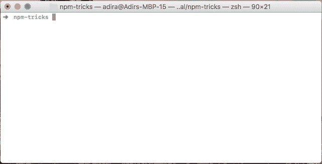

但是，所有这些问题都很烦人，我们无论如何都要修改它，所以为什么不干脆避免它呢？

`npm init -y`和`npm init -f`来救援了！

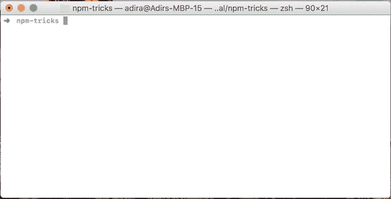

#### 2.运行测试

我们都使用的另一个命令是`npm test`。我们大多数人每天都在使用它，一天几次。

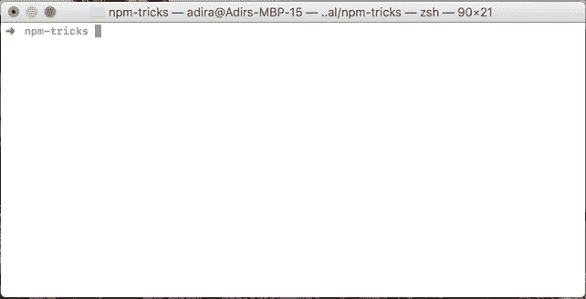

如果我告诉你，你可以用少 40%的字符做同样的事情呢？我们经常使用它，所以这是一个很好的胜利。

幸运的是，有`npm t`可以做到这一点！

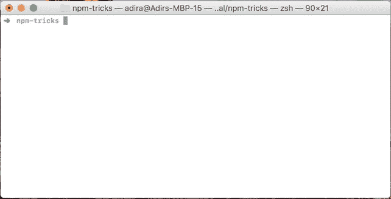

#### 3.列出可用脚本

我们开始一个新项目，我们不知道如何开始。我们通常会问自己这样的问题:我们如何运行它？有哪些脚本可用？

一种方法是打开 package.json 文件并检查`scripts`部分。

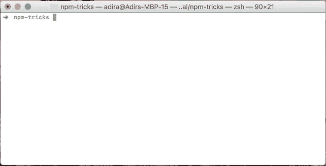

我们当然可以做得更好，所以我们只需运行`npm run`并获得所有可用脚本的列表。

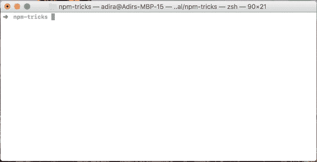

附加选项是安装`ntl` ( `npm i -g ntl`)，然后运行项目文件夹中的`ntl`。它还允许运行脚本，这使得它非常方便。

#### 4.列出已安装的软件包

类似于可用的脚本，有时我们会问自己项目中有哪些依赖项。

我们可以再次打开 package.json 文件进行检查，但是我们已经知道我们可以做得更好。

遇见`npm ls --depth 0`。

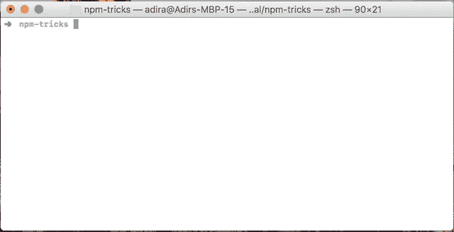

为了列出全局安装的包，我们可以使用`-g`标志和`npm ls -g --depth 0`运行相同的命令。

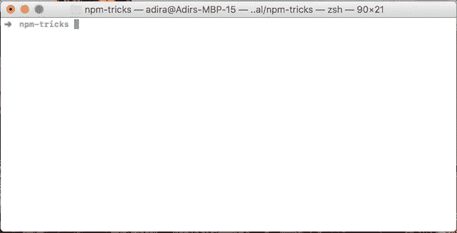

#### 5.运行本地安装的可执行文件

我们在项目中安装了一个包，它带有一个可执行文件，但是只有当我们通过 npm 脚本运行它时，它才起作用。你想知道为什么吗，或者如何克服它？

首先，让我们理解为什么——当我们在终端中执行命令时，实际发生的是它在我们的`PATH`环境变量中列出的所有路径中寻找具有相同名称的可执行文件。这就是为什么它们可以神奇地从任何地方得到。本地安装的包在本地注册它们的可执行文件，所以它们没有列在我们的`PATH`中，也不会被找到。

你会问，当我们通过 npm 脚本运行这些可执行文件时，它是如何工作的？好问题！这是因为当以这种方式运行时，npm 做了一点小把戏，在我们的`PATH`，`<project-directory>/node_module` s/.bin 中添加了一个额外的文件夹。

运行`npm run env | grep "$PATH"`就能看到。您也可以只运行`npm run env`来查看所有可用的环境变量，npm 添加了一些更有趣的东西。

如果您想知道，这正是本地安装包放置可执行文件的地方。

让我们在项目的目录中运行`./node_modules/.bin/mocha`来看看它的运行情况。

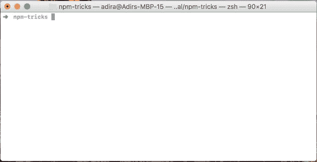

简单吧？只要你想运行本地安装的可执行文件，就运行`./node_modules/.bin/<comma`和>。

#### 6.在互联网上查找您的包裹

您可能会遇到 package.json 文件中的`repository`条目，并想知道:“它有什么用处？”。

要回答这个问题，只需运行`npm repo`并在浏览器中观察它的打开。

顺便说一下，这同样适用于`npm home`命令和`homepage`条目。

如果你想在[npmjs.com](https://www.npmjs.com/)上打开你的包裹页面，也有一个很好的简写方式，`npm docs`。

#### 7.在其他脚本之前和之后运行脚本

您可能熟悉像`pretest`这样的脚本，它允许您定义在`test`脚本之前运行的代码。

您可能会惊讶地发现，您可以为每个脚本创建前置和后置脚本，包括您自己的自定义脚本！

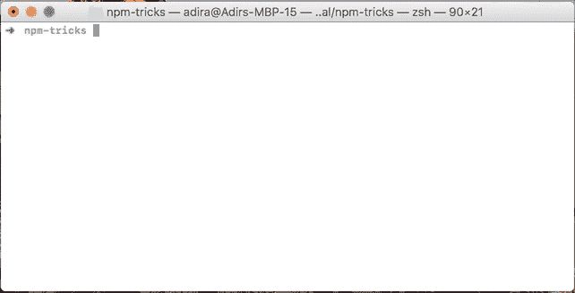

对于使用 npm 作为构建工具并且有许多脚本需要编排的项目来说，这非常有用。

#### 8.碰撞包的版本

你有一个包，你使用 [semver](http://semver.org/) 进行版本控制，你需要在一个新的发布之前修改版本。

一种方法是打开 package.json 文件并手动更改版本，但我们不打算这样做。

更简单的方法是用`major`、`minor`或`patch`运行`npm version`。

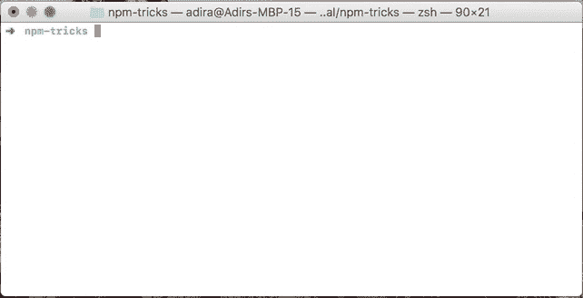

目前就这些。

我希望你学到了一些新的东西，并且至少发现了其中一个对你的日常工作流程有用的技巧，理想情况下，你现在也更好地了解了 npm，并且对如何在工作中更好地利用它有了一些新的想法。

给同事留下深刻印象固然很好，但不断学习新东西，变得更加专业更好！

如果你知道其他有用的技巧，请在评论中分享！