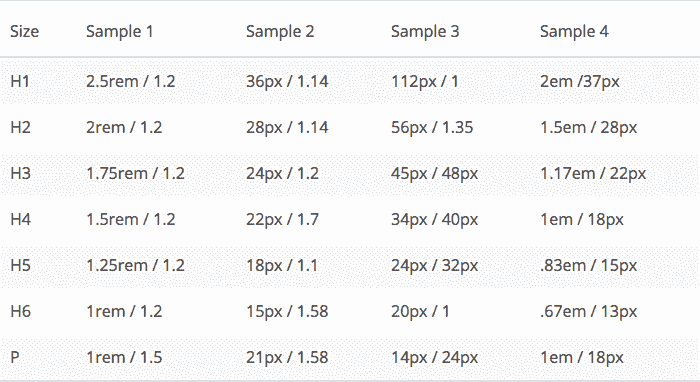
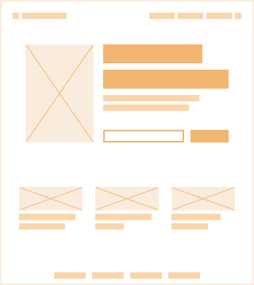
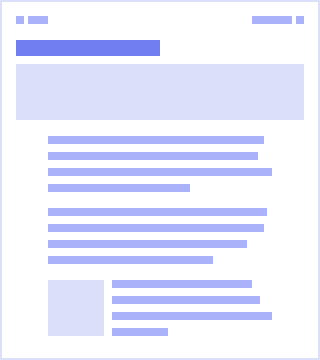
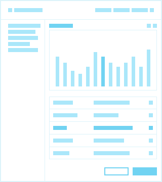
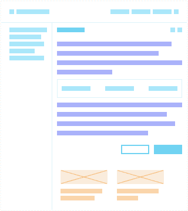
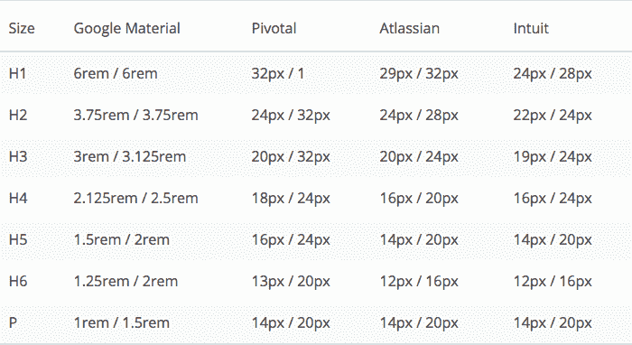

# 8 点网格:网络排版

> 原文：<https://www.freecodecamp.org/news/8-point-grid-typography-on-the-web-be5dc97db6bc/>

## 网页排版令人困惑。你知道最佳实践吗？

当我开始在流行的网站上寻找网页排版的最佳实践时，我必须承认我很困惑。下面是我从一些流行的网站和设计系统中找到的一些字体大小的例子。你能找到统一的模式吗？

Samples simplified to fit onto a standard scale

显然，类型系统有不同的方法。现实是，作为一个网络社区，我们并不都同意。然而，像大多数设计问题一样，它实际上是从解决用户需求开始的。

## 印刷系统的三个原型

这里有三个通用的排版系统原型。大多数公司会在某个时候利用所有这三种方式，但是重要的是要认识到每种方式所解决的潜在用户需求。

#### 营销网站

*   **目的:**讲述一个特定的故事，激发访问者在网站上花费时间和/或金钱。
*   **要求:**每种字体都需要自己的一套风格，大小的变化将基于艺术方向，而不是元素拟合。
*   **响应性用例:**系统将需要在从移动到桌面的多种尺寸之间灵活变化。

旨在向你推销某种东西的网络体验就属于这一类。雄心勃勃的人打破了所有的排版规则，创造出引人入胜、引人入胜的体验。

虽然对这些网站进行了大量的思考，但重点是引起轰动，而不是未来可以建立的可扩展系统。这些网站通常有一个短暂的生命周期，并被完全丢弃，进行自顶向下的重新设计。

一个先进的例子是[利·泰勒](https://twitter.com/lat)和[尼克·琼斯](https://twitter.com/narrowd)在 [Invision 的登陆页面](https://www.invisionapp.com/)上使用的插值函数。

`<`h1>T1【799】)；。页面上的排版经过精心计算，适合各种屏幕尺寸。

> “用数学做动态艺术指导”——利·泰勒

#### 博客/信息网站

*   **目的:**传达大量基于文本的信息。
*   **要求:**主阅读区可能会使用基于比率的行高系统，就像这篇中型文章一样。
*   **响应式用例:**可能会有响应，但保持可读性。

这篇中型文章是为长格式阅读构建的网络体验的一个例子。

重点不是解释小可视化或填写表格。他们选择的大小比例是专门为可读性而构建的，以获得所需的行长度。我可以舒服地阅读每一行，因为排版是精心制作的，以满足我作为读者的需求。

#### 产品

*   **目的:**构建用于解决用户问题，如报税、管理 git 回购或可视化性能指标。
*   需求:文本必须很好地适应元素层次结构。文本主要用于标签、说明和显示数据。
*   **响应用例:**最低响应。高度开发的产品将利用适应性设计，这意味着移动和桌面的不同体验。重点是支持用户体验的元素的层次结构。

Google 的材料设计是一种流行的设计语言，适用于许多产品用例。

材料的[间距方法](https://material.io/design/layout/spacing-methods.html#baseline)基于 8pt 组件网格系统和用于排版的 4pt 基线网格。他们尝试以 4 为增量缩放行高。使用基线网格以 8 为增量进行缩放可能会很困难，因为对于某些文本大小来说，可用的行高相差太远。

允许一些字体大小伴随着一个更合适的行高是一个伟大的前进道路。您总是可以将给定行上方或下方的间距增大 4px，使其与更大的原子网格对齐。

当应用时，基线网格系统能够将元素空间系统(8pt 网格)与排版系统对齐，以在设计中创建引人注目的垂直节奏。

## 网络排版的实现——在现实中

有可能有一个固执己见的结构化用户界面坚持 8pt 网格，也有一个长格式的阅读区域。

允许固定基线网格系统处理结构化组件中的文本，并使用模块化比例为您添加到网站上的博客或文档创建最佳阅读体验。

大多数数字产品公司已经在他们的营销登录页面、数字产品和文档之间这样做了。决定分别构建这些印刷领域可以将你从不可持续的复杂性中解放出来。

Mixing content types together

## 陷阱——Ems、rems 和像素天哪！

为了表达一个清晰和一致的系统，排版尺寸需要被构建它的产品团队容易地解释。

像 rems 和 ems 这样的相对单位有时会被误解，以我的经验，这会导致一个不可持续的排版系统。例如，14px 字体大小和 20px 行高之间的比率不应该用相对单位来表示，因为该比率应该随着字体大小的增加而改变。

将行高定义为 1.4285714286em 是荒谬的，因为大多数人不会心算。如果字体大小增加到 16px，浏览器将呈现 22.857142px 的行高，这种像素分割是一个令人头疼的问题。这造成了混乱，是对相对单位的误用。点击查看[绝对与相对单位的完整列表。](https://www.w3schools.com/cssref/css_units.asp)

为什么今天这么多的设计系统都是基于相对尺寸？答案是“可及性”。

然而，当你用`command +`放大时，浏览器不会缩放基本字体大小。有一些辅助工具可以为需要的用户缩放基本字体大小。我建议对它进行适当的测试，以确保它是您希望用户拥有的体验。复选框可访问性弊大于利。

在你的站点/应用中使用 rems 和 ems 是非常强大的。有许多非常有趣的用例，它们应该是您的工具箱的重要组成部分。

我的建议是，在你真正使用它们之前，尽量少用它们。将它们放入你的排版系统的核心会让你陷入困惑和意想不到的用户体验。

## 8pt 网格排版

8pt 网格概念最强大的部分是它能够推动整个设计的一致性。你需要评估你的用户的需求，以及调整你的版式以满足这些需求的最佳方式。

我非常鼓励设计和工程部门合作，为公司/产品最终确定这些标准。

下面是几个熟悉名字的例子:[谷歌素材](https://material.io/design/typography/the-type-system.html#type-scale)、[枢纽](https://styleguide.pivotal.io/typography)、[亚特兰蒂斯](https://atlassian.design/server/foundations/typography/)、 [Intuit](https://designsystem.quickbooks.com/foundations/typography/) 。

Samples simplified to fit onto a standard scale

#### 参考文献和相关阅读

*   Priyanka Godbole: [创建可预测的&和谐间距系统的框架，以加快设计-开发移交](https://blog.prototypr.io/a-framework-for-creating-a-predictable-and-harmonious-spacing-system-8eee8aaf773c)
*   理查德·鲁特:[应用于网络的印刷风格元素](http://webtypography.net/intro/)
*   伊恩·耶茨:[如何建立一个模块化的排印尺度](https://webdesign.tutsplus.com/articles/how-to-establish-a-modular-typographic-scale--webdesign-14927)
*   内森·柯蒂斯:[设计系统中的空间](https://medium.com/eightshapes-llc/space-in-design-systems-188bcbae0d62)
*   文森特·德·奥利维拉:[深度 CSS:字体度量、行高和垂直对齐](https://iamvdo.me/en/blog/css-font-metrics-line-height-and-vertical-align)
*   凯兹·布里斯:[为什么你应该使用基于 Rem 的布局](https://webdesign.tutsplus.com/tutorials/why-you-should-be-using-rem-based-layouts--cms-27828)

#### 之前的 8 点网格文章:

1.  [八点网格系统简介](https://builttoadapt.io/intro-to-the-8-point-grid-system-d2573cde8632)
2.  [8 点网格:边框和布局](https://builttoadapt.io/8-point-grid-borders-and-layouts-e91eb97f5091)
3.  [8 点网格:垂直节奏](https://builttoadapt.io/8-point-grid-vertical-rhythm-90d05ad95032)

#### 问题:

这是我仍在探索的事情。有好的例子可以分享吗？对于 8pt 排版系统，你有不同的方法吗？

如果你有想法，请留下评论或在 [Twitter](https://twitter.com/Elliotdahl) 上联系。