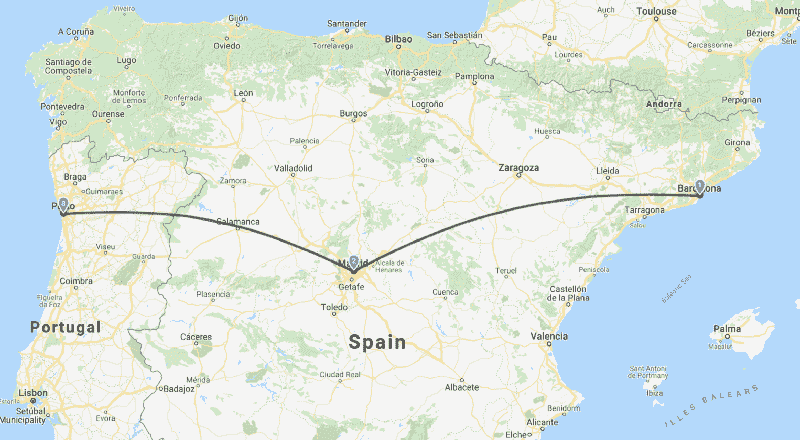

# 在欧洲会议上发表演讲后，我对我的副业和我自己有了什么了解

> 原文：<https://www.freecodecamp.org/news/8-things-i-learned-doing-presentations-in-europe-about-the-front-end-checklist-c37ac18e3b4f/>

2017 年 10 月，我在 Github 上启动了[我的第一个开源项目:**前端清单**。在几个小时内，该项目获得了国际知名度。在那之后的几个星期里，我和世界各地的许多人进行了一次不可思议的旅行。我最近开始在 T4、西班牙和葡萄牙的当地社区做关于这个项目的演讲，我计划以后去法国看看。](https://medium.freecodecamp.org/how-my-first-project-won-6000-stars-on-github-in-5-days-6340ec99829e?source=user_profile---------5----------------)

做这些演讲让我对定期组织聚会的全球社区有了不同的看法和视野。我发现有大量的人在寻找越来越多的内容，并希望参与当地社区。

在发起[前端开发毛里求斯社区](https://www.facebook.com/groups/frontenddevmauritius)后，我知道找到愿意分享他们前端开发经验的人有多复杂。对于一些人来说，比如那些最近刚从另一个城市或国家搬来的人，拥有一个友好的技术社区对创业很重要。

我想和你们分享我在欧洲各地参加这些聚会之前、之中和之后学到的一些东西。我想鼓励你**更多地参与当地的活动，无论你现在身在何处**。

### 第一课:即使当地社区不总是给你回应，也不要放弃！

Barcelona, Madrid and Porto

得知我将在法国、西班牙和葡萄牙度假几周，我决定尝试联系巴塞罗那、马德里、里斯本、阿威罗和波尔图的当地团体。我用 Meetup.com 的[直接给当地团体的创始人发信息，或者当他们在个人资料上指定了自己的账户后，通过 T4 的推特](https://www.meetup.com/)联系他们。但是，正如我所料，一开始我并没有收到很多回复。

在**巴塞罗那**然而，来自 [Ignit](https://itnig.net/) 的 Bettina，他负责管理“ [*巴塞罗那前端开发会议*](https://www.meetup.com/fr-FR/Barcelona-Front-End-Development-Meetup/) ”，很快就回答了我。在通过电子邮件和电话交流之后，我们决定在 3 月 14 日就我的项目进行一次会面。

在**马德里**， [*前端开发商马德里*](https://www.meetup.com/fr-FR/Front-end-Developers-Madrid) ”主办方始终没有回答我。但是[胡安·马西亚斯](https://twitter.com/SoyJuanMacias)，一个在"[*iron hack Madrid*](https://www.ironhack.com/en/locations/madrid)*，"*的助教，尽一切努力帮我准备了一个讲座，我在 3 月 16 日做了这个讲座。

在**里斯本**， [*里斯本 Le Wagon*](https://www.meetup.com/fr-FR/Le-Wagon-Lisbon-Coding-Station/)[Shannon gray bill](https://twitter.com/lewagonlisbon)对让我做一个演示表现出很大的兴趣。但是在我们试着给对方打了几次电话却没有确定时间之后，我们就失去了联系。此外，我决定不在里斯本，而是试图在波尔图做一些事情(对我来说更容易，因为我在阿威罗呆了两周)。

然后在**波尔图**我联系了[里卡多·门德斯](https://twitter.com/locks)，他通常组织 [*波尔图代码*](https://www.meetup.com/fr-FR/portocodes/events/247984077/) 。在几条信息和几封电子邮件之后，我们决定在 4 月 5 日组织一次讲座，地点是在市中心的一个合作空间。

### 第二课:试着了解你的听众，或者准备好你的演讲，让任何人都能理解

我学到的关于演讲或演示的第一条规则是“了解你的听众”。“这可能是你需要牢记的最具挑战性但也是最重要的规则。

在每次演讲的前几天，我浏览了 Meetup 上的所有资料，试图更好地了解我未来的听众。不幸的是，大多数人不把他们的推特或脸书账号放在他们的个人资料里。他们在订阅时通常不会回答群主发来的一些基本问题，这使得演讲者很难了解 meetup 的目标受众。

我在巴塞罗那的 meetup 之前给一些人发了推文，但是没有收到任何回复。下次吧。。

> [@ uoke Sita](https://twitter.com/uokesita?ref_src=twsrc%5Etfw)[@ Miguel cobamtz](https://twitter.com/MiguelCobaMtz?ref_src=twsrc%5Etfw)[@ adrianafreitas](https://twitter.com/adrianafreitas?ref_src=twsrc%5Etfw)[@ martinmalindacz](https://twitter.com/martinmalindacz?ref_src=twsrc%5Etfw)来参加[# frontend check list](https://twitter.com/hashtag/FrontEndChecklist?src=hash&ref_src=twsrc%5Etfw)meetup？你正在做的任何网站，你想让我分析并给一些反馈？[#巴萨](https://twitter.com/hashtag/Barcelona?src=hash&ref_src=twsrc%5Etfw)[#前端](https://twitter.com/hashtag/FrontEnd?src=hash&ref_src=twsrc%5Etfw)
> 
> — David Dias ? ? (@thedaviddias) [March 11, 2018](https://twitter.com/thedaviddias/status/972860228457975808?ref_src=twsrc%5Etfw)