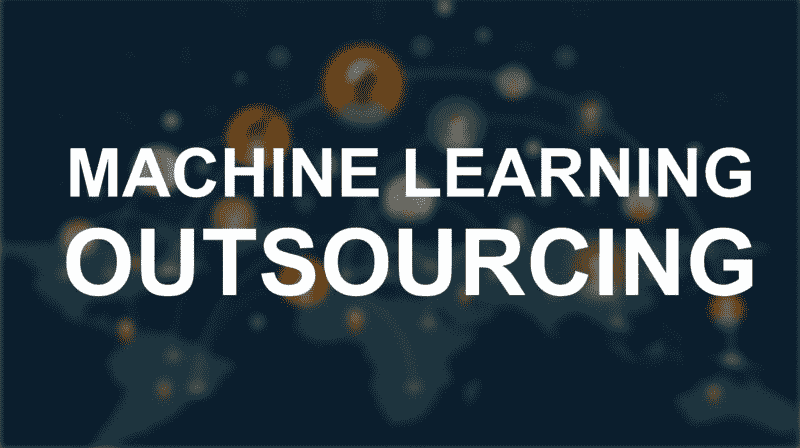
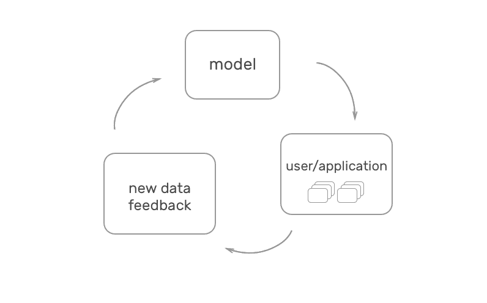
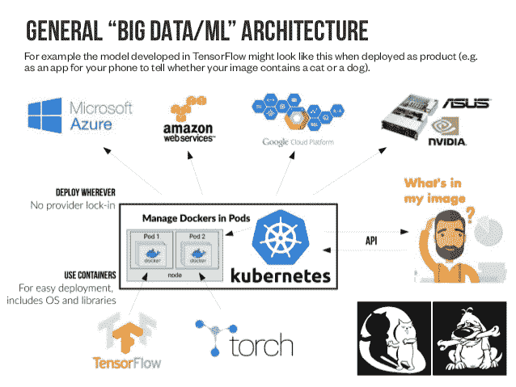

# 为什么大多数创业公司应该外包他们的机器学习工作。

> 原文：<https://www.freecodecamp.org/news/why-most-startups-should-outsource-their-machine-learning-work-d98d89144223/>

大卫·拉伊诺赫

# 为什么大多数创业公司应该外包他们的机器学习工作。

人们说机器学习将改变互联网的工作方式。它将使企业变得更聪明、更有效、信息更灵通。会有更高的点击率，更好的内容和产品推荐，更好的客户细分。

2017 年的现实是缺少程序员，更复杂，缺少优质工具。一般来说，机器学习是原始的，所以在收入翻倍之前，没有人愿意使用它。

我来自一家 ML SaaS(机器学习软件即服务)[公司](https://vize.ai/)。我想指出提供机器学习服务的公司的价值。

机器学习经常与人类的感知联系在一起。

Machine learning is often connected with human perception

### **机器学习简介**

当谈到机器学习时，我们通常指的是监督学习。它由句子等输入数据和情绪=悲伤等标签组成。该数据集为特定任务训练神经网络，例如识别段落的情感。

更多的输入意味着对问题更好的理解和更多的训练数据。这导致更多的用户，更好的神经网络和更好的性能。

This is an amazing feedback loop that comes with machine learning

ML 的一个非常重要的事实是，训练数据必须与用户和系统生成的数据相同。

苹果通过给 Siri 输入声音和文本来训练它理解英语句子。如果我用中文问 Siri 一个问题，它会试图让我们的音节与英语单词相匹配，但这不起作用。

### 1.机器学习外包的好处

#### 反馈回路和大数据

数据量胜过一切。对于 ML 来说是这样，这也是外包的主要原因。

你永远不会从亚马逊的 Echo 平台上获得和亚马逊一样多的语音数据。你永远不会像谷歌那样标注同样多的数据。对于最核心和数据驱动的应用程序，您可能会选择 SaaS。这包括自然语言处理(NLP)、通用图像识别、人脸识别和情感分析。

怎么认出来的？问问自己，“有人能拥有比我多 1000 倍的数据吗？”。

反馈循环是一个双赢的局面。客户得到最好的解决方案，公司就能制造出市场上最好的产品。

你必须测试 SaaS 的服务，了解训练和你的数据的适合度。如果不合适，就没有准确性，SaaS 几乎不会投入时间和资源为你调整解决方案。

#### 开发时间和成本

ML 专家就像嵌入式 C 程序员。价格昂贵，而且是稀有物种。

如果您投资 3 个月、2 名 ML 专家和 1 名后端开发人员来开发解决方案，将花费 3*(2*(150K/4) + 110K/4) = 307K 美元。也就是 307/12 = 25 年的 1K/月 SaaS 服务。即使开发成本减半，也不会对游戏产生太大影响。

[TensorFlow](https://www.tensorflow.org/) 是使用最多的 ML 库还在开发中。有了它，您仍然需要扩展、更新和协调您的解决方案。

这是现收现付 SaaS 公司的巨大价值。它们提供了测试成本低廉、实施快速的解决方案。

#### **问题结构知识**

通常，数据和模型并不是唯一的挑战。我们可能知道问题是什么，但通往解决方案的道路是由聪明人建造的。

你可以通过雇佣合适的人来购买知识和专业技能。但是业内最优秀的人都在为最专注的公司工作。

SaaS 找到了最相关的人，并根据他们合作过的数百名客户积累了知识。它可以向你显示障碍，并为你提供一个你从未想过的额外功能。

#### 最大似然优化和元学习

拥有大量相似的客户会带来相似的数据。这提供了微调神经网络以掌握特定任务的可能性。

专注于人脸识别的公司将为这项任务提供最深刻的理解、最多的功能和最佳的性能。这是一个常识，但它在机器学习中有更大的影响。

优化的一个特例是[元学习](https://en.wikipedia.org/wiki/Meta_learning_(computer_science))。我们的产品是可训练的[图像识别](https://vize.ai/image-analytics)。每个客户的数据都不一样。这不允许我们微调一个神经网络。

相反，我们基于可用的输入数据来改变模型的神经网络参数。我们使用成千上万的数据集-模型对。这使我们能够分析输入数据。然后，我们可以为每个数据集选择前 5 个参数组合。只训练这些模型。在训练之后，选择最好的一个，所有 5 个结果可以帮助建立更好的未来预测。

通过这种方式，我们用更多的机器学习来代替每个客户的个人 ML 专家。

Machine learning in 2017 is not replacing people’s jobs but helps people to work smarter

#### 基础设施和开发运维

缩放从一开始就很重要。机器学习的执行时间通常高于简单的数据库查询。围绕 TensorFlow 建立一个具有连续机器学习反馈循环的健壮架构需要工作。

已部署的 ML 模型的典型堆栈是 [Docker](https://www.docker.com/) 、 [Kubernetes](https://kubernetes.io/) 、TensorFlow 和一些云提供商，如 [AWS](https://aws.amazon.com/) 。它包括构建一个基于云的扩展集群，以及一个基于按需 GPU 的培训和注释工具。

我们已经尝试处理我们自己的硬件，但这不是一个好的开始。

Machine Learning [Stack](https://www.slideshare.net/PetteriTeikariPhD/deploying-deep-learning-models-with-docker-and-kubernete)

### 2.机器学习外包的负面影响

#### 没有竞争优势

如果没有发展，就没有竞争优势。SaaS 提供了一个解决方案，其主要目的是尽可能地扩大规模。与此同时，很难开发出比 SaaS 提供的更好的东西。

如果我们有 SaaS 解决方案中没有的额外数据，那么构建它是很有趣的。但是如果供应商 100%满足我们的需求，我们很难超越它。

#### 具体问题不包括在内

有些数据太具体，没有 SaaS。例如，不会有基于英镑分析数据预测钓鱼得分的 SaaS。你必须自己开发它。

在某些地区，可能会有 SaaS 为有限的市场提供可定制的解决方案。但是要小心那些过于笼统的解决方案。他们可能只为 TensorFlow 提供一个 GUI 包装器作为其唯一的功能。这可能会导致功能受限**。**

Image from [www.unsplashed.com](http://www.unsplashed.com)

#### 数据共享

一些公司运营关键数据、有价值的数据或个人数据。ML SaaS 公司必须访问用户数据。没有最终用户加密的机会。在过去的几年里，这种严格的隐私观念已经发生了很大的变化。

在大多数情况下，我会建议制定一个好的服务水平协议(SLA ),而不是 ML 解决方案。

对于像优步、Airbnb 和 Pinterest 这样的大公司来说，ML 是核心技术，预算巨大，ML 开发是必须的。

对于其他公司来说，有一个比复制 ML 功能更重要的使命。

#### 结论

像往常一样，没有一个直截了当的“是”。ML SaaS 的采用与 SaaS 提供商的受欢迎程度非常相关，唯一不同的是。

如果你需要的话，构建自己的电子邮件营销功能并不困难，比如 [MailChimp](https://mailchimp.com/) 。然而，要建立一个基于机器学习的点击率推荐系统需要付出很多努力。

一些功能，如亚马逊语音识别解决方案或谷歌的通用图像识别，几乎不可能达到同样的精度。

任何开发人员都应该在承诺以一个月内构建一个机器学习功能为目标的 sprint 之前做 SaaS 研究。

如果您对专门的图像识别技术感兴趣，您可以访问我们的[学习页面](https://vize.ai/learn)，在那里您可以找到更多详细信息。感谢您的阅读。

我读过很多文章，指出人工智能的未来可能性，但还没有人接近它。

我发现真正有价值的是:
文本分析，点击率优化，图片分析，内容推荐，自然语言处理，数据挖掘，文档理解。

以下是一组涵盖当今基于人工智能的解决方案的文章:
一系列你今天可以使用的人工智能工具
— [个人使用](https://medium.com/imlyra/a-list-of-artificial-intelligence-tools-you-can-use-today-for-personal-use-1-3-7f1b60b6c94f) (1/3)
— [商业使用](https://lyr.ai/a-list-of-artificial-intelligence-tools-you-can-use-today%E2%80%8A-%E2%80%8Afor-businesses-2-continued/) (2/3)
— [行业专用](https://medium.com/imlyra/a-list-of-artificial-intelligence-tools-you-can-use-today-for-industry-specific-3-3-5e16c68da697) (3/3)