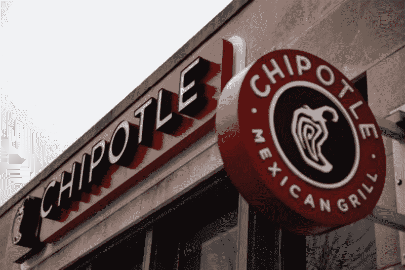

# 如何学习策略设计模式？做一个汉堡！

> 原文：<https://www.freecodecamp.org/news/how-can-you-learn-the-strategy-design-pattern-make-a-hamburger-a6ad4332b838/>

作者:黄思慧

# **如何学习战略设计模式？做一个汉堡！**

你知道怎么点汉堡吗？

如果是这样，我有好消息告诉你。然后你就知道怎么用一个最常用的设计模式了，[策略模式](https://en.wikipedia.org/wiki/Strategy_pattern)！

“怎么会这样？”你可能会问。那么，让我们来看看战略模式的特点。

*   它定义了一系列算法。
*   它封装了每个算法。
*   这使得算法在该家族中可以互换。

策略模式让算法独立于使用它的客户端而变化。

Do you feel as confused as this guy?

这和汉堡有什么关系？

让我们考虑一下汉堡。

汉堡有很多种:蔬菜汉堡、芝士汉堡、烤鸡汉堡和双层芝士汉堡等等。都是一样的格式:上面的小圆面包+肉饼+下面的小圆面包。

是肉饼让每个汉堡都与众不同。奶酪汉堡中间有奶酪和牛肉馅饼，而烤鸡汉堡有烤鸡胸馅饼。

让我们用汉堡来回顾一下策略模式的定义。就汉堡而言，算法家族是什么？这是不同肉饼的家庭:

*   鸡肉汉堡的馅饼=[烤鸡胸肉]
*   奶酪汉堡的馅饼=[奶酪+牛肉馅饼]
*   双层芝士汉堡的馅饼=[芝士+牛肉饼+芝士+牛肉饼]

它们是封装的，并且可以相互交换。把鸡肉汉堡肉饼换成芝士汉堡肉饼，你就得到一个芝士汉堡。

> 策略让算法独立于使用它的客户端而变化。

你可以点任何你喜欢的汉堡。但是对于厨师来说，制作汉堡遵循同样的一般程序:准备小圆面包，烹制肉饼，然后将肉饼夹在上下两个小圆面包中间。

汉堡是使用策略模式的真实例子。

让我们看一下代码。

战略模式中有三个参与者。

**策略**声明一个所有支持的算法通用的接口。上下文使用这个接口来调用由具体策略定义的算法。

**具体策略**使用 StrategyInterface 实现算法。

**Context** 配置了一个 ConcreteStrategy 对象；维护对策略对象的引用；可以定义一个接口，让策略访问它的数据。

烤鸡馅和牛肉馅是我们的具体策略。每一种都规定了馅料的烹饪方式。类是我们的上下文。它被配置了一个具体的策略，当一个汉堡需要被烹饪的时候，它使用这个具体的策略。

在我们的 burger 示例中，我们没有一个特定的类来声明具体策略应该实现什么接口。那是因为我们不需要，多亏了 Ruby 的鸭子打字。如果它走路像鸭子，说话像鸭子，那它就是鸭子。如果能做成汉堡肉饼，那就是汉堡肉饼。

策略声明了具体策略应该实现的接口和上下文可以使用的接口。正如您在上面的代码中看到的，GrilledChickenStuffing 和 BeefPattyStuffing 都实现了 cook 方法，这是具体策略的用户(也称为上下文)期望具体策略提供的方法。

#### **战略模式的核心思想**

策略模式的关键是将不同的算法放到一个单独的对象中。这些对象成为上下文可以从中选择的一系列算法。这些对象中的每一个，也就是策略，做同样的工作并支持同样的接口。

在我们的汉堡例子中，我们对汉堡有不同的馅饼策略。每个具体的汉堡肉饼策略都通过实现 cook 方法来支持相同的接口。

都是构图的问题。用户有一个策略和代表。策略的用户委派作业。在我们的例子中，一个汉堡有一个肉饼，它代表了烹饪的工作。

#### **战略模式的优势**

*   它通过从一个类中抽取一组策略来实现更好的关注点分离，并解除了`Burger`类对我们的填充知识的任何责任。
*   这使得在运行时切换策略变得很容易，因为该模式基于组合和委托，而不是基于继承。

#### **考虑使用策略模式时需要注意的事项**

*   上下文和策略之间的数据传递。如果具体策略的实现需要来自上下文的数据，您可以将数据作为参数传递给具体策略，或者将上下文本身传递给具体策略。这是为了使具体的策略可以通过上下文访问数据。无论你选择哪种方式，都要注意上下文和具体策略的混乱。
*   仔细检查你是否真的需要策略模式、[模板方法](https://en.wikipedia.org/wiki/Template_method_pattern)或[装饰模式](https://en.wikipedia.org/wiki/Decorator_pattern)。

#### **战略模式中使用的设计原则**

*   封装变化的内容
*   偏爱合成而非遗传
*   编程到接口，而不是实现

现在，您已经了解了策略模式。

这里有一个重要的问题:你最喜欢的汉堡策略是什么？:)

我每周出版给 sihui.io。

订阅吧，这样你就不会错过本系列的下一篇文章。

下次我们将看看模板方法和…

