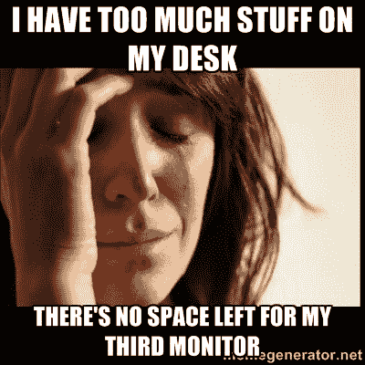
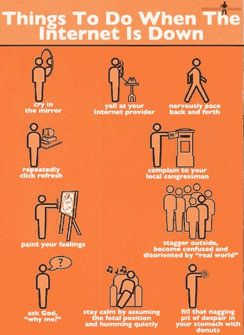
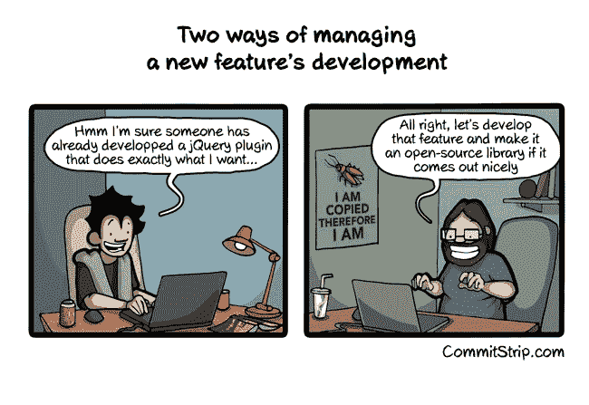
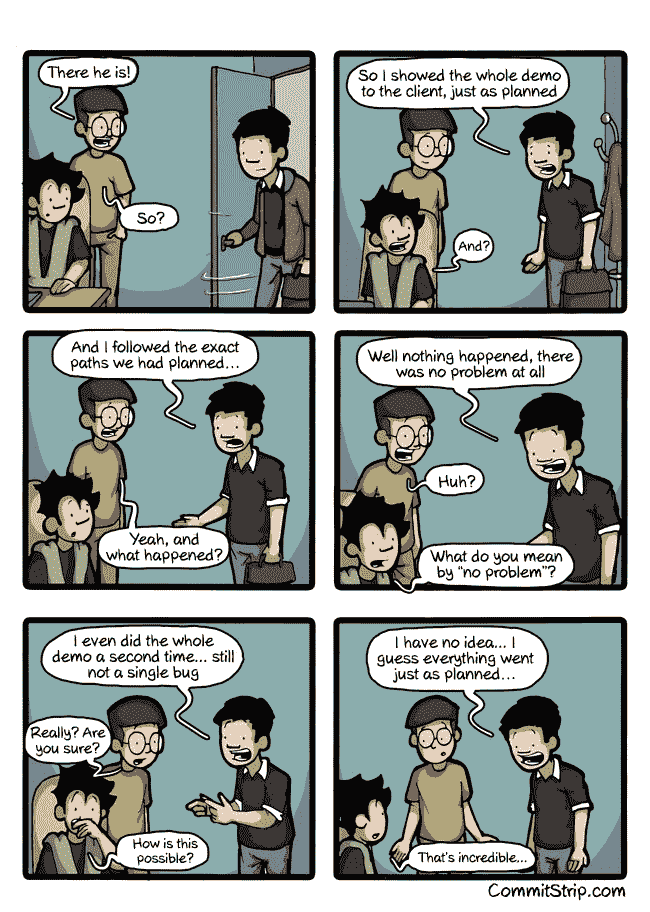

# #作为软件开发人员，我面临的第一世界问题

> 原文：<https://www.freecodecamp.org/news/firstworldproblems-i-face-as-a-software-developer-2ff881ea1d6/>

作者:Kartik Godawat

# #作为软件开发人员，我面临的第一世界问题

Photo by [Michał Parzuchowski](https://unsplash.com/photos/geNNFqfvw48?utm_source=unsplash&utm_medium=referral&utm_content=creditCopyText) on [Unsplash](https://unsplash.com/?utm_source=unsplash&utm_medium=referral&utm_content=creditCopyText)

[**第一世界问题:**](https://en.oxforddictionaries.com/definition/first_world_problem) 相对琐碎或次要的问题或挫折(暗指与发展中世界可能经历的严重问题形成对比)。

作为开发人员，我们常常坐在有空调的漂亮小房间里，忘记世界上的实际问题。我们倾向于把我们的小问题当成大问题。以下是我在一个典型的、想象中的星期五，试图叙述我所面对或思考的“第一世界问题”(包括一些夸张)。

### 上午 9 点——到达我的办公室需要很长时间。

这是一个晴朗的星期五早晨。我开着闪亮的 UberX 去我的办公室，预计 45 分钟后到达。我不再用 Kindle 阅读或听播客，而是在想如果我的办公室离我只有一分钟的路程，那该有多简单。

在这些想法之间，我还想到了我的厨师，他每天骑自行车花同样多的时间，只是为了按时为我准备晚餐。

但是这种想法不足以动摇我是那个因为四处旅行而受苦的人的感觉。结果，第一千次，我想象着搬到我办公室旁边的昂贵公寓。三倍租金完全值得！除非我能负担得起。

### 上午 11:00-只有 30Mbps 的下载速度

现在我已经到达了办公室，在我的努力下*我喝了些茶，慢慢地安顿下来。我下载了一个 Kaggle 数据集。但是好像有点不对！下载显示估计需要四个小时，但我现在就需要。*

*YouTube 也拒绝在 720p 缓冲。我和我的同事谈到办公室互联网正处于石器时代的事实。我故意忽略了一个事实，那就是我家乡的人们甚至无法获得足够的带宽来支持与我进行一次像样的视频通话。*

### *上午 11:30-现代启示录。WiFi 关闭了*

**

*在提交我的更改之后，我做了一个 git 按钮，然后锤子开始敲击。网络中断了。我立即向我的团队和周围的其他团队表达我的担忧。我几乎已经下定决心要收拾行李，在家工作。*

*谢天谢地，几分钟后，网又回来了，世界得救了。唷！无论如何，在内心深处，我已经下定决心，我今天不能做太多的工作。*

### *上午 11:45——我需要一台 MacBook*

*我正在使用一台 16GB 内存的第六代 i7 笔记本电脑。当我走在办公室的走廊上时，我看到一个团队正在开发 MacBooks，炫耀他们在触控板上滑动手指的能力。*

*我羡慕他们，希望我有一台 MacBook。是的。就是这样。这就是我不如他们有效率的原因。我忽略了所有我关注的[生产率调整](https://hackernoon.com/how-i-boost-my-development-environment-to-focus-on-task-at-hand-9dbfc13b7829)。*

### *下午 1 点——自助餐厅糟透了*

*到目前为止不太好的一天。现在我来到自助餐厅，希望能找到美味佳肴等着我。令我沮丧的是，食物相当普通，我已经厌倦了每天吃同样的食物。*

*我试着吃了一点，然后鼓励我的团队扔掉他们盘子里的食物，去附近的地方吃披萨。当我们走进比萨饼店时，我走过两个乞讨食物的小孩。我假装他们根本不存在。*

### *下午 2:00——这个开源库坏了*

*展示我非凡的搜索技巧，我在 github 上找到了一个库，应该可以解决我的需求。我完全按照自述文件所描述的那样做了，但是它在源代码中抛出了一些神秘的错误。函数定义也可以更好，它应该接受更多的调整参数。*

*我觉得我不应该浪费一点时间去**看看我能做些什么来解决这个问题。如果我没有很好地记录我的代码或者在我自己的项目中编写覆盖测试用例，那也没关系。因为这是一个开源项目，所以做出贡献的开发者没有达到标准是错误的。***

*我默默地感谢开发人员发表了这篇文章，浪费了我的时间，并继续用我异常强大的搜索技能寻找解决方案。*

*

Try contributing to an existing open-source library instead of discarding it* 

### *下午 2:30-我没有得到足够的报酬*

*我的经理刚刚要求我在今晚之前为客户部署一个新的临时服务器。我被雇来写代码，**这应该是我唯一的目的。他们怎么敢让我做他们的开发工程师。半小时后我有个评估会议。我决定他们必须给我加薪，因为我做的比我应该做的多得多。***

### *下午 3:30——我没有得到足够的加薪*

*我的反馈很好。管理层感谢我付出的努力，并对我每天处理的问题表示同情。但我带着悲伤的表情走出去。为什么？因为我没有得到我在另一家(资金雄厚的)公司的朋友刚刚得到的 45%的加薪。*

*我现在该如何面对我的朋友？我怎么能和[夏尔马吉卡贝塔](https://www.quora.com/Who-is-Sharma-ji-ka-ladka)比呢？不要介意我仍然获得了两位数的加薪，这明显高于我国的通货膨胀率。*

### *下午 4:00-我是冒名顶替者吗？*

*我在喝茶，思考这个百万美元的问题。我听很多人说他们患有冒名顶替综合症，我想我也是。当我喝完那杯缓解压力的绿茶时，我开始感到紧张，因为**我可能得了综合症！***

### *下午 5:30——墨菲定律*

*任何可能出错的事情都会出错*

*

Only if this could happen!* 

*我写了测试用例，通过了代码审查。我做了所有期望我做的事情。但是原定于今晚进行的生产部署失败了。*

*我很生气。生气是因为我已经和朋友有约了。如果**有人**写了一份[混沌](https://github.com/Netflix/SimianArmy/wiki/Chaos-Monkey)测试，这种情况似乎就可以避免了。很明显，那个人不会是我。我毕竟不能做所有的工作。*

*大约一个小时后，问题就解决了。我终于可以回家，放松一下，星期一再来。*

*但在周一早上，我打开优步应用程序，没有车可用…周期重置！*

*如果你认为你的任何问题都是微不足道的，请在评论中分享。*

*非常感谢您抽出时间。如果你喜欢阅读，请给我一些掌声，让更多的人看到这篇文章。谢谢大家！下次再见，祝你愉快:)*