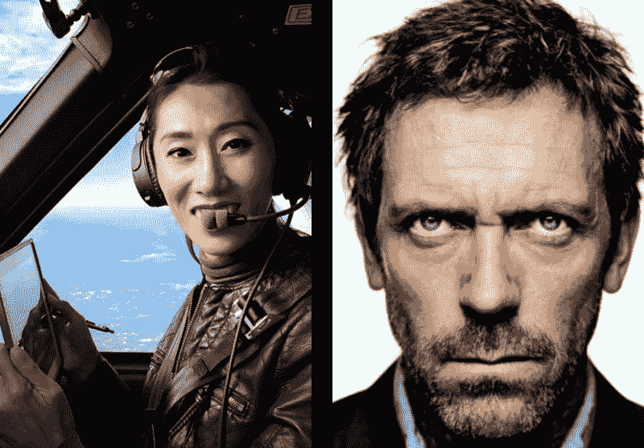

# 你错过的那些事情——都是因为你太自大而没有使用清单

> 原文：<https://www.freecodecamp.org/news/what-you-missed-because-you-were-too-cocky-to-use-a-checklist-c30c3ad663c2/>

乔纳森·索罗扎诺-汉密尔顿

# 你错过的那些事情——都是因为你太自大而没有使用清单

发射 36 秒后，闪电击中了阿波罗 12 号及其 600 万磅高爆炸燃料。

仪器熄灭了。

22 秒后，闪电再次袭来。仅存的几台仪器开始闪烁红色故障灯。

“你就要死了”的警报开始响起。

通过无线电，机组人员听到了约翰·亚伦的声音:“飞行，尝试 SCE 到 Aux。”宇航员艾伦·宾立即按动了这个小开关。

Pete Conrad unfurls the Stars and Stripes on Nov. 19, 1969\. (public domain: US Government photo)

这就是为什么我向你们展示这张历史性的照片，而不是阿灵顿国家公墓三块墓碑的照片。

1969 年 11 月 14 日，约翰·亚伦成为了众所周知的铁眼导弹人。

他怎么知道 566 个开关中的哪一个会挽救发射呢？因为他已经检查了清单上百次了。SCE 辅助电源开关不在清单上。

话说回来，被闪电击中也不是。

但是他已经跑了很多遍正常的步骤，所以都是死记硬背。所以当他们进行模拟时，每一个异常都在他脑海中浮现。

一年前的一次，他们模拟了两次雷击。模拟任务失败了，宇航员被模拟成死了。

亚伦和比恩研究了手册，并找出了如果这种事情再次发生的话，怎样才能拯救他们。当一年后在真正的交易中再次发生时，他们知道该怎么做并挽救了这次任务。

正如作者[阿图尔·加万德博士指出的](https://books.google.com/books/about/The_Checklist_Manifesto.html?id=x3IcNujwHxcC&source=kp_cover)，外科医生按照清单进行手术的医院更安全。这些是模仿商业飞行员使用的清单。

这两种职业都承载着人们生活的大量责任。美国大约有 41000 名外科医生和 104000 名商业飞行员，而 T2 只有 104000 名。这是一个相当可观的劳动力市场。

每年手术台上的死亡率都在数万人左右。每年在商业航班上死亡的几率在 T2 是几千万分之一，在 T4 是几亿分之一。

这些职业中有一个自称是个人天才。另一种假设是，如果没有严格监管的培训和清单，我们将会失败。

Be her, not him (Julie Wang, [source](https://en.wikipedia.org/wiki/Wang_Zheng_(pilot)#/media/File:Julie_Wang,_First_Chinese_Pilot_to_Fly_Solo_Around-the-World.jpg) vs. House MD, © Fox network)

清单需要检查的不仅仅是清单项目——它们也检查我们的自我。当我们拿起一张清单时，我们就默认了我们并不完美。

我们大多数人不是宇航员、飞行员或外科医生。但是我们仍然是易犯错误的人，和其他易犯错误的人一起工作。

我们犯错误，我们忘记事情，我们变得草率。

我从事软件开发工作。它不缺乏那些认为自己凌驾于一切之上的自命不凡者。

我仍然让他们使用清单。

我犯的每一个愚蠢的错误都发生在我让我的自我说服我可以跳过清单的时候。那次我们几乎毁掉了一项价值百万美元的实验——在那次事件之前，我们没有一份清单。我们之后有没有马上写一个？你打赌。

我真的不知道当你不用清单的时候你遗漏了什么。**但是你也没有**。这就是问题所在。

等到你发现的时候已经太晚了。

即使你幸运地躲过了一场灾难，从长远来看，你还是在伤害自己。你把宝贵的脑力投入到记忆平凡的、可重复的过程中。

你可能会错过你的约翰亚伦时刻，因为你太忙于避免一个失误，以至于没有注意到一个异常现象。

在我目前的职业中，有很多机会使用清单来改进流程。代码审查清单。测试清单。部署清单。

这些清单不必很长。毕竟，我们不是要把人送上月球。但是每个清单必须足以减轻它所支持的过程和产品的风险。

下一次你准备发布新的东西，无论是一个应用程序还是一个土星 V，一定要问自己:“我按照清单做了吗？”