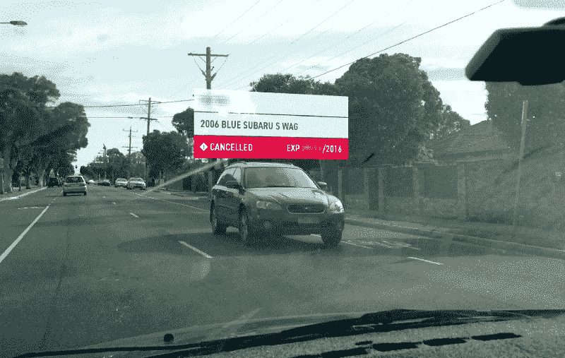
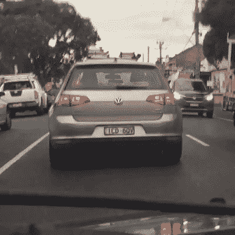
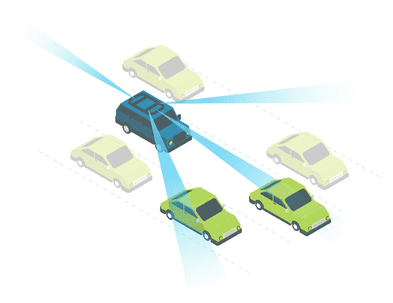
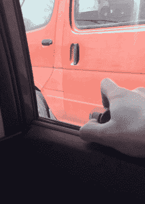
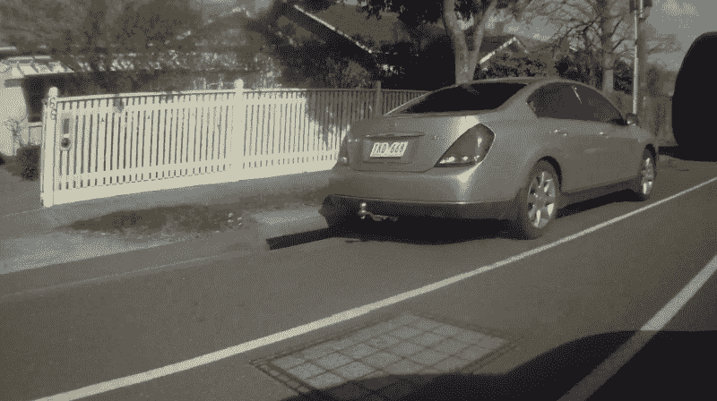
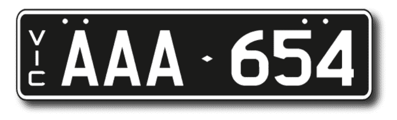
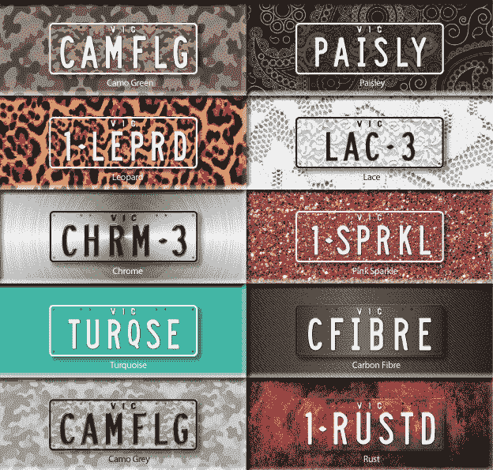
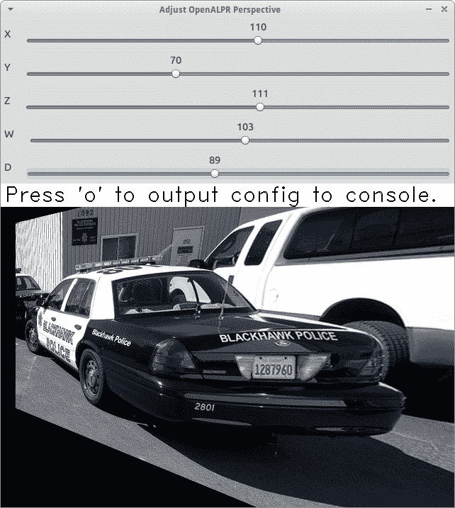

# 还记得我复制的价值 8600 万美元的车牌扫描仪吗？我抓住了一个拿着它的人。

> 原文：<https://www.freecodecamp.org/news/remember-that-86-million-license-plate-scanner-i-replicated-heres-what-happened-next-9f3c64e8f22b/>

泰特·布朗

**Canceled driver caught in action.**

# 还记得我复制的价值 8600 万美元的车牌扫描仪吗？我用它抓到了一个人。

几周前，我发表了一篇我当时认为相当无害的文章:[我如何用 57 行代码复制了一个 8600 万美元的项目](https://medium.freecodecamp.org/how-i-replicated-an-86-million-project-in-57-lines-of-code-277031330ee9)。

我承认——这是一个相当吸引人的说法。我基本上是在说，我复制了澳大利亚维多利亚警方刚刚花了 8600 万美元购买的相同的车牌扫描和验证技术。

从那时起，反应是压倒性的。我的文章在第一天就获得了超过 100，000 的点击量，最后一次点击量达到了 450，000 左右。我被邀请在当地电台访谈节目和加州的一个会议上发言。我想有人可能误读了维多利亚，AU 为维多利亚，BC。

尽管我礼貌地拒绝了这些邀请，但我还是和各种当地开发商和知名公司一起喝过咖啡。令人难以置信的兴奋。

大多数读者看到了它的本来面目:一个概念验证，引发了关于使用开源技术、政府支出和一个人在沙发上制作酷东西的愿望的讨论。

学究们指出了缺乏培训、支持和通常的企业 IT 成本，但不值得任何人花时间去探索这些。我宁愿在这篇文章中看看我的结果，以及其他人如何支持他们自己的准确性。

在我们深入研究结果之前，我想回顾一下我觉得在[原始帖子](https://medium.freecodecamp.org/how-i-replicated-an-86-million-project-in-57-lines-of-code-277031330ee9)中丢失的一件事。这个项目的概念完全独立于 8600 万美元的 BlueNet 项目。这绝不是试图停止它。

它开始于一个令人困扰的想法，既然 OpenCV 已经存在，VicRoads 网站也有车牌检查，那么一定有一种方法可以将两者结合起来，或者使用更好的东西。

只是在我开始写文章的时候，我偶然发现了 BlueNet。发现 BlueNet 和它的价格标签给了我一个很好的编辑角度，代码已经写好了。这些项目之间肯定会有一些不一致的地方。

我还认为，这件事闹得沸沸扬扬的部分原因是，一份关于澳大利亚政府浪费 IT 开支的报告来得正是时候。联邦政府的 IT 账单已经从 59 亿美元飙升到 100 亿美元，而它所带来的价值却令人怀疑。与我联系的媒体研究人员很快就将这两者联系起来，但我并不鼓励这样做。

#### **免责声明**

本着透明的精神，我必须声明一些在最初的帖子中也遗漏了的东西。我的前雇主为维多利亚州警察局和其他州政府机构交付了较小的(不到 100 万美元)IT 项目。因此，我接受了警方的检查，并完成了成为 VicPol 承包商所需的表格。

这可能意味着我别有用心，或者有一些特定的内部知识，但相反，我为我们交付的项目感到自豪。他们既准时又符合预算。

### 可视化结果

下面是我的结果的视频演示，为了好玩，合成了一些特效。我录制了各种测试片段，这是最成功的片段。

视频结束后，我将详细介绍理想的摄像机设置、探测区域等。这将有助于你更好地理解是什么让我透过挡风玻璃拍摄的 iPhone 视频比从侧窗向外倾斜的 Contour HD 视频更好。

### 伦理困境

如果你看到了这篇文章的英雄图文或者看了上面的视频，你可能已经注意到了一个很有意思的发展:**我抓到一个人**。

具体来说，我抓到有人驾驶一辆 2016 年注销登记的车辆。这可能有很多原因，其中最无辜的是一个狡猾的转售行为。

偶尔，当车辆的私下销售不按规定进行时，买方和卖方可能不会完成正式的注册转移。这为买方节省了数百美元，但车辆仍注册在卖方名下。对于卖家来说，取消注册并收到剩余月份的特别退款也是数百美元，这并不是闻所未闻的。

或者，汽车司机很可能就是我们怀疑的罪犯。

因此，虽然我在电脑上设置这个项目时开玩笑地给它起了个名字叫“盘子告密者”,但我现在面临着一个难题，即是否要报告我所看到的。

最终，司机被警方专用设备的原型检测到。但驾驶 2016 年注册(已取消，未过期)的车辆是非常故意的举动。嗯。

### 回到结果

在对我的文章的许多反应中，相当一部分是相当字面上的和可疑的。因为我说我*复制了*软件，他们断言我必须有一个支持中心、保修和培训手册。一个人甚至试图复制我的结果，并遇到了图像质量和原始材料这些不可避免的障碍。

因此，一些人暗示我精选了我的源图像。对此我只能说，“嗯，废话。”

当我构建最初的概念证明时(再次强调，重点是验证一个想法，而不是复制 BlueNet)，我使用了不到 10 张图片的小样本集。由于相机设置是[【ALPR】](http://www.theiacp.org/ALPR)中最重要的因素之一，如果不是最重要的话，我选择它们是因为它们具有增强识别的理想特征。

说到底，拿一个脆弱的概念证明去打破它是非常简单的。真正的创新和挑战来自概念验证，以及*让它工作*。纵观我的职业生涯，很多资深开发者都跟我说过，事情做不到或者至少做不到及时。有时他们是对的。通常，他们只是规避风险。

> “没有什么是不可能的，直到它被证明是。”

许多人贬低这句话，你可能以前见过或听过它的一个化身。对我来说，它很好地总结了健康发展的心态，在这种心态下，提出和验证想法对于理解它们几乎是强制性的。

### 最佳 ALPR 相机设置

这个项目对我来说是如此令人兴奋和不同，因为它有一个明确的成功衡量标准——软件是否识别车牌。这只能通过硬件、软件和网络解决方案的组合来实现。在贴出我的原创文章后，卖 ALPR 相机的人很快提供了建议。

#### 光学变焦

事后看来，最明显的解决方案是使用光学变焦。尽管我在下面探讨了其他重要因素，但没有一个因素能像这个因素那样导致认知度的大幅提升。一般来说，专业的 ALPR 解决方案会偏移一个角度，根据车牌的位置进行训练，并放大该区域以最大限度地提高清晰度。

这意味着**更多的缩放，更多的像素可以用来玩**。

我所有的相机都是固定镜头的。其中包括:

*   轮廓高清行动摄像机。这些照片是 2009 年出版的，我用我的照片记录我骑自行车上下班的过程，并重放每周的濒死体验。
*   富士 X100S(著名的定焦镜头)
*   我的 iPhone 6+

特色测试运行记录在我的手机上。我复制光学变焦的唯一方法是使用一个应用程序在 3K 而不是 1080p 下录制，然后进行数字变焦和裁剪。同样，更多的像素可以使用。

#### 角度和定位

30 的视角常被作为理想板材识别的参考标准。当你了解到 BlueNet 使用了一系列摄像机时，这是非常重要的。当你考虑前置摄像头通常会看到什么时，这也是有意义的——不太多。

What a front facing ALPR camera sees — not much.

如果要我猜的话，我会说大部分面向前的阵列是最理想的设置。它将由一个指向上述死点的摄像机、两个每侧偏离中心 30 的摄像机和一个后置摄像机组成。如果车辆在相反的方向行驶，使大多数摄像机指向前方的价值将来自增加的反应时间。这将允许更快的扫描、处理和掉头，而不是后置摄像头拍摄已经超过警车十米的可疑车辆。

A four camera array would need to be angled similar to this. Icons from [Freepik](http://www.freepik.com/).

#### Gymbal

合成视频的时候，我考虑过稳定镜头。相反，我选择显示颠簸的旅程是什么。你看到的是我拿着手机靠近挡风玻璃，而我妻子在开车。看看这种严谨的科学方法。

Any production-ready version of a vehicle-mounted ALPR needs some form of stabilisation. Not a hand.

### 其他重要因素

#### 帧频

从那时起，复制我的项目和我的录音的尝试都探索了同样的误解，即 ALPR 采样帧速率可能与成功有关。以我的经验来看，这只会浪费时间。相反，令人难以置信的重要是快门速度创造干净，清晰的镜头，很好地馈入算法。

但我也测试了相当低速的镜头。最多，两辆车在 60 公里/小时的区域内擦肩而过，造成了 120 公里/小时的[差](http://www.mathwords.com/d/differential.htm)。另一方面，BlueNet 可以达到据称的 200 公里/小时。

作为解决这个问题的一种方法，一位同事提出了对象检测和带外处理。识别一辆车并画一个边界框。等待它进入理想的识别角度并变焦。然后拍出一组照片进行异步处理。

我研究了使用 OpenCV (node-opencv)进行对象识别，但我发现了一些更简单的方法，如人脸检测，需要 600-800 毫秒。不仅对我的使用不够理想，而且总体来说相当差。

宣传列车 [TensorFlow](https://www.tensorflow.org/) 前来救援。能够在设备上运行，有一些[项目](https://github.com/MarvinTeichmann/KittiBox)以惊人的 27.7fps 每帧识别多辆车的例子。[这个版本](https://github.com/balancap/SDC-Vehicle-Detection)甚至可以暴露速度估计。在法律上毫无价值，但在日常监管中可能有用(readme 中没有 fps 基准)。

为了更好地解释高性能车辆识别如何与较慢的 ALPR 技术相结合，我在 After Effects 中创建了另一个视频。我想象这两个携手工作的人会是这样的:

#### 帧速率与快门速度

帧速率的不同表现形式很大程度上受快门速度的影响，更具体地说，是困扰早期或低端数字电影录像机的*卷帘快门*问题。以下是一些轮廓高清镜头的快照。你可以看到，在只有 60 公里/小时的速度下，从 ALPR 的角度来看，卷帘快门的问题或多或少会使画面不可用。

Rolling shutter issues on a Contour HD @ 60km/h.

在 Contour HD 和我的 iPhone 上调整帧速率并没有明显减少失真。理论上，更高的快门速度应该可以产生更清晰的图像。如果你要追求 200 公里/小时的 BlueNet 基准，它们会变得越来越重要。更少的模糊和更少的滚动快门失真将理想地导致更好的阅读。

#### 打开 ALPR 版本

更有趣的发现之一是，我使用的 node- [openalpr](https://github.com/openalpr/openalpr) 版本已经过时，而且功能远不如他们的专有解决方案。虽然开源需求肯定是一个因素，但令人惊讶的是，云版本可以如此准确地成功读取我甚至无法识别的帧。

#### ALPR 国家培训数据

我还发现主 node-openalpr 包默认为美国国家处理，无法覆盖它。您必须拉下其他人的分支，这样您就可以提供额外的国家参数。

Slimline Australian plates need their own separate country detection to regular Australian plates?

但这并不总是有帮助。使用默认的美国算法，我能够产生最多的结果。指定澳大利亚数据集实际上使成功读板的数量减半，并且它只设法找到一两个美国算法不能找到的。提供单独的“澳大利亚宽盘”集再次减半计数，并引入了一个单独的额外的盘子。

当谈到 ALPR 的澳大利亚数据集时，显然有很多需要改进的地方，我认为维多利亚州可用的盘子类型的数量是一个起作用的因素。

Good luck with that.

#### 平面经线

开放 ALPR 附带了一个特殊的工具来减少相机角度和滚动快门问题的失真影响。平面扭曲是指将坐标传递给库来扭曲、平移和旋转图像，直到它非常类似于直印版。

在我有限的测试经验中，我无法找到一种在所有速度下都能工作的平面翘曲。当你考虑卷帘式快门时，失真相对于车速的增长是有道理的。我会想象输入加速计或 GPS 速度数据作为一个系数可能有效。或者，你知道，买一个不完全是垃圾的相机。

The planar warp tool provided with Open ALPR

### 业内其他人在做什么

在上一篇文章之后，许多读者主动联系，分享他们自己的经历和想法。也许和我分享的一个更有趣的解决方案是由新西兰的傲罗提出的。

他们在加油站安装了固定的 ALPR 摄像机来报告偷汽油的人。这本身并不是特别新颖和革命性的。但当与他们的网络结合时，当已知的罪犯回来时，或者目标是该地区的加油站时，他们可以自动发出警报。

以色列、南非和阿根廷的独立开发者对构建他们自己的黑版 BlueNet 表现出了兴趣。有些人可能会比其他人过得更好，因为像以色列这样的地方使用没有字母字符的七位数车牌。

### 关键要点

在过去几周的涉猎中，我学到了太多的东西，以至于无法用一篇文章来概括。虽然有很多批评者，但我真的很感谢给我的支持和知识。

在尝试构建您自己的 ALPR 解决方案时，您将面临许多挑战，但谢天谢地，其中许多都是已解决的问题。

客观地说，我是一名设计师和前端开发人员。我已经花了大约 10 个小时在镜头和代码上，另外 8 个小时在视频制作上，另外至少 10 个小时在文字报道上。我站在巨人的肩膀上，取得了我所拥有的一切。我正在安装由聪明人建造的图书馆，并采纳了以卖这些相机为生的人的建议。

这个价值 8600 万美元的问题仍然存在——如果你能站在巨人的肩膀上构建一个半吊子的解决方案，并且做得还不错，那么你应该投入多少钱来做一个真正的好工作呢？

我的解决方案甚至不像一些互联网评论者期望的那样，与 99.999%准确的扫描仪在同一个太阳系中。不过话说回来，BlueNet 只需要达到 95%的准确率目标。

所以，如果 100 万美元能让你达到 80%的准确率，也许 1000 万美元能让你达到 90%的准确率——你什么时候停止花钱？此外，考虑到这项技术已经在大洋洲证明了商业应用，当本地创业公司可以受益时，应该有多少纳税人的钱投入到一个专有的、封闭来源的解决方案中？毕竟，澳大利亚应该是一个“创新国家”。