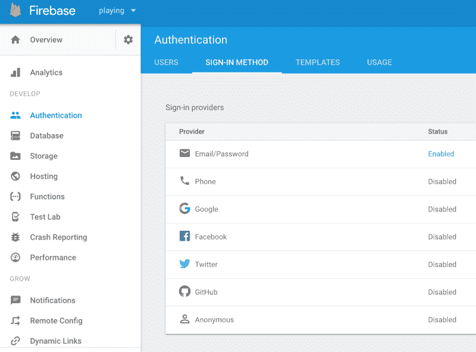

# 下面是如何使用 Vue.js 和 Firebase 验证用户

> 原文：<https://www.freecodecamp.org/news/authentication-with-vue-js-firebase-5c3a82149f66/>

作者加雷斯·雷德费恩

# 下面是如何使用 Vue.js 和 Firebase 验证用户


在本教程中，我们将构建一个简单的 Vue.js 应用程序。它将使用 Firebase 进行身份验证，并允许用户注册。注册用户通过登录页面访问 web 应用程序的受保护区域。

为了使事情尽可能简单和简短，我们假设您熟悉 [Vue.js.](https://vuejs.org/v2/guide/) 您可以使用 [CLI](https://vuejs.org/v2/guide/installation.html#CLI) 和 [webpack](https://webpack.js.org/) 启动并运行一个项目。我们将通过两个主要主题来创建我们的应用程序:

1.  使用 [vue-router 2](https://router.vuejs.org/en/) 加载和保护 web 应用程序的页面。
2.  设置一个 Firebase 后端，它使用 [Firebase 身份验证](https://firebase.google.com/docs/auth/)来管理用户注册和登录。

[教程文件](https://github.com/garethredfern/vue-auth-demo)可以在 github 上免费下载。在可能的地方添加了注释来解释代码在做什么。要在本地计算机上启动并运行该站点，请按照自述文件中的说明进行操作。我们将要编写代码的主目录是 [src 目录。如果你过去开发过 Vue 应用，你应该很熟悉。](https://github.com/garethredfern/vue-auth-demo/tree/master/src)

### 应用架构

我们正在建设的应用程序将有一个简单的主页，用户导航到访问该网站。他们需要用注册表单注册一个帐户。注册后，登录页面将使用户能够访问仪表板(网站的安全区域)。

### 处理路由和保护页面

要理解的第一个概念是如何发送页面请求和保护登录后的页面。为此，我们将安装 [vue-router 2](https://router.vuejs.org/en/) ，一个用于处理路由的第一方库。为了更好地理解简单路由，我们将首先忽略任何页面的安全保护。让我们设置站点结构:

*   主页
*   注册
*   登录
*   仪表板(我们最终会保护此页面)
*   错误/404(捕获所有页面)

为了对 vue 路由器的功能有一个基本的了解，需要回顾两个主要文件。在 [main.js](https://github.com/garethredfern/vue-auth-demo/blob/master/src/main.js) 文件中，我们[导入 VueRouter](https://github.com/garethredfern/vue-auth-demo/blob/master/src/main.js#L4) 并告诉 Vue 你想[使用它](https://github.com/garethredfern/vue-auth-demo/blob/master/src/main.js#L26)。接下来，我们创建一个 VueRouter 实例，并通过一个单独的 [routes.js](https://github.com/garethredfern/vue-auth-demo/blob/master/src/router/routes.js) 文件传递应用程序将使用的路线。

在这里，我们还将路由器的模式设置为 us，开箱即用的 vue-router 将在 URL 中加载带有哈希的每个页面。在现代浏览器中，我们可以使用 HTML5 历史 API，不再需要在 URL 中包含散列。

还会有一些服务器配置来让它工作，更多信息请阅读官方文档。

```
Vue.use(VueRouter);
```

```
const router = new VueRouter({ routes: routes,  mode: 'history'} );
```

[routes.js](https://github.com/garethredfern/vue-auth-demo/blob/master/src/router/routes.js) 文件导入您将在整个站点中显示的所有组件。它导出一个包含您所有路线的[数组作为对象。每个对象都有以下键值对:](https://github.com/garethredfern/vue-auth-demo/blob/master/src/router/routes.js#L12)

*   路线名称(可选)
*   路径(用户导航到的 url)
*   组件(要加载的 Vue 组件)

为了进一步解释，请看下面的代码:

```
{
```

```
 path: '/sign-in', // set the URL the user will visit
```

```
 name: 'signIn', // use this name as a shortcut in your links
```

```
 component: SignIn // load the SignIn component
```

```
}
```

对于每条路线，我们重复上面的代码，并交换所有路线选项的属性。接下来我们将添加 App.js 文件的`<router-view></rou`三视图>打开和关闭`[tags t](https://github.com/garethredfern/vue-auth-demo/blob/master/src/App.vue#L5)`。这些充当占位符，告诉 Vue 当选择一个路由路径时在哪里交换组件。有了这个，您应该能够导航到每个 URL，并且该路径的组件将被加载。

#### 保护路线

vue-router 提供了一种使用[导航卫士](https://router.vuejs.org/en/advanced/navigation-guards.html)保护路线的方法。您可以使用三种级别的防护:

*   全局保护(我们将使用的)在 route 实例上设置一次。
*   每条路线上分别设置了每条路线的防护装置。
*   每个组件中都设置了组件内防护装置。

您可以选择使用这些方法中的任何一种，但是为了简单起见，我们将设置保护在每次页面加载时全局运行，这可能有最大的开销，所以请记住这一点。为了让我们的安全路线工作，我们将检查两件事:

1.  路由是否有一个`requiresAuth`设置为真的元属性。
2.  用户是否已登录并通过 Firebase 身份验证。

让我们通过以上几点来更好地理解正在发生的事情。vue 路由器有[路由元字段](https://router.vuejs.org/en/advanced/meta.html)，您可以在其中添加数据以检索特定路由。我们可以用它来为我们受保护的页面设置一个简单的布尔值`requiresAuth`:

```
{   path: '/dashboard',   name: 'dashboard',   component: Dashboard,   meta: {    requiresAuth: true   }},
```

有了上面的代码，我们在加载之前检查路由是否需要身份验证。该检查使用在 [main.js](https://github.com/garethredfern/vue-auth-demo/blob/master/src/main.js) 文件中设置的全局导航保护。

```
router.beforeEach((to, from, next) => {
```

```
const requiresAuth = to.matched.some(record => record.meta.requiresAuth);
```

```
if(requiresAuth) {   next('/sign-in');} else {  next();}
```

```
});
```

这里我们调用路由器实例上的`beforeEach`方法。在[文档](https://router.vuejs.org/en/advanced/navigation-guards.html)中详细解释了 3 个参数，但重点是`next`参数。当`requiresAuth`条件设置为真时，您可以在这里告诉路由器做什么。

在我们的应用程序中，我们使用它将用户发送到登录页面。为了访问路线元数据，我们设置了一个带`to`参数的常量(我们正在导航的路线**到**)。文档解释了如何访问您设置的元字段:

> 一条路线匹配的所有路线记录在`$route`对象(以及导航卫士中的路线对象)上显示为`$route.matched`数组。因此，我们需要迭代`$route.matched`来检查路由记录中的元字段。

有了可用的元数组，我们可以使用 ES6 函数对其进行迭代:

```
const requiresAuth = to.matched.some(record => record.meta.requiresAuth);
```

我们将`requiresAuth`传递给条件式。如果`true`发送用户到登录页面，如果`false`正常加载页面。

花时间通读[文档是值得的。](https://router.vuejs.org/en/advanced/navigation-guards.html)很好地理解`beforeEach`方法在做什么。这是理解路线守卫的关键原则。接下来，我们将继续使用 Firebase 来验证用户，并向 route guard 添加一个检查。

### 使用 Firebase 进行身份验证

Firebase 提供了一个完整的后端和认证系统。它可以添加到您的 web 应用程序的前端。在这个演示中，我们将使用它的身份验证 API 来允许用户注册和登录。登录后，经过身份验证的用户可以查看受保护的内容。你需要做的第一件事是在 [Firebase](https://firebase.google.com/) 注册一个账户。我也建议观看 Firebase Auth 入门。

一旦你有了一个帐户，你需要在 Firebase 中创建一个项目。除此之外，你可以通读 Firebase 上的文档。他们为您提供了一套出色的入门指导。请注意，您需要复制并粘贴您的配置设置，并将它们交换到项目的 [main.js](https://github.com/garethredfern/vue-auth-demo/blob/master/src/main.js#L10) 中。确保您启用电子邮件&密码认证作为登录方法。



设置了 Firebase 并添加了配置设置。让我们看看认证过程的最后一部分。向我们之前创建的 route guard 的`beforeEach`方法添加第二个条件。

```
router.beforeEach((to, from, next) => {
```

```
const currentUser = Firebase.auth().currentUser;
```

```
const requiresAuth = to.matched.some(record => record.meta.requiresAuth);
```

```
if (requiresAuth && !currentUser) {
```

```
 next('/sign-in');
```

```
} else if (requiresAuth && currentUser) {
```

```
 next();
```

```
} else {
```

```
 next();
```

```
}
```

```
});
```

我们添加了一个变量`currentUser`，它从 Firebase 返回当前登录的用户。如果没有人登录，那么它返回 null。我们可以用它作为条件语句中的第二个检查。如果 requiresAuth 和 currentUser 都为真，则路线将显示页面。

如果不满足这个条件，它会将用户返回到登录页面。如果路由没有使用 requiresAuth meta 标记进行保护，则页面会正常加载，不需要进行身份验证。

#### 在加载 Vue 之前，确保 Firebase 已初始化

我们已经设置了路由，因此如果您已经登录，您将被重定向到仪表板页面。不幸的是，这不会发生。在 Firebase 初始化结束之前，执行导航保护。这是一个非常重要的问题，阿纳斯·马默里在[的帖子](https://medium.com/@anas.mammeri/vue-2-firebase-how-to-build-a-vue-app-with-firebase-authentication-system-in-15-minutes-fdce6f289c3c)中对此进行了解释。

#### 使用 Vue 处理注册和登录

我们需要用户能够注册和登录到我们的应用程序。看看两个 Vue 组件 [SignUp.vue](https://github.com/garethredfern/vue-auth-demo/blob/master/src/components/SignUp.vue) 和 [SignIn.vue.](https://github.com/garethredfern/vue-auth-demo/blob/master/src/components/SignIn.vue) 它们都以类似的方式工作，将电子邮件和密码字段绑定到数据属性。

与 Firebase 的集成发生在运行 signUp 或 signIn 方法时。这些功能是由 Firebase 提供的。我们从 Vue 数据属性传入电子邮件和密码。成功后，使用 vue 路由器替换方法导航到仪表板。如果出现任何错误，则会显示带有错误消息的警报。

```
signUp: function() {  Firebase.auth()          .createUserWithEmailAndPassword(this.email, this.password)          .then( user => { this.$router.replace('dashboard'); },          error => { alert(error.message); });}
```

```
signIn: function() {  Firebase.auth()          .signInWithEmailAndPassword(this.email, this.password)          .then( user => { this.$router.replace("dashboard"); },          error => { alert(error.message); });}
```

如果您在浏览器中加载了该网站，现在您应该能够注册并登录。我们现在需要做的就是为用户提供一个退出链接。

#### 允许用户注销

看一下 [Header.vue](https://github.com/garethredfern/vue-auth-demo/blob/master/src/components/Header.vue) 组件。我们可以使用一个 Firebase Sign out 方法，当用户单击注销按钮时触发它。然后使用 vue-router replace 方法将他们重定向到登录页面。

```
signOut: function() {  Firebase.auth()    .signOut()    .then(() => {      this.$router.replace('sign-in');    });}
```

在你的浏览器中加载网站，然后点击退出按钮。您现在应该会被重定向回登录页面。

### 总结和进一步学习

我们的应用程序现在有基本的 Firebase 身份验证，并添加了一些简单的 vue 路由器基础知识。接下来，我们需要看看如何管理用户状态。该状态有助于根据用户是否登录来显示内容和链接。在回顾了几个选项之后，[深入 Vuex](https://medium.com/@garethredfern/managing-user-state-with-vuex-firebase-77eebc64f546) 将是一个很好的用例。