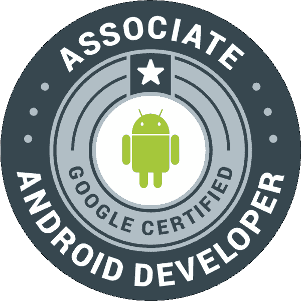

# 我是如何成为谷歌认证的 Android 助理开发人员的

> 原文：<https://www.freecodecamp.org/news/becoming-associate-android-developer-certified-by-google-26e08e6abf2f/>

斯特凡诺斯·瓦达洛斯

# 我是如何成为谷歌认证的 Android 助理开发人员的

Associate Android Developer

如果你已经从事 Android 开发工作，或者你想开始你的移动开发之旅，有一种方法可以证明你的技能，让你脱颖而出。谷歌早在 2016 年就推出了助理 Android 开发者认证，他们的目标是“缩小开发者职业生涯与雇主之间的差距。”

通过这次考试并获得 Android 开发人员助理认证，候选人能够展示经过测试的 Android 开发知识和执行一般开发任务的能力。

#### 考试的结构

考试本身分为两部分。第一部分是实践考试。你会得到一个随机项目，你必须实现一些新功能。你必须在现有的功能上添加缺失的功能，并且需要修复各种错误。最后，你需要做一些测试。

从你得到这个项目的时候，你将有 24 小时来完成一切，并上传你的解决方案在一个压缩格式的文件进行审查。如果你对这类任务感到舒适，并且在这段时间内没有其他义务，那么时间限制就足够了。将考试安排在周末是明智的。

第二部分是离职面谈。在你成功通过实践考试后，你将不得不安排这次离职面谈。带上你的身份证或护照来证明你的身份，然后你会解释你在这个项目上的工作，讨论最难实施的部分，等等。

然后面试官会问你一些关于 Android 开发的一般性问题。您可能在项目工作中偶然发现了这些东西，但也可能没有。

一旦实践考试和离职面谈都结束了，你将在几周内得到最终结果。在那之后不久，如果你通过了，你的数字徽章将会到达，表明你实际上已经被认证。

#### 考试前应该学什么

Ready to start

你可以在这个[页](https://developers.google.com/training/certification/associate-android-developer/)找到考试的内容。我建议在尝试参加考试之前，对这些部分都有扎实的了解。这些东西中的大部分将通过认证的实践部分以这样或那样的方式进行测试。

简而言之，您应该对 Android 编程的这些方面比较熟悉:

1.  **应用组件**:了解活动和片段及其生命周期，以及数据加载器的使用、创建通知、使用异步任务和后台服务。
2.  **数据存储**:能够创建和查询 SQLite 数据库，并且能够使用内容提供者和共享偏好。
3.  应用程序 UI & UX :使用 XML 构建布局，并通过 Java 代码与它们交互，或者使用提供的 UI 元素，或者通过创建自己的自定义视图。实现并使用 RecyclerViews，添加辅助功能，并将您的 UI 本地化为不同的语言。
4.  **调试和测试**:分析崩溃和读取日志，发现 bug 和错误。通过使用 Espresso 测试框架编写自己的单元测试来测试您的应用程序。

如果你觉得你在这四个普通科目上有足够的专业知识，那么你就可以去参加考试了。报名通过以上网站。在你支付了考试费(目前是 149 美元)后，你就可以下载这个项目，并随时开始整个程序。当你有足够的时间的时候做它。

#### 准备考试

由于考试内容概述得非常清楚，并且你事先知道要想成功你必须学习什么，所以很容易找到大量的资源来复习。

根据你的喜好，有很多书籍和网络资源可以很好地教授 Android。基于你目前的水平，你可以在相对较短的时间内达到所需的水平——对于之前没有太多 Android 实践的人来说，两三个月的学习应该足够了。

除了这些选项之外，谷歌还与 Udacity 合作提供了一个专门的项目:Android 开发人员快速通道(Associate Android Developer Fast Track)将教会你足够多的东西来通过这次考试。该项目目前费用为 750 美元(包括考试费)。它给你提供了三门课程，每门课程都有一个相应的项目，你应该在注册后的三个月内完成。

如果你通过了所有三个项目，你将获得足够的知识来创建自己的简单应用程序，并参加 Android 开发人员考试。

#### 我的经历

大约一年前，Udacity 提供了 1000 个奖学金给他们的 Android 开发人员快速通道项目。我是获得奖学金的幸运儿之一，有机会参加这个项目。

在我开始这个项目之前，我对 Java 和 Android 开发有一定的经验。我已经发布了一个原生的 Android 应用程序，并且做了足够多的研究来跟上这个领域的发展。我不知道该期待什么，也不知道这门课程能给我带来什么。

课程结构非常好，有很棒的老师和非常高质量的内容。我惊奇地发现，即使我已经知道了很多内容，我还是喜欢重访。我在这里或那里学到或理解了更多的东西。

课程的每个部分之后都有项目，这一事实很有帮助。每个项目都需要足够的作业，这样在你完成之后，你就能对之前的课程内容有一个很好的理解。

真正让整个过程与众不同的是 Udacity 社区。我认为这应该是有人参与这个项目的主要原因。学习相同内容的人们之间的互动，以及社区内部普遍的乐于助人的心态，使得这门课程成为一次很好的学习经历。这不仅仅是一个简单的电子学习课程。对所有那些在相关的松弛渠道，使这一切发生的人致敬。

You get a fitting badge when you successfuly finish the exam to show around

在我看来，考试本身相当难。我有足够的时间完成所有要求的任务，并再看一眼以确保万无一失——与课程项目不同，在考试阶段你没有第二次机会。

一些新人可能会在时间限制(24 小时开始到结束)上挣扎，但是如果你已经做了功课，你应该不会有任何问题。

大约一周后，我收到一封电子邮件，说我已经通过了考试，应该继续进行离职面试。我把面试安排在了接下来的一周，但之后又不得不重新安排在下一周。到面试的时候，我已经忘记了我为考试项目所做的大部分工作。谢天谢地，在打电话之前，我对我的代码做了一个简短的回顾。

在面试中，我被问到我的实现(不是很具体的东西)。如果我没有做那篇简短的评论，我不知道我会如何回应。所以，如果实践考试和离职面谈之间已经过了一段时间，最好在打电话之前补上一点。大约一周后，我收到了另一封电子邮件，说我终于成为了一名认证的 Android 助理开发人员。

#### 摘要

AAD 是展示你在 Android 开发方面的专业水平的好方法。如果你很少或没有工作经验，并且想在面试中证明自己，这一点特别有帮助。而且考虑到它相对较低的价格，真的没有理由不做。

就算你已经是开发者了，我觉得在这里也是大有收获的。Udacity 课程尤其有价值。我可以把它看作是更大事情的开始。这可能不是谷歌认证之旅的终点，所以现在就开始可能有助于以后更高级的版本。

如果你喜欢这篇文章，请给我一些掌声，让更多的人看到它。谢谢！